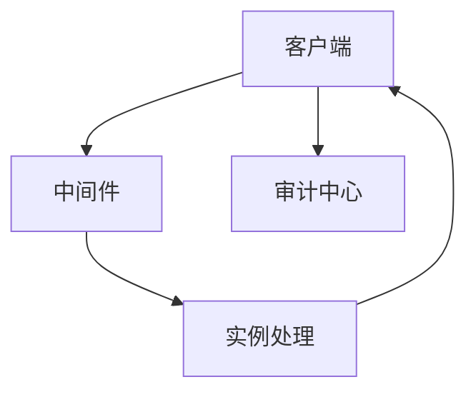
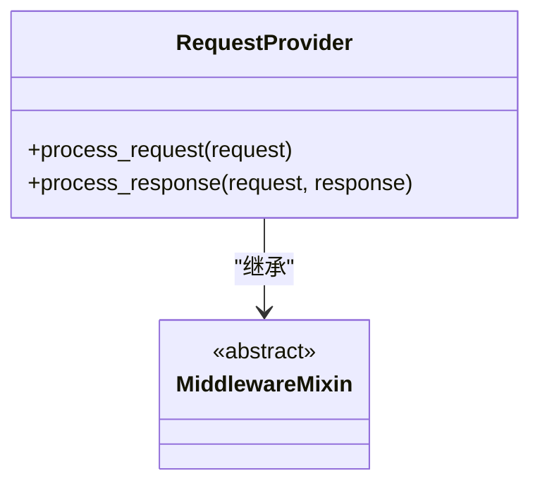
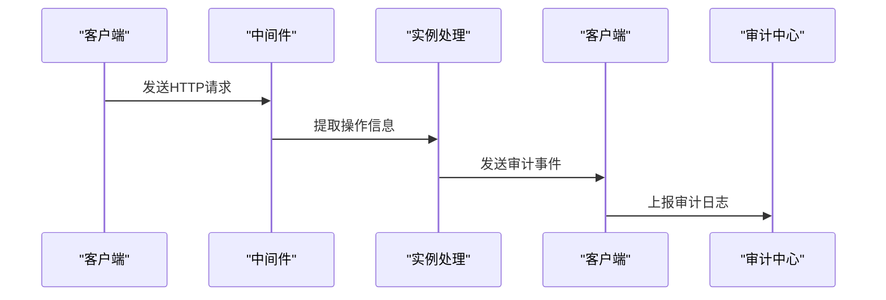
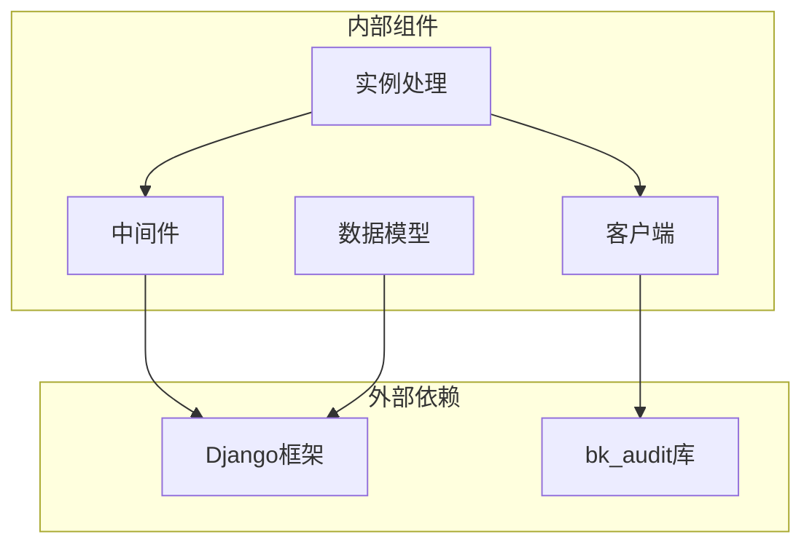

# 审计日志采集

<cite>
**本文档引用的文件**   
- [middleware.py](file://bklog/apps/log_audit/middleware.py)
- [client.py](file://bklog/apps/log_audit/client.py)
- [instance.py](file://bklog/apps/log_audit/instance.py)
- [models.py](file://bklog/apps/log_audit/models.py)
- [apps.py](file://bklog/apps/log_audit/apps.py)
- [decorators.py](file://bklog/apps/decorators.py)
- [audit_record_views.py](file://bklog/apps/bk_log_admin/views/audit_record_views.py)
- [audit_record.py](file://bklog/apps/bk_log_admin/handlers/audit_record.py)
- [bklog.yaml](file://bklog/support-files/bkpkgs/bklog.yaml)
</cite>

## 目录
1. [引言](#引言)
2. [项目结构](#项目结构)
3. [核心组件](#核心组件)
4. [架构概述](#架构概述)
5. [详细组件分析](#详细组件分析)
6. [依赖分析](#依赖分析)
7. [性能考虑](#性能考虑)
8. [故障排除指南](#故障排除指南)
9. [结论](#结论)

## 引言
本文档详细说明了蓝鲸日志平台中的审计日志采集机制。文档涵盖了通过中间件自动捕获系统操作事件的实现原理，包括AuditMiddleware如何拦截HTTP请求并提取操作信息。同时，文档还描述了客户端SDK的使用方法，以及在业务代码中手动记录审计事件的方式。此外，文档还解释了采集过程中的性能优化措施，如异步写入和批量处理，并提供了配置指南，说明如何启用或禁用特定类型的审计日志记录。

## 项目结构
蓝鲸日志平台的项目结构清晰，主要分为多个应用模块，每个模块负责不同的功能。审计日志相关的代码主要位于`bklog/apps/log_audit`目录下，包括中间件、客户端、实例处理等核心组件。

```mermaid
graph TD
subgraph "bklog"
subgraph "apps"
subgraph "log_audit"
middleware[中间件]
client[客户端]
instance[实例处理]
models[数据模型]
apps[应用配置]
end
subgraph "bk_log_admin"
audit_record_views[审计记录视图]
audit_record[审计记录处理器]
end
end
end
```

**图示来源**
- [middleware.py](file://bklog/apps/log_audit/middleware.py)
- [client.py](file://bklog/apps/log_audit/client.py)
- [instance.py](file://bklog/apps/log_audit/instance.py)
- [models.py](file://bklog/apps/log_audit/models.py)
- [apps.py](file://bklog/apps/log_audit/apps.py)
- [audit_record_views.py](file://bklog/apps/bk_log_admin/views/audit_record_views.py)
- [audit_record.py](file://bklog/apps/bk_log_admin/handlers/audit_record.py)

**章节来源**
- [middleware.py](file://bklog/apps/log_audit/middleware.py)
- [client.py](file://bklog/apps/log_audit/client.py)
- [instance.py](file://bklog/apps/log_audit/instance.py)
- [models.py](file://bklog/apps/log_audit/models.py)
- [apps.py](file://bklog/apps/log_audit/apps.py)
- [audit_record_views.py](file://bklog/apps/bk_log_admin/views/audit_record_views.py)
- [audit_record.py](file://bklog/apps/bk_log_admin/handlers/audit_record.py)

## 核心组件
审计日志采集机制的核心组件包括中间件、客户端、实例处理和数据模型。这些组件协同工作，确保系统操作事件能够被准确捕获和记录。

**章节来源**
- [middleware.py](file://bklog/apps/log_audit/middleware.py)
- [client.py](file://bklog/apps/log_audit/client.py)
- [instance.py](file://bklog/apps/log_audit/instance.py)
- [models.py](file://bklog/apps/log_audit/models.py)

## 架构概述
审计日志采集机制的架构设计旨在高效、可靠地捕获和记录系统操作事件。通过中间件拦截HTTP请求，提取操作信息，并通过客户端将这些信息发送到审计中心。



**图示来源**
- [middleware.py](file://bklog/apps/log_audit/middleware.py)
- [client.py](file://bklog/apps/log_audit/client.py)
- [instance.py](file://bklog/apps/log_audit/instance.py)

## 详细组件分析
### 中间件分析
中间件是审计日志采集机制的关键组件，负责拦截HTTP请求并提取操作信息。

#### 对于对象导向的组件：


**图示来源**
- [middleware.py](file://bklog/apps/log_audit/middleware.py)

#### 对于API/服务组件：


**图示来源**
- [middleware.py](file://bklog/apps/log_audit/middleware.py)
- [instance.py](file://bklog/apps/log_audit/instance.py)
- [client.py](file://bklog/apps/log_audit/client.py)

**章节来源**
- [middleware.py](file://bklog/apps/log_audit/middleware.py)
- [instance.py](file://bklog/apps/log_audit/instance.py)
- [client.py](file://bklog/apps/log_audit/client.py)

### 客户端SDK使用方法
客户端SDK提供了手动记录审计事件的接口，开发者可以在业务代码中调用这些接口来记录特定的操作。

**章节来源**
- [client.py](file://bklog/apps/log_audit/client.py)
- [decorators.py](file://bklog/apps/decorators.py)

### 性能优化措施
为了提高审计日志采集的性能，系统采用了异步写入和批量处理等优化措施。

**章节来源**
- [instance.py](file://bklog/apps/log_audit/instance.py)
- [client.py](file://bklog/apps/log_audit/client.py)

## 依赖分析
审计日志采集机制依赖于多个外部组件，包括Django框架、bk_audit库等。这些依赖关系确保了系统的稳定性和可靠性。



**图示来源**
- [middleware.py](file://bklog/apps/log_audit/middleware.py)
- [client.py](file://bklog/apps/log_audit/client.py)
- [instance.py](file://bklog/apps/log_audit/instance.py)
- [models.py](file://bklog/apps/log_audit/models.py)

**章节来源**
- [middleware.py](file://bklog/apps/log_audit/middleware.py)
- [client.py](file://bklog/apps/log_audit/client.py)
- [instance.py](file://bklog/apps/log_audit/instance.py)
- [models.py](file://bklog/apps/log_audit/models.py)

## 性能考虑
审计日志采集机制在设计时充分考虑了性能问题，通过异步写入和批量处理等技术手段，确保了系统的高效运行。

**章节来源**
- [instance.py](file://bklog/apps/log_audit/instance.py)
- [client.py](file://bklog/apps/log_audit/client.py)

## 故障排除指南
当审计日志写入失败时，系统会采取降级策略，确保不影响主业务流程。开发者可以通过查看日志文件和监控指标来诊断和解决问题。

**章节来源**
- [client.py](file://bklog/apps/log_audit/client.py)
- [instance.py](file://bklog/apps/log_audit/instance.py)

## 结论
本文档详细介绍了蓝鲸日志平台中的审计日志采集机制，涵盖了从中间件到客户端SDK的各个方面。通过合理的架构设计和性能优化措施，系统能够高效、可靠地捕获和记录系统操作事件，为系统的安全性和可追溯性提供了有力支持。