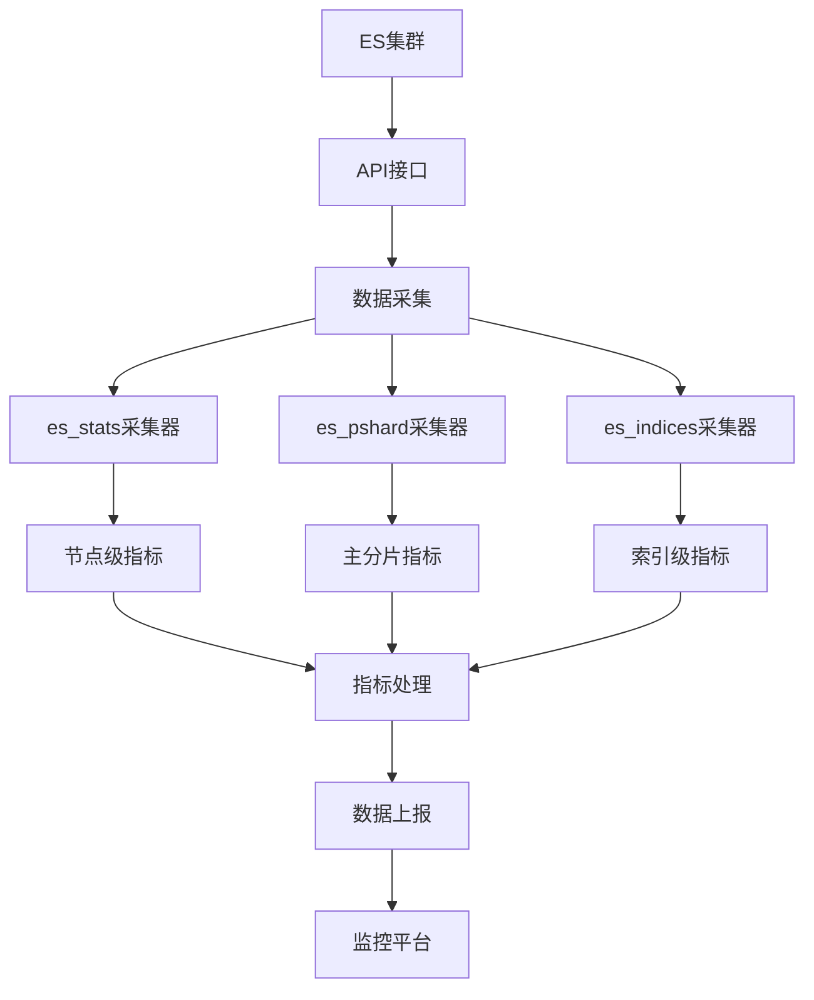
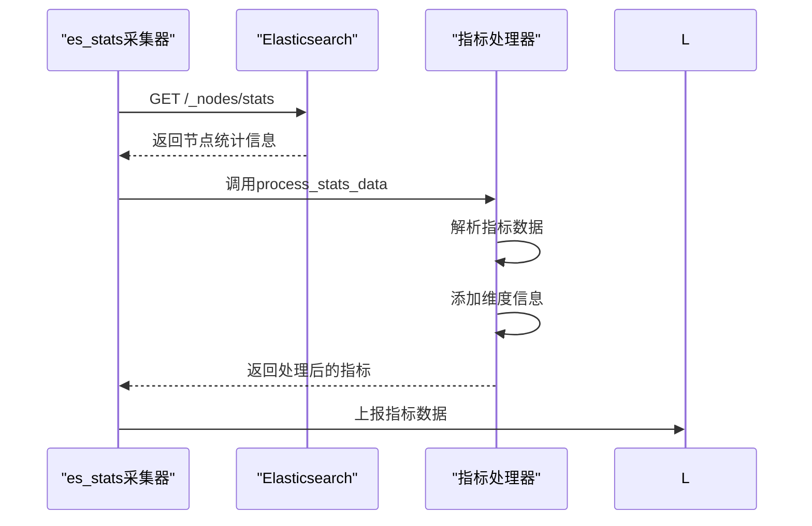
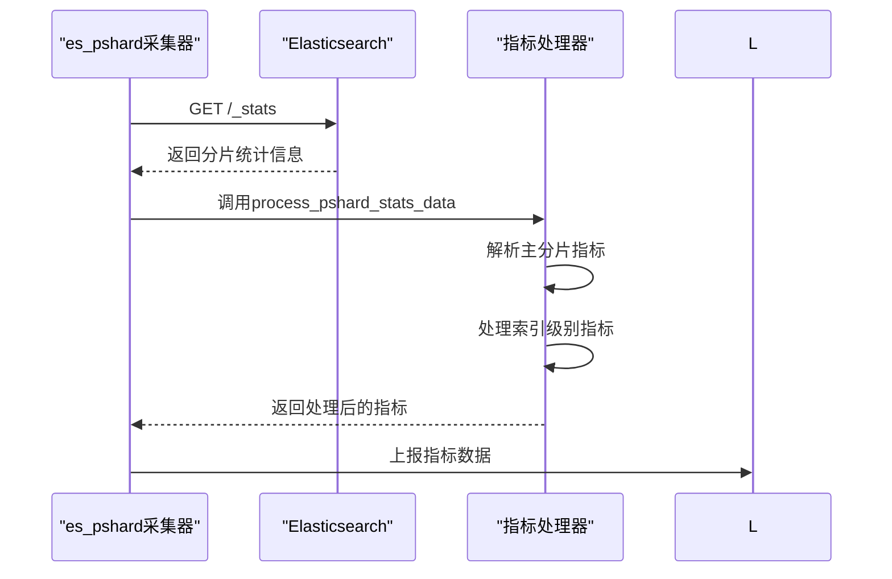
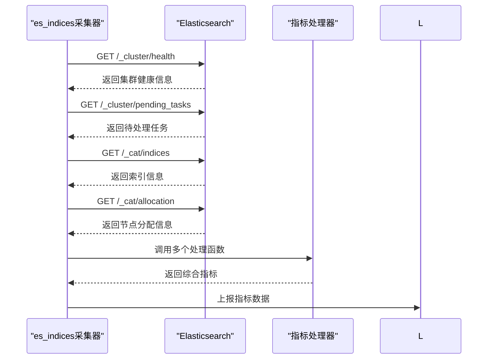
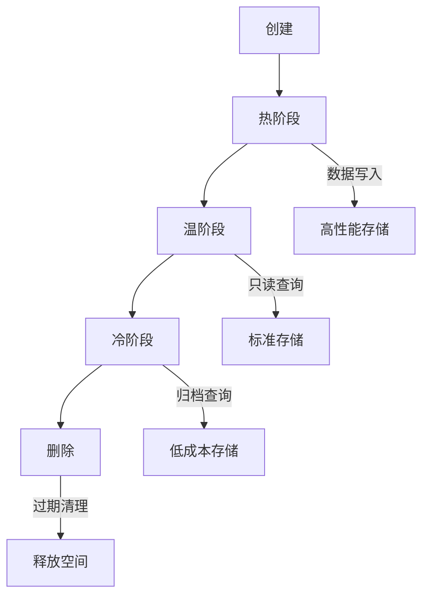

# Elasticsearch监控

<cite>
**本文档引用的文件**   
- [es.py](file://bklog/apps/log_measure/utils/es.py)
- [es_stats.py](file://bklog/apps/log_measure/handlers/metric_collectors/es_stats.py)
- [es_pshard.py](file://bklog/apps/log_measure/handlers/metric_collectors/es_pshard.py)
- [es_indices.py](file://bklog/apps/log_measure/handlers/metric_collectors/es_indices.py)
- [metrics.py](file://bklog/apps/log_measure/handlers/metrics.py)
- [metric.py](file://bklog/apps/log_measure/utils/metric.py)
- [constants.py](file://bklog/apps/log_measure/constants.py)
</cite>

## 目录
1. [引言](#引言)
2. [ES监控架构概述](#es监控架构概述)
3. [核心监控指标详解](#核心监控指标详解)
4. [采集器实现原理](#采集器实现原理)
5. [性能瓶颈识别与优化建议](#性能瓶颈识别与优化建议)
6. [存储容量规划与索引生命周期管理](#存储容量规划与索引生命周期管理)
7. [监控指标异常处理方案](#监控指标异常处理方案)

## 引言
本文档详细描述了蓝鲸日志平台对Elasticsearch集群的监控机制。文档涵盖了ES集群各项性能指标的采集方法，包括索引性能、分片状态、集群健康度等关键指标的监控策略。重点说明了`es_indices`、`es_pshard`、`es_stats`三个核心采集器的实现原理和数据采集频率。同时，提供了ES集群性能瓶颈的识别方法、优化建议、存储容量规划策略以及索引生命周期管理方案。

## ES监控架构概述



**Diagram sources**
- [es.py](file://bklog/apps/log_measure/utils/es.py#L144-L1127)
- [es_stats.py](file://bklog/apps/log_measure/handlers/metric_collectors/es_stats.py#L23-L43)
- [es_pshard.py](file://bklog/apps/log_measure/handlers/metric_collectors/es_pshard.py#L23-L42)
- [es_indices.py](file://bklog/apps/log_measure/handlers/metric_collectors/es_indices.py#L23-L42)

**Section sources**
- [es.py](file://bklog/apps/log_measure/utils/es.py#L1-L1127)
- [metrics.py](file://bklog/apps/log_measure/handlers/metrics.py#L1-L298)

## 核心监控指标详解

### 索引性能指标
索引性能指标主要反映ES集群的写入和查询性能，包括：

- **elasticsearch.indexing.index.total**: 索引操作总数
- **elasticsearch.indexing.index.time**: 索引操作总耗时（秒）
- **elasticsearch.search.query.total**: 查询操作总数
- **elasticsearch.search.query.time**: 查询操作总耗时（秒）
- **elasticsearch.get.total**: 获取操作总数
- **elasticsearch.get.time**: 获取操作总耗时（秒）

这些指标的正常范围取决于业务负载，但通常应保持稳定。异常情况表现为指标值突然飙升或持续增长，可能表明存在性能瓶颈。

### 分片状态指标
分片状态指标用于监控ES集群中分片的健康状况：

- **elasticsearch.active_primary_shards**: 活跃的主分片数量
- **elasticsearch.active_shards**: 活跃的分片总数
- **elasticsearch.relocating_shards**: 正在迁移的分片数量
- **elasticsearch.initializing_shards**: 正在初始化的分片数量
- **elasticsearch.unassigned_shards**: 未分配的分片数量

正常情况下，未分配分片数量应为0，活跃分片数量应与集群配置一致。当出现大量未分配或正在迁移的分片时，表明集群可能存在节点故障或负载不均问题。

### 集群健康度指标
集群健康度是评估ES集群整体状态的核心指标：

- **elasticsearch.number_of_nodes**: 集群节点总数
- **elasticsearch.number_of_data_nodes**: 数据节点数量
- **elasticsearch.cluster_status**: 集群状态（0=red, 1=yellow, 2=green）

集群状态的正常范围应为"green"，表示所有主分片和副本分片都已分配。"yellow"状态表示主分片已分配但部分副本分片未分配，"red"状态表示部分主分片未分配，需要立即处理。

### JVM与系统资源指标
JVM和系统资源指标反映ES节点的资源使用情况：

- **jvm.mem.heap_used_percent**: JVM堆内存使用率
- **jvm.gc.collectors.young.collection_time**: 年轻代GC耗时
- **jvm.gc.collectors.old.collection_time**: 老年代GC耗时
- **system.cpu.idle**: CPU空闲率
- **system.mem.free**: 系统空闲内存

JVM堆内存使用率应保持在70%以下，GC耗时应尽可能短。CPU空闲率过低或内存不足都可能导致ES性能下降。

**Section sources**
- [es.py](file://bklog/apps/log_measure/utils/es.py#L144-L800)

## 采集器实现原理

### es_stats采集器
`es_stats`采集器负责收集节点级别的性能指标，其实现原理如下：



**Diagram sources**
- [es_stats.py](file://bklog/apps/log_measure/handlers/metric_collectors/es_stats.py#L23-L43)
- [es.py](file://bklog/apps/log_measure/utils/es.py#L901-L928)

`es_stats`采集器通过调用`/_nodes/stats` API获取节点级别的统计信息，然后使用`process_stats_data`函数处理数据。该采集器的采集频率为每5分钟一次，由`TimeFilterEnum.MINUTE5`配置。

### es_pshard采集器
`es_pshard`采集器负责收集主分片相关的性能指标：



**Diagram sources**
- [es_pshard.py](file://bklog/apps/log_measure/handlers/metric_collectors/es_pshard.py#L23-L42)
- [es.py](file://bklog/apps/log_measure/utils/es.py#L931-L960)

`es_pshard`采集器通过调用`/_stats` API获取分片级别的统计信息，重点关注主分片的性能指标。该采集器同样以5分钟为周期进行数据采集。

### es_indices采集器
`es_indices`采集器负责收集索引级别的综合信息：



**Diagram sources**
- [es_indices.py](file://bklog/apps/log_measure/handlers/metric_collectors/es_indices.py#L23-L42)
- [es.py](file://bklog/apps/log_measure/utils/es.py#L962-L1096)

`es_indices`采集器是一个复合采集器，它通过调用多个API来收集集群健康度、待处理任务、索引信息和节点分配情况等综合指标。该采集器整合了`process_health_data`、`process_pending_tasks_data`、`get_index_metrics`和`process_cat_allocation_data`四个处理函数。

**Section sources**
- [es_stats.py](file://bklog/apps/log_measure/handlers/metric_collectors/es_stats.py#L23-L43)
- [es_pshard.py](file://bklog/apps/log_measure/handlers/metric_collectors/es_pshard.py#L23-L42)
- [es_indices.py](file://bklog/apps/log_measure/handlers/metric_collectors/es_indices.py#L23-L42)
- [es.py](file://bklog/apps/log_measure/utils/es.py#L1100-L1103)

## 性能瓶颈识别与优化建议

### 识别索引性能瓶颈
当发现索引性能下降时，应按以下步骤进行诊断：

1. 检查`elasticsearch.thread_pool.index.queue`指标，如果队列长度持续增长，表明索引线程池过载
2. 查看`elasticsearch.indexing.index.time`指标，如果耗时显著增加，可能是磁盘I/O瓶颈
3. 分析`jvm.gc.collectors.young.collection_time`和`jvm.gc.collectors.old.collection_time`，频繁的GC会导致性能下降

优化建议：
- 增加索引线程池大小
- 优化索引刷新间隔（refresh_interval）
- 调整JVM堆内存大小
- 使用批量索引（bulk indexing）替代单条索引

### 识别搜索性能瓶颈
搜索性能瓶颈的识别方法：

1. 监控`elasticsearch.thread_pool.search.queue`指标，搜索线程池队列积压表明搜索负载过重
2. 分析`elasticsearch.search.query.time`指标，查询耗时增加可能与查询复杂度有关
3. 检查`elasticsearch.fielddata.evictions`指标，频繁的字段数据驱逐会影响性能

优化建议：
- 优化查询语句，避免通配符查询和深度分页
- 合理使用缓存（query cache和request cache）
- 调整搜索线程池配置
- 对热点数据进行预热

### 识别集群稳定性问题
集群稳定性问题的识别：

1. 监控`elasticsearch.unassigned_shards`指标，未分配分片数量增加表明集群存在问题
2. 查看`elasticsearch.pending_tasks_total`指标，待处理任务积压可能导致集群不稳定
3. 分析`elasticsearch.relocating_shards`指标，过多的分片迁移会影响集群性能

优化建议：
- 确保集群有足够的副本分片
- 合理配置分片分配策略
- 监控并及时处理节点故障
- 避免在业务高峰期进行大规模集群操作

**Section sources**
- [es.py](file://bklog/apps/log_measure/utils/es.py#L144-L800)
- [constants.py](file://bklog/apps/log_measure/constants.py#L40-L48)

## 存储容量规划与索引生命周期管理

### 存储容量规划
合理的存储容量规划需要考虑以下因素：

- **数据增长率**: 根据业务需求预测数据增长速度
- **保留周期**: 确定数据的保留时间
- **副本数量**: 副本会增加存储需求
- **硬件配置**: 节点的磁盘容量和性能

计算公式：
```
总存储需求 = 日均数据量 × 保留天数 × (1 + 副本数) × 1.5（预留空间）
```

建议预留50%的存储空间用于分片分配、合并操作和临时文件。

### 索引生命周期管理
索引生命周期管理（ILM）策略：



**Diagram sources**
- [es.py](file://bklog/apps/log_measure/utils/es.py#L1040-L1055)

实施建议：
- 热阶段使用SSD存储，保证写入性能
- 温阶段迁移到SATA磁盘，降低存储成本
- 冷阶段可考虑使用对象存储
- 定期清理过期索引，释放存储空间

**Section sources**
- [es.py](file://bklog/apps/log_measure/utils/es.py#L1037-L1066)
- [constants.py](file://bklog/apps/log_measure/constants.py#L47-L48)

## 监控指标异常处理方案

### 集群状态异常处理
当集群状态变为"yellow"或"red"时：

1. 立即检查`elasticsearch.unassigned_shards`指标，确定未分配分片数量
2. 查看`elasticsearch.number_of_nodes`，确认是否有节点离线
3. 检查节点日志，查找具体错误原因
4. 如果是节点故障，尝试重启节点或重新分配分片

### 高内存使用率处理
当JVM堆内存使用率过高时：

1. 检查`jvm.gc.collectors.old.collection_time`，确认是否存在频繁的Full GC
2. 分析内存使用情况，确定是正常数据增长还是内存泄漏
3. 临时解决方案：重启ES节点释放内存
4. 长期解决方案：增加JVM堆内存或优化索引策略

### 高CPU使用率处理
当CPU使用率持续过高时：

1. 检查`elasticsearch.thread_pool.*.queue`指标，确认是否有线程池积压
2. 分析查询性能，优化慢查询
3. 检查是否有大量的索引或搜索操作
4. 考虑增加节点或优化分片分配

### 磁盘空间不足处理
当磁盘使用率过高时：

1. 检查`elasticsearch.fs.total.available_in_bytes`指标，确认可用空间
2. 清理过期索引，释放空间
3. 临时解决方案：增加磁盘空间
4. 长期解决方案：实施索引生命周期管理策略

**Section sources**
- [es.py](file://bklog/apps/log_measure/utils/es.py#L636-L647)
- [constants.py](file://bklog/apps/log_measure/constants.py#L47-L48)