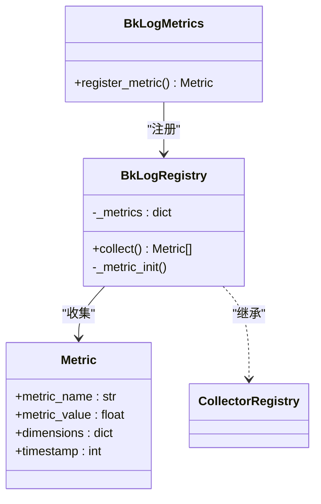
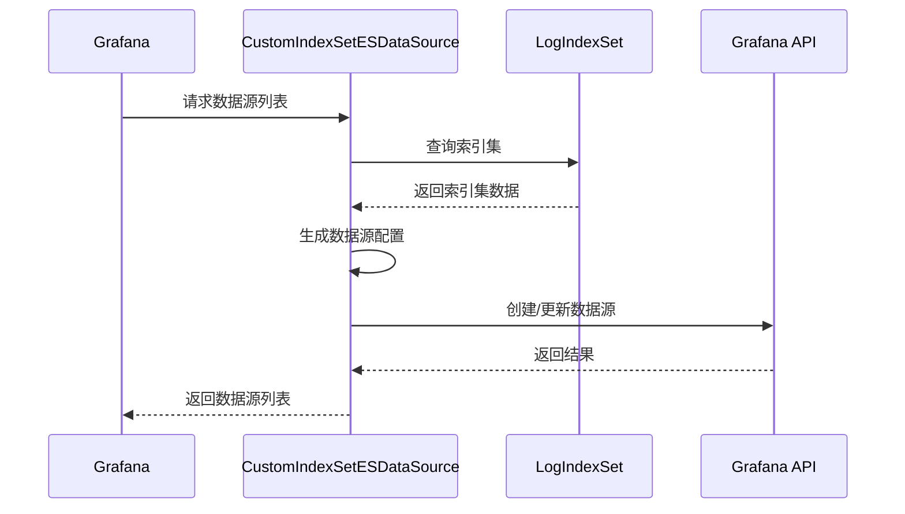
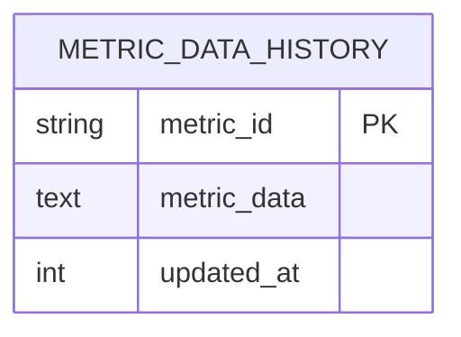

# 性能监控

<cite>
**本文档引用的文件**
- [data_source.py](file://bklog/apps/grafana/data_source.py)
- [query.py](file://bklog/apps/grafana/handlers/query.py)
- [model.py](file://bklog/apps/grafana/model.py)
- [prometheus.py](file://bklog/apps/utils/prometheus.py)
- [metrics.py](file://bklog/apps/log_search/metrics.py)
- [metrics.py](file://bklog/apps/log_esquery/metrics.py)
- [metrics.py](file://bklog/apps/ai_assistant/metrics.py)
- [cluster.py](file://bklog/apps/log_measure/handlers/metric_collectors/cluster.py)
- [business.py](file://bklog/apps/log_measure/handlers/metric_collectors/business.py)
- [es_indices.py](file://bklog/apps/log_measure/handlers/metric_collectors/es_indices.py)
- [es_pshard.py](file://bklog/apps/log_measure/handlers/metric_collectors/es_pshard.py)
- [es_stats.py](file://bklog/apps/log_measure/handlers/metric_collectors/es_stats.py)
- [log_archive.py](file://bklog/apps/log_measure/handlers/metric_collectors/log_archive.py)
- [log_clustering.py](file://bklog/apps/log_measure/handlers/metric_collectors/log_clustering.py)
- [log_databus.py](file://bklog/apps/log_measure/handlers/metric_collectors/log_databus.py)
- [log_extract.py](file://bklog/apps/log_measure/handlers/metric_collectors/log_extract.py)
- [log_search.py](file://bklog/apps/log_measure/handlers/metric_collectors/log_search.py)
- [rabbitmq.py](file://bklog/apps/log_measure/handlers/metric_collectors/rabbitmq.py)
- [third_party.py](file://bklog/apps/log_measure/handlers/metric_collectors/third_party.py)
- [user.py](file://bklog/apps/log_measure/handlers/metric_collectors/user.py)
- [MetricDataHistory.py](file://bklog/apps/log_measure/models.py)
</cite>

## 目录
1. [性能指标采集机制](#性能指标采集机制)
2. [自定义指标定义与注册](#自定义指标定义与注册)
3. [Grafana仪表盘集成配置](#grafana仪表盘集成配置)
4. [核心功能性能监控方案](#核心功能性能监控方案)
5. [RabbitMQ与第三方服务监控](#rabbitmq与第三方服务监控)
6. [性能数据存储与查询优化](#性能数据存储与查询优化)

## 性能指标采集机制

系统通过`metric_collectors`模块实现多维度性能指标的采集，覆盖业务、集群、Elasticsearch索引、分片和统计信息等关键指标。该模块采用基于装饰器的注册机制，通过`@register_metric`装饰器定义采集任务。

集群健康度指标采集通过`ClusterMetricCollector.cluster_health`方法实现，定期获取Elasticsearch集群的健康状态、活跃分片和未分配分片等信息。采集频率为每10分钟一次，指标包括：
- `cluster_health`：集群健康状态（0=green, 1=yellow, 2=red）
- `active_shards`：活跃分片数量
- `unassigned_shards`：未分配分片数量

集群节点性能指标采集通过`ClusterMetricCollector.cluster_node`方法实现，采集频率为每5分钟一次，包含节点资源使用情况：
- `heap_percent`：JVM堆内存使用率
- `ram_percent`：物理内存使用率
- `cpu`：CPU使用率
- `disk_use_rate`：磁盘使用率
- `load_1m`、`load_5m`、`load_15m`：系统负载

业务维度指标采集通过`BusinessMetricCollector`类实现，包括活跃业务统计、日志采集配置统计等功能使用情况。采集器通过分析`UserIndexSetSearchHistory`、`CollectorConfig`等模型数据，生成业务级别的使用统计指标。

Elasticsearch相关指标采集由多个专用采集器实现：
- `es_indices`：索引级别指标（文档数量、存储大小等）
- `es_pshard`：分片级别指标（分片状态、分配情况等）
- `es_stats`：集群统计信息（索引速率、搜索速率等）

**Section sources**
- [cluster.py](file://bklog/apps/log_measure/handlers/metric_collectors/cluster.py#L33-L195)
- [business.py](file://bklog/apps/log_measure/handlers/metric_collectors/business.py#L53-L285)
- [es_indices.py](file://bklog/apps/log_measure/handlers/metric_collectors/es_indices.py)
- [es_pshard.py](file://bklog/apps/log_measure/handlers/metric_collectors/es_pshard.py)
- [es_stats.py](file://bklog/apps/log_measure/handlers/metric_collectors/es_stats.py)

## 自定义指标定义与注册

系统提供灵活的自定义指标定义和注册机制，基于Prometheus客户端库和蓝鲸监控扩展实现。自定义指标通过`register_metric`函数注册，该函数封装了指标创建、标签处理和注册管理的完整流程。

指标注册的核心实现位于`bklog/apps/utils/prometheus.py`文件中，定义了`BkLogRegistry`类作为自定义的指标注册表。该注册表继承自`CollectorRegistry`，并重写了`collect`方法，在每次指标收集后清空指标数据，避免多实例部署时的数据重复累加。



**Diagram sources**
- [prometheus.py](file://bklog/apps/utils/prometheus.py#L16-L42)

自定义指标的定义需要指定以下参数：
- `metric_cls`：指标类型（Counter、Gauge、Histogram等）
- `name`：指标名称
- `documentation`：指标描述
- `labelnames`：标签名称列表
- `buckets`：直方图的桶边界（仅Histogram类型）

系统预定义了多种指标类型，如`Counter`（计数器）、`Gauge`（仪表盘）和`Histogram`（直方图）。例如，在日志搜索模块中定义的Doris查询延迟指标：

```python
DORIS_QUERY_LATENCY = register_metric(
    Histogram,
    name="doris_query_latency",
    documentation="query latency of doris query API",
    labelnames=("index_set_id", "result_table_id", "status", "source_app_code"),
    buckets=(0.05, 0.1, 0.5, 1.0, 2.5, 5.0, 7.5, 10.0, 20.0, 30.0, 60.0, INF),
)
```

所有注册的指标会自动添加通用标签：`hostname`（主机名）、`stage`（环境）、`bk_app_code`（应用代码）。这些标签有助于在多实例部署环境中区分不同实例的指标数据。

**Section sources**
- [prometheus.py](file://bklog/apps/utils/prometheus.py#L45-L59)
- [metrics.py](file://bklog/apps/log_search/metrics.py#L7-L22)
- [metrics.py](file://bklog/apps/log_esquery/metrics.py#L7-L22)
- [metrics.py](file://bklog/apps/ai_assistant/metrics.py#L26-L39)

## Grafana仪表盘集成配置

系统通过Grafana数据源集成实现性能数据的可视化展示。Grafana数据源配置由`CustomIndexSetESDataSource`类管理，该类负责将日志平台的索引集转换为Grafana可用的Elasticsearch数据源。

数据源创建流程如下：
1. 检查特性开关`GRAFANA_CUSTOM_ES_DATASOURCE`是否启用
2. 获取业务空间对应的`space_uid`
3. 查询该空间下的所有索引集
4. 为每个索引集生成Grafana数据源配置
5. 通过Grafana API创建或更新数据源



**Diagram sources**
- [data_source.py](file://bklog/apps/grafana/data_source.py#L46-L153)

Grafana查询处理由`GrafanaQueryHandler`类实现，该类处理来自Grafana的查询请求，包括时间序列查询、日志查询和统一查询。查询处理流程包括：
- 权限校验：验证用户是否有权限访问指定的索引集
- 参数转换：将Grafana查询参数转换为内部搜索参数
- 聚合处理：根据查询需求构建Elasticsearch聚合查询
- 结果格式化：将搜索结果转换为Grafana兼容的格式

数据源配置中包含必要的安全设置，如HTTP头认证：
- `X-BKLOG-SPACE-UID`：业务空间ID
- `X-BKLOG-TOKEN`：访问令牌

这些安全头确保只有授权的请求才能访问Elasticsearch数据，防止数据泄露。

**Section sources**
- [data_source.py](file://bklog/apps/grafana/data_source.py#L46-L153)
- [query.py](file://bklog/apps/grafana/handlers/query.py#L59-L800)

## 核心功能性能监控方案

### 日志采集性能监控

日志采集性能监控通过`log_databus`采集器实现，监控日志采集器的运行状态和性能指标。关键指标包括：
- 采集器实例数量
- 数据采集速率（条/秒）
- 数据传输延迟
- 采集成功率

采集器通过分析`CollectorConfig`模型和相关运行时数据，生成采集性能指标。系统还监控采集器的资源使用情况，包括CPU、内存和网络带宽。

### 日志搜索性能监控

日志搜索性能监控通过`log_search`模块的指标系统实现，主要监控两类指标：
1. Doris查询性能指标：
   - `doris_query_latency`：查询延迟直方图
   - `doris_query_count`：查询计数器

2. ESQuery搜索性能指标：
   - `esquery_search_latency`：Elasticsearch查询延迟
   - `esquery_search_count`：Elasticsearch查询计数

这些指标按索引集ID、场景ID、存储集群ID等维度进行细分，便于定位性能瓶颈。

### 日志聚类性能监控

日志聚类性能监控通过`log_clustering`采集器实现，监控聚类任务的执行情况。关键指标包括：
- 聚类任务执行时间
- 聚类结果数量
- 聚类准确率
- 模型训练耗时

系统通过分析`ClusteringConfig`模型和任务执行日志，生成聚类性能指标，帮助优化聚类算法和资源配置。

### 日志归档性能监控

日志归档性能监控通过`log_archive`采集器实现，监控归档任务的执行效率和资源消耗。关键指标包括：
- 归档数据量（GB）
- 归档速率（GB/小时）
- 归档任务执行时间
- 存储成本

系统通过分析`ArchiveConfig`模型和归档任务日志，生成归档性能指标，为存储策略优化提供数据支持。

**Section sources**
- [log_databus.py](file://bklog/apps/log_measure/handlers/metric_collectors/log_databus.py)
- [log_search.py](file://bklog/apps/log_measure/handlers/metric_collectors/log_search.py)
- [log_clustering.py](file://bklog/apps/log_measure/handlers/metric_collectors/log_clustering.py)
- [log_archive.py](file://bklog/apps/log_measure/handlers/metric_collectors/log_archive.py)
- [metrics.py](file://bklog/apps/log_search/metrics.py)
- [metrics.py](file://bklog/apps/log_esquery/metrics.py)

## RabbitMQ与第三方服务监控

### RabbitMQ队列监控

RabbitMQ队列监控通过`rabbitmq`采集器实现，定期采集RabbitMQ服务器的队列状态和性能指标。采集器连接到RabbitMQ管理API，获取以下关键指标：
- 队列消息数量（`messages`）
- 消息未确认数量（`messages_unacknowledged`）
- 消费者数量（`consumers`）
- 消息入队速率（`publish_details.rate`）
- 消息出队速率（`deliver_get_details.rate`）

采集器通过分析队列的深度和消息处理速率，识别潜在的性能瓶颈和消息积压问题。系统还监控RabbitMQ节点的资源使用情况，包括内存、磁盘和文件描述符使用率。

### 第三方服务监控

第三方服务监控通过`third_party`采集器实现，监控与系统集成的外部服务状态。监控范围包括：
- API响应时间
- 请求成功率
- 服务可用性
- 配额使用情况

对于不同的第三方服务，采集器实现特定的健康检查逻辑。例如，对于蓝鲸数据平台（BKData）的监控，采集器会定期执行简单的查询操作，验证服务的可用性和性能。

```mermaid
classDiagram
class MetricCollector {
+collect() Metric[]
}
class RabbitMQCollector {
+collect() Metric[]
}
class ThirdPartyCollector {
+collect() Metric[]
}
MetricCollector <|-- RabbitMQCollector
MetricCollector <|-- ThirdPartyCollector
RabbitMQCollector --> "RabbitMQ API" : "HTTP"
ThirdPartyCollector --> "External Services" : "API"
```

**Diagram sources**
- [rabbitmq.py](file://bklog/apps/log_measure/handlers/metric_collectors/rabbitmq.py)
- [third_party.py](file://bklog/apps/log_measure/handlers/metric_collectors/third_party.py)

系统还实现了用户行为监控，通过`user`采集器跟踪用户的操作行为和使用模式。这些指标包括：
- 用户登录频率
- 功能使用情况
- 搜索查询模式
- 仪表盘访问统计

这些监控数据不仅用于性能分析，还为产品优化和用户体验改进提供重要参考。

**Section sources**
- [rabbitmq.py](file://bklog/apps/log_measure/handlers/metric_collectors/rabbitmq.py)
- [third_party.py](file://bklog/apps/log_measure/handlers/metric_collectors/third_party.py)
- [user.py](file://bklog/apps/log_measure/handlers/metric_collectors/user.py)

## 性能数据存储与查询优化

### 存储策略

性能数据存储采用分层存储策略，结合短期热存储和长期冷存储。短期存储使用高性能数据库，确保实时查询性能；长期存储使用成本优化的存储方案，支持历史数据分析。

核心存储组件是`MetricDataHistory`模型，该模型定义了性能数据的存储结构：
- `metric_id`：指标ID，用于唯一标识指标
- `metric_data`：指标数据，以文本格式存储
- `updated_at`：指标时间戳



**Diagram sources**
- [models.py](file://bklog/apps/log_measure/models.py#L40-L44)

系统还实现了数据压缩和归档机制，定期将旧的性能数据压缩存储，减少存储空间占用。对于访问频率较低的历史数据，系统会自动迁移到低成本存储介质。

### 查询优化

查询优化策略包括：
1. **索引优化**：为`metric_id`和`updated_at`字段创建复合索引，加速基于指标ID和时间范围的查询。
2. **缓存机制**：对频繁访问的性能数据使用Redis缓存，减少数据库查询压力。
3. **分页查询**：对于大数据量查询，采用分页机制避免内存溢出。
4. **预聚合**：对常用查询模式预先计算聚合结果，提高查询响应速度。

系统还实现了查询限流和熔断机制，防止异常查询导致服务不可用。当查询负载过高时，系统会自动拒绝新的查询请求，确保核心服务的稳定性。

**Section sources**
- [models.py](file://bklog/apps/log_measure/models.py#L40-L44)
- [log_measure.py](file://bklog/apps/log_measure/handlers/metric_collectors/__init__.py)