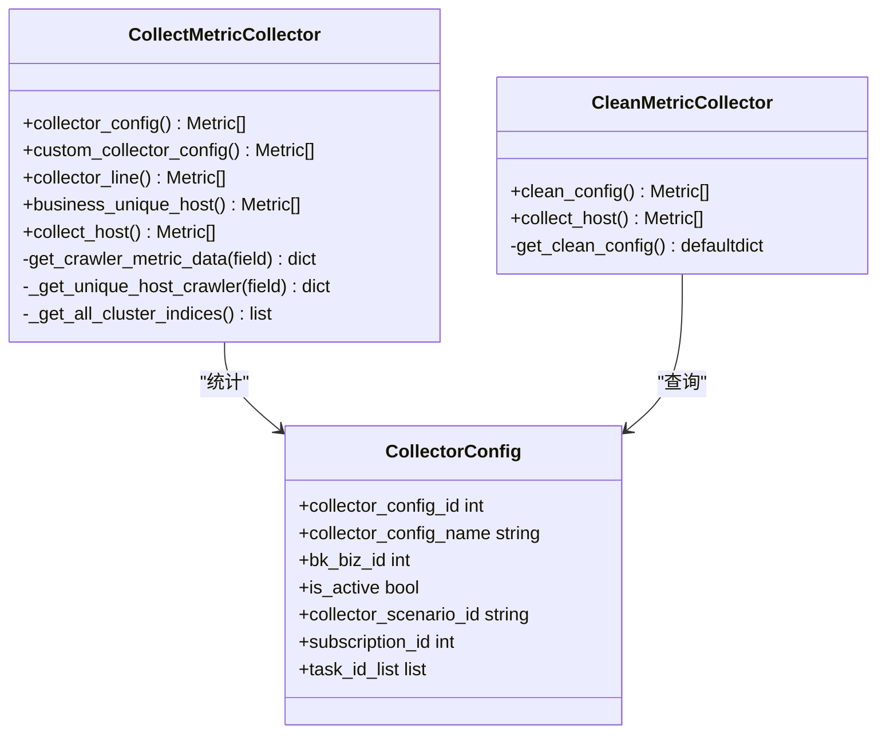
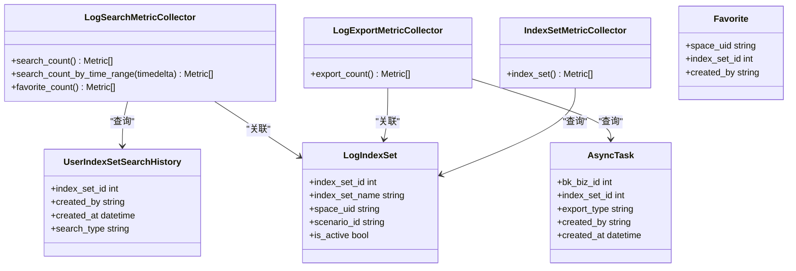
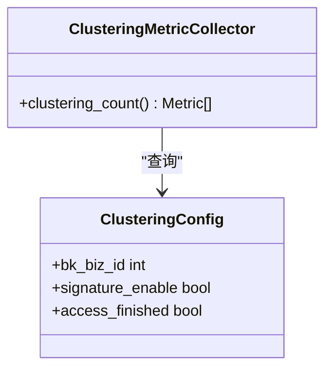
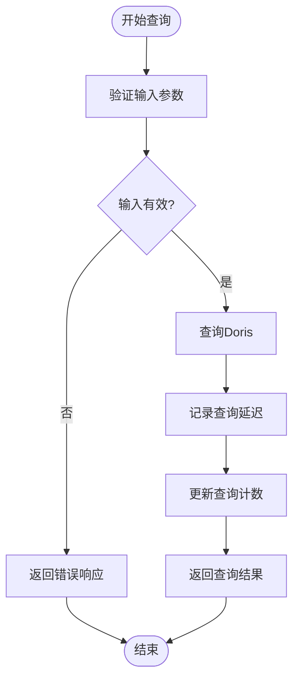

# 日志处理性能监控

<cite>
**本文档引用的文件**   
- [log_databus.py](file://bklog/apps/log_measure/handlers/metric_collectors/log_databus.py)
- [log_search.py](file://bklog/apps/log_measure/handlers/metric_collectors/log_search.py)
- [log_clustering.py](file://bklog/apps/log_measure/handlers/metric_collectors/log_clustering.py)
- [metrics.py](file://bklog/apps/log_search/metrics.py)
- [models.py](file://bklog/apps/log_databus/models.py)
- [models.py](file://bklog/apps/log_search/models.py)
</cite>

## 目录
1. [引言](#引言)
2. [日志采集性能监控](#日志采集性能监控)
3. [日志搜索性能监控](#日志搜索性能监控)
4. [日志聚类性能监控](#日志聚类性能监控)
5. [端到端延迟监控](#端到端延迟监控)
6. [资源消耗分析与容量规划](#资源消耗分析与容量规划)
7. [瓶颈识别与优化策略](#瓶颈识别与优化策略)
8. [结论](#结论)

## 引言
本文档详细描述了日志处理系统的性能监控方案，重点关注日志采集、搜索、聚类、提取和归档各环节的性能监控。文档说明了如何监控log_databus、log_search、log_clustering等模块的关键性能指标，解释了各处理环节的瓶颈识别方法和性能优化策略，并提供了端到端日志处理延迟的监控方案。同时，文档包含了各模块的资源消耗分析和容量规划建议。

## 日志采集性能监控

日志采集模块（log_databus）通过多种指标监控采集过程的性能和状态。系统通过采集配置、采集行数、采集主机等维度进行性能监控。

### 采集配置监控
采集配置监控主要跟踪不同业务、状态和采集场景下的采集配置数量。通过`collector_config`方法，系统按业务ID、激活状态和采集场景ID分组统计采集配置数量，并上报总数量。

### 采集行数监控
采集行数监控通过`collector_line`方法实现，该方法从监控系统获取采集器接收到的日志行数和已处理的日志行数，计算差值作为当前采集行数。监控数据包括任务数据ID维度的采集行数。

### 采集主机监控
采集主机监控通过`collect_host`方法实现，该方法查询节点管理系统的订阅实例状态，统计每个采集配置关联的主机数量。监控数据包括采集配置ID、采集配置名称、业务ID和业务名称维度的主机数量。

**图表来源**
- [log_databus.py](file://bklog/apps/log_measure/handlers/metric_collectors/log_databus.py#L55-L516)

**本节来源**
- [log_databus.py](file://bklog/apps/log_measure/handlers/metric_collectors/log_databus.py#L55-L516)

## 日志搜索性能监控

日志搜索模块（log_search）通过多个维度监控搜索性能，包括搜索次数、收藏统计、导出统计和索引集统计。

### 搜索次数监控
搜索次数监控通过`search_count`方法实现，该方法按不同时间范围（5分钟、15分钟、30分钟、1小时）统计日志检索次数。系统查询用户索引集搜索历史，按业务ID、用户名和时间范围分组统计搜索次数。

### 搜索收藏监控
搜索收藏监控通过`favorite_count`方法实现，该方法统计用户的检索收藏数量。系统查询收藏表，按空间ID和索引集ID分组统计收藏数量，并关联索引集名称和业务信息。

### 搜索导出监控
搜索导出监控通过`export_count`方法实现，该方法统计过去一小时内的日志导出任务。系统查询异步任务表，按业务ID、索引集ID、导出类型和创建者分组统计导出次数。

### 索引集监控
索引集监控通过`index_set`方法实现，该方法统计索引集的总数、活跃数量和多维度分布。系统按业务ID、场景ID、激活状态和是否有数据等维度聚合索引集数量。

**图表来源**
- [log_search.py](file://bklog/apps/log_measure/handlers/metric_collectors/log_search.py#L46-L293)

**本节来源**
- [log_search.py](file://bklog/apps/log_measure/handlers/metric_collectors/log_search.py#L46-L293)

## 日志聚类性能监控

日志聚类模块（log_clustering）通过聚类配置监控来跟踪聚类功能的使用情况。

### 聚类配置监控
聚类配置监控通过`clustering_count`方法实现，该方法统计已启用且接入完成的聚类配置数量。系统查询聚类配置表，按业务ID分组统计聚类配置数量，并上报总数。

**图表来源**
- [log_clustering.py](file://bklog/apps/log_measure/handlers/metric_collectors/log_clustering.py#L31-L65)

**本节来源**
- [log_clustering.py](file://bklog/apps/log_measure/handlers/metric_collectors/log_clustering.py#L31-L65)

## 端到端延迟监控

端到端延迟监控通过Doris查询延迟指标实现，该指标跟踪查询API的响应时间分布。

### Doris查询延迟监控
系统通过`DORIS_QUERY_LATENCY`直方图指标监控Doris查询API的延迟。该指标按索引集ID、结果表ID、状态和来源应用代码分组，记录查询延迟的分布情况，预设了从50毫秒到60秒的多个桶。

### Doris查询次数监控
系统通过`DORIS_QUERY_COUNT`计数器指标监控Doris查询API的调用次数。该指标按索引集ID、结果表ID、状态和来源应用代码分组，记录查询请求的总数。

**图表来源**
- [metrics.py](file://bklog/apps/log_search/metrics.py#L7-L21)

**本节来源**
- [metrics.py](file://bklog/apps/log_search/metrics.py#L7-L21)

## 资源消耗分析与容量规划

资源消耗分析与容量规划基于采集配置、索引集和存储使用情况等数据进行。

### 采集配置资源分析
通过采集配置监控数据，可以分析各业务的采集配置数量分布，识别配置密集的业务。结合采集行数和采集主机数据，可以评估采集负载与资源配置的匹配度。

### 索引集资源分析
通过索引集监控数据，可以分析索引集的数量分布、活跃度和数据存在情况。这些数据有助于识别长期未使用的索引集，进行资源回收和优化。

### 存储容量规划
通过采集配置的存储分片数量、分片大小和副本数等配置参数，结合实际的存储使用量，可以进行存储容量规划。系统还监控业务已用容量，为容量预警和扩容提供依据。

## 瓶颈识别与优化策略

### 采集环节瓶颈识别
通过采集行数监控和采集主机监控，可以识别采集瓶颈。当采集行数增长而采集主机数量不变时，可能表明单机采集负载过高。通过比较接收行数和处理行数的差值，可以识别处理延迟。

### 搜索环节瓶颈识别
通过搜索延迟监控和搜索次数监控，可以识别搜索性能瓶颈。当搜索延迟增加而搜索次数稳定时，可能表明查询复杂度增加或索引性能下降。通过分析不同时间范围的搜索模式，可以优化查询缓存策略。

### 聚类环节瓶颈识别
通过聚类配置监控和系统资源监控，可以识别聚类处理瓶颈。当聚类配置数量增加而聚类处理时间延长时，可能表明聚类算法或资源不足。通过监控聚类任务的执行时间和资源消耗，可以优化聚类策略。

### 优化策略
1. 对于采集环节，可以通过增加采集主机、优化采集配置或调整采集频率来优化性能。
2. 对于搜索环节，可以通过优化索引结构、增加缓存或优化查询语句来提高性能。
3. 对于聚类环节，可以通过优化聚类算法、增加计算资源或调整聚类参数来提升效率。

## 结论
本文档详细描述了日志处理系统的性能监控方案，涵盖了日志采集、搜索、聚类等关键环节的监控指标和方法。通过建立全面的性能监控体系，可以有效识别系统瓶颈，指导性能优化和容量规划，确保日志处理系统的稳定高效运行。建议定期分析监控数据，持续优化系统配置和架构，以应对不断增长的日志处理需求。