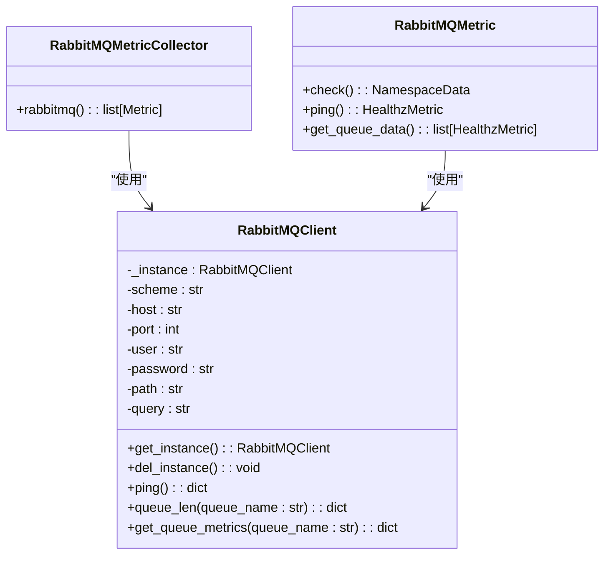
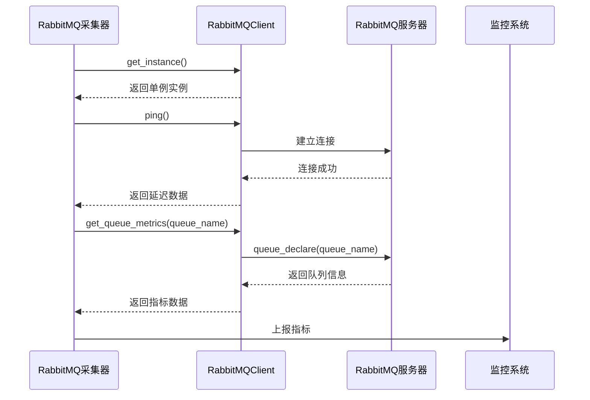
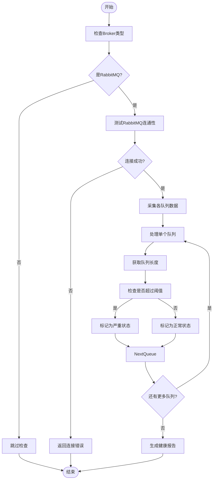
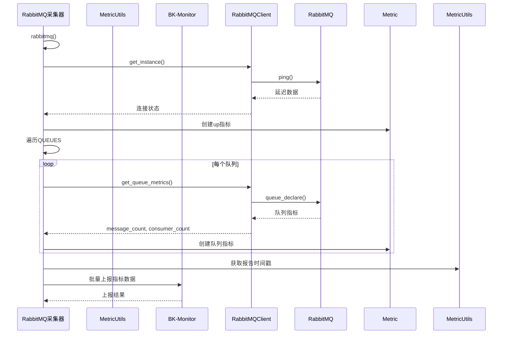

# 消息队列监控

<cite>
**本文档引用的文件**   
- [rabbitmq.py](file://bklog/home_application/utils/rabbitmq.py)
- [rabbitmq.py](file://bklog/apps/log_measure/handlers/metric_collectors/rabbitmq.py)
- [constants.py](file://bklog/home_application/constants.py)
- [rabbitmq.py](file://bklog/home_application/handlers/healthz_metrics/rabbitmq.py)
- [default.py](file://bklog/config/default.py)
- [dev.py](file://bklog/config/dev.py)
- [metric.py](file://bklog/bk_monitor/utils/metric.py)
</cite>

## 目录
1. [引言](#引言)
2. [RabbitMQ监控实现机制](#rabbitmq监控实现机制)
3. [关键指标采集方案](#关键指标采集方案)
4. [消息积压预警机制](#消息积压预警机制)
5. [集群性能优化建议](#集群性能优化建议)
6. [常见问题排查指南](#常见问题排查指南)
7. [容量规划与高可用配置](#容量规划与高可用配置)
8. [监控数据上报流程](#监控数据上报流程)

## 引言

本文档详细描述了RabbitMQ消息队列的监控实现方案，包括关键指标采集、预警机制、性能优化、问题排查和高可用配置等方面。系统通过专门的RabbitMQ采集器实现对队列状态的全面监控，确保消息系统的稳定性和可靠性。

## RabbitMQ监控实现机制

RabbitMQ监控系统通过专门的采集器实现对消息队列的全面监控。核心实现基于`pika`库与RabbitMQ建立连接，并通过AMQP协议获取队列的各项指标。

监控系统采用单例模式实现`RabbitMQClient`，确保在整个应用生命周期中只维护一个连接实例，提高资源利用率和性能。



**图源**
- [rabbitmq.py](file://bklog/home_application/utils/rabbitmq.py#L36-L129)
- [rabbitmq.py](file://bklog/apps/log_measure/handlers/metric_collectors/rabbitmq.py#L9-L40)
- [rabbitmq.py](file://bklog/home_application/handlers/healthz_metrics/rabbitmq.py#L34-L86)

**本节源**
- [rabbitmq.py](file://bklog/home_application/utils/rabbitmq.py#L36-L129)
- [rabbitmq.py](file://bklog/apps/log_measure/handlers/metric_collectors/rabbitmq.py#L9-L40)
- [rabbitmq.py](file://bklog/home_application/handlers/healthz_metrics/rabbitmq.py#L34-L86)

## 关键指标采集方案

系统通过RabbitMQ管理API采集以下关键指标：

### 队列长度监控
通过`queue_declare`方法获取队列中的消息数量，这是衡量消息积压情况的核心指标。

### 消息速率监控
通过定期采集队列长度变化，计算单位时间内的消息处理速率。

### 连接数监控
监控当前与RabbitMQ建立的连接数量，评估系统负载情况。

### 消费者数量监控
获取每个队列的消费者数量，判断消息处理能力是否充足。



**图源**
- [rabbitmq.py](file://bklog/home_application/utils/rabbitmq.py#L66-L81)
- [rabbitmq.py](file://bklog/home_application/utils/rabbitmq.py#L109-L129)
- [rabbitmq.py](file://bklog/apps/log_measure/handlers/metric_collectors/rabbitmq.py#L14-L39)

**本节源**
- [rabbitmq.py](file://bklog/home_application/utils/rabbitmq.py#L66-L129)
- [rabbitmq.py](file://bklog/apps/log_measure/handlers/metric_collectors/rabbitmq.py#L14-L39)

## 消息积压预警机制

系统实现了完善的消息积压预警机制，当队列长度超过预设阈值时触发告警。

### 预警阈值配置
系统预设的告警阈值为10000条消息，可通过配置文件进行调整。

### 预警流程
1. 定期采集各队列的长度
2. 比较队列长度与预设阈值
3. 超过阈值时标记为异常状态
4. 生成健康检查报告
5. 触发告警通知

### 队列监控列表
系统监控以下核心队列：
- default
- celery
- pipeline_additional_task
- pipeline_additional_task_priority
- service_schedule
- service_schedule_priority
- pipeline
- pipeline_priority
- async_export
- tgpa_task



**图源**
- [constants.py](file://bklog/home_application/constants.py#L51-L66)
- [rabbitmq.py](file://bklog/home_application/handlers/healthz_metrics/rabbitmq.py#L72-L86)
- [rabbitmq.py](file://bklog/home_application/utils/rabbitmq.py#L83-L107)

**本节源**
- [constants.py](file://bklog/home_application/constants.py#L51-L68)
- [rabbitmq.py](file://bklog/home_application/handlers/healthz_metrics/rabbitmq.py#L38-L58)
- [rabbitmq.py](file://bklog/home_application/utils/rabbitmq.py#L83-L107)

## 集群性能优化建议

### 连接管理优化
- 使用连接池管理RabbitMQ连接，避免频繁创建和销毁连接
- 设置合理的连接超时时间，及时释放闲置连接
- 采用长连接方式，减少TCP握手开销

### 队列设计优化
- 合理划分队列，避免单个队列过大
- 为高优先级任务设置专用队列
- 使用死信队列处理异常消息

### 消息处理优化
- 批量消费消息，提高处理效率
- 设置合理的预取计数（prefetch count）
- 实现消息确认机制，确保消息不丢失

### 资源配置优化
- 根据业务负载合理配置RabbitMQ节点资源
- 设置合理的内存和磁盘告警阈值
- 配置持久化策略，平衡性能和可靠性

## 常见问题排查指南

### 连接失败问题
**现象**：无法连接到RabbitMQ服务器
**排查步骤**：
1. 检查Broker URL配置是否正确
2. 验证网络连通性
3. 检查认证信息（用户名、密码）是否正确
4. 确认RabbitMQ服务是否正常运行

### 消息积压问题
**现象**：队列长度持续增长
**排查步骤**：
1. 检查消费者是否正常运行
2. 分析消息处理逻辑是否存在性能瓶颈
3. 评估消费者数量是否足够
4. 检查是否有异常消息阻塞队列

### 性能下降问题
**现象**：消息处理延迟增加
**排查步骤**：
1. 检查系统资源使用情况（CPU、内存、磁盘IO）
2. 分析网络延迟
3. 检查RabbitMQ节点负载
4. 评估消息大小和频率是否异常

### 高可用问题
**现象**：节点故障导致服务中断
**排查步骤**：
1. 检查集群状态
2. 验证镜像队列配置
3. 检查网络分区情况
4. 确认故障转移机制是否正常工作

## 容量规划与高可用配置

### 容量规划
根据业务需求进行合理的容量规划：

#### 存储容量计算
```
总存储容量 = 日均消息量 × 平均消息大小 × 保留周期
```

#### 处理能力评估
- 评估峰值消息吞吐量
- 计算所需消费者数量
- 预留30%-50%的性能余量

#### 节点规模规划
- 小型部署：3节点集群
- 中型部署：5-7节点集群
- 大型部署：7+节点集群，考虑跨机房部署

### 高可用配置
#### 集群模式
采用RabbitMQ镜像队列模式，确保消息在多个节点间复制。

#### 镜像策略
```json
{
  "ha-mode": "exactly",
  "ha-params": 3,
  "ha-sync-mode": "automatic"
}
```

#### 故障转移
- 配置自动故障转移
- 设置合理的心跳检测间隔
- 实现客户端重连机制

#### 数据持久化
- 启用消息持久化
- 配置持久化存储
- 定期备份队列元数据

## 监控数据上报流程

监控数据通过标准化流程上报到监控系统，确保数据的完整性和一致性。



**图源**
- [rabbitmq.py](file://bklog/apps/log_measure/handlers/metric_collectors/rabbitmq.py#L12-L40)
- [metric.py](file://bklog/bk_monitor/utils/metric.py#L49-L86)
- [constants.py](file://bklog/home_application/constants.py#L51-L66)

**本节源**
- [rabbitmq.py](file://bklog/apps/log_measure/handlers/metric_collectors/rabbitmq.py#L12-L40)
- [metric.py](file://bklog/bk_monitor/utils/metric.py#L49-L86)