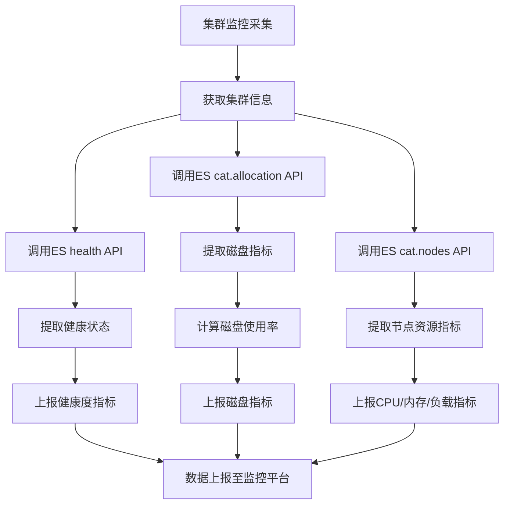
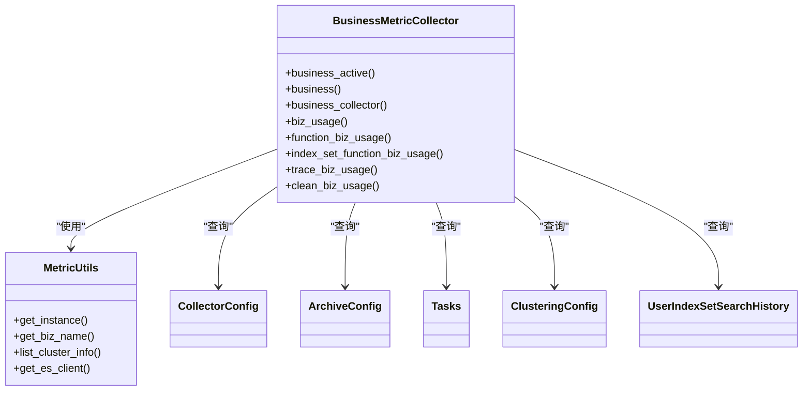
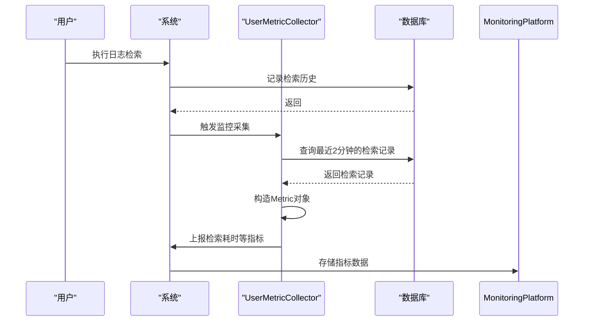
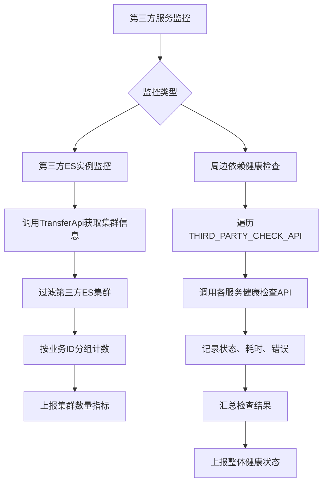
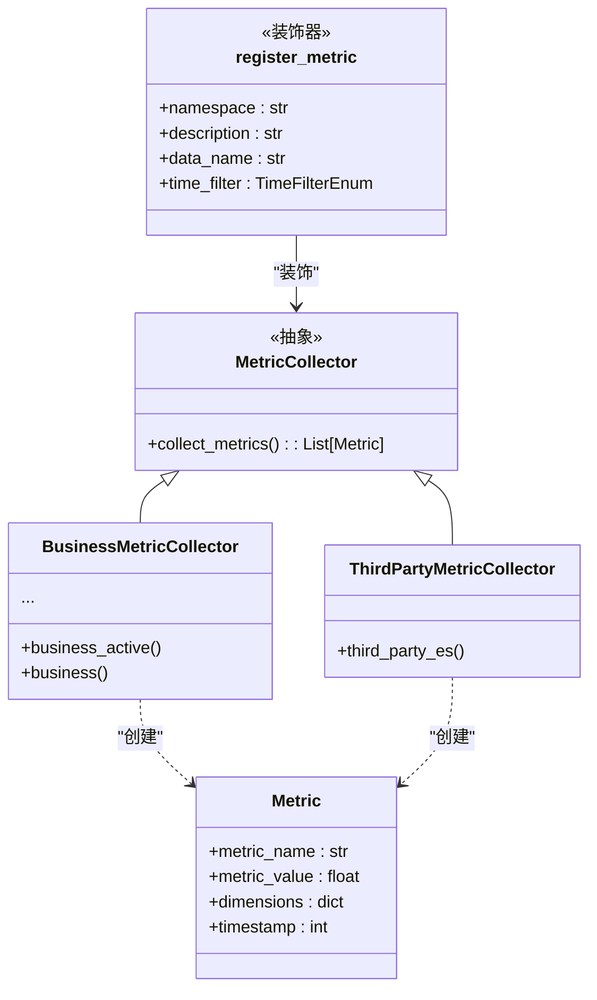

# 系统与第三方服务监控

<cite>
**本文档引用文件**  
- [third_party.py](file://bklog/home_application/utils/third_party.py)
- [third_party.py](file://bklog/apps/log_measure/handlers/metric_collectors/third_party.py)
- [healthz_metrics.py](file://bklog/home_application/handlers/healthz_metrics/third_party.py)
- [metric_collectors.py](file://bklog/apps/log_measure/handlers/metric_collectors/third_party.py)
- [constants.py](file://bklog/apps/log_measure/constants.py)
- [metric.py](file://bklog/apps/log_measure/utils/metric.py)
- [business.py](file://bklog/apps/log_measure/handlers/metric_collectors/business.py)
- [cluster.py](file://bklog/apps/log_measure/handlers/metric_collectors/cluster.py)
- [grafana.py](file://bklog/apps/log_measure/handlers/metric_collectors/grafana.py)
- [user.py](file://bklog/apps/log_measure/handlers/metric_collectors/user.py)
- [metrics.py](file://bklog/apps/ai_assistant/metrics.py)
</cite>

## 目录
1. [引言](#引言)
2. [集群监控方案](#集群监控方案)
3. [业务指标监控](#业务指标监控)
4. [用户行为监控](#用户行为监控)
5. [第三方服务监控](#第三方服务监控)
6. [自定义业务指标定义与采集](#自定义业务指标定义与采集)
7. [系统性能瓶颈分析方法](#系统性能瓶颈分析方法)
8. [监控数据关联分析与根因定位](#监控数据关联分析与根因定位)
9. [总结](#总结)

## 引言

蓝鲸智云监控平台（BLUEKING-MONITOR）是一款集数据采集、大规模数据处理、平台扩展能力于一体的监控平台产品。该平台依托蓝鲸PaaS，支持多种监控场景，致力于提升监控的及时性、准确性与智能化水平，为在线业务提供全面保障。本文档详细描述了该系统在集群、业务、用户及第三方服务方面的监控方案，涵盖系统资源使用率、业务指标、用户行为等数据的采集方法，以及第三方采集器的集成方式和监控范围。同时，文档还提供了系统级性能瓶颈的分析方法、监控数据的关联分析与根因定位策略，并详细说明了自定义业务指标的定义与采集流程。

**Section sources**
- [README.md](file://README.md)

## 集群监控方案

本系统通过`cluster.py`中的`ClusterMetricCollector`类实现对Elasticsearch集群的全面监控。监控内容包括集群健康度和节点资源使用情况。健康度监控通过调用Elasticsearch的`cluster.health`接口获取集群状态（green/yellow/red）、活跃分片数和未分配分片数等关键指标。节点监控则通过`cat.allocation`和`cat.nodes`接口采集各节点的磁盘使用率、堆内存使用率、CPU使用率、负载等资源指标。所有采集的指标均通过`register_metric`装饰器注册，并附带`bk_biz_id`、`bk_biz_name`、`cluster_id`、`cluster_name`等维度信息，实现多维度监控数据的上报与分析。

**Diagram sources**
- [cluster.py](file://bklog/apps/log_measure/handlers/metric_collectors/cluster.py)

**Section sources**
- [cluster.py](file://bklog/apps/log_measure/handlers/metric_collectors/cluster.py)

## 业务指标监控

业务指标监控由`business.py`中的`BusinessMetricCollector`类负责，主要采集与业务使用情况相关的统计信息。监控范围包括：活跃业务数（基于近期检索行为判断）、业务总数、配置了日志采集的业务数、以及各功能模块（如日志采集、日志归档、日志提取、日志聚类等）的使用业务数。该采集器通过查询数据库中的`CollectorConfig`、`ArchiveConfig`、`Tasks`、`ClusteringConfig`等模型，统计各业务的配置数量，并将结果作为时间序列指标上报。此外，还通过分析`UserIndexSetSearchHistory`表来判断业务的活跃度，为业务运营提供数据支持。

**Diagram sources**
- [business.py](file://bklog/apps/log_measure/handlers/metric_collectors/business.py)

**Section sources**
- [business.py](file://bklog/apps/log_measure/handlers/metric_collectors/business.py)

## 用户行为监控

用户行为监控由`user.py`中的`UserMetricCollector`类实现，主要关注用户的活跃度和操作行为。监控指标包括：活跃用户数（基于最近登录和检索行为）、不同时间范围内的独立访客（UV）数、以及用户的检索历史。检索历史采集器（`search_history`）会实时上报用户的每次检索操作，包括检索耗时、检索的索引集、操作用户等详细信息，这些数据可用于分析用户使用习惯、优化检索性能。所有用户指标均以`target_username`作为关键维度，便于进行用户级别的行为分析。

**Diagram sources**
- [user.py](file://bklog/apps/log_measure/handlers/metric_collectors/user.py)

**Section sources**
- [user.py](file://bklog/apps/log_measure/handlers/metric_collectors/user.py)

## 第三方服务监控

第三方服务监控包含两个层面：一是对第三方服务实例（如ES）的监控，二是对周边依赖服务（如CC、JOB、ITSM等）的健康检查。

### 第三方服务实例监控
`third_party.py`（位于`log_measure/handlers/metric_collectors/`）中的`ThirdPartyMetricCollector`类负责监控第三方Elasticsearch实例。它通过调用`TransferApi.get_cluster_info`接口获取所有类型为`elasticsearch`的集群信息，然后根据集群配置中的`registered_system`和`custom_option.bk_biz_id`进行过滤和分组，最终上报每个业务下第三方ES集群的数量。

### 周边依赖服务健康检查
`healthz_metrics/third_party.py`中的`ThirdPartyCheck`类负责对周边依赖服务进行健康检查。它通过`THIRD_PARTY_CHECK_API`字典定义了一组待检查的服务（如CC、ITSM、JOB、BK-USER、NODEMAN、MONITOR、BK-DATA、PAAS等），并为每个服务配置了对应的API调用方法。检查逻辑会遍历这些服务，逐一调用其健康检查接口，记录调用耗时、状态和错误信息。最终，所有检查结果会被汇总，如果所有服务（或关键服务）均正常，则认为第三方依赖整体健康。

**Diagram sources**
- [third_party.py](file://bklog/apps/log_measure/handlers/metric_collectors/third_party.py)
- [healthz_metrics/third_party.py](file://bklog/home_application/handlers/healthz_metrics/third_party.py)

**Section sources**
- [third_party.py](file://bklog/apps/log_measure/handlers/metric_collectors/third_party.py)
- [healthz_metrics/third_party.py](file://bklog/home_application/handlers/healthz_metrics/third_party.py)
- [third_party.py](file://bklog/home_application/utils/third_party.py)

## 自定义业务指标定义与采集

系统通过一套基于装饰器的灵活指标采集框架来支持自定义业务指标。核心机制如下：

1.  **指标注册**：使用`@register_metric`装饰器来定义和注册一个监控指标。该装饰器接受`namespace`（命名空间）、`description`（描述）、`data_name`（数据名称）和`time_filter`（上报周期）等参数。
2.  **采集器实现**：开发者需实现一个返回`Metric`对象列表的函数。`Metric`对象包含`metric_name`（指标名）、`metric_value`（指标值）、`dimensions`（维度，如业务ID、集群名等）和`timestamp`（时间戳）。
3.  **统一管理**：所有采集器的路径在`constants.py`的`COLLECTOR_IMPORT_PATHS`列表中统一配置，系统启动时会自动加载这些模块，发现并注册所有被`@register_metric`装饰的函数。
4.  **数据上报**：采集到的指标数据通过`BKMonitor`客户端上报至蓝鲸监控平台。

例如，`ai_assistant/metrics.py`中定义了AI服务的调用次数和耗时指标，这些指标在AI服务处理请求时被更新，实现了对AI功能的精细化监控。

**Diagram sources**
- [metric.py](file://bklog/apps/log_measure/utils/metric.py)
- [constants.py](file://bklog/apps/log_measure/constants.py)
- [metrics.py](file://bklog/apps/ai_assistant/metrics.py)

**Section sources**
- [metric.py](file://bklog/apps/log_measure/utils/metric.py)
- [constants.py](file://bklog/apps/log_measure/constants.py)
- [metrics.py](file://bklog/apps/ai_assistant/metrics.py)

## 系统性能瓶颈分析方法

系统性能瓶颈分析主要依赖于多维度的监控数据采集和关联分析。

1.  **资源瓶颈分析**：通过`cluster.py`采集的节点级指标（CPU、内存、磁盘I/O、负载）可以快速定位到资源使用过高的具体节点。结合`grafana.py`采集的Grafana仪表盘和面板数据，可以分析是否存在大量高频率或复杂查询导致的资源消耗。
2.  **应用瓶颈分析**：通过`user.py`采集的`search_history`指标，可以分析单次检索的耗时。如果平均或P99耗时过高，说明查询性能存在瓶颈。可以进一步结合`business.py`中的业务指标，分析是特定业务的查询负载过高，还是特定功能（如聚类）导致的性能下降。
3.  **依赖瓶颈分析**：通过`third_party.py`（健康检查）可以判断周边依赖服务是否正常。如果某个依赖服务（如Job或BK-Data）响应缓慢或不可用，可能会成为整个系统的性能瓶颈。
4.  **数据流瓶颈分析**：系统通过`log_databus`等模块处理日志数据流。分析数据采集、传输、处理各环节的延迟和积压情况，可以定位数据流中的瓶颈点。

**Section sources**
- [cluster.py](file://bklog/apps/log_measure/handlers/metric_collectors/cluster.py)
- [user.py](file://bklog/apps/log_measure/handlers/metric_collectors/user.py)
- [third_party.py](file://bklog/home_application/handlers/healthz_metrics/third_party.py)
- [grafana.py](file://bklog/apps/log_measure/handlers/metric_collectors/grafana.py)

## 监控数据关联分析与根因定位

本系统通过丰富的维度信息和统一的监控框架，支持高效的监控数据关联分析与根因定位。

1.  **维度关联**：所有关键指标都带有`bk_biz_id`和`bk_biz_name`维度。当发现某个业务的系统资源使用率异常升高时，可以立即关联查询该业务的`business_collector`、`user_active`、`search_history`等指标，判断是业务量激增、用户行为异常还是配置变更导致的。
2.  **时间序列关联**：通过将不同来源的指标（如集群节点CPU、用户检索耗时、第三方服务响应时间）在同一时间轴上进行对比，可以直观地发现异常事件之间的先后关系和相关性。例如，第三方服务（如CC）的延迟增加，可能紧接着导致本系统的API响应变慢。
3.  **根因定位流程**：
    *   **现象层**：告警或大盘显示系统性能下降（如API延迟高）。
    *   **资源层**：检查`cluster_node`指标，确认是否存在CPU、内存或磁盘瓶颈。
    *   **应用层**：检查`search_history`指标，确认是否是特定查询导致负载过高。
    *   **依赖层**：检查`third_party`健康检查结果，确认周边依赖服务是否正常。
    *   **业务层**：结合`business_active`和`user_active`指标，确认是否是业务或用户行为异常。
    通过这种自上而下、层层剥离的分析方法，可以快速定位问题的根本原因。

**Section sources**
- [cluster.py](file://bklog/apps/log_measure/handlers/metric_collectors/cluster.py)
- [user.py](file://bklog/apps/log_measure/handlers/metric_collectors/user.py)
- [third_party.py](file://bklog/home_application/handlers/healthz_metrics/third_party.py)
- [business.py](file://bklog/apps/log_measure/handlers/metric_collectors/business.py)

## 总结

本文档详细阐述了蓝鲸智云监控平台在集群、业务、用户和第三方服务方面的监控体系。系统通过模块化的采集器设计，实现了对系统资源、业务使用、用户行为和外部依赖的全方位监控。其核心优势在于：
*   **灵活性**：基于装饰器的自定义指标框架，易于扩展。
*   **全面性**：覆盖了从基础设施到应用层再到用户行为的完整监控链条。
*   **可关联性**：统一的维度和数据模型，便于进行跨维度的关联分析和根因定位。
通过合理利用这套监控方案，可以有效保障系统的稳定运行，及时发现并解决潜在问题。