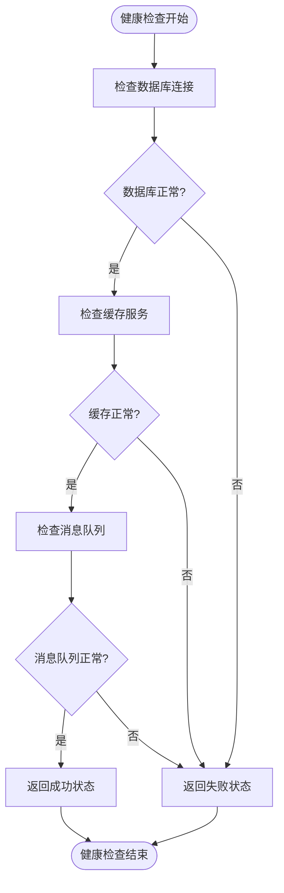
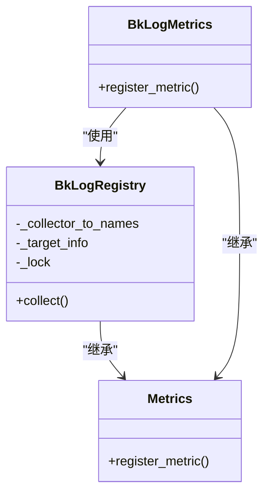
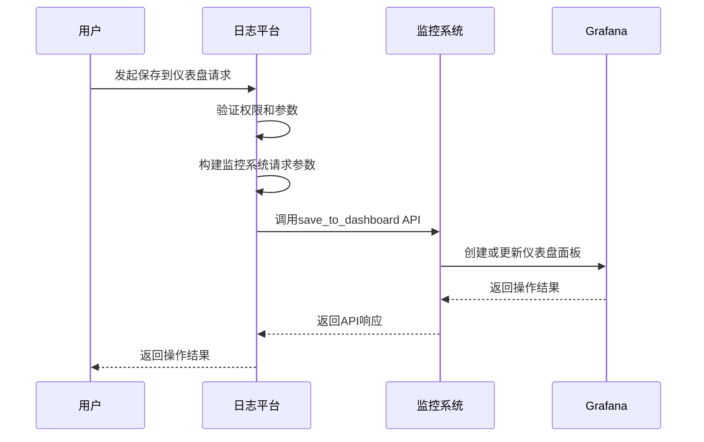
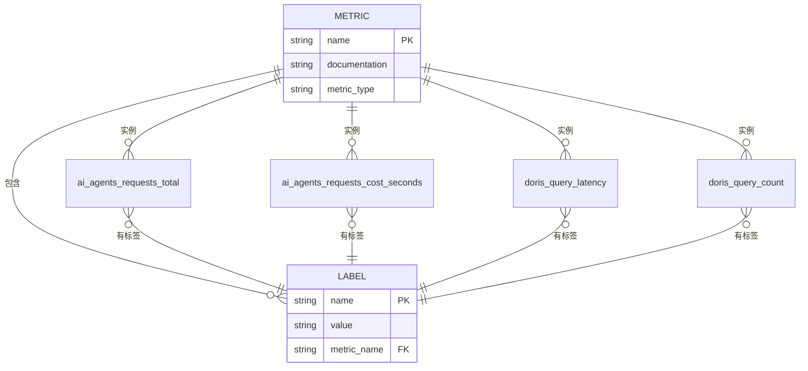
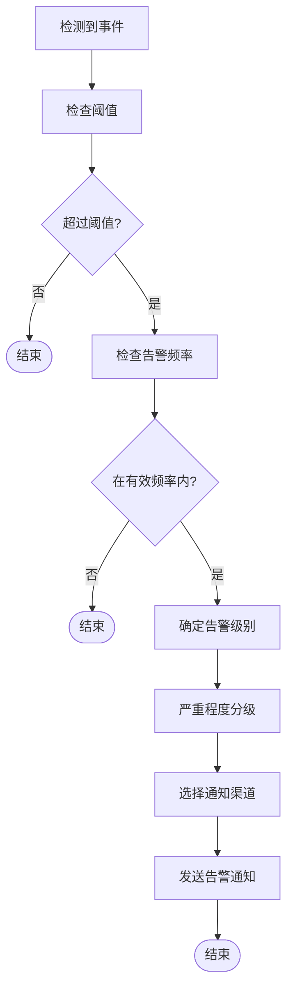
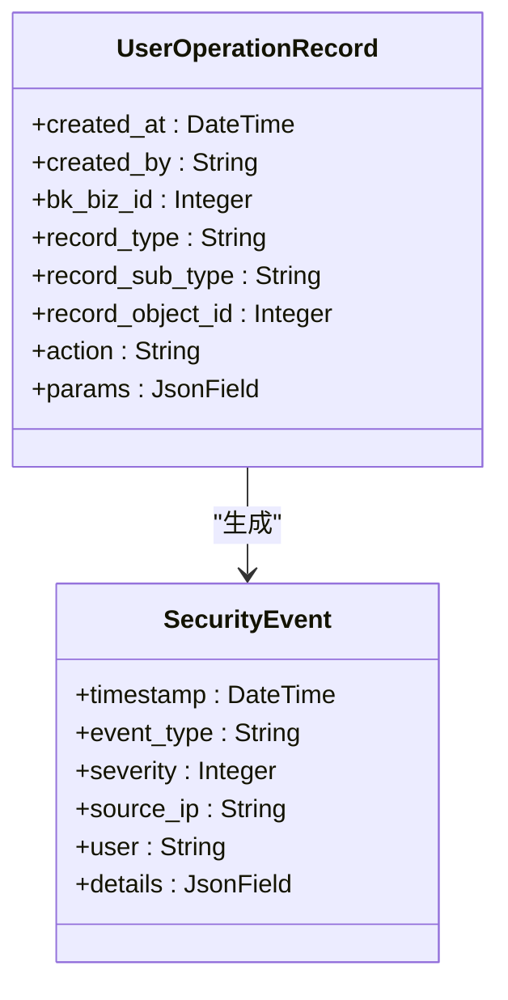
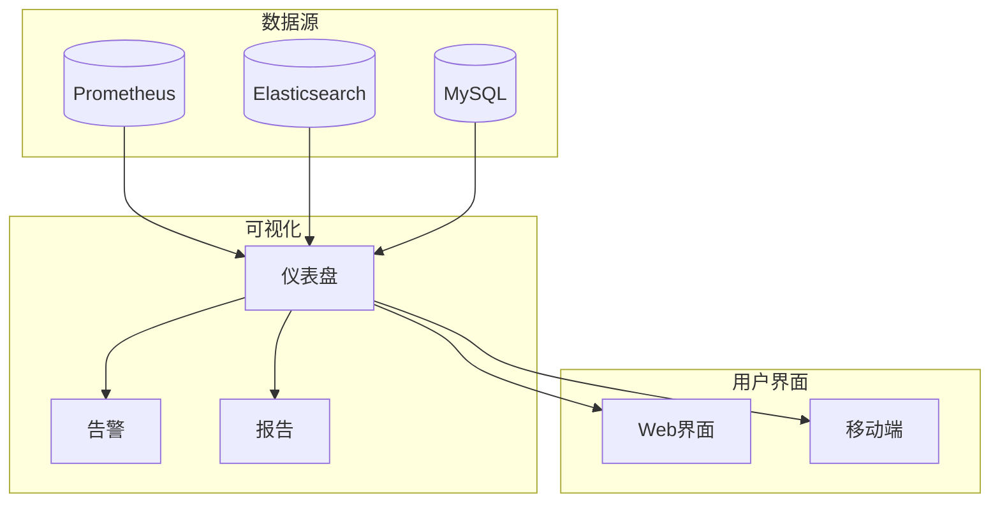

# 监控与告警

<cite>
**本文档引用的文件**
- [monitor.py](file://bklog/apps/grafana/handlers/monitor.py)
- [data_source.py](file://bklog/apps/grafana/data_source.py)
- [views.py](file://bklog/apps/grafana/views.py)
- [metrics.py](file://bklog/apps/ai_assistant/metrics.py)
- [metrics.py](file://bklog/apps/log_search/metrics.py)
- [prometheus.py](file://bklog/apps/utils/prometheus.py)
- [QueryClient.py](file://bklog/apps/log_esquery/esquery/client/QueryClient.py)
- [models.py](file://bklog/apps/log_audit/models.py)
- [events.py](file://bklog/apps/log_measure/events.py)
- [healthz.py](file://bklog/home_application/handlers/healthz.py)
</cite>

## 目录
1. [引言](#引言)
2. [系统健康检查机制](#系统健康检查机制)
3. [性能指标采集](#性能指标采集)
4. [Prometheus监控配置](#prometheus监控配置)
5. [Grafana仪表盘集成](#grafana仪表盘集成)
6. [关键性能指标定义](#关键性能指标定义)
7. [告警规则配置](#告警规则配置)
8. [系统审计日志与安全事件监控](#系统审计日志与安全事件监控)
9. [监控数据可视化与历史分析](#监控数据可视化与历史分析)

## 引言
本文档详细描述了蓝鲸日志平台的监控与告警系统，涵盖了系统健康检查、性能指标采集、Prometheus监控配置、Grafana仪表盘集成、关键性能指标定义、告警规则配置、审计日志以及监控数据可视化方案。该系统为日志平台提供了全面的可观测性能力，确保系统的稳定性和可靠性。

## 系统健康检查机制
系统健康检查机制通过暴露标准的健康检查端点来实现，用于监控应用的运行状态。系统实现了多层级的健康检查，包括应用层、数据库连接和外部服务依赖的检查。

健康检查端点通过`healthz`处理器实现，该处理器会检查核心组件的可用性，如数据库连接、缓存服务和消息队列等。当所有依赖服务都正常时，健康检查返回成功状态；否则返回失败状态并提供详细的错误信息。



**图示来源**
- [healthz.py](file://bklog/home_application/handlers/healthz.py)

**本节来源**
- [healthz.py](file://bklog/home_application/handlers/healthz.py)

## 性能指标采集
系统通过Prometheus客户端库采集详细的性能指标，这些指标涵盖了应用性能、业务逻辑和系统资源使用情况。指标采集遵循统一的注册和管理机制，确保指标的一致性和可维护性。

系统使用自定义的`BkLogRegistry`注册表来管理所有指标，该注册表在每次指标收集后会清空数据，以适应多实例部署的场景，由监控系统上层进行聚合计算。



**图示来源**
- [prometheus.py](file://bklog/apps/utils/prometheus.py)

**本节来源**
- [prometheus.py](file://bklog/apps/utils/prometheus.py)

## Prometheus监控配置
Prometheus监控配置通过自定义的指标注册机制实现，系统提供了统一的`register_metric`函数来注册各种类型的Prometheus指标。所有指标都会自动添加主机名、部署环境和应用代码等标签，便于多维度分析。

指标注册时，系统会自动为所有指标添加标准化的标签，包括`hostname`、`stage`和`bk_app_code`，这使得在分布式环境中可以轻松地按实例、环境和应用进行指标过滤和聚合。

```python
# 指标注册示例（概念性代码，非实际内容）
def register_metric(metric_cls, name, documentation, labelnames=(), **kwargs):
    # 添加标准化标签
    labelnames = [*labelnames, "hostname", "stage", "bk_app_code"]
    # 创建指标实例
    metric = metric_cls(name, documentation, labelnames, namespace=NAMESPACE, registry=REGISTRY, **kwargs)
    # 重写labels方法以自动注入标准化标签
    return metric
```

**本节来源**
- [prometheus.py](file://bklog/apps/utils/prometheus.py)

## Grafana仪表盘集成
Grafana仪表盘集成通过API接口实现，系统提供了将查询结果保存到Grafana仪表盘的功能。集成机制允许用户将日志搜索结果直接创建为Grafana面板，并保存到指定的仪表盘中。

系统通过`MonitorGrafanaHandler`类处理与监控系统的集成，该类将日志索引集信息转换为监控系统可识别的格式，并通过API调用将其保存到Grafana仪表盘。



**图示来源**
- [monitor.py](file://bklog/apps/grafana/handlers/monitor.py)
- [views.py](file://bklog/apps/grafana/views.py)

**本节来源**
- [monitor.py](file://bklog/apps/grafana/handlers/monitor.py)
- [views.py](file://bklog/apps/grafana/views.py)

## 关键性能指标定义
系统定义了多种关键性能指标(KPI)，用于监控不同组件的性能和健康状况。这些指标分为应用性能指标、业务指标和系统资源指标。

### AI助手服务指标
AI助手服务采集了两个核心指标：
- `ai_agents_requests_total`: AI服务调用次数统计，按代理代码、资源名称、状态、用户名和命令进行标签划分
- `ai_agents_requests_cost_seconds`: AI服务调用耗时统计，按相同维度进行标签划分

### 日志搜索性能指标
日志搜索功能采集了Doris查询性能指标：
- `doris_query_latency`: Doris查询延迟直方图，记录查询响应时间分布
- `doris_query_count`: Doris查询次数计数器，按索引集ID、结果表ID、状态和来源应用代码进行标签划分



**图示来源**
- [metrics.py](file://bklog/apps/ai_assistant/metrics.py)
- [metrics.py](file://bklog/apps/log_search/metrics.py)

**本节来源**
- [metrics.py](file://bklog/apps/ai_assistant/metrics.py)
- [metrics.py](file://bklog/apps/log_search/metrics.py)

## 告警规则配置
告警规则配置通过事件触发机制实现，系统定义了多种事件类型用于触发告警。告警规则配置包括阈值设置、通知渠道和告警分级。

系统通过`BK_MONITOR_CLIENT`构建事件触发器，当特定条件满足时触发告警事件。告警事件包含内容和维度信息，便于在监控系统中进行分类和路由。

告警分级基于事件的严重程度，系统支持多种通知渠道，包括邮件、企业微信和短信等。告警规则可以基于时间窗口、频率和依赖关系进行配置，避免告警风暴。



**图示来源**
- [events.py](file://bklog/apps/log_measure/events.py)

**本节来源**
- [events.py](file://bklog/apps/log_measure/events.py)

## 系统审计日志与安全事件监控
系统审计日志通过`UserOperationRecord`模型实现，记录所有用户的操作行为。审计日志包含操作时间、操作者、业务ID、操作对象类型、操作方法和请求参数等详细信息。

安全事件监控基于审计日志和系统指标，通过预定义的规则检测异常行为。系统会监控登录失败、权限变更、数据导出等敏感操作，并在检测到可疑行为时触发安全告警。

审计日志存储在数据库中，支持按时间范围、操作者、操作类型等条件进行查询和分析。日志数据保留策略根据安全合规要求进行配置，确保满足审计需求。



**图示来源**
- [models.py](file://bklog/apps/log_audit/models.py)

**本节来源**
- [models.py](file://bklog/apps/log_audit/models.py)

## 监控数据可视化与历史分析
监控数据可视化通过Grafana实现，系统提供了多种预定义的仪表盘和自定义查询功能。用户可以通过Grafana界面创建、编辑和共享仪表盘，实现监控数据的可视化展示。

历史数据分析支持按时间范围查询和对比，系统提供了趋势分析、异常检测和根因分析等功能。用户可以对历史监控数据进行深度分析，识别性能瓶颈和潜在问题。

数据可视化方案包括：
- 实时监控仪表盘：显示关键指标的实时状态
- 历史趋势图表：展示指标随时间的变化趋势
- 拓扑视图：显示服务和组件之间的依赖关系
- 日志关联分析：将指标数据与日志数据关联展示



**图示来源**
- [views.py](file://bklog/apps/grafana/views.py)
- [data_source.py](file://bklog/apps/grafana/data_source.py)

**本节来源**
- [views.py](file://bklog/apps/grafana/views.py)
- [data_source.py](file://bklog/apps/grafana/data_source.py)