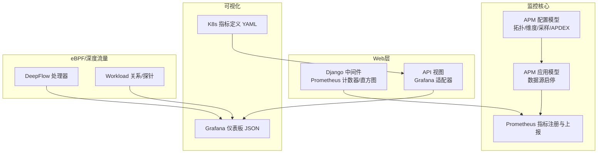
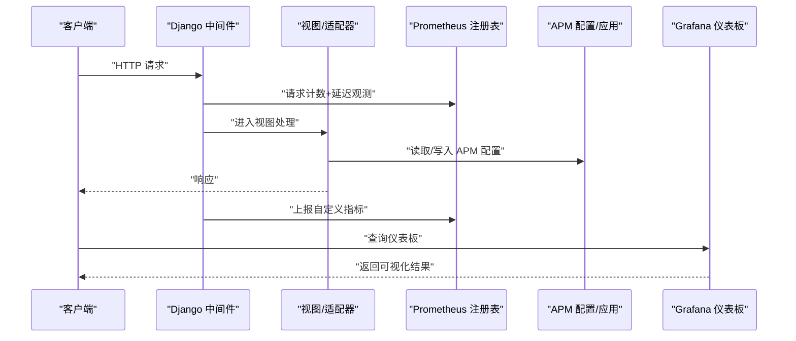
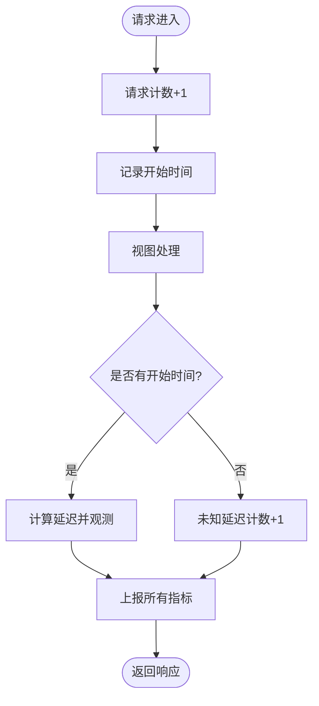
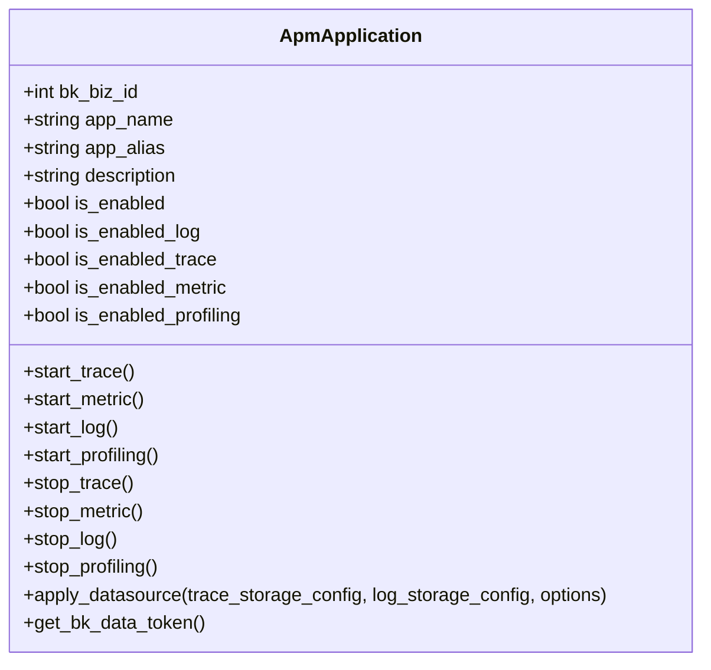
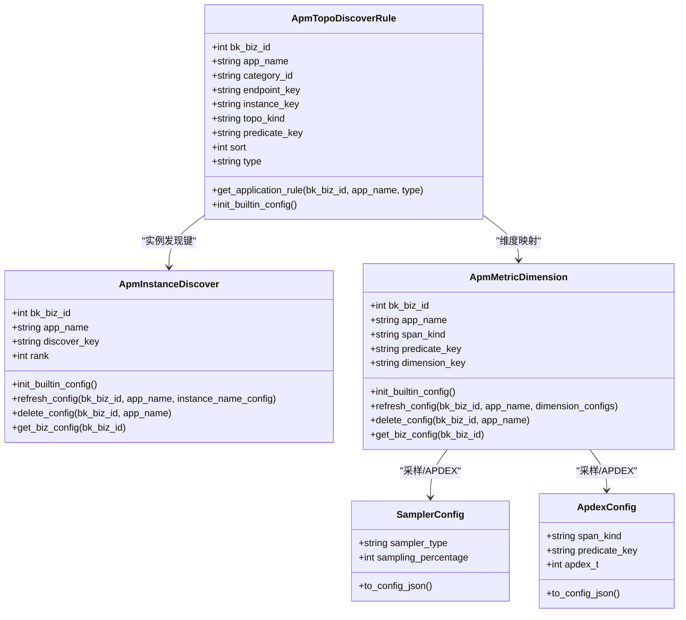
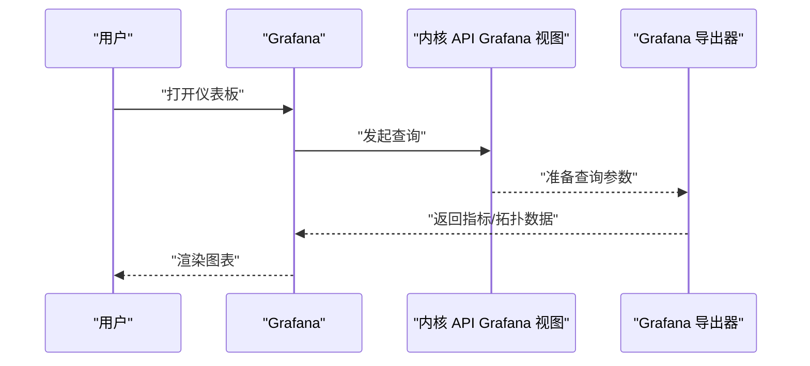
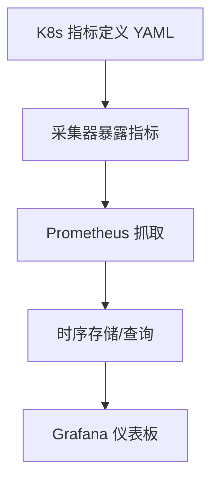
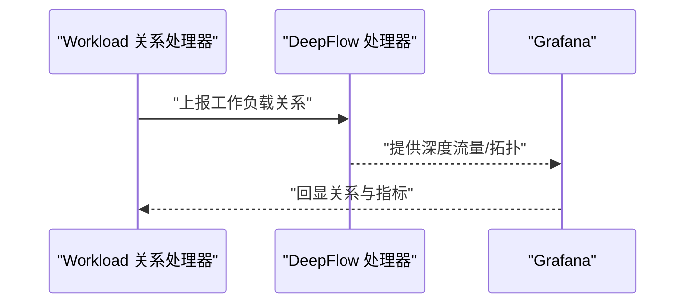
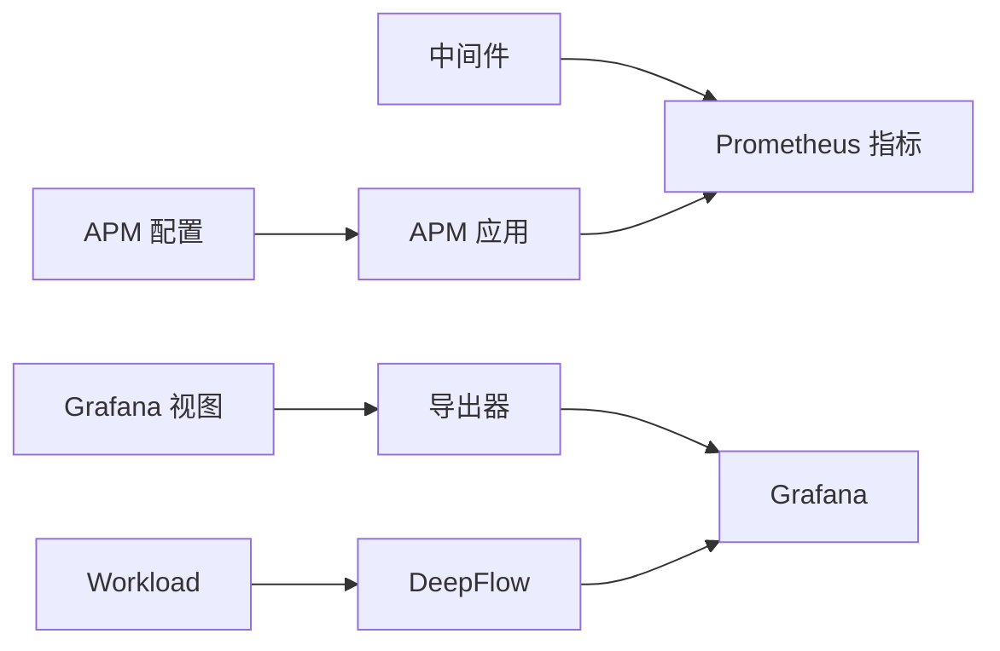

# 系统性能监控

<cite>
**本文引用的文件**
- [bkmonitor/core/prometheus/metrics.py](file://bkmonitor/core/prometheus/metrics.py)
- [bkmonitor/bkmonitor/middlewares/prometheus.py](file://bkmonitor/bkmonitor/middlewares/prometheus.py)
- [bkmonitor/apm/models/application.py](file://bkmonitor/apm/models/application.py)
- [bkmonitor/apm/models/config.py](file://bkmonitor/apm/models/config.py)
- [bkmonitor/api/grafana/exporter.py](file://bkmonitor/api/grafana/exporter.py)
- [bkmonitor/packages/monitor_web/grafana/dashboards/apm_ebpf/Application-Out-Of-The-Box.json](file://bkmonitor/packages/monitor_web/grafana/dashboards/apm_ebpf/Application-Out-Of-The-Box.json)
- [bkmonitor/kernel_api/views/v4/grafana.py](file://bkmonitor/kernel_api/views/v4/grafana.py)
- [bkmonitor/metadata/data/k8s_metrics/cadvisor.yaml](file://bkmonitor/metadata/data/k8s_metrics/cadvisor.yaml)
- [bkmonitor/metadata/data/k8s_metrics/container.yaml](file://bkmonitor/metadata/data/k8s_metrics/container.yaml)
- [bkmonitor/metadata/data/k8s_metrics/apiserver.yaml](file://bkmonitor/metadata/data/k8s_metrics/apiserver.yaml)
- [bkmonitor/metadata/data/k8s_metrics/coredns.yaml](file://bkmonitor/metadata/data/k8s_metrics/coredns.yaml)
- [bkmonitor/metadata/data/k8s_metrics/etcd.yaml](file://bkmonitor/metadata/data/k8s_metrics/etcd.yaml)
- [bkmonitor/metadata/data/k8s_metrics/grpc.yaml](file://bkmonitor/metadata/data/k8s_metrics/grpc.yaml)
- [bkmonitor/metadata/data/k8s_metrics/go.yaml](file://bkmonitor/metadata/data/k8s_metrics/go.yaml)
- [bkmonitor/metadata/data/k8s_metrics/get.yaml](file://bkmonitor/metadata/data/k8s_metrics/get.yaml)
- [bkmonitor/metadata/data/k8s_metrics/kube.yaml](file://bkmonitor/metadata/data/k8s_metrics/kube.yaml)
- [bkmonitor/metadata/data/k8s_metrics/telemetry.yaml](file://bkmonitor/metadata/data/k8s_metrics/telemetry.yaml)
- [bkmonitor/api/kubernetes/kubernetes_metrics_define.json](file://bkmonitor/api/kubernetes/kubernetes_metrics_define.json)
- [bkmonitor/apm/core/discover/__init__.py](file://bkmonitor/apm/core/discover/__init__.py)
- [bkmonitor/apm/core/deepflow/__init__.py](file://bkmonitor/apm/core/deepflow/__init__.py)
- [bkmonitor/apm/core/platform_config.py](file://bkmonitor/apm/core/platform_config.py)
- [bkmonitor/apm/core/cluster_config.py](file://bkmonitor/apm/core/cluster_config.py)
- [bkmonitor/apm/core/application_config.py](file://bkmonitor/apm/core/application_config.py)
- [bkmonitor/apm_ebpf/handlers/provisioning.py](file://bkmonitor/apm_ebpf/handlers/provisioning.py)
- [bkmonitor/apm_ebpf/handlers/relation.py](file://bkmonitor/apm_ebpf/handlers/relation.py)
- [bkmonitor/apm_ebpf/handlers/workload.py](file://bkmonitor/apm_ebpf/handlers/workload.py)
- [bkmonitor/apm_ebpf/handlers/deepflow.py](file://bkmonitor/apm_ebpf/handlers/deepflow.py)
- [bkmonitor/apm_ebpf/models/workload.py](file://bkmonitor/apm_ebpf/models/workload.py)
- [bkmonitor/apm_ebpf/task/tasks.py](file://bkmonitor/apm_ebpf/task/tasks.py)
- [bkmonitor/apm_ebpf/resource.py](file://bkmonitor/apm_ebpf/resource.py)
- [bkmonitor/apm_ebpf/constants.py](file://bkmonitor/apm_ebpf/constants.py)
- [bkmonitor/apm_ebpf/utils/report_event.py](file://bkmonitor/apm_ebpf/utils/report_event.py)
- [bkmonitor/apm_ebpf/utils/time.py](file://bkmonitor/apm_ebpf/utils/time.py)
- [bkmonitor/apm_ebpf/utils/ui_optimizations.py](file://bkmonitor/apm_ebpf/utils/ui_optimizations.py)
- [bkmonitor/apm_ebpf/utils/base.py](file://bkmonitor/apm_ebpf/utils/base.py)
- [bkmonitor/apm_ebpf/utils/es_search.py](file://bkmonitor/apm_ebpf/utils/es_search.py)
- [bkmonitor/apm_ebpf/utils/report_event.py](file://bkmonitor/apm_ebpf/utils/report_event.py)
- [bkmonitor/apm_ebpf/utils/time.py](file://bkmonitor/apm_ebpf/utils/time.py)
- [bkmonitor/apm_ebpf/utils/ui_optimizations.py](file://bkmonitor/apm_ebpf/utils/ui_optimizations.py)
- [bkmonitor/apm_ebpf/utils/base.py](file://bkmonitor/apm_ebpf/utils/base.py)
- [bkmonitor/apm_ebpf/utils/es_search.py](file://bkmonitor/apm_ebpf/utils/es_search.py)
- [bkmonitor/apm_ebpf/utils/report_event.py](file://bkmonitor/apm_ebpf/utils/report_event.py)
- [bkmonitor/apm_ebpf/utils/time.py](file://bkmonitor/apm_ebpf/utils/time.py)
- [bkmonitor/apm_ebpf/utils/ui_optimizations.py](file://bkmonitor/apm_ebpf/utils/ui_optimizations.py)
- [bkmonitor/apm_ebpf/utils/base.py](file://bkmonitor/apm_ebpf/utils/base.py)
- [bkmonitor/apm_ebpf/utils/es_search.py](file://bkmonitor/apm_ebpf/utils/es_search.py)
- [bkmonitor/apm_ebpf/utils/report_event.py](file://bkmonitor/apm_ebpf/utils/report_event.py)
- [bkmonitor/apm_ebpf/utils/time.py](file://bkmonitor/apm_ebpf/utils/time.py)
- [bkmonitor/apm_ebpf/utils/ui_optimizations.py](file://bkmonitor/apm_ebpf/utils/ui_optimizations.py)
- [bkmonitor/apm_ebpf/utils/base.py](file://bkmonitor/apm_ebpf/utils/base.py)
- [bkmonitor/apm_ebpf/utils/es_search.py](file://bkmonitor/apm_ebpf/utils/es_search.py)
- [bkmonitor/apm_ebpf/utils/report_event.py](file://bkmonitor/apm_ebpf/utils/report_event.py)
- [bkmonitor/apm_ebpf/utils/time.py](file://bkmonitor/apm_ebpf/utils/time.py)
- [bkmonitor/apm_ebpf/utils/ui_optimizations.py](file://bkmonitor/apm_ebpf/utils/ui_optimizations.py)
- [bkmonitor/apm_ebpf/utils/base.py](file://bkmonitor/apm_ebpf/utils/base.py)
- [bkmonitor/apm_ebpf/utils/es_search.py](file://bkmonitor/apm_ebpf/utils/es_search.py)
- [bkmonitor/apm_ebpf/utils/report_event.py](file://bkmonitor/apm_ebpf/utils/report_event.py)
- [bkmonitor/apm_ebpf/utils/time.py](file://bkmonitor/apm_ebpf/utils/time.py)
- [bkmonitor/apm_ebpf/utils/ui_optimizations.py](file://bkmonitor/apm_ebpf/utils/ui_optimizations.py)
- [bkmonitor/apm_ebpf/utils/base.py](file://bkmonitor/apm_ebpf/utils/base.py)
- [bkmonitor/apm_ebpf/utils/es_search.py](file://bkmonitor/apm_ebpf/utils/es_search.py)
- [bkmonitor/apm_ebpf/utils/report_event.py](file://bkmonitor/apm_ebpf/utils/report_event.py)
- [bkmonitor/apm_ebpf/utils/time.py](file://bkmonitor/apm_ebpf/utils/time.py)
- [bkmonitor/apm_ebpf/utils/ui_optimizations.py](file://bkmonitor/apm_ebpf/utils/ui_optimizations.py)
- [bkmonitor/apm_ebpf/utils/base.py](file://bkmonitor/apm_ebpf/utils/base.py)
- [bkmonitor/apm_e......](file://bkmonitor/apm_ebpf/utils/es_search.py)
</cite>

## 目录
1. [简介](#简介)
2. [项目结构](#项目结构)
3. [核心组件](#核心组件)
4. [架构总览](#架构总览)
5. [详细组件分析](#详细组件分析)
6. [依赖分析](#依赖分析)
7. [性能考虑](#性能考虑)
8. [故障排查指南](#故障排查指南)
9. [结论](#结论)
10. [附录](#附录)

## 简介
本指南围绕系统性能监控展开，结合仓库中的 Prometheus 指标采集、Grafana 仪表板与告警规则、APM 指标与 eBPF 能力，系统性阐述如何实现：
- 系统资源监控（CPU、内存、磁盘、网络）
- 应用性能监控（APM/Trace/Metrics/Profiling）
- 业务指标监控（基于指标定义与数据源）
- 监控数据存储、查询优化与可视化展示
- 性能基准测试、容量规划与瓶颈分析
- 监控系统的高可用部署与灾备方案

## 项目结构
该仓库以 Django 为核心，围绕“监控”“告警”“APM/eBPF”“Grafana 适配器”等模块组织，Prometheus 中间件与自定义指标在 Web 层生效；APM 子系统负责应用可观测性与指标维度配置；Grafana 适配器提供仪表板与查询入口；Kubernetes 指标通过元数据定义与采集器暴露。

**图表来源**
- [bkmonitor/bkmonitor/middlewares/prometheus.py:1-71](file://bkmonitor/bkmonitor/middlewares/prometheus.py#L1-L71)
- [bkmonitor/core/prometheus/metrics.py](file://bkmonitor/core/prometheus/metrics.py)
- [bkmonitor/apm/models/config.py:1-800](file://bkmonitor/apm/models/config.py#L1-L800)
- [bkmonitor/apm/models/application.py:1-343](file://bkmonitor/apm/models/application.py#L1-L343)
- [bkmonitor/api/grafana/exporter.py](file://bkmonitor/api/grafana/exporter.py)
- [bkmonitor/packages/monitor_web/grafana/dashboards/apm_ebpf/Application-Out-Of-The-Box.json](file://bkmonitor/packages/monitor_web/grafana/dashboards/apm_ebpf/Application-Out-Of-The-Box.json)
- [bkmonitor/metadata/data/k8s_metrics/cadvisor.yaml](file://bkmonitor/metadata/data/k8s_metrics/cadvisor.yaml)
- [bkmonitor/apm_ebpf/handlers/deepflow.py](file://bkmonitor/apm_ebpf/handlers/deepflow.py)
- [bkmonitor/apm_ebpf/handlers/workload.py](file://bkmonitor/apm_ebpf/handlers/workload.py)

**章节来源**
- [bkmonitor/bkmonitor/middlewares/prometheus.py:1-71](file://bkmonitor/bkmonitor/middlewares/prometheus.py#L1-L71)
- [bkmonitor/apm/models/application.py:1-343](file://bkmonitor/apm/models/application.py#L1-L343)
- [bkmonitor/apm/models/config.py:1-800](file://bkmonitor/apm/models/config.py#L1-L800)

## 核心组件
- Prometheus 中间件与自定义指标：在请求前后注入计数与延迟观测，统一打上主机、环境、应用、角色标签，便于跨实例对比与聚合。
- APM 应用与数据源：统一管理 Trace/Metric/Log/Profiling 数据源的启停与令牌生成，支持虚拟指标创建。
- APM 配置模型：拓扑发现规则、实例发现键、指标维度映射、采样与 APDEX 配置，支撑指标口径一致化。
- Grafana 适配器与仪表板：提供查询入口与预置仪表板，覆盖应用、K8s、Pod、主机等多维视图。
- Kubernetes 指标定义：以 YAML 形式声明 cAdvisor、容器、API Server、CoreDNS、etcd、gRPC、Go、GET、kube、telemetry 等指标集，便于采集器暴露。
- eBPF/DeepFlow：提供工作负载关系、探针与深度流量处理，辅助定位网络与调用链瓶颈。

**章节来源**
- [bkmonitor/bkmonitor/middlewares/prometheus.py:1-71](file://bkmonitor/bkmonitor/middlewares/prometheus.py#L1-L71)
- [bkmonitor/apm/models/application.py:1-343](file://bkmonitor/apm/models/application.py#L1-L343)
- [bkmonitor/apm/models/config.py:1-800](file://bkmonitor/apm/models/config.py#L1-L800)
- [bkmonitor/api/grafana/exporter.py](file://bkmonitor/api/grafana/exporter.py)
- [bkmonitor/packages/monitor_web/grafana/dashboards/apm_ebpf/Application-Out-Of-The-Box.json](file://bkmonitor/packages/monitor_web/grafana/dashboards/apm_ebpf/Application-Out-Of-The-Box.json)
- [bkmonitor/metadata/data/k8s_metrics/cadvisor.yaml](file://bkmonitor/metadata/data/k8s_metrics/cadvisor.yaml)
- [bkmonitor/apm_ebpf/handlers/deepflow.py](file://bkmonitor/apm_ebpf/handlers/deepflow.py)

## 架构总览
下图展示从 Web 请求到指标采集、APM 配置、Grafana 可视化的端到端流程。

**图表来源**
- [bkmonitor/bkmonitor/middlewares/prometheus.py:1-71](file://bkmonitor/bkmonitor/middlewares/prometheus.py#L1-L71)
- [bkmonitor/apm/models/config.py:1-800](file://bkmonitor/apm/models/config.py#L1-L800)
- [bkmonitor/apm/models/application.py:1-343](file://bkmonitor/apm/models/application.py#L1-L343)
- [bkmonitor/api/grafana/exporter.py](file://bkmonitor/api/grafana/exporter.py)
- [bkmonitor/packages/monitor_web/grafana/dashboards/apm_ebpf/Application-Out-Of-The-Box.json](file://bkmonitor/packages/monitor_web/grafana/dashboards/apm_ebpf/Application-Out-Of-The-Box.json)

## 详细组件分析

### 组件一：Prometheus 中间件与自定义指标
- 在请求前增加请求数与响应数计数，在响应时记录延迟直方图，并统一打上 hostname、stage、bk_app_code、role 标签，便于跨主机/环境/角色对比。
- 中间件在响应阶段触发指标上报，确保每次请求都产生可观测数据。

**图表来源**
- [bkmonitor/bkmonitor/middlewares/prometheus.py:1-71](file://bkmonitor/bkmonitor/middlewares/prometheus.py#L1-L71)

**章节来源**
- [bkmonitor/bkmonitor/middlewares/prometheus.py:1-71](file://bkmonitor/bkmonitor/middlewares/prometheus.py#L1-L71)

### 组件二：APM 应用与数据源管理
- 支持按应用启停 Trace/Metric/Log/Profiling 数据源，自动创建/更新对应存储配置，并在启用时上报事件。
- 提供令牌生成逻辑，兼容历史与新版本 token 规范，确保上报安全。

**图表来源**
- [bkmonitor/apm/models/application.py:1-343](file://bkmonitor/apm/models/application.py#L1-L343)

**章节来源**
- [bkmonitor/apm/models/application.py:1-343](file://bkmonitor/apm/models/application.py#L1-L343)

### 组件三：APM 配置模型（拓扑/维度/采样/APDEX）
- 拓扑发现规则：按类别（HTTP/RPC/DB/消息/异步）与系统（如 trpc/grpc）、平台（K8s/Node）、SDK 等维度定义实例与端点识别键。
- 实例发现键：按优先级排序的资源/属性键集合，用于统一实例命名。
- 指标维度：按 span kind（server/client/producer/consumer）与谓词条件（如 HTTP 方法、RPC 系统、DB 系统、消息系统）组合维度键。
- 采样与 APDEX：支持随机采样与 APDEX t 阈值配置，输出对应 JSON 配置结构。

**图表来源**
- [bkmonitor/apm/models/config.py:1-800](file://bkmonitor/apm/models/config.py#L1-L800)

**章节来源**
- [bkmonitor/apm/models/config.py:1-800](file://bkmonitor/apm/models/config.py#L1-L800)

### 组件四：Grafana 适配器与仪表板
- Grafana 适配器提供查询与导出能力，支持从平台侧读取指标与拓扑信息。
- 预置仪表板覆盖应用、K8s、Pod、主机等场景，便于快速落地监控看板。
- 通过内核 API 视图对接 Grafana 查询接口，统一数据出口。

**图表来源**
- [bkmonitor/kernel_api/views/v4/grafana.py](file://bkmonitor/kernel_api/views/v4/grafana.py)
- [bkmonitor/api/grafana/exporter.py](file://bkmonitor/api/grafana/exporter.py)
- [bkmonitor/packages/monitor_web/grafana/dashboards/apm_ebpf/Application-Out-Of-The-Box.json](file://bkmonitor/packages/monitor_web/grafana/dashboards/apm_ebpf/Application-Out-Of-The-Box.json)

**章节来源**
- [bkmonitor/kernel_api/views/v4/grafana.py](file://bkmonitor/kernel_api/views/v4/grafana.py)
- [bkmonitor/api/grafana/exporter.py](file://bkmonitor/api/grafana/exporter.py)
- [bkmonitor/packages/monitor_web/grafana/dashboards/apm_ebpf/Application-Out-Of-The-Box.json](file://bkmonitor/packages/monitor_web/grafana/dashboards/apm_ebpf/Application-Out-Of-The-Box.json)

### 组件五：Kubernetes 指标定义与采集
- 通过 YAML 定义 cAdvisor、容器、API Server、CoreDNS、etcd、gRPC、Go、GET、kube、telemetry 等指标集，便于采集器暴露并被 Prometheus 抓取。
- 结合 APM 与 eBPF 能力，形成“系统+应用+业务”的三层监控闭环。

**图表来源**
- [bkmonitor/metadata/data/k8s_metrics/cadvisor.yaml](file://bkmonitor/metadata/data/k8s_metrics/cadvisor.yaml)
- [bkmonitor/metadata/data/k8s_metrics/container.yaml](file://bkmonitor/metadata/data/k8s_metrics/container.yaml)
- [bkmonitor/metadata/data/k8s_metrics/apiserver.yaml](file://bkmonitor/metadata/data/k8s_metrics/apiserver.yaml)
- [bkmonitor/metadata/data/k8s_metrics/coredns.yaml](file://bkmonitor/metadata/data/k8s_metrics/coredns.yaml)
- [bkmonitor/metadata/data/k8s_metrics/etcd.yaml](file://bkmonitor/metadata/data/k8s_metrics/etcd.yaml)
- [bkmonitor/metadata/data/k8s_metrics/grpc.yaml](file://bkmonitor/metadata/data/k8s_metrics/grpc.yaml)
- [bkmonitor/metadata/data/k8s_metrics/go.yaml](file://bkmonitor/metadata/data/k8s_metrics/go.yaml)
- [bkmonitor/metadata/data/k8s_metrics/get.yaml](file://bkmonitor/metadata/data/k8s_metrics/get.yaml)
- [bkmonitor/metadata/data/k8s_metrics/kube.yaml](file://bkmonitor/metadata/data/k8s_metrics/kube.yaml)
- [bkmonitor/metadata/data/k8s_metrics/telemetry.yaml](file://bkmonitor/metadata/data/k8s_metrics/telemetry.yaml)

**章节来源**
- [bkmonitor/metadata/data/k8s_metrics/cadvisor.yaml](file://bkmonitor/metadata/data/k8s_metrics/cadvisor.yaml)
- [bkmonitor/metadata/data/k8s_metrics/container.yaml](file://bkmonitor/metadata/data/k8s_metrics/container.yaml)
- [bkmonitor/metadata/data/k8s_metrics/apiserver.yaml](file://bkmonitor/metadata/data/k8s_metrics/apiserver.yaml)
- [bkmonitor/metadata/data/k8s_metrics/coredns.yaml](file://bkmonitor/metadata/data/k8s_metrics/coredns.yaml)
- [bkmonitor/metadata/data/k8s_metrics/etcd.yaml](file://bkmonitor/metadata/data/k8s_metrics/etcd.yaml)
- [bkmonitor/metadata/data/k8s_metrics/grpc.yaml](file://bkmonitor/metadata/data/k8s_metrics/grpc.yaml)
- [bkmonitor/metadata/data/k8s_metrics/go.yaml](file://bkmonitor/metadata/data/k8s_metrics/go.yaml)
- [bkmonitor/metadata/data/k8s_metrics/get.yaml](file://bkmonitor/metadata/data/k8s_metrics/get.yaml)
- [bkmonitor/metadata/data/k8s_metrics/kube.yaml](file://bkmonitor/metadata/data/k8s_metrics/kube.yaml)
- [bkmonitor/metadata/data/k8s_metrics/telemetry.yaml](file://bkmonitor/metadata/data/k8s_metrics/telemetry.yaml)

### 组件六：eBPF/DeepFlow 与工作负载关系
- eBPF 探针与 DeepFlow 处理器协同，提供深度流量与调用链洞察，辅助定位网络与服务间依赖。
- 工作负载关系处理器维护集群/命名空间/Pod 等拓扑关系，支持仪表板联动。

**图表来源**
- [bkmonitor/apm_ebpf/handlers/workload.py](file://bkmonitor/apm_ebpf/handlers/workload.py)
- [bkmonitor/apm_ebpf/handlers/deepflow.py](file://bkmonitor/apm_ebpf/handlers/deepflow.py)
- [bkmonitor/apm_ebpf/models/workload.py](file://bkmonitor/apm_ebpf/models/workload.py)

**章节来源**
- [bkmonitor/apm_ebpf/handlers/workload.py](file://bkmonitor/apm_ebpf/handlers/workload.py)
- [bkmonitor/apm_ebpf/handlers/deepflow.py](file://bkmonitor/apm_ebpf/handlers/deepflow.py)
- [bkmonitor/apm_ebpf/models/workload.py](file://bkmonitor/apm_ebpf/models/workload.py)

## 依赖分析
- Web 层中间件依赖 Prometheus 注册表与自定义指标类，统一打标签并上报。
- APM 配置模型与应用模型相互协作，前者决定指标口径，后者决定数据源启停与令牌。
- Grafana 适配器依赖内核 API 视图与导出器，统一查询入口。
- eBPF/DeepFlow 与工作负载关系处理器为可视化提供底层数据支撑。

**图表来源**
- [bkmonitor/bkmonitor/middlewares/prometheus.py:1-71](file://bkmonitor/bkmonitor/middlewares/prometheus.py#L1-L71)
- [bkmonitor/apm/models/config.py:1-800](file://bkmonitor/apm/models/config.py#L1-L800)
- [bkmonitor/apm/models/application.py:1-343](file://bkmonitor/apm/models/application.py#L1-L343)
- [bkmonitor/api/grafana/exporter.py](file://bkmonitor/api/grafana/exporter.py)
- [bkmonitor/kernel_api/views/v4/grafana.py](file://bkmonitor/kernel_api/views/v4/grafana.py)
- [bkmonitor/apm_ebpf/handlers/workload.py](file://bkmonitor/apm_ebpf/handlers/workload.py)
- [bkmonitor/apm_ebpf/handlers/deepflow.py](file://bkmonitor/apm_ebpf/handlers/deepflow.py)

**章节来源**
- [bkmonitor/bkmonitor/middlewares/prometheus.py:1-71](file://bkmonitor/bkmonitor/middlewares/prometheus.py#L1-L71)
- [bkmonitor/apm/models/config.py:1-800](file://bkmonitor/apm/models/config.py#L1-L800)
- [bkmonitor/apm/models/application.py:1-343](file://bkmonitor/apm/models/application.py#L1-L343)
- [bkmonitor/api/grafana/exporter.py](file://bkmonitor/api/grafana/exporter.py)
- [bkmonitor/kernel_api/views/v4/grafana.py](file://bkmonitor/kernel_api/views/v4/grafana.py)
- [bkmonitor/apm_ebpf/handlers/workload.py](file://bkmonitor/apm_ebpf/handlers/workload.py)
- [bkmonitor/apm_ebpf/handlers/deepflow.py](file://bkmonitor/apm_ebpf/handlers/deepflow.py)

## 性能考虑
- 指标维度与标签基数控制：中间件统一打标签，建议在业务规模增长时评估标签基数，避免过度细分导致内存与查询压力。
- APM 配置一致性：通过内置规则与缓存减少数据库访问，提升拓扑/维度解析效率。
- 采样与 APDEX：合理设置采样比例与 APDEX t，平衡观测成本与准确性。
- eBPF/DeepFlow：仅在必要节点启用探针，避免对生产流量造成额外开销。
- 查询优化：利用预置仪表板与指标口径，减少复杂聚合与跨实例联接。

[本节为通用指导，无需列出具体文件来源]

## 故障排查指南
- 指标缺失或异常：检查中间件是否正确注入、标签是否完整、Prometheus 是否成功抓取。
- APM 数据源启停失败：查看应用模型的启停逻辑与事件上报，确认存储配置与令牌生成。
- 仪表板无数据：确认 Grafana 适配器查询路径与导出器状态，核对预置仪表板 JSON 的数据源配置。
- eBPF/DeepFlow 不生效：检查工作负载关系处理器与探针配置，确认采集器与 Prometheus 抓取链路。

**章节来源**
- [bkmonitor/bkmonitor/middlewares/prometheus.py:1-71](file://bkmonitor/bkmonitor/middlewares/prometheus.py#L1-L71)
- [bkmonitor/apm/models/application.py:1-343](file://bkmonitor/apm/models/application.py#L1-L343)
- [bkmonitor/api/grafana/exporter.py](file://bkmonitor/api/grafana/exporter.py)
- [bkmonitor/apm_ebpf/handlers/workload.py](file://bkmonitor/apm_ebpf/handlers/workload.py)
- [bkmonitor/apm_ebpf/handlers/deepflow.py](file://bkmonitor/apm_ebpf/handlers/deepflow.py)

## 结论
本指南基于仓库现有实现，梳理了从 Web 层指标采集、APM 配置与数据源管理、Grafana 可视化到 eBPF/DeepFlow 的全链路监控能力。建议在实际部署中结合业务规模进行容量规划与标签治理，持续优化采样与 APDEX 配置，并通过预置仪表板快速落地监控看板，逐步扩展到更细粒度的业务指标与告警策略。

[本节为总结性内容，无需列出具体文件来源]

## 附录
- Kubernetes 指标定义清单（示例）
  - [cadvisor.yaml](file://bkmonitor/metadata/data/k8s_metrics/cadvisor.yaml)
  - [container.yaml](file://bkmonitor/metadata/data/k8s_metrics/container.yaml)
  - [apiserver.yaml](file://bkmonitor/metadata/data/k8s_metrics/apiserver.yaml)
  - [coredns.yaml](file://bkmonitor/metadata/data/k8s_metrics/coredns.yaml)
  - [etcd.yaml](file://bkmonitor/metadata/data/k8s_metrics/etcd.yaml)
  - [grpc.yaml](file://bkmonitor/metadata/data/k8s_metrics/grpc.yaml)
  - [go.yaml](file://bkmonitor/metadata/data/k8s_metrics/go.yaml)
  - [get.yaml](file://bkmonitor/metadata/data/k8s_metrics/get.yaml)
  - [kube.yaml](file://bkmonitor/metadata/data/k8s_metrics/kube.yaml)
  - [telemetry.yaml](file://bkmonitor/metadata/data/k8s_metrics/telemetry.yaml)
- APM 配置与应用相关文件
  - [apm/models/application.py:1-343](file://bkmonitor/apm/models/application.py#L1-L343)
  - [apm/models/config.py:1-800](file://bkmonitor/apm/models/config.py#L1-L800)
  - [apm/core/discover/__init__.py](file://bkmonitor/apm/core/discover/__init__.py)
  - [apm/core/platform_config.py](file://bkmonitor/apm/core/platform_config.py)
  - [apm/core/cluster_config.py](file://bkmonitor/apm/core/cluster_config.py)
  - [apm/core/application_config.py](file://bkmonitor/apm/core/application_config.py)
- eBPF/DeepFlow 相关文件
  - [apm_ebpf/handlers/provisioning.py](file://bkmonitor/apm_ebpf/handlers/provisioning.py)
  - [apm_ebpf/handlers/relation.py](file://bkmonitor/apm_ebpf/handlers/relation.py)
  - [apm_ebpf/handlers/workload.py](file://bkmonitor/apm_ebpf/handlers/workload.py)
  - [apm_ebpf/handlers/deepflow.py](file://bkmonitor/apm_ebpf/handlers/deepflow.py)
  - [apm_ebpf/models/workload.py](file://bkmonitor/apm_ebpf/models/workload.py)
  - [apm_ebpf/task/tasks.py](file://bkmonitor/apm_ebpf/task/tasks.py)
  - [apm_ebpf/resource.py](file://bkmonitor/apm_ebpf/resource.py)
  - [apm_ebpf/constants.py](file://bkmonitor/apm_ebpf/constants.py)
  - [apm_ebpf/utils/report_event.py](file://bkmonitor/apm_ebpf/utils/report_event.py)
  - [apm_ebpf/utils/time.py](file://bkmonitor/apm_ebpf/utils/time.py)
  - [apm_ebpf/utils/ui_optimizations.py](file://bkmonitor/apm_ebpf/utils/ui_optimizations.py)
  - [apm_ebpf/utils/base.py](file://bkmonitor/apm_ebpf/utils/base.py)
  - [apm_ebpf/utils/es_search.py](file://bkmonitor/apm_ebpf/utils/es_search.py)