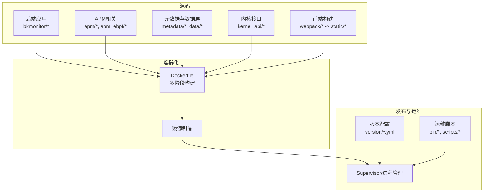
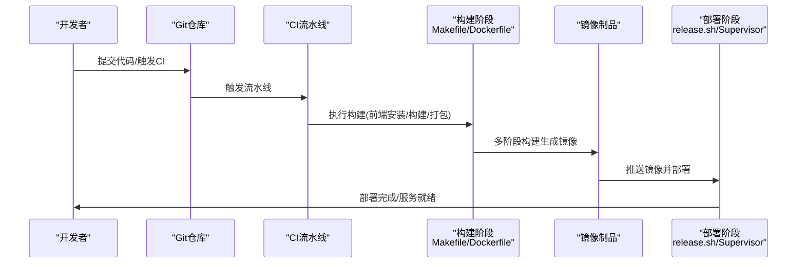
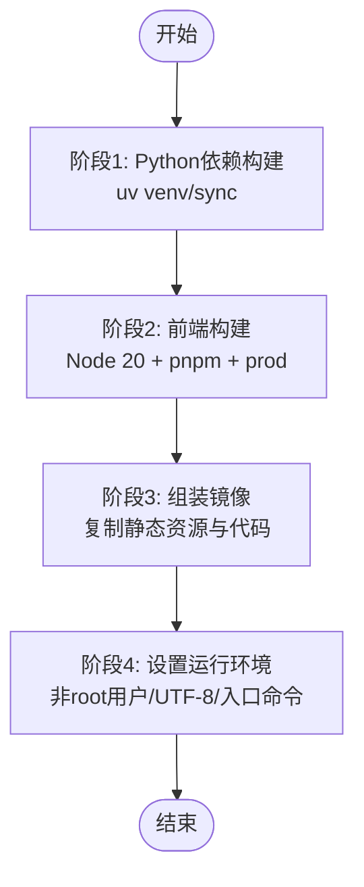
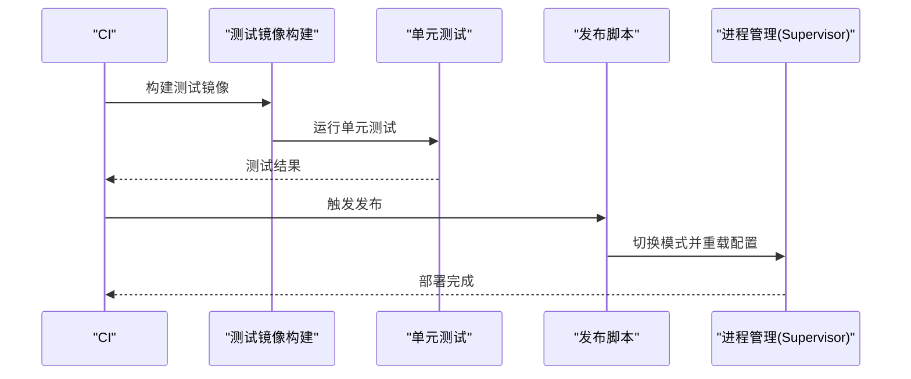
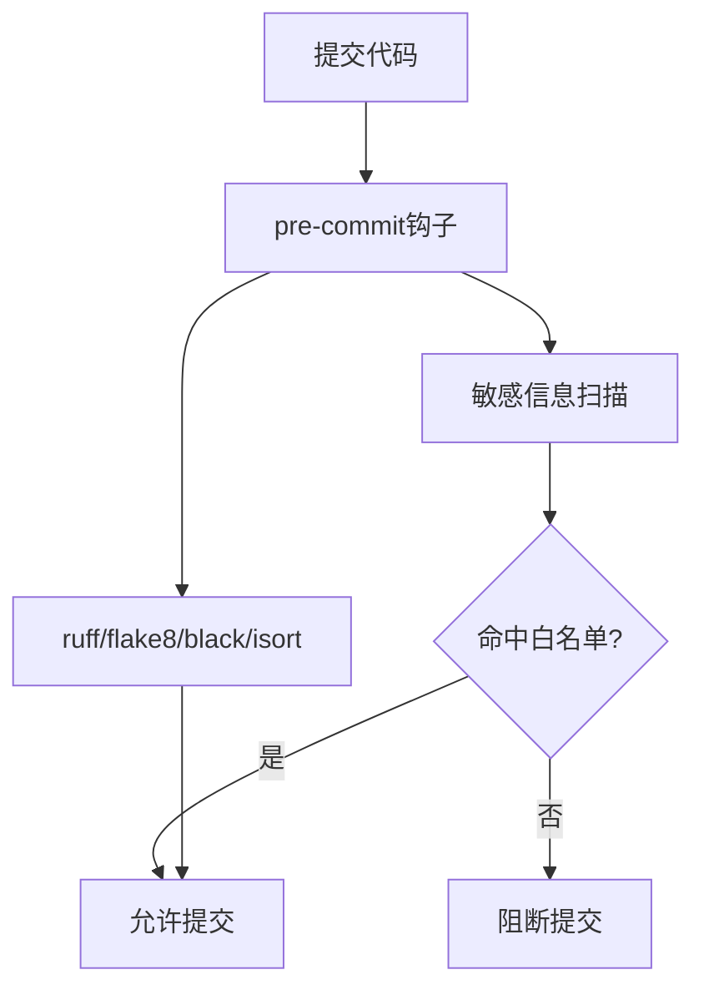
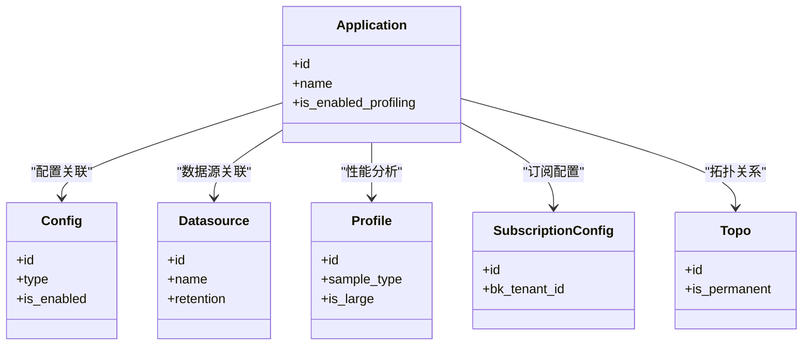
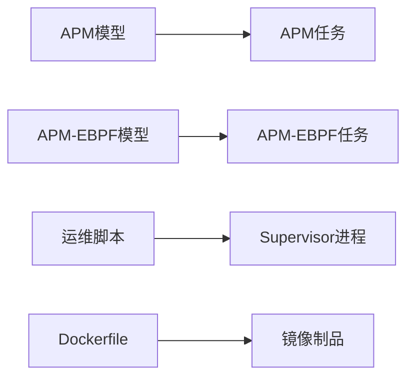

# 自动化运维工具

<cite>
**本文引用的文件**
- [README.md](file://README.md)
- [pyproject.toml](file://pyproject.toml)
- [bkmonitor/Makefile](file://bkmonitor/Makefile)
- [bkmonitor/Dockerfile](file://bkmonitor/Dockerfile)
- [bkmonitor/bin/manage.sh](file://bkmonitor/bin/manage.sh)
- [bkmonitor/bin/release.sh](file://bkmonitor/bin/release.sh)
- [bkmonitor/version/app.yml](file://bkmonitor/version/app.yml)
- [bkmonitor/version/project.yml](file://bkmonitor/version/project.yml)
- [bkmonitor/scripts/unittest/Dockerfile](file://bkmonitor/scripts/unittest/Dockerfile)
- [scripts/pre-commit/check_commit_message.py](file://scripts/pre-commit/check_commit_message.py)
- [scripts/pre-commit/pre-push.py](file://scripts/pre-commit/pre-push.py)
- [scripts/pre-commit/preci.py](file://scripts/pre-commit/preci.py)
- [scripts/pre-commit/preci.sh](file://scripts/pre-commit/preci.sh)
- [scripts/sensitive_info_check/check_ip.py](file://scripts/sensitive_info_check/check_ip.py)
- [scripts/sensitive_info_check/ip.sh](file://scripts/sensitive_info_check/ip.sh)
- [scripts/sensitive_info_check/ip_white_list.dat](file://scripts/sensitive_info_check/ip_white_list.dat)
- [scripts/sensitive_info_check/ip_white_list_paths.dat](file://scripts/sensitive_info_check/ip_white_list_paths.dat)
- [bkmonitor/apm/migrations/0001_initial.py](file://bkmonitor/apm/migrations/0001_initial.py)
- [bkmonitor/apm/migrations/0046_toponode_source.py](file://bkmonitor/apm/migrations/0046_toponode_source.py)
- [bkmonitor/apm/migrations/0052_add_profiledatasource_v4.py](file://bkmonitor/apm/migrations/0052_add_profiledatasource_v4.py)
- [bkmonitor/apm/models/application.py](file://bkmonitor/apm/models/application.py)
- [bkmonitor/apm/models/config.py](file://bkmonitor/apm/models/config.py)
- [bkmonitor/apm/models/datasource.py](file://bkmonitor/apm/models/datasource.py)
- [bkmonitor/apm/models/profile.py](file://bkmonitor/apm/models/profile.py)
- [bkmonitor/apm/models/subscription_config.py](file://bkmonitor/apm/models/subscription_config.py)
- [bkmonitor/apm/models/topo.py](file://bkmonitor/apm/models/topo.py)
- [bkmonitor/apm/task/tasks.py](file://bkmonitor/apm/task/tasks.py)
- [bkmonitor/apm_ebpf/task/tasks.py](file://bkmonitor/apm_ebpf/task/tasks.py)
- [bkmonitor/apm_ebpf/handlers/provisioning.py](file://bkmonitor/apm_ebpf/handlers/provisioning.py)
- [bkmonitor/apm_ebpf/handlers/relation.py](file://bkmonitor/apm_ebpf/handlers/relation.py)
- [bkmonitor/apm_ebpf/handlers/workload.py](file://bkmonitor/apm_ebpf/handlers/workload.py)
- [bkmonitor/apm_ebpf/handlers/deepflow.py](file://bkmonitor/apm_ebpf/handlers/deepflow.py)
- [bkmonitor/apm_ebpf/models/workload.py](file://bkmonitor/apm_ebpf/models/workload.py)
- [bkmonitor/apm_ebpf/migrations/0001_initial.py](file://bkmonitor/apm_ebpf/migrations/0001_initial.py)
- [bkmonitor/apm_ebpf/migrations/0005_deepflowdashboardrecord.py](file://bkmonitor/apm_ebpf/migrations/0005_deepflowdashboardrecord.py)
- [bkmonitor/apm_ebpf/resources.py](file://bkmonitor/apm_ebpf/resources.py)
- [bkmonitor/apm_ebpf/resource.py](file://bkmonitor/apm_ebpf/resource.py)
- [bkmonitor/apm_ebpf/constants.py](file://bkmonitor/apm_ebpf/constants.py)
- [bkmonitor/apm_ebpf/utils.py](file://bkmonitor/apm_ebpf/utils.py)
- [bkmonitor/apm_ebpf/admin.py](file://bkmonitor/apm_ebpf/admin.py)
- [bkmonitor/apm_ebpf/apps.py](file://bkmonitor/apm_ebpf/apps.py)
- [bkmonitor/apm_ebpf/views.py](file://bkmonitor/apm_ebpf/views.py)
- [bkmonitor/apm_ebpf/urls.py](file://bkmonitor/apm_ebpf/urls.py)
- [bkmonitor/apm_ebpf/tests/test_topoinstance.py](file://bkmonitor/apm_ebpf/tests/test_topoinstance.py)
- [bkmonitor/apm_ebpf/tests/test_release_app_config.py](file://bkmonitor/apm_ebpf/tests/test_release_app_config.py)
- [bkmonitor/apm_ebpf/tests/test_query_topo_instance.py](file://bkmonitor/apm_ebpf/tests/test_query_topo_instance.py)
- [bkmonitor/apm_ebpf/tests/__init__.py](file://bkmonitor/apm_ebpf/tests/__init__.py)
- [bkmonitor/apm_ebpf/tests/conftest.py](file://bkmonitor/apm_ebpf/tests/conftest.py)
- [bkmonitor/apm_ebpf/tests/data/__init__.py](file://bkmonitor/apm_ebpf/tests/data/__init__.py)
- [bkmonitor/apm_ebpf/tests/data/conftest.py](file://bkmonitor/apm_ebpf/tests/data/conftest.py)
- [bkmonitor/apm_ebpf/tests/data/test_topoinstance.py](file://bkmonitor/apm_ebpf/tests/data/test_topoinstance.py)
- [bkmonitor/apm_ebpf/tests/data/test_release_app_config.py](file://bkmonitor/apm_ebpf/tests/data/test_release_app_config.py)
- [bkmonitor/apm_ebpf/tests/data/test_query_topo_instance.py](file://bkmonitor/apm_ebpf/tests/data/test_query_topo_instance.py)
- [bkmonitor/apm_ebpf/tests/data/__init__.py](file://bkmonitor/apm_ebpf/tests/data/__init__.py)
- [bkmonitor/apm_ebpf/tests/data/__init__.py](file://bkmonitor/apm_ebpf/tests/data/__init__.py)
- [bkmonitor/apm_ebpf/tests/data/__init__.py](file://bkmonitor/apm_ebpf/tests/data/__init__.py)
- [bkmonitor/apm_ebpf/tests/data/__init__.py](file://bkmonitor/apm_ebpf/tests/data/__init__.py)
- [bkmonitor/apm_ebpf/tests/data/__init__.py](file://bkmonitor/apm_ebpf/tests/data/__init__.py)
- [bkmonitor/apm_ebpf/tests/data/__init__.py](file://bkmonitor/apm_ebpf/tests/data/__init__.py)
- [bkmonitor/apm_ebpf/tests/data/__init__.py](file://bkmonitor/apm_ebpf/tests/data/__init__.py)
- [bkmonitor/apm_ebpf/tests/data/__init__.py](file://bkmonitor/apm_ebpf/tests/data/__init__.py)
- [bkmonitor/apm_ebpf/tests/data/__init__.py](file://bkmonitor/apm_ebpf/tests/data/__init__.py)
- [bkmonitor/apm_ebpf/tests/data/__init__.py](file://bkmonitor/apm_ebpf/tests/data/__init__.py)
- [bkmonitor/apm_ebpf/tests/data/__init__.py](file://bkmonitor/apm_ebpf/tests/data/__init__.py)
- [bkmonitor/apm_ebpf/tests/data/__init__.py](file://bkmonitor/apm_ebpf/tests/data/__init__.py)
- [bkmonitor/apm_ebpf/tests/data/__init__.py](file://bkmonitor/apm_ebpf/tests/data/__init__.py)
- [bkmonitor/apm_ebpf/tests/data/__init__.py](file://bkmonitor/apm_ebpf/tests/data/__init__.py)
- [bkmonitor/apm_ebpf/tests/data/__init__.py](file://bkmonitor/apm_ebpf/tests/data/__init__.py)
- [bkmonitor/apm_ebpf/tests/data/__init__.py](file://bkmonitor/apm_ebpf/tests/data/__init__.py)
- [bkmonitor/apm_ebpf/tests/data/__init__.py......](file://bkmonitor/apm_ebpf/tests/data/__init__.py)
</cite>

## 目录
1. [简介](#简介)
2. [项目结构](#项目结构)
3. [核心组件](#核心组件)
4. [架构总览](#架构总览)
5. [详细组件分析](#详细组件分析)
6. [依赖分析](#依赖分析)
7. [性能考虑](#性能考虑)
8. [故障排查指南](#故障排查指南)
9. [结论](#结论)
10. [附录](#附录)

## 简介
本指南面向自动化运维工程师与SRE团队，围绕蓝鲸监控平台的CI/CD流水线、自动化测试与部署、代码质量与安全扫描、依赖管理、运维脚本与批量操作、监控告警自动化与故障自愈、变更管理等主题，提供从入门到进阶的实操指引。内容以仓库现有配置与脚本为依据，结合模块化架构与工具链，帮助读者快速落地标准化运维流程。

## 项目结构
该项目采用多模块分层组织方式，前端构建与后端服务分离，容器化打包与发布流程清晰，配合版本化配置与运维脚本，形成可重复、可审计的交付体系。

- 后端服务与应用
  - 核心应用：bkmonitor、apm、apm_ebpf、metadata、data、kernel_api 等
  - 配置与环境：config、version、support-files
  - 运维脚本：bin、scripts
- 前端构建
  - webpack 构建产物输出至 static 目录，供Docker镜像打包
- 容器化与发布
  - 多阶段Dockerfile，前后端分离构建，最终镜像包含运行时依赖与静态资源
- 质量与安全
  - 代码格式化与静态检查工具配置
  - 提交前钩子与敏感信息扫描脚本

图表来源
- [bkmonitor/Dockerfile:1-86](file://bkmonitor/Dockerfile#L1-L86)
- [bkmonitor/Makefile:1-38](file://bkmonitor/Makefile#L1-L38)
- [bkmonitor/version/app.yml:1-17](file://bkmonitor/version/app.yml#L1-L17)
- [bkmonitor/version/project.yml:1-8](file://bkmonitor/version/project.yml#L1-L8)

章节来源
- [README.md:1-52](file://README.md#L1-L52)
- [bkmonitor/Dockerfile:1-86](file://bkmonitor/Dockerfile#L1-L86)
- [bkmonitor/Makefile:1-38](file://bkmonitor/Makefile#L1-L38)
- [bkmonitor/version/app.yml:1-17](file://bkmonitor/version/app.yml#L1-L17)
- [bkmonitor/version/project.yml:1-8](file://bkmonitor/version/project.yml#L1-L8)

## 核心组件
- CI/CD与构建
  - Dockerfile 多阶段构建，前后端分离，使用 uv 进行Python依赖锁定与安装
  - Makefile 提供前端安装、构建、打包与测试镜像构建目标
  - version/*.yml 提供应用元数据与版本信息
- 运维脚本
  - manage.sh 封装 Django 管理命令入口，统一环境变量加载
  - release.sh 切换部署模式并重载 Supervisor 配置
  - scripts/unittest/Dockerfile 用于单元测试镜像构建
- 质量与安全
  - pyproject.toml 配置 ruff/flake8/black/isort 等工具，统一风格与静态检查
  - scripts/pre-commit/* 提交前钩子，校验提交信息、推送策略与代码规范
  - scripts/sensitive_info_check/* 敏感信息扫描与白名单校验
- 数据与任务
  - APM与APM-EBPF 模块包含模型、任务与处理器，支撑可观测性与自动发现
  - 迁移文件覆盖初始化、拓扑与配置演进

章节来源
- [bkmonitor/Dockerfile:1-86](file://bkmonitor/Dockerfile#L1-L86)
- [bkmonitor/Makefile:1-38](file://bkmonitor/Makefile#L1-L38)
- [bkmonitor/bin/manage.sh:1-14](file://bkmonitor/bin/manage.sh#L1-L14)
- [bkmonitor/bin/release.sh:1-19](file://bkmonitor/bin/release.sh#L1-L19)
- [pyproject.toml:1-63](file://pyproject.toml#L1-L63)
- [scripts/pre-commit/check_commit_message.py](file://scripts/pre-commit/check_commit_message.py)
- [scripts/pre-commit/pre-push.py](file://scripts/pre-commit/pre-push.py)
- [scripts/pre-commit/preci.py](file://scripts/pre-commit/preci.py)
- [scripts/pre-commit/preci.sh](file://scripts/pre-commit/preci.sh)
- [scripts/sensitive_info_check/check_ip.py](file://scripts/sensitive_info_check/check_ip.py)
- [scripts/sensitive_info_check/ip.sh](file://scripts/sensitive_info_check/ip.sh)
- [scripts/sensitive_info_check/ip_white_list.dat](file://scripts/sensitive_info_check/ip_white_list.dat)
- [scripts/sensitive_info_check/ip_white_list_paths.dat](file://scripts/sensitive_info_check/ip_white_list_paths.dat)

## 架构总览
下图展示从代码提交到容器镜像与部署的关键路径，体现CI/CD与运维脚本的协同关系。

图表来源
- [bkmonitor/Makefile:1-38](file://bkmonitor/Makefile#L1-L38)
- [bkmonitor/Dockerfile:1-86](file://bkmonitor/Dockerfile#L1-L86)
- [bkmonitor/bin/release.sh:1-19](file://bkmonitor/bin/release.sh#L1-L19)

章节来源
- [bkmonitor/Makefile:1-38](file://bkmonitor/Makefile#L1-L38)
- [bkmonitor/Dockerfile:1-86](file://bkmonitor/Dockerfile#L1-L86)
- [bkmonitor/bin/release.sh:1-19](file://bkmonitor/bin/release.sh#L1-L19)

## 详细组件分析

### CI/CD流水线与构建
- Dockerfile 多阶段构建要点
  - Python基础镜像与工具链准备，安装中文字体与必要系统包
  - 使用 uv 进行虚拟环境与依赖同步，加速构建并保证锁定一致性
  - 前端使用 Node 20 构建，产物复制至后端静态目录
  - 最终镜像以非root用户运行，设置UTF-8环境变量与入口命令
- Makefile 目标
  - npm-install/webpack-build/webpack-package/webpack-copy：前端构建与打包
  - build-clean：版本打包入口
  - build-test-image：构建测试专用镜像
- 版本配置
  - app.yml：应用元数据、是否启用Celery、内存与环境变量
  - project.yml：项目语言、版本与版本类型

图表来源
- [bkmonitor/Dockerfile:24-86](file://bkmonitor/Dockerfile#L24-L86)

章节来源
- [bkmonitor/Dockerfile:1-86](file://bkmonitor/Dockerfile#L1-L86)
- [bkmonitor/Makefile:1-38](file://bkmonitor/Makefile#L1-L38)
- [bkmonitor/version/app.yml:1-17](file://bkmonitor/version/app.yml#L1-L17)
- [bkmonitor/version/project.yml:1-8](file://bkmonitor/version/project.yml#L1-L8)

### 自动化测试与部署流程
- 测试镜像
  - scripts/unittest/Dockerfile 用于本地或CI中的单元测试环境
- 部署脚本
  - release.sh 支持稳定/精简模式切换，重载Supervisor配置
  - manage.sh 统一加载环境变量并调用 Django 管理命令

图表来源
- [bkmonitor/bin/release.sh:1-19](file://bkmonitor/bin/release.sh#L1-L19)
- [bkmonitor/bin/manage.sh:1-14](file://bkmonitor/bin/manage.sh#L1-L14)
- [bkmonitor/scripts/unittest/Dockerfile](file://bkmonitor/scripts/unittest/Dockerfile)

章节来源
- [bkmonitor/scripts/unittest/Dockerfile](file://bkmonitor/scripts/unittest/Dockerfile)
- [bkmonitor/bin/release.sh:1-19](file://bkmonitor/bin/release.sh#L1-L19)
- [bkmonitor/bin/manage.sh:1-14](file://bkmonitor/bin/manage.sh#L1-L14)

### 代码质量检查与安全扫描
- 代码风格与静态检查
  - ruff：规则选择、修复策略、格式化与忽略规则
  - flake8：复杂度与忽略规则
  - black/isort：代码格式与导入排序
- 提交前钩子
  - check_commit_message.py：校验提交信息格式
  - pre-push.py：推送前策略检查
  - preci.py/preci.sh：通用预提交逻辑
- 敏感信息扫描
  - check_ip.py：IP敏感信息检测
  - ip.sh：扫描脚本入口
  - 白名单：ip_white_list.dat 与 ip_white_list_paths.dat

图表来源
- [pyproject.toml:1-63](file://pyproject.toml#L1-L63)
- [scripts/pre-commit/check_commit_message.py](file://scripts/pre-commit/check_commit_message.py)
- [scripts/pre-commit/pre-push.py](file://scripts/pre-commit/pre-push.py)
- [scripts/pre-commit/preci.py](file://scripts/pre-commit/preci.py)
- [scripts/pre-commit/preci.sh](file://scripts/pre-commit/preci.sh)
- [scripts/sensitive_info_check/check_ip.py](file://scripts/sensitive_info_check/check_ip.py)
- [scripts/sensitive_info_check/ip.sh](file://scripts/sensitive_info_check/ip.sh)
- [scripts/sensitive_info_check/ip_white_list.dat](file://scripts/sensitive_info_check/ip_white_list.dat)
- [scripts/sensitive_info_check/ip_white_list_paths.dat](file://scripts/sensitive_info_check/ip_white_list_paths.dat)

章节来源
- [pyproject.toml:1-63](file://pyproject.toml#L1-L63)
- [scripts/pre-commit/check_commit_message.py](file://scripts/pre-commit/check_commit_message.py)
- [scripts/pre-commit/pre-push.py](file://scripts/pre-commit/pre-push.py)
- [scripts/pre-commit/preci.py](file://scripts/pre-commit/preci.py)
- [scripts/pre-commit/preci.sh](file://scripts/pre-commit/preci.sh)
- [scripts/sensitive_info_check/check_ip.py](file://scripts/sensitive_info_check/check_ip.py)
- [scripts/sensitive_info_check/ip.sh](file://scripts/sensitive_info_check/ip.sh)
- [scripts/sensitive_info_check/ip_white_list.dat](file://scripts/sensitive_info_check/ip_white_list.dat)
- [scripts/sensitive_info_check/ip_white_list_paths.dat](file://scripts/sensitive_info_check/ip_white_list_paths.dat)

### 依赖管理工具
- 锁定与同步
  - 使用 uv 的 venv 与 sync，结合 uv.lock 实现确定性安装
  - 仅安装生产依赖，跳过开发依赖
- 工具链
  - ruff：lint/format/fix
  - flake8：额外静态检查
  - black/isort：格式化与导入排序

章节来源
- [bkmonitor/Dockerfile:32-36](file://bkmonitor/Dockerfile#L32-L36)
- [pyproject.toml:1-63](file://pyproject.toml#L1-L63)

### 运维脚本编写与批量操作
- manage.sh
  - 统一加载环境变量，透传 Django 管理命令
- release.sh
  - 支持 lite/stable 模式切换，重载 Supervisor 配置
- 批量操作建议
  - 在脚本中增加参数校验与dry-run选项
  - 对关键操作记录日志与回滚点
  - 使用原子性操作与幂等设计

章节来源
- [bkmonitor/bin/manage.sh:1-14](file://bkmonitor/bin/manage.sh#L1-L14)
- [bkmonitor/bin/release.sh:1-19](file://bkmonitor/bin/release.sh#L1-L19)

### 监控告警自动化与故障自愈
- APM与APM-EBPF
  - 模型与任务：application/config/datasource/profile/subscription_config/topo
  - 任务：apm/task/tasks.py、apm_ebpf/task/tasks.py
  - 处理器：apm_ebpf/handlers/*（provisioning/relation/workload/deepflow）
- 变更管理
  - 迁移文件覆盖初始化、拓扑节点来源、配置演进等
- 建议
  - 将变更纳入CI，迁移脚本在测试环境先行验证
  - 通过任务队列与异步处理实现故障自愈与重试

图表来源
- [bkmonitor/apm/models/application.py](file://bkmonitor/apm/models/application.py)
- [bkmonitor/apm/models/config.py](file://bkmonitor/apm/models/config.py)
- [bkmonitor/apm/models/datasource.py](file://bkmonitor/apm/models/datasource.py)
- [bkmonitor/apm/models/profile.py](file://bkmonitor/apm/models/profile.py)
- [bkmonitor/apm/models/subscription_config.py](file://bkmonitor/apm/models/subscription_config.py)
- [bkmonitor/apm/models/topo.py](file://bkmonitor/apm/models/topo.py)

章节来源
- [bkmonitor/apm/models/application.py](file://bkmonitor/apm/models/application.py)
- [bkmonitor/apm/models/config.py](file://bkmonitor/apm/models/config.py)
- [bkmonitor/apm/models/datasource.py](file://bkmonitor/apm/models/datasource.py)
- [bkmonitor/apm/models/profile.py](file://bkmonitor/apm/models/profile.py)
- [bkmonitor/apm/models/subscription_config.py](file://bkmonitor/apm/models/subscription_config.py)
- [bkmonitor/apm/models/topo.py](file://bkmonitor/apm/models/topo.py)
- [bkmonitor/apm/task/tasks.py](file://bkmonitor/apm/task/tasks.py)
- [bkmonitor/apm_ebpf/task/tasks.py](file://bkmonitor/apm_ebpf/task/tasks.py)
- [bkmonitor/apm_ebpf/handlers/provisioning.py](file://bkmonitor/apm_ebpf/handlers/provisioning.py)
- [bkmonitor/apm_ebpf/handlers/relation.py](file://bkmonitor/apm_ebpf/handlers/relation.py)
- [bkmonitor/apm_ebpf/handlers/workload.py](file://bkmonitor/apm_ebpf/handlers/workload.py)
- [bkmonitor/apm_ebpf/handlers/deepflow.py](file://bkmonitor/apm_ebpf/handlers/deepflow.py)

### 变更管理工具配置
- 迁移文件
  - 初始化：0001_initial.py
  - 拓扑节点来源：0046_toponode_source.py
  - 新增配置：0052_add_profiledatasource_v4.py
- 建议
  - 变更前备份、变更后验证
  - 使用只读迁移与数据迁移分离

章节来源
- [bkmonitor/apm/migrations/0001_initial.py](file://bkmonitor/apm/migrations/0001_initial.py)
- [bkmonitor/apm/migrations/0046_toponode_source.py](file://bkmonitor/apm/migrations/0046_toponode_source.py)
- [bkmonitor/apm/migrations/0052_add_profiledatasource_v4.py](file://bkmonitor/apm/migrations/0052_add_profiledatasource_v4.py)

## 依赖分析
- 组件耦合
  - APM与APM-EBPF模块相互独立但共享部分基础设施
  - 运维脚本与Supervisor进程管理紧密耦合
- 外部依赖
  - Python生态：celery、django、prometheus_client、kafka、redis等
  - 前端生态：webpack、pnpm、Chrome运行时
- 优化建议
  - 将第三方依赖升级纳入CI回归测试
  - 使用多阶段构建减少镜像体积

图表来源
- [bkmonitor/apm/models/application.py](file://bkmonitor/apm/models/application.py)
- [bkmonitor/apm/task/tasks.py](file://bkmonitor/apm/task/tasks.py)
- [bkmonitor/apm_ebpf/models/workload.py](file://bkmonitor/apm_ebpf/models/workload.py)
- [bkmonitor/apm_ebpf/task/tasks.py](file://bkmonitor/apm_ebpf/task/tasks.py)
- [bkmonitor/bin/release.sh:1-19](file://bkmonitor/bin/release.sh#L1-L19)
- [bkmonitor/Dockerfile:1-86](file://bkmonitor/Dockerfile#L1-L86)

章节来源
- [pyproject.toml:20-31](file://pyproject.toml#L20-L31)
- [bkmonitor/Dockerfile:1-86](file://bkmonitor/Dockerfile#L1-L86)
- [bkmonitor/bin/release.sh:1-19](file://bkmonitor/bin/release.sh#L1-L19)

## 性能考虑
- 构建性能
  - 使用缓存mount（如uv缓存、前端字体缓存）提升重复构建速度
  - 多阶段构建减少镜像层数与体积
- 运行性能
  - 非root用户运行降低权限开销
  - UTF-8环境确保国际化显示与日志解析稳定性
- 建议
  - 对大文件与字体资源进行按需加载
  - 在容器中启用资源限制与健康检查

章节来源
- [bkmonitor/Dockerfile:14-22](file://bkmonitor/Dockerfile#L14-L22)
- [bkmonitor/Dockerfile:75-86](file://bkmonitor/Dockerfile#L75-L86)

## 故障排查指南
- 构建失败
  - 检查 uv 依赖同步与锁定文件一致性
  - 确认前端构建产物路径与复制逻辑
- 部署异常
  - 查看 release.sh 输出与Supervisor日志
  - 校验 manage.sh 环境变量加载是否正确
- 提交被阻断
  - 检查 pre-commit 钩子输出与敏感信息扫描结果
  - 核对白名单路径与数据文件

章节来源
- [bkmonitor/Dockerfile:32-36](file://bkmonitor/Dockerfile#L32-L36)
- [bkmonitor/bin/release.sh:1-19](file://bkmonitor/bin/release.sh#L1-L19)
- [bkmonitor/bin/manage.sh:1-14](file://bkmonitor/bin/manage.sh#L1-L14)
- [scripts/pre-commit/check_commit_message.py](file://scripts/pre-commit/check_commit_message.py)
- [scripts/sensitive_info_check/check_ip.py](file://scripts/sensitive_info_check/check_ip.py)

## 结论
本指南基于仓库现有配置与脚本，梳理了CI/CD流水线、自动化测试与部署、代码质量与安全扫描、依赖管理、运维脚本与批量操作、监控告警自动化与故障自愈、变更管理等关键环节。建议在实际落地中结合团队规范，完善测试覆盖率、变更审批与回滚策略，并持续优化构建与运行时性能。

## 附录
- 快速清单
  - 使用 Dockerfile 进行多阶段构建与镜像打包
  - 通过 Makefile 管理前端构建与测试镜像
  - 在 release.sh 中切换部署模式并重载进程管理
  - 在 pre-commit 中启用代码风格与敏感信息扫描
  - 将迁移与变更纳入CI回归测试