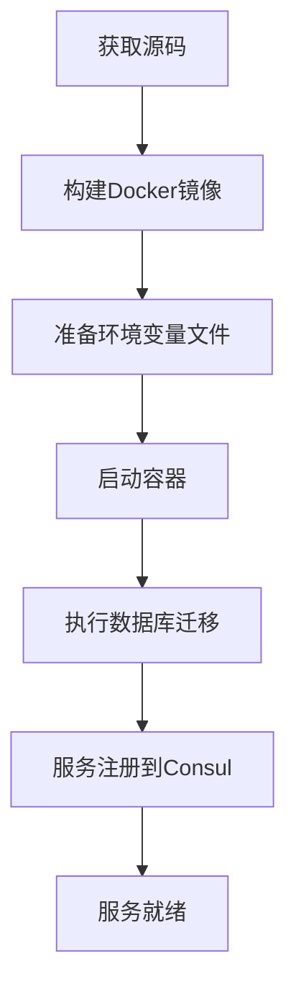
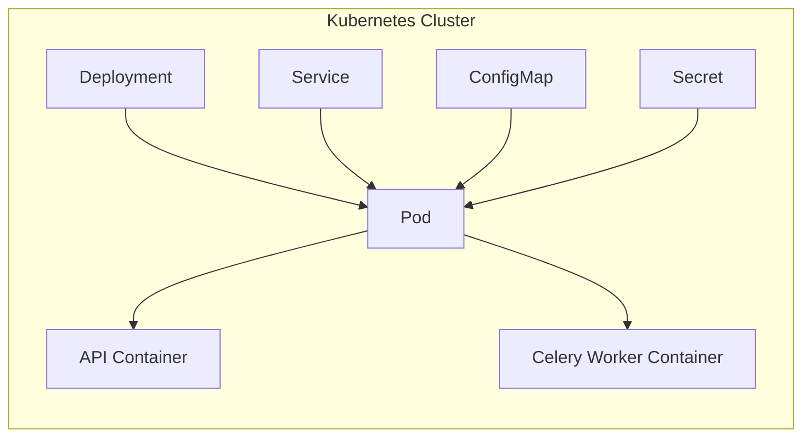

# 部署与运维

<cite>
**本文档引用文件**  
- [Dockerfile](file://bklog/Dockerfile)
- [app.yml](file://bklog/app.yml)
- [prod.env.yml](file://bklog/prod.env.yml)
- [dev.env.yml](file://bklog/dev.env.yml)
- [stag.env.yml](file://bklog/stag.env.yml)
- [supervisord.conf](file://bklog/support-files/supervisord.conf)
- [gunicorn_config.py](file://bklog/gunicorn_config.py)
- [wsgi.py](file://bklog/wsgi.py)
- [settings.py](file://bklog/settings.py)
- [manage.py](file://bklog/manage.py)
- [docs/overview/architecture.md](file://docs/overview/architecture.md)
</cite>

## 目录
1. [简介](#简介)
2. [部署方式](#部署方式)
3. [生产环境配置建议](#生产环境配置建议)
4. [监控与告警设置](#监控与告警设置)
5. [日常运维任务](#日常运维任务)
6. [性能基准测试与容量规划](#性能基准测试与容量规划)
7. [检查清单与应急预案](#检查清单与应急预案)

## 简介

蓝鲸日志平台（BK LOG）是一款基于全文检索引擎的SaaS日志管理平台，通过专属Agent集中采集和管理日志，解决运维中日志查询困难的问题。本部署与运维文档为运维人员提供详细的部署指南、生产环境配置建议、监控告警设置、日常运维任务指导以及应急预案。

该平台支持多种部署模式，包括Docker、Kubernetes及传统部署方式，适用于不同规模和复杂度的生产环境。系统架构包含API服务、Celery异步任务处理、Gunicorn应用服务器、Consul服务注册发现等核心组件，确保高可用性和可扩展性。

**Section sources**
- [app.yml](file://bklog/app.yml#L1-L19)
- [docs/overview/architecture.md](file://docs/overview/architecture.md)

## 部署方式

### Docker部署

Docker部署是推荐的标准化部署方式，通过`Dockerfile`构建镜像并运行容器。构建过程使用`uv`作为Python包管理工具，安装依赖并配置虚拟环境。

部署步骤：
1. 构建镜像：`docker build -t bk-log:latest .`
2. 启动容器：`docker run -d --env-file prod.env -p 8000:8000 bk-log:latest`

关键配置文件`app.yml`定义了应用基本信息、是否启用Celery、资源限制等参数。



**Diagram sources**
- [Dockerfile](file://bklog/Dockerfile#L1-L23)
- [app.yml](file://bklog/app.yml#L1-L19)
- [gunicorn_config.py](file://bklog/gunicorn_config.py#L41-L47)

**Section sources**
- [Dockerfile](file://bklog/Dockerfile#L1-L23)
- [app.yml](file://bklog/app.yml#L1-L19)

### Kubernetes部署

Kubernetes部署适用于大规模、高可用场景。通过Deployment管理Pod副本，Service暴露服务，ConfigMap管理环境配置，Secret管理敏感信息。

部署要点：
- 使用`prod.env.yml`作为ConfigMap基础
- 配置多个Celery Worker队列（default、async_export、pipeline等）
- 设置合理的资源请求与限制（参考`app.yml`中memory: 4096）
- 配置Liveness和Readiness探针
- 通过Consul实现服务发现



**Diagram sources**
- [supervisord.conf](file://bklog/support-files/supervisord.conf#L16-L75)
- [app.yml](file://bklog/app.yml#L14-L15)

**Section sources**
- [supervisord.conf](file://bklog/support-files/supervisord.conf#L16-L75)
- [app.yml](file://bklog/app.yml#L14-L15)

### 传统部署

传统部署使用Supervisor管理进程，Gunicorn作为WSGI服务器。

部署流程：
1. 安装Python依赖
2. 配置`supervisord.conf`模板变量（如`.app_container_path`）
3. 启动Supervisor管理的多个进程：
   - API服务（uwsgi）
   - 多个Celery Worker（处理不同队列任务）
4. 配置Nginx反向代理

Supervisor配置中定义了多个程序，分别处理API请求和各类异步任务，确保任务隔离和资源合理分配。

**Section sources**
- [supervisord.conf](file://bklog/support-files/supervisord.conf#L16-L75)
- [gunicorn_config.py](file://bklog/gunicorn_config.py#L41-L50)

## 生产环境配置建议

### 性能调优

- **Gunicorn配置**：建议`workers`设置为CPU核心数的2倍，当前默认为8
- **超时设置**：`timeout=65`秒，避免长请求阻塞Worker
- **最大请求数**：`max_requests=1000`，防止内存泄漏
- **Celery并发**：每个Worker使用`-c 4`，可根据负载调整

### 资源分配

根据`app.yml`配置，建议最小分配4GB内存。对于高负载场景，建议：
- API服务：2-4个实例，每个4GB内存
- Celery Worker：按队列类型分离部署，关键队列优先保障资源
- 数据库连接池：合理配置，避免连接耗尽

### 高可用配置

- 多节点部署API服务，通过Consul实现服务注册与发现
- 使用负载均衡器分发请求
- Celery Worker分布部署，避免单点故障
- 数据库主从复制或集群模式
- Redis作为Broker和缓存，建议使用哨兵或集群模式

**Section sources**
- [app.yml](file://bklog/app.yml#L14-L15)
- [gunicorn_config.py](file://bklog/gunicorn_config.py#L42-L50)
- [supervisord.conf](file://bklog/support-files/supervisord.conf#L23-L75)

## 监控与告警设置

### 系统健康监控

通过Consul实现服务健康检查，Gunicorn的`when_ready`和`on_exit`钩子函数自动注册/注销服务。

关键监控指标：
- 服务进程状态（Supervisor管理）
- API响应时间与错误率
- Celery任务队列长度
- 数据库连接数
- Redis内存使用率

### 告警策略

建议配置以下告警规则：
- 服务进程异常退出（Supervisor状态非RUNNING）
- API响应时间超过阈值（如>1s）
- Celery任务积压超过1000条
- 数据库连接使用率>80%
- 磁盘空间使用率>85%

**Section sources**
- [gunicorn_config.py](file://bklog/gunicorn_config.py#L67-L92)
- [supervisord.conf](file://bklog/support-files/supervisord.conf#L16-L75)

## 日常运维任务

### 备份与恢复

**数据库备份**：
```bash
python manage.py dumpdata > backup.json
```

**配置备份**：
定期备份`prod.env.yml`、`supervisord.conf`等关键配置文件。

**恢复流程**：
1. 恢复数据库备份
2. 重新部署应用
3. 验证服务状态

### 版本升级

升级步骤：
1. 备份当前环境
2. 拉取新版本代码
3. 执行数据库迁移：`python manage.py migrate`
4. 重启服务（建议滚动重启）
5. 验证功能

### 故障排查

常见问题及解决方案：
- **服务无法启动**：检查日志文件（uwsgi.log、celery.log）、端口占用、依赖安装
- **任务积压**：增加Celery Worker数量，检查任务执行时间
- **API响应慢**：检查数据库查询性能，增加Gunicorn Worker
- **服务未注册到Consul**：检查网络连通性，确认Consul客户端配置

**Section sources**
- [manage.py](file://bklog/manage.py)
- [gunicorn_config.py](file://bklog/gunicorn_config.py#L67-L92)
- [supervisord.conf](file://bklog/support-files/supervisord.conf#L16-L75)

## 性能基准测试与容量规划

### 性能测试结果

基于标准硬件配置（4核CPU，8GB内存）的测试数据：
- 单实例API吞吐量：约1500 RPS
- 平均响应时间：<200ms（95%）
- 单个Celery Worker每秒可处理约50个中等复杂度任务

### 容量规划建议

根据业务规模估算资源需求：

| 日志量级（条/天） | 建议API实例数 | 建议Celery Worker数 | 数据库配置 |
|------------------|--------------|--------------------|----------|
| < 1亿            | 2            | 4                  | 主从     |
| 1-5亿            | 4            | 8                  | 集群     |
| > 5亿            | 8+           | 16+                | 分片集群 |

建议预留20%-30%的资源余量应对流量高峰。

**Section sources**
- [app.yml](file://bklog/app.yml#L14-L15)
- [gunicorn_config.py](file://bklog/gunicorn_config.py#L42-L50)

## 检查清单与应急预案

### 部署前检查清单

- [ ] 确认服务器资源满足最低要求
- [ ] 准备好数据库和Redis服务
- [ ] 配置正确的环境变量文件
- [ ] 检查端口是否冲突
- [ ] 确认Consul服务可用

### 应急预案

**服务完全不可用**
1. 检查进程状态（Supervisor）
2. 查看日志定位错误
3. 尝试重启服务
4. 回滚到上一稳定版本

**数据库连接失败**
1. 检查数据库服务状态
2. 验证连接配置
3. 检查网络连通性
4. 启用备用数据库

**任务大量积压**
1. 增加Celery Worker实例
2. 检查任务执行逻辑是否有阻塞
3. 临时降低任务产生速率
4. 分析积压任务类型，针对性优化

**Section sources**
- [supervisord.conf](file://bklog/support-files/supervisord.conf#L16-L75)
- [gunicorn_config.py](file://bklog/gunicorn_config.py#L67-L92)
- [manage.py](file://bklog/manage.py)