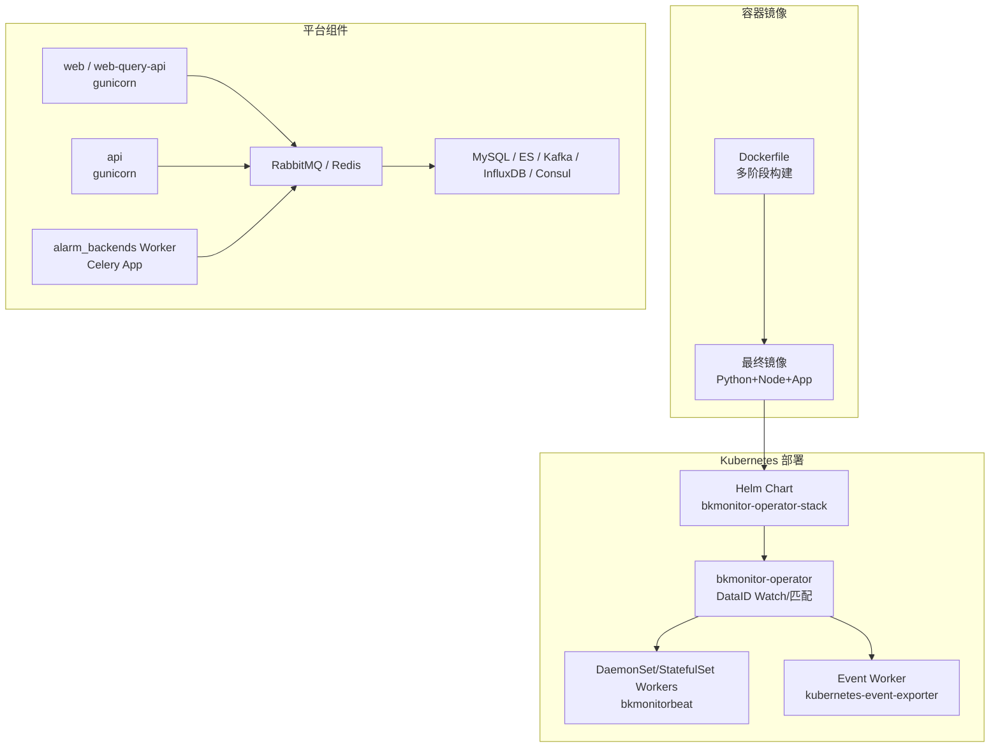
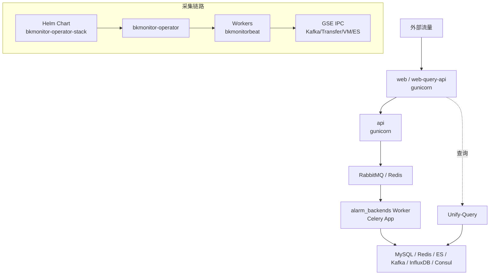
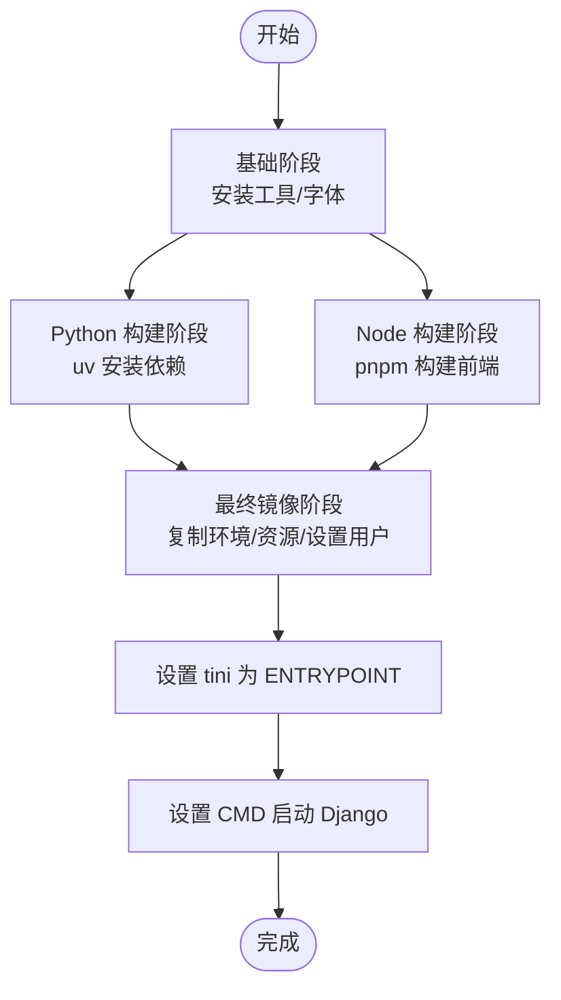
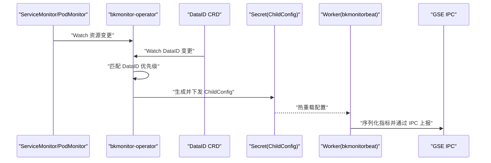
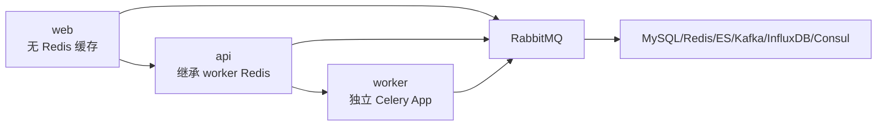
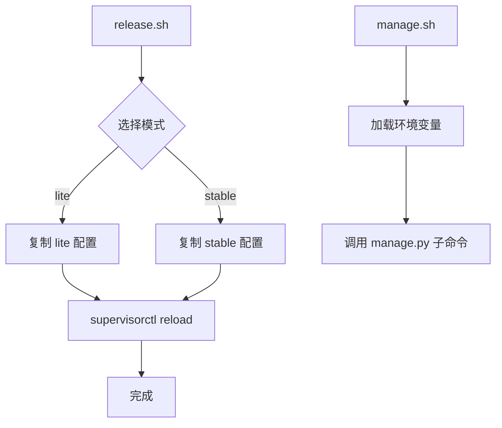
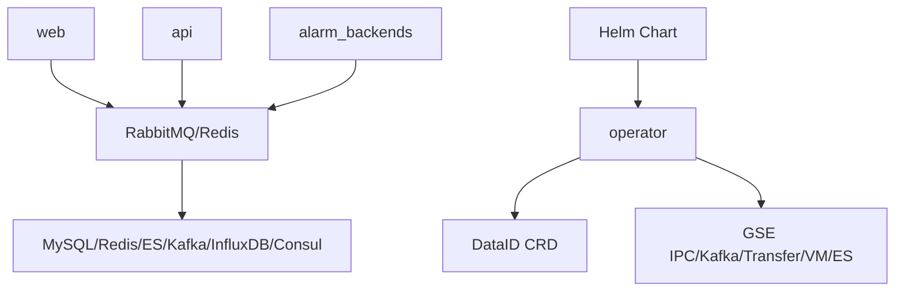

# 部署与运维

<cite>
**本文引用的文件**
- [Dockerfile](file://bkmonitor/Dockerfile)
- [bk-monitor-base-config.example.yaml](file://bkmonitor/bkmonitor/bk-monitor-base-config.example.yaml)
- [helm-chart-k8s采集配置详解.md](file://ai-docs/helm-charts/docs/helm-chart-k8s采集配置详解.md)
- [部署架构.md](file://ai-docs/bk-monitor/docs/告警后台(alarm_backends)/部署架构.md)
- [release.sh](file://bkmonitor/bin/release.sh)
- [manage.sh](file://bkmonitor/bin/manage.sh)
- [README.md](file://README.md)
</cite>

## 目录
1. [简介](#简介)
2. [项目结构](#项目结构)
3. [核心组件](#核心组件)
4. [架构总览](#架构总览)
5. [详细组件分析](#详细组件分析)
6. [依赖分析](#依赖分析)
7. [性能考虑](#性能考虑)
8. [故障排查指南](#故障排查指南)
9. [结论](#结论)
10. [附录](#附录)

## 简介
本指南面向生产环境的部署与运维，围绕容器化构建、Kubernetes 集群部署、负载均衡与高可用、性能监控与告警、日志与自动化运维展开。内容基于仓库中的 Dockerfile、Helm Chart 文档、部署架构文档与脚本，结合蓝鲸生态与监控平台特性，给出可落地的实施建议与最佳实践。

## 项目结构
- 容器镜像构建：通过多阶段 Dockerfile 构建 Python 运行时与前端静态资源，最终以非 root 用户运行 Django 应用。
- Helm Chart 与 K8s 采集：提供完整的 k8s 指标采集、DataID 路由、Worker 调度与系统内置指标白名单等配置说明。
- 部署角色与组件：明确 web/api/worker 三类角色及其依赖中间件，包括 Celery 双轨制与缓存能力差异。
- 运维脚本：提供发布模式切换与 Django 管理命令入口脚本，便于自动化部署与日常维护。

```mermaid
graph TB
subgraph "容器镜像"
DF["Dockerfile<br/>多阶段构建"]
IMG["最终镜像<br/>Python+Node+App"]
end
subgraph "Kubernetes 部署"
HC["Helm Chart<br/>bkmonitor-operator-stack"]
OP["bkmonitor-operator<br/>DataID Watch/匹配"]
DS["DaemonSet/StatefulSet Workers<br/>bkmonitorbeat"]
EV["Event Worker<br/>kubernetes-event-exporter"]
end
subgraph "平台组件"
WEB["web / web-query-api<br/>gunicorn"]
API["api<br/>gunicorn"]
WKR["alarm_backends Worker<br/>Celery App"]
MQ["RabbitMQ / Redis"]
DB["MySQL / ES / Kafka / InfluxDB / Consul"]
end
DF --> IMG
IMG --> HC
HC --> OP
OP --> DS
OP --> EV
WEB --> MQ
API --> MQ
WKR --> MQ
MQ --> DB
```

图表来源
- [Dockerfile:1-86](file://bkmonitor/Dockerfile#L1-L86)
- [helm-chart-k8s采集配置详解.md:11-48](file://ai-docs/helm-charts/docs/helm-chart-k8s采集配置详解.md#L11-L48)
- [部署架构.md:5-22](file://ai-docs/bk-monitor/docs/告警后台(alarm_backends)/部署架构.md#L5-L22)

章节来源
- [Dockerfile:1-86](file://bkmonitor/Dockerfile#L1-L86)
- [helm-chart-k8s采集配置详解.md:11-48](file://ai-docs/helm-charts/docs/helm-chart-k8s采集配置详解.md#L11-L48)
- [部署架构.md:5-22](file://ai-docs/bk-monitor/docs/告警后台(alarm_backends)/部署架构.md#L5-L22)

## 核心组件
- 容器镜像与运行时
  - 多阶段构建：Python 基础镜像安装工具与字体，Node 构建前端静态资源，最终镜像以非 root 用户运行。
  - 入口与命令：使用 tini 作为 init，CMD 启动 Django runserver。
- 配置示例
  - 提供蓝鲸应用配置、数据库连接、域名与文件存储等示例，便于本地与生产环境快速对接。
- Helm Chart 采集与 DataID 路由
  - 内置系统级 ServiceMonitor/PodMonitor 与 relabelRule 扩展，实现指标白名单与维度增强。
  - DataID CRD 与 operator 匹配逻辑，确保系统指标与自定义指标走不同数据管道。
- 部署角色与中间件
  - web/api/worker 三类角色，分别承担前端 API、后台 API 与告警后台任务。
  - 中间件包括 MySQL、Redis、Elasticsearch、Kafka、RabbitMQ、InfluxDB、Consul、Transfer、Unify-Query、Grafana 等。

章节来源
- [Dockerfile:1-86](file://bkmonitor/Dockerfile#L1-L86)
- [bk-monitor-base-config.example.yaml:1-50](file://bkmonitor/bkmonitor/bk-monitor-base-config.example.yaml#L1-L50)
- [helm-chart-k8s采集配置详解.md:418-474](file://ai-docs/helm-charts/docs/helm-chart-k8s采集配置详解.md#L418-L474)
- [部署架构.md:26-114](file://ai-docs/bk-monitor/docs/告警后台(alarm_backends)/部署架构.md#L26-L114)

## 架构总览
下图展示从外部流量到数据存储的整体链路，以及告警后台的分层职责与依赖。

```mermaid
graph TB
EXT["外部流量"] --> WEB["web / web-query-api<br/>gunicorn"]
WEB --> API["api<br/>gunicorn"]
API --> MQ["RabbitMQ / Redis"]
MQ --> WKR["alarm_backends Worker<br/>Celery App"]
WKR --> DB["MySQL / Redis / ES / Kafka / InfluxDB / Consul"]
subgraph "采集链路"
HC["Helm Chart<br/>bkmonitor-operator-stack"] --> OP["bkmonitor-operator"]
OP --> DS["Workers<br/>bkmonitorbeat"]
DS --> PIPE["GSE IPC<br/>Kafka/Transfer/VM/ES"]
end
WEB -. 查询 .-> UNIFY["Unify-Query"]
UNIFY --> DB
```

图表来源
- [部署架构.md:5-22](file://ai-docs/bk-monitor/docs/告警后台(alarm_backends)/部署架构.md#L5-L22)
- [helm-chart-k8s采集配置详解.md:515-561](file://ai-docs/helm-charts/docs/helm-chart-k8s采集配置详解.md#L515-L561)

章节来源
- [部署架构.md:5-22](file://ai-docs/bk-monitor/docs/告警后台(alarm_backends)/部署架构.md#L5-L22)
- [helm-chart-k8s采集配置详解.md:515-561](file://ai-docs/helm-charts/docs/helm-chart-k8s采集配置详解.md#L515-L561)

## 详细组件分析

### 容器化构建流程
- 多阶段构建要点
  - Python 基础阶段：安装常用工具与中文字体，准备运行时环境。
  - Python 构建阶段：使用 uv 管理依赖，隔离构建缓存，加速安装。
  - Node 构建阶段：使用 pnpm 构建前端静态资源，输出 dist。
  - 最终镜像：复制虚拟环境与静态资源，设置非 root 用户与 UTF-8 环境，ENTRYPOINT 使用 tini，CMD 启动 Django。
- 镜像参数与变量
  - 支持通过 ARG 注入基础镜像与 PyPI 源，便于企业内网定制。
  - 版本号写入 VERSION 文件，便于镜像追踪。
- 运行时与安全
  - 非 root 用户运行，降低权限风险。
  - 设置 LC_ALL 与 LANG，确保国际化显示正常。

```mermaid
flowchart TD
Start(["开始"]) --> Base["基础阶段<br/>安装工具/字体"]
Base --> PyBuild["Python 构建阶段<br/>uv 安装依赖"]
Base --> NodeBuild["Node 构建阶段<br/>pnpm 构建前端"]
PyBuild --> Final["最终镜像阶段<br/>复制环境/资源/设置用户"]
NodeBuild --> Final
Final --> Entrypoint["设置 tini 为 ENTRYPOINT"]
Entrypoint --> CMD["设置 CMD 启动 Django"]
CMD --> End(["完成"])
```

图表来源
- [Dockerfile:24-86](file://bkmonitor/Dockerfile#L24-L86)

章节来源
- [Dockerfile:1-86](file://bkmonitor/Dockerfile#L1-L86)

### Kubernetes 部署与采集配置
- Chart 结构与组件
  - umbrella chart 包含 CRD、内置 exporter、子 chart 与本地 operator/worker。
  - 三类 Worker：DaemonSet（节点本地）、StatefulSet（远端/外部）、Event Worker（k8s 事件）。
- DataID 与路由
  - DataID CRD 定义与 operator 匹配逻辑，支持 scheduledDataID、isSystem 等 annotation。
  - 系统内置指标与自定义指标走不同 DataID，保障数据隔离。
- 指标白名单与 relabelRule
  - kubelet/cAdvisor/probes/resource 等端点的指标重命名与过滤。
  - relabelRule 扩展：v1/workload、v1/node、v2/workload、v3/workload 等，实现维度增强。
- 资源与调度
  - 各组件 CPU/Memory 限制与亲和/容忍配置。
  - StatefulSet Worker HPA 与调度算法（hash/roundrobin）。

```mermaid
sequenceDiagram
participant SM as "ServiceMonitor/PodMonitor"
participant OP as "bkmonitor-operator"
participant CID as "DataID CRD"
participant SEC as "Secret(ChildConfig)"
participant WK as "Worker(bkmonitorbeat)"
participant GSE as "GSE IPC"
SM->>OP : "Watch 资源变更"
CID->>OP : "Watch DataID 变更"
OP->>OP : "匹配 DataID 优先级"
OP->>SEC : "生成并下发 ChildConfig"
SEC-->>WK : "热重载配置"
WK->>GSE : "序列化指标并通过 IPC 上报"
```

图表来源
- [helm-chart-k8s采集配置详解.md:418-474](file://ai-docs/helm-charts/docs/helm-chart-k8s采集配置详解.md#L418-L474)
- [helm-chart-k8s采集配置详解.md:515-561](file://ai-docs/helm-charts/docs/helm-chart-k8s采集配置详解.md#L515-L561)

章节来源
- [helm-chart-k8s采集配置详解.md:11-48](file://ai-docs/helm-charts/docs/helm-chart-k8s采集配置详解.md#L11-L48)
- [helm-chart-k8s采集配置详解.md:418-474](file://ai-docs/helm-charts/docs/helm-chart-k8s采集配置详解.md#L418-L474)
- [helm-chart-k8s采集配置详解.md:515-561](file://ai-docs/helm-charts/docs/helm-chart-k8s采集配置详解.md#L515-L561)

### 部署角色与高可用
- 角色划分
  - web：SaaS 前端 API 与 Celery，无 Redis 缓存。
  - api：后台内部 API，继承 worker 的 Redis 配置。
  - worker：alarm_backends 后台任务，独立 Celery App 与队列。
- 中间件依赖
  - MySQL、Redis、Elasticsearch、Kafka、RabbitMQ、InfluxDB、Consul、Transfer、Unify-Query、Grafana。
- Celery 双轨制
  - web Celery 与 alarm_backends Celery 分离，使用不同 Broker 与 App，避免相互干扰。
- 缓存能力
  - 仅 worker/api 角色具备 alarm_backends Redis 缓存配置，web 角色不支持。

```mermaid
graph LR
WEB["web<br/>无 Redis 缓存"] --> API["api<br/>继承 worker Redis"]
API --> WKR["worker<br/>独立 Celery App"]
WEB --> MQ["RabbitMQ"]
API --> MQ
WKR --> MQ
MQ --> MWS["MySQL/Redis/ES/Kafka/InfluxDB/Consul"]
```

图表来源
- [部署架构.md:26-114](file://ai-docs/bk-monitor/docs/告警后台(alarm_backends)/部署架构.md#L26-L114)
- [部署架构.md:117-147](file://ai-docs/bk-monitor/docs/告警后台(alarm_backends)/部署架构.md#L117-L147)

章节来源
- [部署架构.md:26-114](file://ai-docs/bk-monitor/docs/告警后台(alarm_backends)/部署架构.md#L26-L114)
- [部署架构.md:117-147](file://ai-docs/bk-monitor/docs/告警后台(alarm_backends)/部署架构.md#L117-L147)

### 运维脚本与发布模式
- 发布模式切换
  - release.sh 支持 lite/stable 两种模式，通过 supervisor 配置切换并 reload。
- Django 管理命令入口
  - manage.sh 读取环境变量并调用 manage.py，便于统一入口执行迁移、收集静态资源等。

```mermaid
flowchart TD
RS["release.sh"] --> MODE{"选择模式"}
MODE --> |lite| LCONF["复制 lite 配置"]
MODE --> |stable| SCONF["复制 stable 配置"]
LCONF --> RELOAD["supervisorctl reload"]
SCONF --> RELOAD
RELOAD --> DONE["完成"]
MS["manage.sh"] --> ENV["加载环境变量"]
ENV --> DJCLI["调用 manage.py 子命令"]
```

图表来源
- [release.sh:1-19](file://bkmonitor/bin/release.sh#L1-L19)
- [manage.sh:1-14](file://bkmonitor/bin/manage.sh#L1-L14)

章节来源
- [release.sh:1-19](file://bkmonitor/bin/release.sh#L1-L19)
- [manage.sh:1-14](file://bkmonitor/bin/manage.sh#L1-L14)

## 依赖分析
- 组件耦合
  - web/api 通过 RabbitMQ/Redis 与 alarm_backends 解耦；alarm_backends 使用独立 Celery App 与 Broker。
  - 采集链路通过 Helm Chart 与 operator 解耦，DataID 路由与 relabelRule 保证指标质量与维度。
- 外部依赖
  - MySQL/Redis/ES/Kafka/InfluxDB/Consul 为核心存储与消息通道；Transfer/Unify-Query/Grafana 提供数据处理与可视化。
- 潜在环路
  - 无直接循环依赖；若自定义 DataID 与 isSystem 标注冲突，可能导致匹配不确定性，需规范标注。

```mermaid
graph TB
WEB["web"] --> MQ["RabbitMQ/Redis"]
API["api"] --> MQ
WKR["alarm_backends"] --> MQ
MQ --> ST["MySQL/Redis/ES/Kafka/InfluxDB/Consul"]
HC["Helm Chart"] --> OP["operator"]
OP --> DATA["DataID CRD"]
OP --> PIPE["GSE IPC/Kafka/Transfer/VM/ES"]
```

图表来源
- [部署架构.md:99-114](file://ai-docs/bk-monitor/docs/告警后台(alarm_backends)/部署架构.md#L99-L114)
- [helm-chart-k8s采集配置详解.md:515-561](file://ai-docs/helm-charts/docs/helm-chart-k8s采集配置详解.md#L515-L561)

章节来源
- [部署架构.md:99-114](file://ai-docs/bk-monitor/docs/告警后台(alarm_backends)/deploy/部署架构.md#L99-L114)
- [helm-chart-k8s采集配置详解.md:515-561](file://ai-docs/helm-charts/docs/helm-chart-k8s采集配置详解.md#L515-L561)

## 性能考虑
- 容器镜像与启动
  - 多阶段构建减少镜像体积，缓存 uv 与字体安装提升构建效率。
  - 非 root 用户与 UTF-8 环境减少运行时问题。
- 采集与上报
  - DataID 白名单与 relabelRule 降低指标风暴风险；批量上报参数可调优吞吐。
  - HPA 与调度算法（hash/roundrobin）平衡任务分布。
- 后台任务
  - Celery 双轨制避免 web/api 与 alarm_backends 的资源争抢；队列分离提升稳定性。
- 查询与存储
  - Unify-Query 屏蔽底层存储差异；合理配置 ES/InfluxDB 索引与保留策略，避免热点写入。

## 故障排查指南
- 容器与运行
  - 检查镜像构建日志与 ENTRYPOINT 参数，确认 tini 是否正确初始化。
  - 若页面乱码，检查 LC_ALL/LANG 环境变量是否设置。
- Helm 与采集
  - 确认 DataID CRD 是否存在且标注正确（isSystem/scheduledDataID）。
  - 查看 operator 日志，定位匹配失败或 ChildConfig 下发异常。
  - 检查 Worker Pod 的 reloader 是否成功写入 child_configs 并触发热重载。
- 部署角色与缓存
  - web 角色无法使用 alarm_backends 缓存，避免在 web 进程中调用相关缓存工具。
  - api/worker 角色需确保 Redis 配置完整，DB 选择正确。
- 发布与运维
  - 使用 release.sh 切换模式并 reload，观察 supervisor 状态。
  - 使用 manage.sh 执行迁移、收集静态资源等命令，确保环境变量正确。

章节来源
- [Dockerfile:75-86](file://bkmonitor/Dockerfile#L75-L86)
- [helm-chart-k8s采集配置详解.md:608-724](file://ai-docs/helm-charts/docs/helm-chart-k8s采集配置详解.md#L608-L724)
- [部署架构.md:131-147](file://ai-docs/bk-monitor/docs/告警后台(alarm_backends)/部署架构.md#L131-L147)
- [release.sh:1-19](file://bkmonitor/bin/release.sh#L1-L19)
- [manage.sh:1-14](file://bkmonitor/bin/manage.sh#L1-L14)

## 结论
本指南基于仓库现有文档与脚本，给出了从容器构建、Kubernetes 部署、采集配置、角色与中间件依赖到运维脚本的完整路径。建议在生产环境中严格遵循 Helm Chart 的采集白名单与 relabelRule，规范 DataID 标注，利用 Celery 双轨制与 HPA 调度实现高可用与弹性伸缩，并通过 Supervisor 与 manage.sh 实现标准化发布与运维。

## 附录
- 参考文档与链接
  - 项目 README 提供总体介绍与外部文档入口。
  - Helm Chart 采集配置详解提供详尽的 CRD、Worker、DataID 匹配与 relabelRule 说明。
  - 部署架构文档明确角色划分、中间件与 Celery 双轨制。

章节来源
- [README.md:17-34](file://README.md#L17-L34)
- [helm-chart-k8s采集配置详解.md:1-10](file://ai-docs/helm-charts/docs/helm-chart-k8s采集配置详解.md#L1-L10)
- [部署架构.md:1-5](file://ai-docs/bk-monitor/docs/告警后台(alarm_backends)/部署架构.md#L1-L5)