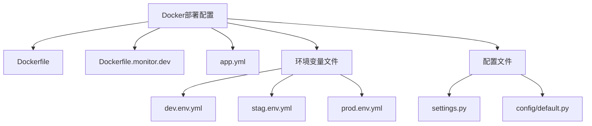
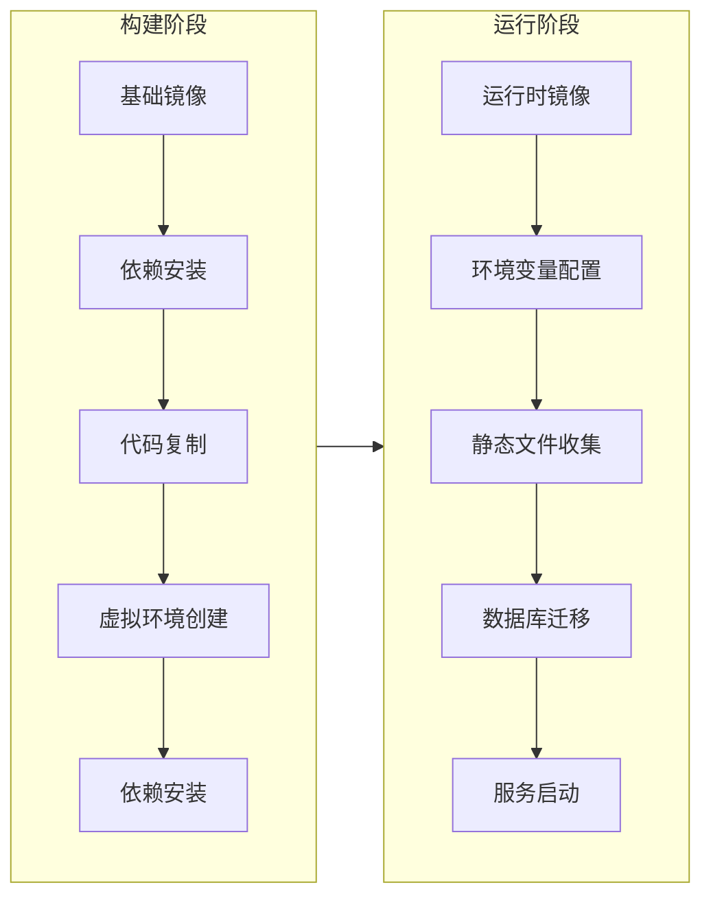
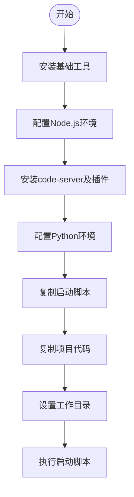
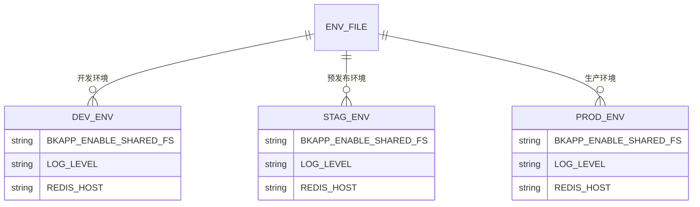
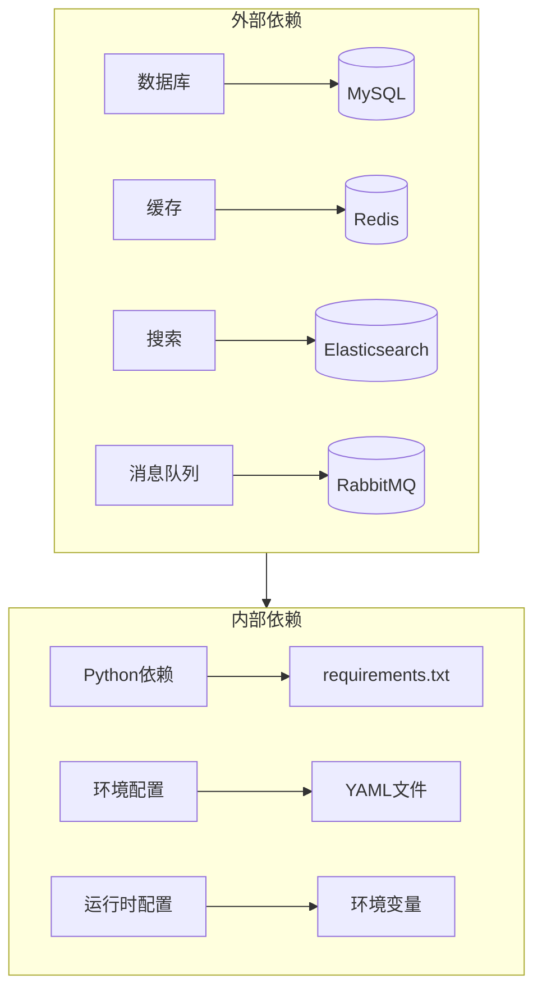

# Docker部署

<cite>
**本文档引用文件**  
- [Dockerfile](file://bklog/Dockerfile)
- [Dockerfile.monitor.dev](file://Dockerfile.monitor.dev)
- [app.yml](file://bklog/app.yml)
- [settings.py](file://bklog/settings.py)
- [default.py](file://bklog/config/default.py)
- [prod.env.yml](file://bklog/prod.env.yml)
- [dev.env.yml](file://bklog/dev.env.yml)
- [stag.env.yml](file://bklog/stag.env.yml)
</cite>

## 目录
1. [简介](#简介)
2. [项目结构](#项目结构)
3. [核心组件](#核心组件)
4. [架构概述](#架构概述)
5. [详细组件分析](#详细组件分析)
6. [依赖分析](#依赖分析)
7. [性能考虑](#性能考虑)
8. [故障排除指南](#故障排除指南)
9. [结论](#结论)

## 简介
本文档详细说明了蓝鲸日志平台的Docker部署方案，重点解析项目中的Dockerfile配置、环境变量管理、容器启动流程以及多环境一致性部署策略。文档涵盖了从镜像构建到容器运行时配置的完整生命周期，为开发、测试和生产环境提供统一的部署实践指导。

## 项目结构
本项目采用模块化设计，主要包含日志采集、搜索、分析和可视化等核心功能模块。Docker相关配置文件位于项目根目录及bklog子目录中，通过多阶段构建和环境变量注入实现灵活部署。



**图示来源**  
- [Dockerfile](file://bklog/Dockerfile)
- [Dockerfile.monitor.dev](file://Dockerfile.monitor.dev)
- [app.yml](file://bklog/app.yml)

## 核心组件
项目通过Docker容器化部署，核心组件包括基于TencentOS的Python运行时环境、Celery任务队列、Grafana可视化服务以及与外部系统（数据库、Redis、Elasticsearch）的集成。部署配置支持开发、测试和生产多种环境模式。

**组件来源**  
- [app.yml](file://bklog/app.yml#L1-L19)
- [default.py](file://bklog/config/default.py#L34-L35)
- [settings.py](file://bklog/settings.py#L27-L36)

## 架构概述
Docker部署采用多阶段构建策略，分离构建环境和运行环境，确保镜像安全性和最小化。通过环境变量文件实现不同环境的配置管理，支持Kubernetes和传统部署模式。



**图示来源**  
- [Dockerfile](file://bklog/Dockerfile#L1-L22)
- [default.py](file://bklog/config/default.py#L34)

## 详细组件分析

### Dockerfile配置分析
项目包含两个Dockerfile，分别用于生产环境和开发环境的部署。

#### 生产环境Dockerfile
生产环境使用多阶段构建，基于TencentOS Minimal镜像，通过uv工具高效安装Python依赖。

```mermaid
classDiagram
class BuilderStage {
+ARG PYTHON_BASE_IMAGE
+FROM ${PYTHON_BASE_IMAGE}
+COPY uv工具
+安装编译工具
+复制代码
+创建虚拟环境
+安装生产依赖
}
class RuntimeStage {
+基础镜像配置
+环境变量设置
+CMD执行迁移
}
BuilderStage --> RuntimeStage : 多阶段构建
```

**图示来源**  
- [Dockerfile](file://bklog/Dockerfile#L1-L22)

#### 开发环境Dockerfile
开发环境Dockerfile包含完整的开发工具链，包括Node.js、code-server等，支持在线开发调试。



**图示来源**  
- [Dockerfile.monitor.dev](file://Dockerfile.monitor.dev#L1-L48)

### 环境配置管理
项目通过YAML文件管理不同环境的配置，实现环境间的一致性。



**图示来源**  
- [dev.env.yml](file://bklog/dev.env.yml)
- [stag.env.yml](file://bklog/stag.env.yml)
- [prod.env.yml](file://bklog/prod.env.yml)

## 依赖分析
项目依赖管理通过requirements.txt和环境变量双重机制实现，确保依赖的可重现性和灵活性。



**图示来源**  
- [Dockerfile](file://bklog/Dockerfile#L13)
- [default.py](file://bklog/config/default.py#L196)
- [app.yml](file://bklog/app.yml#L4)

## 性能考虑
Docker部署在性能方面进行了多项优化，包括依赖缓存、多核利用和资源限制配置。

- 使用uv工具加速Python依赖安装
- 通过环境变量控制Celery并发数
- 配置合理的内存限制（4096MB）
- 支持高优先级任务队列
- 日志输出采用JSON格式便于收集和分析

**性能配置来源**  
- [app.yml](file://bklog/app.yml#L15)
- [default.py](file://bklog/config/default.py#L206)
- [default.py](file://bklog/config/default.py#L262)

## 故障排除指南
常见部署问题及解决方案：

1. **依赖安装失败**：检查镜像源配置和网络连接
2. **数据库迁移错误**：确认数据库连接参数正确
3. **环境变量未生效**：检查.env文件加载顺序
4. **端口冲突**：验证容器端口映射配置
5. **权限问题**：检查文件系统挂载权限设置

**故障排除来源**  
- [settings.py](file://bklog/settings.py#L40-L46)
- [default.py](file://bklog/config/default.py#L273-L363)
- [Dockerfile](file://bklog/Dockerfile#L22)

## 结论
本Docker部署方案通过标准化的构建流程、灵活的配置管理和完善的环境支持，实现了蓝鲸日志平台在不同环境下的快速部署和一致性运维。建议在生产环境中采用多阶段构建，并结合Kubernetes进行容器编排管理，以获得最佳的部署体验和运行性能。