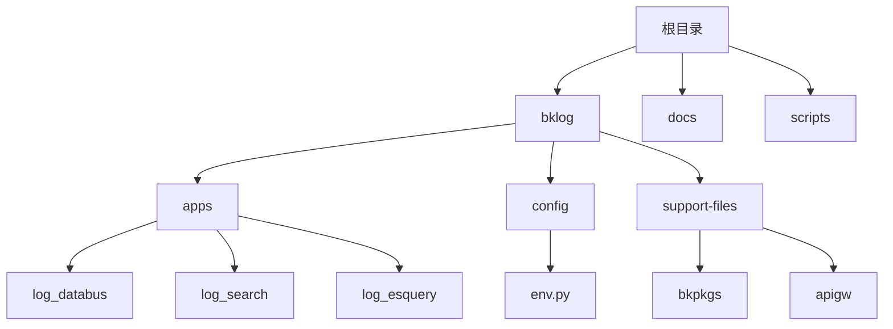
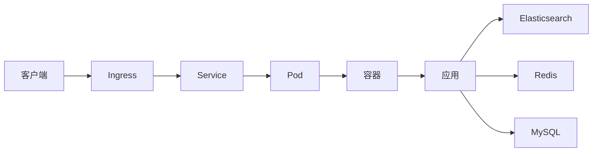
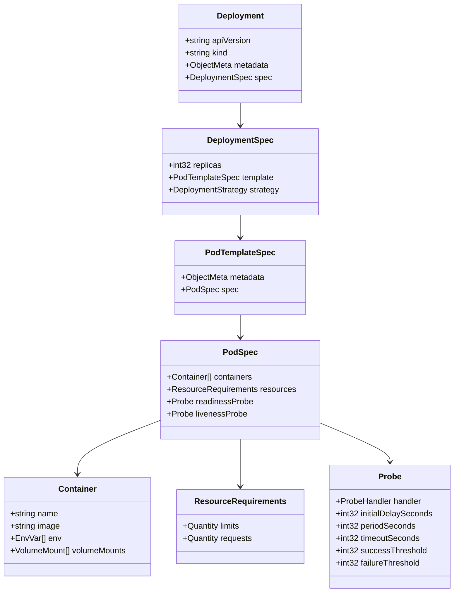
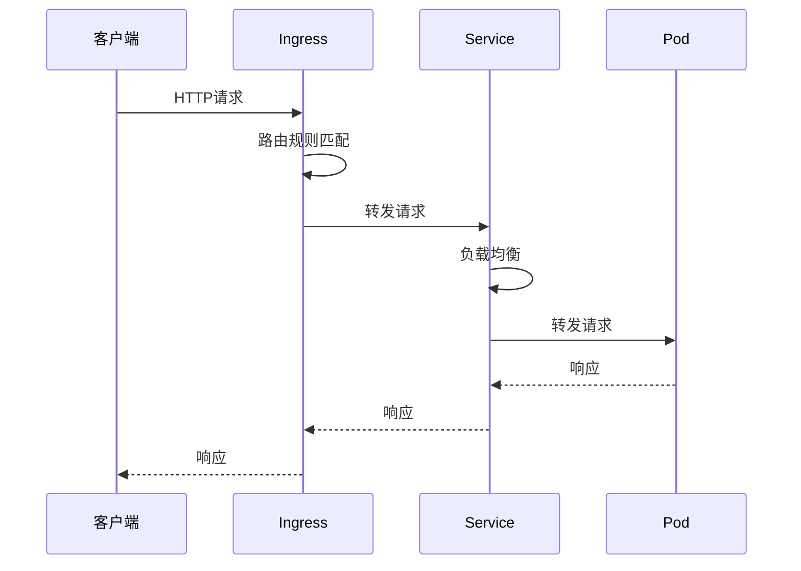
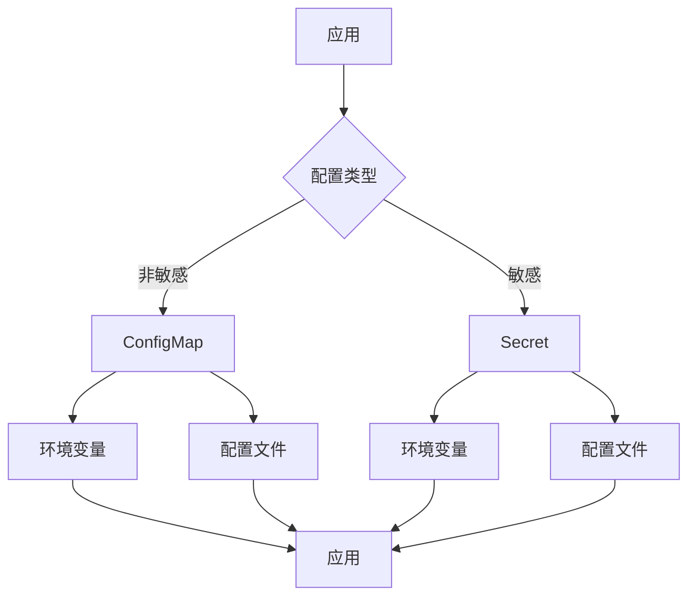
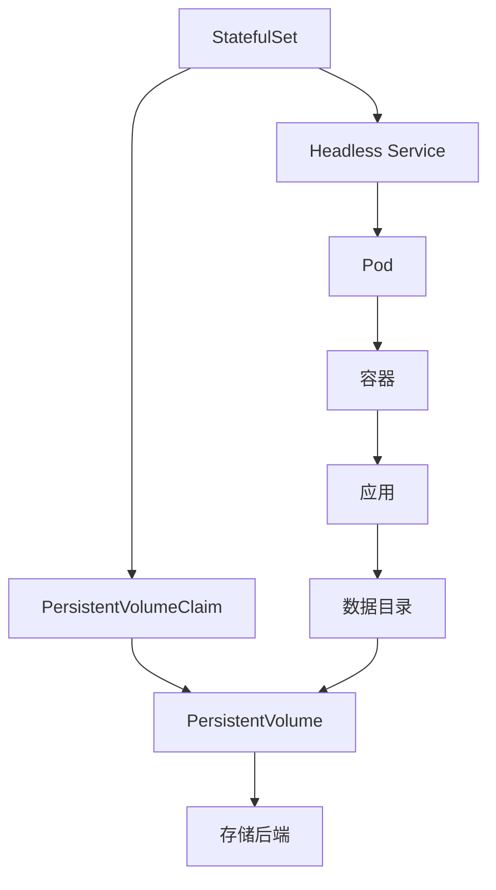
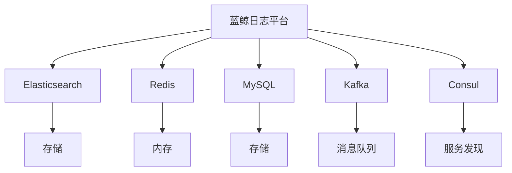

# Kubernetes部署

<cite>
**本文档引用的文件**  
- [bklog.yaml](file://bklog/support-files/bkpkgs/bklog.yaml)
- [bk_log_search.yaml](file://bklog/support-files/bkpkgs/bk_log_search.yaml)
- [app.yml](file://bklog/app.yml)
- [dev.env.yml](file://bklog/dev.env.yml)
- [prod.env.yml](file://bklog/prod.env.yml)
- [stag.env.yml](file://bklog/stag.env.yml)
- [bcs.py](file://bklog/apps/utils/bcs.py)
- [k8s.py](file://bklog/apps/log_databus/handlers/collector/k8s.py)
- [env.py](file://bklog/config/env.py)
- [settings.py](file://bklog/settings.py)
- [serializers.py](file://bklog/apps/log_databus/serializers.py)
</cite>

## 目录
1. [简介](#简介)
2. [项目结构](#项目结构)
3. [核心组件](#核心组件)
4. [架构概述](#架构概述)
5. [详细组件分析](#详细组件分析)
6. [依赖分析](#依赖分析)
7. [性能考虑](#性能考虑)
8. [故障排除指南](#故障排除指南)
9. [结论](#结论)

## 简介
本文档基于蓝鲸日志平台（BK LOG）的现有部署资源文件，提供完整的Helm Chart配置指南。文档详细说明了Kubernetes部署中的Deployment资源配置、Service和Ingress配置、ConfigMap和Secret管理、有状态应用部署考虑、持久化存储配置、节点亲和性设置、滚动更新策略和故障恢复方案。

## 项目结构
蓝鲸日志平台项目采用模块化设计，主要包含日志采集、搜索、分析和可视化等核心功能模块。项目结构清晰，配置文件集中管理，支持多环境部署。

**图示来源**  
- [项目结构](file://)

**本节来源**  
- [项目结构](file://)

## 核心组件
蓝鲸日志平台的核心组件包括日志采集器（log_databus）、日志搜索引擎（log_search）、Elasticsearch查询服务（log_esquery）等。这些组件通过Kubernetes进行容器化部署，实现了高可用和弹性伸缩。

**本节来源**  
- [log_databus](file://bklog/apps/log_databus)
- [log_search](file://bklog/apps/log_search)
- [log_esquery](file://bklog/apps/log_esquery)

## 架构概述
蓝鲸日志平台采用微服务架构，各组件通过API进行通信。平台支持通过Kubernetes进行容器化部署，利用Helm Chart进行配置管理。

**图示来源**  
- [k8s.py](file://bklog/apps/log_databus/handlers/collector/k8s.py)
- [bcs.py](file://bklog/apps/utils/bcs.py)

## 详细组件分析

### Deployment资源配置
Deployment资源配置包括副本数、资源限制、就绪和存活探针设置。通过Helm Chart可以灵活配置这些参数。

**图示来源**  
- [k8s.py](file://bklog/apps/log_databus/handlers/collector/k8s.py)
- [env.py](file://bklog/config/env.py)

### Service和Ingress配置
Service和Ingress配置实现了外部访问和负载均衡。通过Ingress可以将外部请求路由到内部服务。

**图示来源**  
- [k8s.py](file://bklog/apps/log_databus/handlers/collector/k8s.py)
- [bcs.py](file://bklog/apps/utils/bcs.py)

### ConfigMap和Secret管理
ConfigMap和Secret用于管理配置和敏感信息。ConfigMap存储非敏感配置，Secret存储敏感信息如密码、密钥等。

**图示来源**  
- [env.py](file://bklog/config/env.py)
- [settings.py](file://bklog/settings.py)

### 有状态应用部署
对于MySQL、Redis和Elasticsearch等有状态应用，需要考虑持久化存储和节点亲和性设置。

**图示来源**  
- [k8s.py](file://bklog/apps/log_databus/handlers/collector/k8s.py)
- [serializers.py](file://bklog/apps/log_databus/serializers.py)

## 依赖分析
蓝鲸日志平台依赖多个外部服务，包括Elasticsearch、Redis、MySQL等。这些依赖关系通过Helm Chart进行管理。

**图示来源**  
- [bklog.yaml](file://bklog/support-files/bkpkgs/bklog.yaml)
- [bk_log_search.yaml](file://bklog/support-files/bkpkgs/bk_log_search.yaml)

## 性能考虑
在Kubernetes部署中，需要考虑资源限制、水平扩展、缓存策略等性能因素。

## 故障排除指南
当遇到部署问题时，可以检查以下方面：
- 配置文件是否正确
- 资源是否充足
- 网络是否通畅
- 日志是否有错误信息

**本节来源**  
- [k8s.py](file://bklog/apps/log_databus/handlers/collector/k8s.py)
- [bcs.py](file://bklog/apps/utils/bcs.py)

## 结论
蓝鲸日志平台通过Kubernetes和Helm Chart实现了灵活、可扩展的部署方案。通过合理的资源配置和管理，可以确保平台的高可用性和性能。