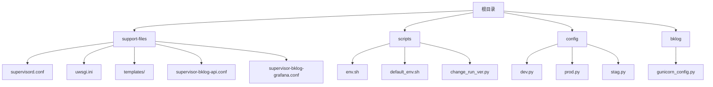

# 传统部署

<cite>
**本文档中引用的文件**  
- [supervisord.conf](file://bklog/support-files/supervisord.conf)
- [uwsgi.ini](file://bklog/support-files/uwsgi.ini)
- [env.sh](file://bklog/scripts/env.sh)
- [default_env.sh](file://bklog/scripts/default_env.sh)
- [supervisor-bklog-api.conf](file://bklog/support-files/templates/#etc#supervisor-bklog-api.conf)
- [supervisor-bklog-grafana.conf](file://bklog/support-files/templates/#etc#supervisor-bklog-grafana.conf)
- [gunicorn_config.py](file://bklog/gunicorn_config.py)
- [dev.py](file://bklog/config/dev.py)
- [prod.py](file://bklog/config/prod.py)
- [stag.py](file://bklog/config/stag.py)
- [change_run_ver.py](file://bklog/scripts/change_run_ver.py)
</cite>

## 目录
1. [简介](#简介)
2. [项目结构](#项目结构)
3. [Supervisor进程管理配置详解](#supervisor进程管理配置详解)
4. [uWSGI配置详解](#uwsgi配置详解)
5. [环境变量配置与管理](#环境变量配置与管理)
6. [Nginx反向代理配置示例](#nginx反向代理配置示例)
7. [Gunicorn配置说明](#gunicorn配置说明)
8. [完整部署流程](#完整部署流程)
9. [结论](#结论)

## 简介
本文档详细说明了基于Supervisor的蓝鲸日志平台（BK-LOG）传统部署方案。文档涵盖Supervisor进程管理、uWSGI应用服务器、环境变量配置、Nginx反向代理等核心组件的配置与优化。重点解析了如何通过Supervisor管理多个Celery工作进程和uWSGI主进程，以及如何根据不同环境（开发、预发布、生产）进行配置切换。文档还提供了完整的部署流程，从代码拉取到服务启动的每一步操作。

## 项目结构
蓝鲸日志平台的项目结构遵循典型的Django应用布局，并包含专门的部署支持文件。核心部署配置位于`support-files`目录下，包括Supervisor主配置、uWSGI配置模板和环境脚本。



**图示来源**
- [supervisord.conf](file://bklog/support-files/supervisord.conf)
- [uwsgi.ini](file://bklog/support-files/uwsgi.ini)
- [env.sh](file://bklog/scripts/env.sh)
- [dev.py](file://bklog/config/dev.py)

**本节来源**
- [supervisord.conf](file://bklog/support-files/supervisord.conf)
- [uwsgi.ini](file://bklog/support-files/uwsgi.ini)
- [env.sh](file://bklog/scripts/env.sh)
- [dev.py](file://bklog/config/dev.py)

## Supervisor进程管理配置详解
Supervisor是本系统的核心进程管理工具，负责启动、监控和自动重启所有关键服务进程。系统使用了两种Supervisor配置模式：一种是通用的`supervisord.conf`模板，另一种是针对特定服务的独立配置文件。

### 通用Supervisor配置
位于`support-files/supervisord.conf`的配置文件定义了多个程序组，每个程序对应一个服务进程：

- **uWSGI进程**：通过uWSGI运行Django应用，配置了标准输出日志重定向和自动重启。
- **Celery工作进程**：为不同任务队列（如`default`、`async_export`、`pipeline`等）配置了独立的工作进程，确保任务隔离和资源合理分配。
- **环境变量注入**：所有进程都通过`environment`参数注入了运行时环境变量，确保进程在正确的上下文中运行。

关键参数说明：
- `command`：指定启动命令，包括Python虚拟环境路径和具体执行命令。
- `directory`：设置工作目录，确保进程在正确的路径下运行。
- `stdout_logfile`：指定标准输出日志文件路径，便于问题排查。
- `autorestart`：设置为`true`，确保进程异常退出后能自动重启。
- `stopwaitsecs`：设置进程优雅停止的等待时间，避免强制终止导致数据丢失。

### 专用Supervisor配置
系统还提供了针对API和Grafana服务的专用Supervisor配置文件：

- **API服务配置** (`supervisor-bklog-api.conf`)：使用Gunicorn作为WSGI服务器，通过`source bin/environ.sh`加载环境变量，确保API服务在正确的配置下启动。
- **Grafana服务配置** (`supervisor-bklog-grafana.conf`)：直接启动Grafana二进制文件，并通过命令行参数指定配置文件路径和数据目录，实现与主应用的集成。

**本节来源**
- [supervisord.conf](file://bklog/support-files/supervisord.conf)
- [supervisor-bklog-api.conf](file://bklog/support-files/templates/#etc#supervisor-bklog-api.conf)
- [supervisor-bklog-grafana.conf](file://bklog/support-files/templates/#etc#supervisor-bklog-grafana.conf)

## uWSGI配置详解
uWSGI配置文件`uwsgi.ini`定义了应用服务器的核心参数，确保Django应用能够高效稳定地运行。

### 核心参数解析
- `socket`：指定uWSGI与Nginx通信的Unix域套接字路径，比TCP连接更高效。
- `master`：启用主进程模式，主进程负责管理工作进程的生命周期。
- `workers`：设置工作进程数为16，充分利用多核CPU性能。
- `cheaper` 和 `cheaper-initial`：设置最低和初始工作进程数为4，实现资源的动态伸缩。
- `enable-threads`：启用线程支持，允许在工作进程中执行多线程操作。
- `max-requests`：设置每个工作进程处理1024个请求后重启，防止内存泄漏。

### 性能优化参数
- `cheaper-algo`：使用`busyness`算法动态调整工作进程数，根据负载自动伸缩。
- `buffer-size` 和 `post-buffering`：设置缓冲区大小为8192字节，提高I/O性能。
- `memory-report`：启用内存报告，便于监控和性能调优。

该配置通过平衡性能和资源消耗，确保系统在高并发场景下的稳定性和响应速度。

**本节来源**
- [uwsgi.ini](file://bklog/support-files/uwsgi.ini)

## 环境变量配置与管理
系统的环境配置通过`env.sh`脚本和Python配置文件共同管理，实现了不同环境（开发、预发布、生产）的灵活切换。

### 环境切换脚本
`scripts/env.sh`脚本是环境配置的核心，其主要功能包括：
- **环境验证**：检查传入的运行版本（`open`、`ieod`、`tencent`）是否有效。
- **Python环境检查**：验证当前Python环境是否与指定版本匹配。
- **环境变量设置**：根据运行版本设置`BKPAAS_ENGINE_REGION`和`BK_PAAS_HOST`等关键环境变量。
- **依赖安装**：自动执行`pip install -r requirements.txt`安装依赖，并配置pre-commit钩子。

### 配置文件管理
系统通过`change_run_ver.py`脚本实现配置文件的动态切换：
- 根据`RUN_VER`参数从`sites/`目录下的对应子目录拷贝配置文件到项目根目录。
- 支持忽略特定目录（如`api`），避免关键文件被覆盖。
- 实现了配置与代码的分离，便于多环境部署。

### 环境特定配置
系统提供了三个环境配置文件：
- `dev.py`：开发环境配置，使用本地数据库和Redis，DEBUG模式开启。
- `stag.py`：预发布环境配置，启用了CORS支持，便于前端调试。
- `prod.py`：生产环境配置，设置了更严格的日志级别（ERROR），并支持从环境变量读取数据库配置。

**本节来源**
- [env.sh](file://bklog/scripts/env.sh)
- [change_run_ver.py](file://bklog/scripts/change_run_ver.py)
- [dev.py](file://bklog/config/dev.py)
- [prod.py](file://bklog/config/prod.py)
- [stag.py](file://bklog/config/stag.py)

## Nginx反向代理配置示例
虽然Nginx配置文件未在代码库中直接提供，但根据Supervisor和uWSGI的配置，可以推导出标准的反向代理配置：

```nginx
server {
    listen 80;
    server_name bklog.example.com;

    # 静态文件服务
    location /static/ {
        alias /path/to/bklog/static/;
        expires 1y;
        add_header Cache-Control "public, immutable";
    }

    # 媒体文件服务
    location /media/ {
        alias /path/to/bklog/media/;
        expires 1y;
    }

    # API请求转发到uWSGI
    location / {
        include uwsgi_params;
        uwsgi_pass unix:///path/to/bklog/run/uwsgi.sock;
        uwsgi_read_timeout 65;
        uwsgi_send_timeout 65;
    }

    # SSL终止配置
    listen 443 ssl;
    ssl_certificate /path/to/certificate.crt;
    ssl_certificate_key /path/to/private.key;
    ssl_protocols TLSv1.2 TLSv1.3;
    ssl_ciphers HIGH:!aNULL:!MD5;
}
```

此配置实现了：
- 静态文件的直接服务，减轻应用服务器负担。
- 所有动态请求通过Unix套接字转发到uWSGI进程。
- SSL/TLS终止，由Nginx处理加密解密，提高性能。
- 合理的超时设置，与Gunicorn的timeout配置相匹配。

**本节来源**
- [supervisord.conf](file://bklog/support-files/supervisord.conf)
- [uwsgi.ini](file://bklog/support-files/uwsgi.ini)
- [gunicorn_config.py](file://bklog/gunicorn_config.py)

## Gunicorn配置说明
`gunicorn_config.py`文件提供了Gunicorn服务器的详细配置，作为uWSGI的替代或补充方案。

### 核心配置参数
- `bind`：绑定到`LAN_IP`环境变量指定的IP和`BKLOG_API_PORT`指定的端口，默认为`0.0.0.0:8000`。
- `workers`：设置工作进程数为8，与CPU核心数相匹配。
- `timeout`：设置请求超时时间为65秒，与Nginx配置保持一致。
- `max_requests`：设置每个工作进程处理1000个请求后重启，防止内存泄漏。

### 高级功能
- **Consul服务注册**：通过`when_ready`和`on_exit`钩子函数，在服务启动时向Consul注册，在服务停止时注销，实现服务发现。
- **信号处理**：正确处理`SIGCHLD`信号，确保子进程被正确回收。
- **日志格式**：自定义访问日志格式，包含客户端IP、用户、时间、请求、状态码等关键信息。

该配置确保了应用的高可用性和可观察性，特别是在微服务架构中的集成能力。

**本节来源**
- [gunicorn_config.py](file://bklog/gunicorn_config.py)

## 完整部署流程
以下是基于Supervisor的传统部署完整流程：

1. **代码拉取**：
   ```bash
   git clone https://github.com/TencentBlueKing/bk-monitor.git
   cd bk-monitor/bklog
   ```

2. **环境变量设置**：
   ```bash
   export RUN_VER=open
   export BK_PAAS_HOST=http://paasee-bkdata-v3.o.qcloud.com/
   ```

3. **依赖安装**：
   ```bash
   python scripts/env.sh open
   ```

4. **数据库迁移**：
   ```bash
   python manage.py migrate
   ```

5. **静态文件收集**：
   ```bash
   python manage.py collectstatic --noinput
   ```

6. **Supervisor配置生成**：
   ```bash
   # 根据模板生成实际的Supervisor配置文件
   cp support-files/templates/#etc#supervisor-bklog-api.conf /etc/supervisor/conf.d/bklog-api.conf
   cp support-files/templates/#etc#supervisor-bklog-grafana.conf /etc/supervisor/conf.d/bklog-grafana.conf
   ```

7. **服务启动**：
   ```bash
   supervisorctl reread
   supervisorctl update
   supervisorctl start all
   ```

8. **状态检查**：
   ```bash
   supervisorctl status
   ```

此流程确保了从零开始的完整部署，所有服务都能正确启动并相互协作。

**本节来源**
- [env.sh](file://bklog/scripts/env.sh)
- [supervisord.conf](file://bklog/support-files/supervisord.conf)
- [gunicorn_config.py](file://bklog/gunicorn_config.py)

## 结论
本文档详细阐述了蓝鲸日志平台的传统部署方案，重点介绍了基于Supervisor的进程管理机制。通过合理的Supervisor配置，系统能够稳定运行多个关键服务进程，并实现自动故障恢复。uWSGI和Gunicorn的双重配置选项提供了灵活性，适应不同的部署需求。环境变量管理和配置文件切换机制确保了多环境部署的便捷性。完整的部署流程为运维人员提供了清晰的操作指南，确保系统能够快速、可靠地部署上线。