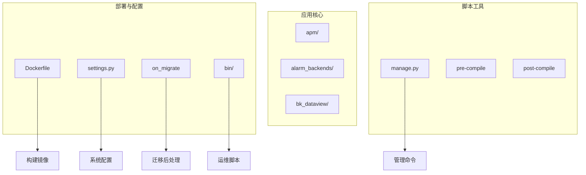
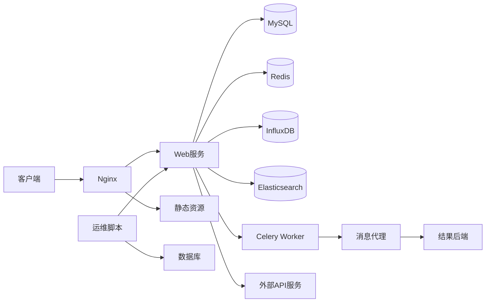
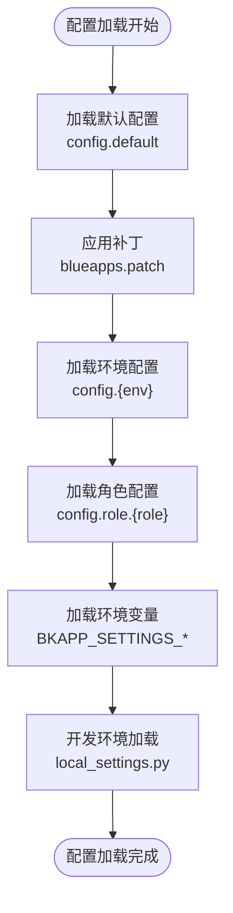
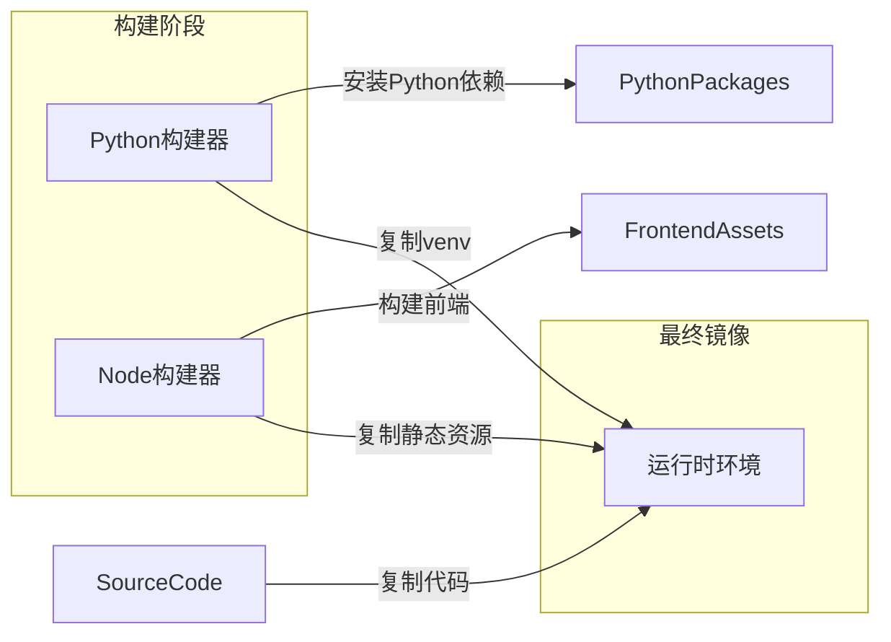
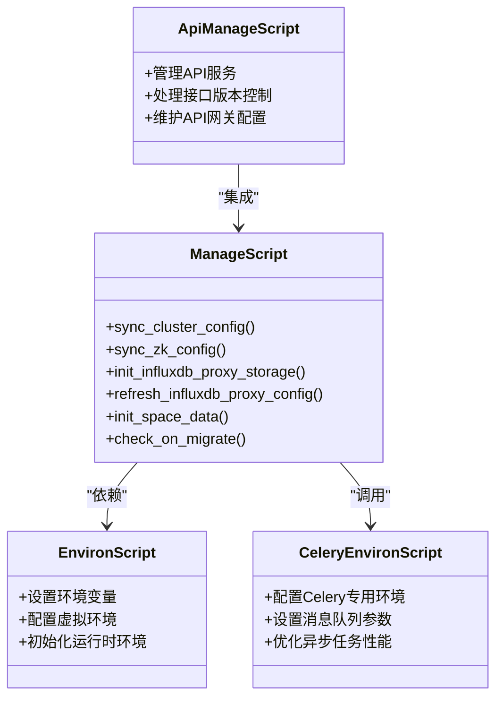
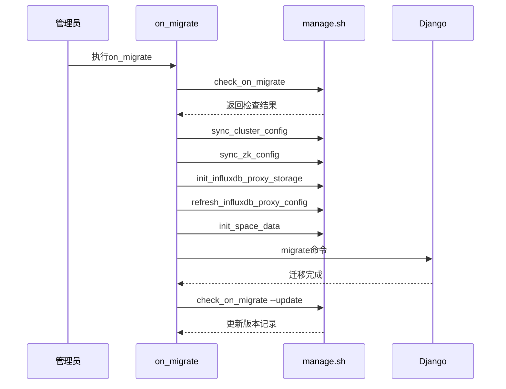
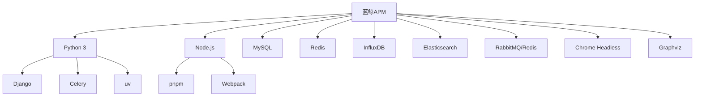

# 部署与配置

<cite>
**本文档中引用的文件**  
- [settings.py](file://bkmonitor/settings.py)
- [Dockerfile](file://bkmonitor/Dockerfile)
- [manage.py](file://bkmonitor/manage.py)
- [on_migrate](file://bkmonitor/on_migrate)
- [bin/manage.sh](file://bkmonitor/bin/manage.sh)
- [bin/environ.sh](file://bkmonitor/bin/environ.sh)
- [bin/celery_environ.sh](file://bkmonitor/bin/celery_environ.sh)
- [bin/api_manage.sh](file://bkmonitor/bin/api_manage.sh)
- [apm/migrations/](file://bkmonitor/apm/migrations/)
</cite>

## 目录
1. [简介](#简介)
2. [项目结构](#项目结构)
3. [核心组件](#核心组件)
4. [架构概述](#架构概述)
5. [详细组件分析](#详细组件分析)
6. [依赖分析](#依赖分析)
7. [性能考虑](#性能考虑)
8. [故障排除指南](#故障排除指南)
9. [结论](#结论)

## 简介
本文档旨在为蓝鲸监控平台（BlueKing - Monitor）提供全面的部署与配置指南。文档详细说明了生产环境下的容器化部署流程、关键配置参数设置、管理脚本用途、数据库迁移机制以及高可用性建议。通过本指南，运维人员可以成功部署和维护该监控系统。

## 项目结构
蓝鲸APM项目采用模块化设计，主要包含监控核心模块、API接口层、数据处理组件及部署脚本等部分。项目根目录下包含Dockerfile用于容器化构建，settings.py作为主配置文件，manage.py为Django管理入口，on_migrate脚本负责迁移后操作，bin目录存放各类运维脚本。

**Diagram sources**
- [Dockerfile](file://bkmonitor/Dockerfile#L1-L84)
- [settings.py](file://bkmonitor/settings.py#L1-L93)
- [manage.py](file://bkmonitor/manage.py#L1-L49)
- [on_migrate](file://bkmonitor/on_migrate#L1-L24)

**Section sources**
- [Dockerfile](file://bkmonitor/Dockerfile#L1-L84)
- [settings.py](file://bkmonitor/settings.py#L1-L93)

## 核心组件
系统核心由Django Web框架驱动，通过Celery实现异步任务处理，使用MySQL作为主要数据库存储，InfluxDB用于时序数据存储。配置系统采用环境变量与角色配置文件相结合的方式，支持多环境灵活部署。bin目录下的管理脚本提供了自动化运维能力。

**Section sources**
- [settings.py](file://bkmonitor/settings.py#L1-L93)
- [manage.py](file://bkmonitor/manage.py#L1-L49)
- [on_migrate](file://bkmonitor/on_migrate#L1-L24)

## 架构概述
系统采用微服务架构风格，前端通过Webpack构建，后端使用Django提供RESTful API，Celery Worker处理异步任务。容器化部署基于TencentOS基础镜像，使用tini作为init进程确保信号正确传递。多阶段Docker构建分离了构建环境与运行环境，优化了镜像大小。

**Diagram sources**
- [Dockerfile](file://bkmonitor/Dockerfile#L1-L84)
- [settings.py](file://bkmonitor/settings.py#L1-L93)

## 详细组件分析

### 配置系统分析
系统配置采用分层加载机制，优先级从低到高为：config.default → blueapps.patch → config.{env} → config.role.{role}。环境变量BKAPP_SETTINGS_前缀的变量可直接映射为Django设置项。

**Diagram sources**
- [settings.py](file://bkmonitor/settings.py#L26-L72)

**Section sources**
- [settings.py](file://bkmonitor/settings.py#L1-L93)

### 容器化部署分析
Dockerfile采用多阶段构建策略，包含Python构建阶段、前端构建阶段和最终镜像阶段。使用uv作为Python包管理器，pnpm管理前端依赖，确保构建效率和可重复性。

**Diagram sources**
- [Dockerfile](file://bkmonitor/Dockerfile#L1-L84)

**Section sources**
- [Dockerfile](file://bkmonitor/Dockerfile#L1-L84)

### 管理脚本分析
bin目录下的脚本提供了系统管理的核心功能，包括环境设置、服务管理和数据库迁移等。

#### 脚本功能说明

**Diagram sources**
- [bin/manage.sh](file://bkmonitor/bin/manage.sh)
- [bin/environ.sh](file://bkmonitor/bin/environ.sh)
- [bin/celery_environ.sh](file://bkmonitor/bin/celery_environ.sh)
- [bin/api_manage.sh](file://bkmonitor/bin/api_manage.sh)

**Section sources**
- [bin/manage.sh](file://bkmonitor/bin/manage.sh)
- [bin/environ.sh](file://bkmonitor/bin/environ.sh)

### 数据库迁移分析
系统使用Django ORM进行数据库迁移管理，apm应用包含从0001_initial到0051_auto的51个迁移文件，涵盖了应用配置、数据源、性能分析等多个方面。

**Diagram sources**
- [on_migrate](file://bkmonitor/on_migrate#L1-L24)
- [apm/migrations/](file://bkmonitor/apm/migrations/)
- [bin/manage.sh](file://bkmonitor/bin/manage.sh)

**Section sources**
- [on_migrate](file://bkmonitor/on_migrate#L1-L24)
- [apm/migrations/](file://bkmonitor/apm/migrations/)

## 依赖分析
系统依赖关系复杂，涉及多个内部应用和外部服务。通过Dockerfile可见，系统依赖Python 3、Node.js、MySQL、Redis、InfluxDB、Elasticsearch等多种技术栈。

**Diagram sources**
- [Dockerfile](file://bkmonitor/Dockerfile#L1-L84)
- [pyproject.toml](file://bkmonitor/pyproject.toml)

**Section sources**
- [Dockerfile](file://bkmonitor/Dockerfile#L1-L84)
- [pyproject.toml](file://bkmonitor/pyproject.toml)

## 性能考虑
系统在设计上考虑了性能优化，包括使用uv替代pip提高包安装速度，采用多阶段Docker构建减小镜像体积，通过gevent补丁支持高并发。Celery Worker可水平扩展以处理大量异步任务。

## 故障排除指南
常见问题包括数据库迁移失败、环境变量未正确加载、Celery Worker连接问题等。建议检查on_migrate脚本执行日志，验证环境变量配置，确保消息队列服务正常运行。

**Section sources**
- [on_migrate](file://bkmonitor/on_migrate#L1-L24)
- [settings.py](file://bkmonitor/settings.py#L1-L93)
- [manage.py](file://bkmonitor/manage.py#L1-L49)

## 结论
蓝鲸APM系统提供了完整的监控解决方案，通过规范的部署流程和丰富的配置选项，能够满足生产环境的高可用性要求。建议在生产部署时采用容器编排平台（如Kubernetes）管理多个Web实例和Celery Worker实例，实现负载均衡和故障转移。