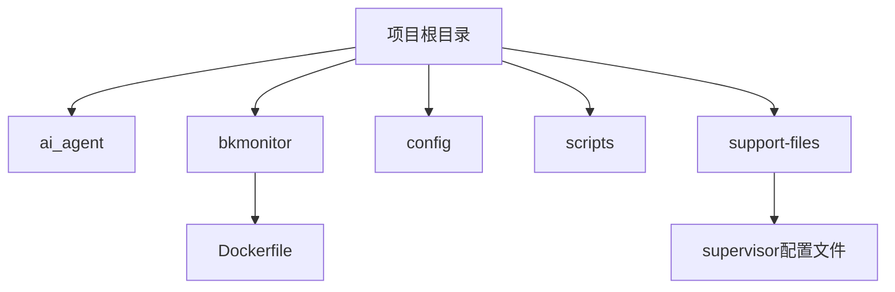
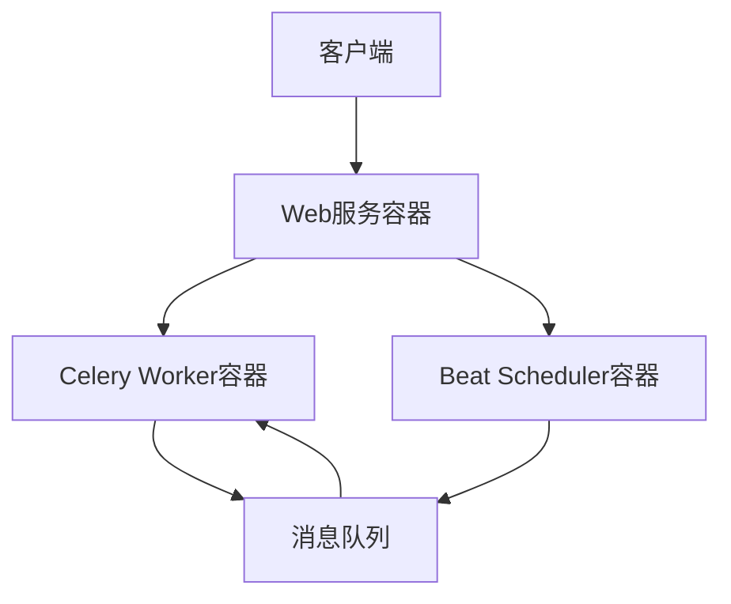
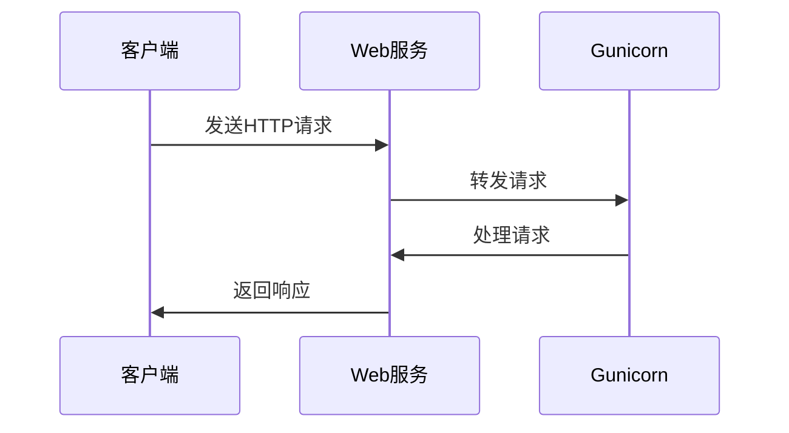
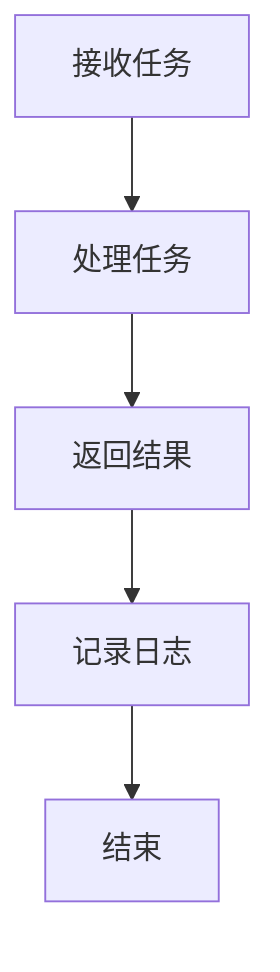
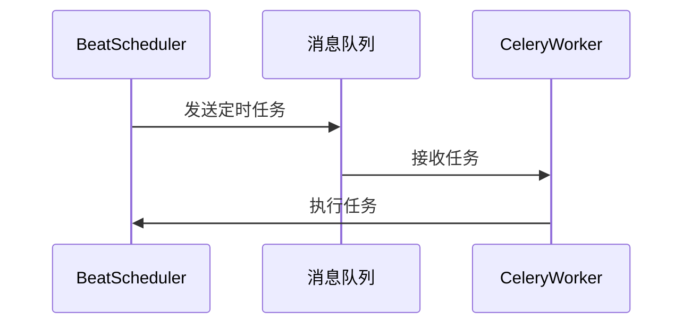
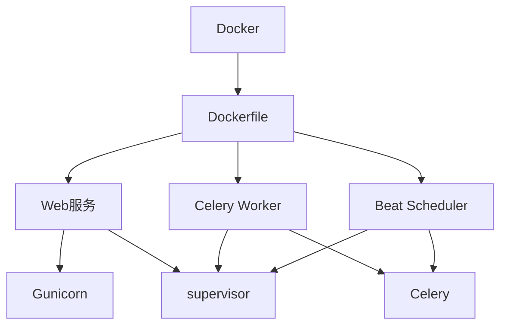

# 容器化部署

<cite>
**本文档中引用的文件**   
- [Dockerfile](file://bkmonitor/Dockerfile)
- [gunicorn_config.py](file://bkmonitor/gunicorn_config.py)
- [environ.sh](file://bkmonitor/bin/environ.sh)
- [celery_environ.sh](file://bkmonitor/bin/celery_environ.sh)
- [supervisor-bkmonitorv3-monitor.conf](file://bkmonitor/support-files/templates/#etc#supervisor-bkmonitorv3-monitor.conf)
</cite>

## 目录
1. [简介](#简介)
2. [项目结构](#项目结构)
3. [核心组件](#核心组件)
4. [架构概述](#架构概述)
5. [详细组件分析](#详细组件分析)
6. [依赖分析](#依赖分析)
7. [性能考虑](#性能考虑)
8. [故障排除指南](#故障排除指南)
9. [结论](#结论)

## 简介
本文档旨在为bk-monitor系统提供一份全面的容器化部署指南。文档详细解析了基于Docker的部署方案，包括Dockerfile的构建步骤、容器内服务的启动流程、多容器协作模式以及容器化环境下的配置管理策略。通过本指南，用户可以深入了解如何使用Docker和相关工具来部署和管理bk-monitor系统。

## 项目结构
bk-monitor项目的目录结构清晰，主要分为以下几个部分：
- `ai_agent`: AI代理相关代码
- `bkmonitor`: 核心监控系统代码
- `config`: 配置文件
- `scripts`: 脚本文件
- `support-files`: 支持文件，包括supervisor配置等

项目根目录下包含一个Dockerfile，用于构建Docker镜像。此外，`bkmonitor`子目录下也包含一个Dockerfile，可能是用于特定环境的构建。

**图示来源**
- [Dockerfile](file://bkmonitor/Dockerfile)
- [supervisor-bkmonitorv3-monitor.conf](file://bkmonitor/support-files/templates/#etc#supervisor-bkmonitorv3-monitor.conf)

**章节来源**
- [Dockerfile](file://bkmonitor/Dockerfile)
- [supervisor-bkmonitorv3-monitor.conf](file://bkmonitor/support-files/templates/#etc#supervisor-bkmonitorv3-monitor.conf)

## 核心组件
bk-monitor系统的核心组件包括Web服务、Celery Worker和Beat Scheduler。这些组件通过Docker容器化部署，实现了系统的高可用性和可扩展性。

**章节来源**
- [Dockerfile](file://bkmonitor/Dockerfile)
- [gunicorn_config.py](file://bkmonitor/gunicorn_config.py)

## 架构概述
bk-monitor系统的容器化架构采用了多容器协作模式，主要包括Web服务容器、Celery Worker容器和Beat Scheduler容器。这些容器通过Docker网络进行通信，实现了系统的解耦和独立扩展。

**图示来源**
- [Dockerfile](file://bkmonitor/Dockerfile)
- [gunicorn_config.py](file://bkmonitor/gunicorn_config.py)

## 详细组件分析
### Web服务分析
Web服务是bk-monitor系统的主要入口，负责处理HTTP请求和响应。在容器化部署中，Web服务使用Gunicorn作为WSGI服务器，通过gunicorn_config.py文件进行配置。

#### 启动流程

**图示来源**
- [gunicorn_config.py](file://bkmonitor/gunicorn_config.py)

**章节来源**
- [gunicorn_config.py](file://bkmonitor/gunicorn_config.py)

### Celery Worker分析
Celery Worker负责处理异步任务，是bk-monitor系统的重要组成部分。在容器化部署中，Celery Worker通过supervisor进行进程管理，确保其高可用性。

#### 任务处理流程

**图示来源**
- [supervisor-bkmonitorv3-monitor.conf](file://bkmonitor/support-files/templates/#etc#supervisor-bkmonitorv3-monitor.conf)

**章节来源**
- [supervisor-bkmonitorv3-monitor.conf](file://bkmonitor/support-files/templates/#etc#supervisor-bkmonitorv3-monitor.conf)

### Beat Scheduler分析
Beat Scheduler负责定时任务的调度，是bk-monitor系统的关键组件。在容器化部署中，Beat Scheduler通过Celery Beat实现，确保定时任务的准确执行。

#### 调度流程

**图示来源**
- [supervisor-bkmonitorv3-monitor.conf](file://bkmonitor/support-files/templates/#etc#supervisor-bkmonitorv3-monitor.conf)

**章节来源**
- [supervisor-bkmonitorv3-monitor.conf](file://bkmonitor/support-files/templates/#etc#supervisor-bkmonitorv3-monitor.conf)

## 依赖分析
bk-monitor系统的容器化部署依赖于多个外部组件，包括Docker、Gunicorn、Celery和supervisor。这些组件通过Dockerfile和配置文件进行集成，实现了系统的完整部署。

**图示来源**
- [Dockerfile](file://bkmonitor/Dockerfile)
- [gunicorn_config.py](file://bkmonitor/gunicorn_config.py)
- [supervisor-bkmonitorv3-monitor.conf](file://bkmonitor/support-files/templates/#etc#supervisor-bkmonitorv3-monitor.conf)

**章节来源**
- [Dockerfile](file://bkmonitor/Dockerfile)
- [gunicorn_config.py](file://bkmonitor/gunicorn_config.py)
- [supervisor-bkmonitorv3-monitor.conf](file://bkmonitor/support-files/templates/#etc#supervisor-bkmonitorv3-monitor.conf)

## 性能考虑
在容器化部署中，性能调优是一个重要方面。bk-monitor系统通过以下方式优化性能：
- 使用Gunicorn的多进程模式提高Web服务的并发处理能力
- 通过supervisor配置合理的资源限制和重启策略
- 使用Celery的并发模式提高任务处理效率

## 故障排除指南
在容器化部署过程中，可能会遇到各种问题。以下是一些常见的故障排除方法：
- 检查Docker日志，查看容器启动失败的原因
- 检查supervisor日志，查看进程管理问题
- 检查Gunicorn日志，查看Web服务问题
- 检查Celery日志，查看任务处理问题

**章节来源**
- [gunicorn_config.py](file://bkmonitor/gunicorn_config.py)
- [supervisor-bkmonitorv3-monitor.conf](file://bkmonitor/support-files/templates/#etc#supervisor-bkmonitorv3-monitor.conf)

## 结论
通过本文档的指导，用户可以成功部署和管理bk-monitor系统的容器化环境。文档详细解析了Dockerfile的构建步骤、容器内服务的启动流程、多容器协作模式以及容器化环境下的配置管理策略，为用户提供了全面的部署指南。