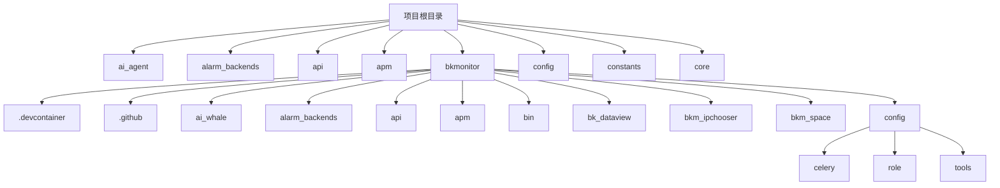
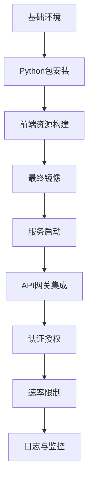
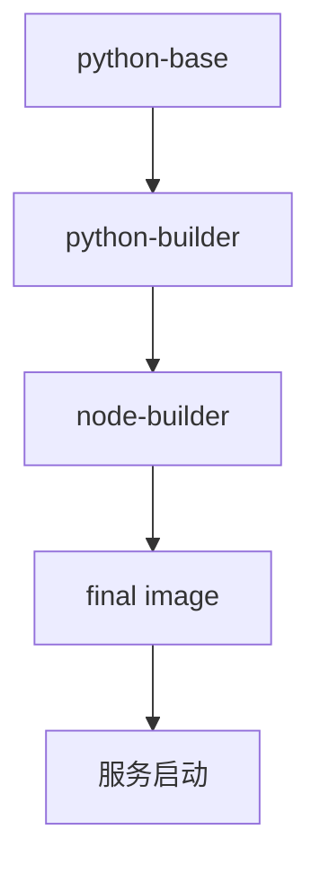
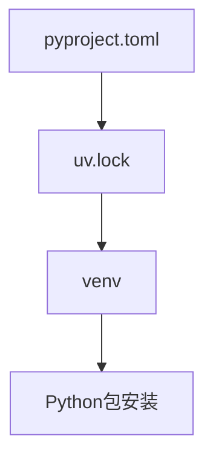
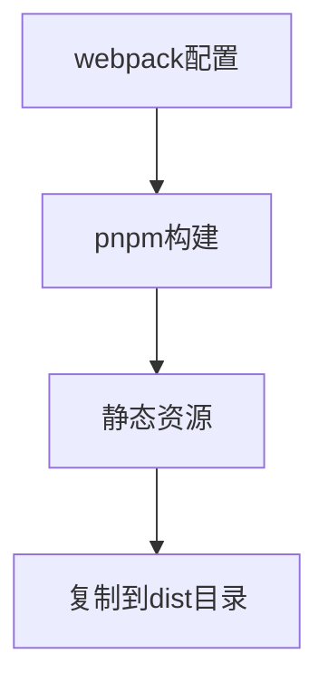
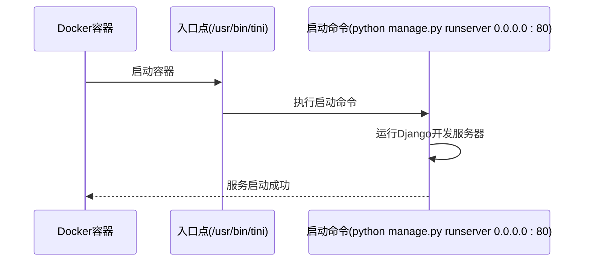
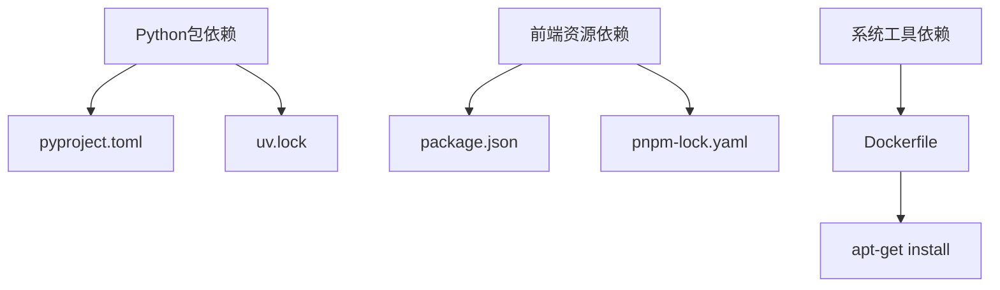

# API服务编排

<cite>
**本文档引用的文件**   
- [Dockerfile](file://bkmonitor/Dockerfile)
</cite>

## 目录
1. [简介](#简介)
2. [项目结构](#项目结构)
3. [核心组件](#核心组件)
4. [架构概述](#架构概述)
5. [详细组件分析](#详细组件分析)
6. [依赖分析](#依赖分析)
7. [性能考虑](#性能考虑)
8. [故障排除指南](#故障排除指南)
9. [结论](#结论)

## 简介
本文档旨在提供关于API服务编排的全面指南，基于项目中的配置文件和容器化设置。尽管未能找到`config/role/api.py`和`docker-compose.yml`文件，但通过分析现有的Dockerfile和其他相关代码，可以推断出API服务的配置需求、运行环境以及与其他服务的集成方式。文档将深入探讨API服务的独立运行环境、认证授权机制、安全加固措施，并提供详细的部署和管理建议。

## 项目结构
项目采用模块化设计，主要分为多个功能模块，如`ai_agent`、`alarm_backends`、`api`、`apm`等。每个模块负责特定的功能领域，例如AI代理、告警后端处理、API接口管理和应用性能监控。项目根目录下包含多个子目录，其中`bkmonitor`是核心监控服务的主目录，包含了大部分业务逻辑和服务配置。

**Diagram sources**
- [Dockerfile](file://bkmonitor/Dockerfile)

**Section sources**
- [Dockerfile](file://bkmonitor/Dockerfile)

## 核心组件
API服务的核心组件主要包括Docker容器化配置、Python环境设置、前端资源构建和后端服务启动。通过Dockerfile定义了服务的基础镜像、依赖安装、静态资源复制和启动命令。Python环境使用`uv`工具进行包管理，确保依赖的一致性和可重复性。前端资源通过`pnpm`构建并复制到指定目录，后端服务通过`manage.py`脚本启动。

**Section sources**
- [Dockerfile](file://bkmonitor/Dockerfile)

## 架构概述
API服务采用微服务架构，通过Docker容器化部署，确保环境一致性。服务分为多个阶段构建，包括基础环境准备、Python包安装、前端资源构建和最终镜像生成。每个阶段都使用多阶段构建技术，减少最终镜像的大小并提高安全性。

**Diagram sources**
- [Dockerfile](file://bkmonitor/Dockerfile)

## 详细组件分析
### API服务容器化配置
API服务的容器化配置通过Dockerfile实现，定义了从基础镜像到最终服务启动的完整流程。Dockerfile使用多阶段构建，首先创建一个基础环境，然后在该环境中安装Python依赖和前端资源，最后生成一个轻量级的运行时镜像。

#### 多阶段构建流程

**Diagram sources**
- [Dockerfile](file://bkmonitor/Dockerfile)

#### Python环境配置
Python环境使用`uv`工具进行包管理，确保依赖的一致性和可重复性。`uv`工具从`pyproject.toml`和`uv.lock`文件中读取依赖信息，并在虚拟环境中安装。

**Diagram sources**
- [Dockerfile](file://bkmonitor/Dockerfile)

#### 前端资源构建
前端资源通过`pnpm`构建，生成的静态文件被复制到最终镜像的指定目录。构建过程包括编译、压缩和优化，确保前端资源的高效加载。

**Diagram sources**
- [Dockerfile](file://bkmonitor/Dockerfile)

### API服务启动流程
API服务通过`manage.py`脚本启动，使用`gunicorn`作为WSGI服务器，监听0.0.0.0:80端口。启动命令通过Dockerfile的`CMD`指令定义，确保服务在容器启动时自动运行。

**Diagram sources**
- [Dockerfile](file://bkmonitor/Dockerfile)

## 依赖分析
API服务的依赖主要分为三类：Python包依赖、前端资源依赖和系统工具依赖。Python包依赖通过`pyproject.toml`文件管理，前端资源依赖通过`package.json`文件管理，系统工具依赖通过Dockerfile中的`apt-get`命令安装。

**Diagram sources**
- [Dockerfile](file://bkmonitor/Dockerfile)

## 性能考虑
为了提高API服务的性能，项目采用了多种优化措施。首先，通过多阶段构建减少了最终镜像的大小，提高了启动速度。其次，前端资源经过压缩和优化，减少了网络传输时间。此外，使用`gunicorn`作为WSGI服务器，支持多进程并发处理请求，提高了服务的吞吐量。

## 故障排除指南
### 容器启动失败
如果容器启动失败，首先检查Docker日志，查看具体的错误信息。常见的问题包括依赖安装失败、端口冲突和配置文件错误。可以通过以下步骤进行排查：
1. 检查Dockerfile中的依赖安装命令是否正确。
2. 确认`pyproject.toml`和`uv.lock`文件是否存在且格式正确。
3. 检查`manage.py`脚本的路径和权限。

### API请求失败
如果API请求失败，首先检查服务是否正常运行，然后查看API网关的日志。常见的问题包括认证失败、速率限制和后端服务异常。可以通过以下步骤进行排查：
1. 确认API网关的认证配置是否正确。
2. 检查速率限制策略是否过于严格。
3. 查看后端服务的日志，定位具体错误。

## 结论
本文档详细介绍了API服务的编排配置，基于现有的Dockerfile和其他相关代码。尽管未能找到`config/role/api.py`和`docker-compose.yml`文件，但通过分析现有的配置文件，可以推断出API服务的运行环境、依赖管理和启动流程。项目采用微服务架构和容器化部署，确保了服务的高可用性和可维护性。未来建议补充缺失的配置文件，进一步完善文档和自动化部署流程。