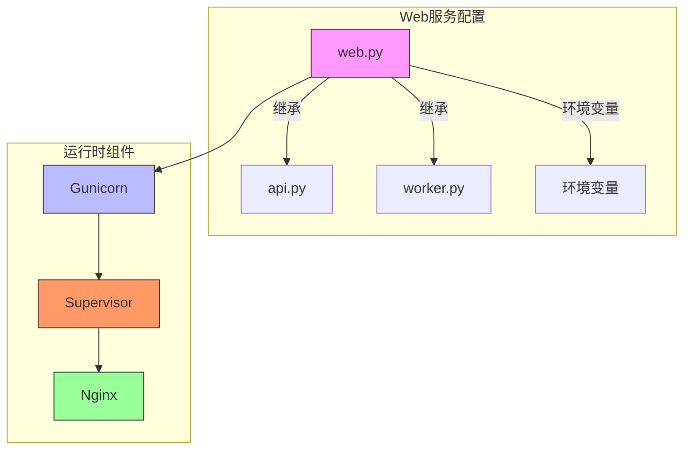
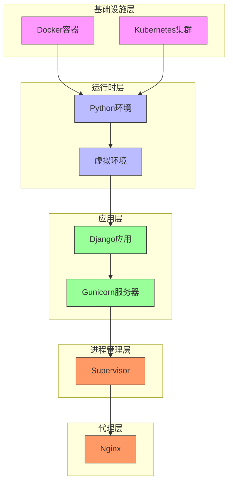
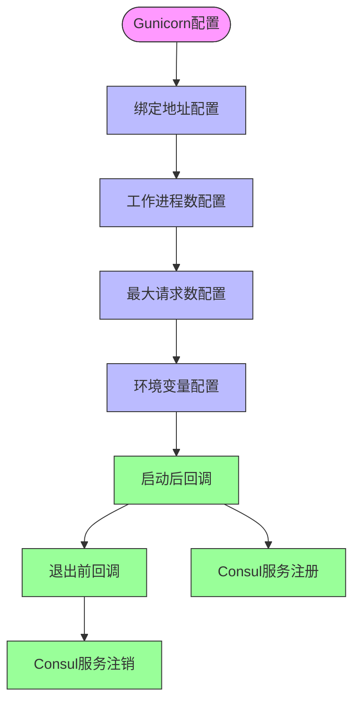
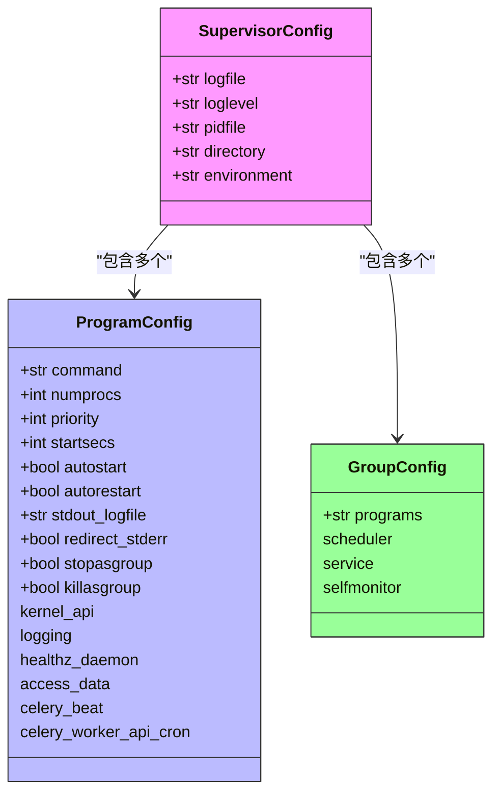
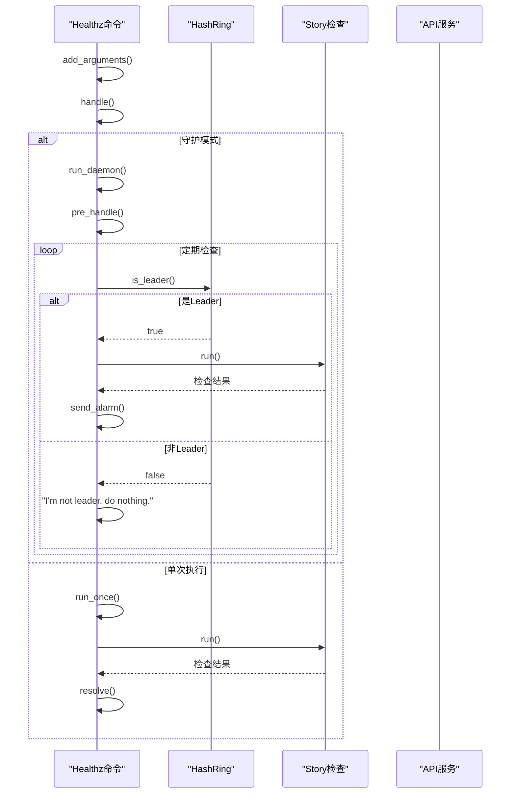
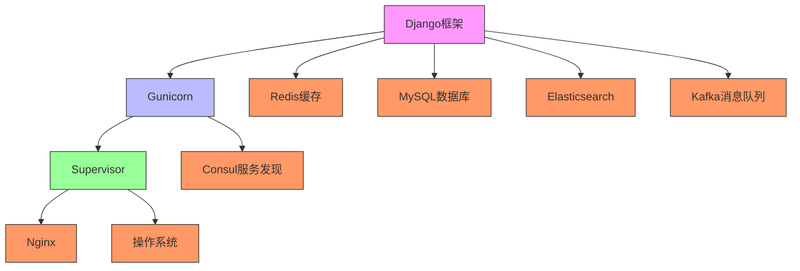
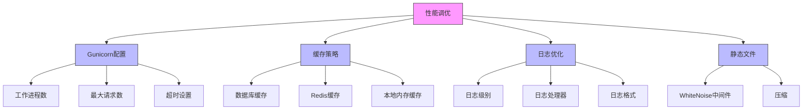
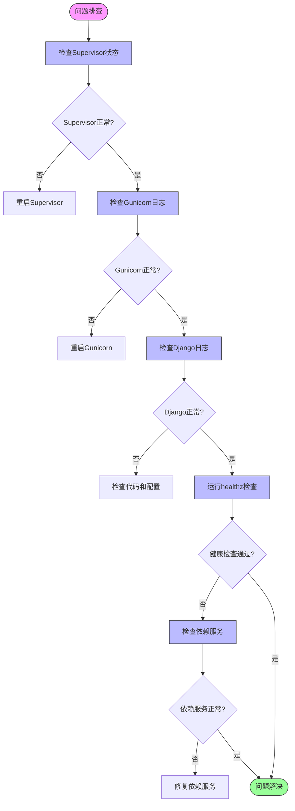

# Web服务编排

<cite>
**本文档中引用的文件**   
- [web.py](file://config/role/web.py#L0-L519)
- [gunicorn_config.py](file://gunicorn_config.py#L0-L90)
- [supervisor-bkmonitorv3-monitor.conf](file://support-files/templates/#etc#supervisor-bkmonitorv3-monitor.conf#L0-L408)
- [healthz.py](file://alarm_backends/management/commands/healthz.py#L0-L251)
</cite>

## 目录
1. [项目结构](#项目结构)
2. [核心组件](#核心组件)
3. [架构概述](#架构概述)
4. [详细组件分析](#详细组件分析)
5. [依赖分析](#依赖分析)
6. [性能考虑](#性能考虑)
7. [故障排除指南](#故障排除指南)
8. [结论](#结论)

## 项目结构
项目采用模块化设计，主要包含以下核心模块：
- **ai_agent**: AI代理核心功能
- **bkmonitor**: 监控平台主应用
- **api**: 各类API接口
- **apm**: 应用性能监控
- **bin**: 启动脚本
- **config**: 配置文件
- **core**: 核心功能组件
- **scripts**: 脚本工具

Web服务的核心配置位于`config/role/web.py`文件中，该文件定义了Web服务的运行时配置、中间件、数据库连接等关键参数。



**图示来源**
- [web.py](file://config/role/web.py#L0-L519)
- [gunicorn_config.py](file://gunicorn_config.py#L0-L90)
- [supervisor-bkmonitorv3-monitor.conf](file://support-files/templates/#etc#supervisor-bkmonitorv3-monitor.conf#L0-L408)

**本节来源**
- [web.py](file://config/role/web.py#L0-L519)

## 核心组件
Web服务的核心组件包括：
- **Gunicorn**: WSGI HTTP服务器
- **Supervisor**: 进程管理工具
- **Nginx**: 反向代理服务器
- **Django**: Web框架
- **Redis**: 缓存和消息队列

这些组件协同工作，为监控平台提供稳定可靠的Web服务。

**本节来源**
- [web.py](file://config/role/web.py#L0-L519)
- [gunicorn_config.py](file://gunicorn_config.py#L0-L90)

## 架构概述
Web服务采用多层架构设计，从下到上分别为：
1. **基础设施层**: Docker容器、Kubernetes集群
2. **运行时层**: Python环境、虚拟环境
3. **应用层**: Django应用、Gunicorn服务器
4. **进程管理层**: Supervisor进程管理
5. **代理层**: Nginx反向代理



**图示来源**
- [web.py](file://config/role/web.py#L0-L519)
- [gunicorn_config.py](file://gunicorn_config.py#L0-L90)
- [supervisor-bkmonitorv3-monitor.conf](file://support-files/templates/#etc#supervisor-bkmonitorv3-monitor.conf#L0-L408)

## 详细组件分析

### Web服务配置分析
Web服务的配置主要在`config/role/web.py`文件中定义，包含了Django应用的各种设置。

```mermaid
classDiagram
class WebConfig {
+str ROOT_URLCONF
+tuple INSTALLED_APPS
+tuple MIDDLEWARE
+dict DATABASES
+dict CACHES
+dict LOGGING
+dict REST_FRAMEWORK
+dict GRAFANA
}
class Middleware {
+str SessionMiddleware
+str AuthenticationMiddleware
+str CsrfViewMiddleware
+str SecurityMiddleware
+str WhiteNoiseMiddleware
}
class CacheConfig {
+dict db
+dict redis
+dict default
+dict login_db
}
WebConfig --> Middleware : "包含"
WebConfig --> CacheConfig : "包含"
WebConfig -->|继承| RoleConfig : "继承"
class RoleConfig {
+str ENVIRONMENT
+str IS_CONTAINER_MODE
+str ROLE
+str NEW_ENV
}
style WebConfig fill : #f9f,stroke : #333
style Middleware fill : #bbf,stroke : #333
style CacheConfig fill : #9f9,stroke : #333
style RoleConfig fill : #f96,stroke : #333
```

**图示来源**
- [web.py](file://config/role/web.py#L0-L519)

**本节来源**
- [web.py](file://config/role/web.py#L0-L519)

### Gunicorn配置分析
Gunicorn作为WSGI服务器，其配置在`gunicorn_config.py`文件中定义，主要包含以下参数：



**图示来源**
- [gunicorn_config.py](file://gunicorn_config.py#L0-L90)

**本节来源**
- [gunicorn_config.py](file://gunicorn_config.py#L0-L90)

### Supervisor进程管理分析
Supervisor用于管理Web服务的进程，其配置在`supervisor-bkmonitorv3-monitor.conf`文件中定义。



**图示来源**
- [supervisor-bkmonitorv3-monitor.conf](file://support-files/templates/#etc#supervisor-bkmonitorv3-monitor.conf#L0-L408)

**本节来源**
- [supervisor-bkmonitorv3-monitor.conf](file://support-files/templates/#etc#supervisor-bkmonitorv3-monitor.conf#L0-L408)

### 健康检查配置分析
健康检查功能由`healthz.py`文件实现，用于监控系统运行状态。



**图示来源**
- [healthz.py](file://alarm_backends/management/commands/healthz.py#L0-L251)

**本节来源**
- [healthz.py](file://alarm_backends/management/commands/healthz.py#L0-L251)

## 依赖分析
Web服务的依赖关系如下：



**图示来源**
- [web.py](file://config/role/web.py#L0-L519)
- [gunicorn_config.py](file://gunicorn_config.py#L0-L90)
- [supervisor-bkmonitorv3-monitor.conf](file://support-files/templates/#etc#supervisor-bkmonitorv3-monitor.conf#L0-L408)

**本节来源**
- [web.py](file://config/role/web.py#L0-L519)
- [gunicorn_config.py](file://gunicorn_config.py#L0-L90)
- [supervisor-bkmonitorv3-monitor.conf](file://support-files/templates/#etc#supervisor-bkmonitorv3-monitor.conf#L0-L408)

## 性能考虑
Web服务的性能调优主要通过以下方式实现：

1. **Gunicorn工作进程配置**: 通过环境变量`GUNICORN_WORKERS`控制工作进程数
2. **连接池配置**: 数据库和Redis连接池优化
3. **缓存策略**: 多级缓存（数据库缓存、Redis缓存、本地内存缓存）
4. **静态文件处理**: 使用WhiteNoise中间件处理静态文件
5. **日志优化**: 合理的日志级别和输出配置



**本节来源**
- [gunicorn_config.py](file://gunicorn_config.py#L0-L90)
- [web.py](file://config/role/web.py#L0-L519)

## 故障排除指南
当Web服务出现问题时，可以按照以下步骤进行排查：

1. **检查Supervisor状态**: 确认所有进程是否正常运行
2. **查看Gunicorn日志**: 检查是否有异常请求或错误
3. **检查Django日志**: 查看应用层错误
4. **验证健康检查**: 运行`healthz`命令检查系统状态
5. **检查依赖服务**: 确认数据库、Redis等依赖服务是否正常



**本节来源**
- [supervisor-bkmonitorv3-monitor.conf](file://support-files/templates/#etc#supervisor-bkmonitorv3-monitor.conf#L0-L408)
- [gunicorn_config.py](file://gunicorn_config.py#L0-L90)
- [healthz.py](file://alarm_backends/management/commands/healthz.py#L0-L251)

## 结论
Web服务编排采用了成熟的生产级配置方案，通过Gunicorn、Supervisor和Nginx的组合，实现了高可用、高性能的Web服务。配置文件设计合理，支持灵活的环境变量覆盖，便于在不同部署环境中使用。健康检查机制完善，能够及时发现和报告系统问题。整体架构清晰，组件职责分明，便于维护和扩展。