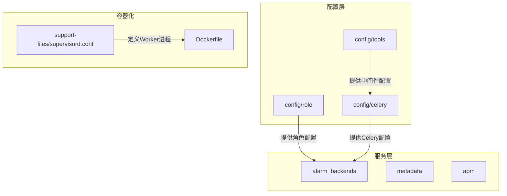
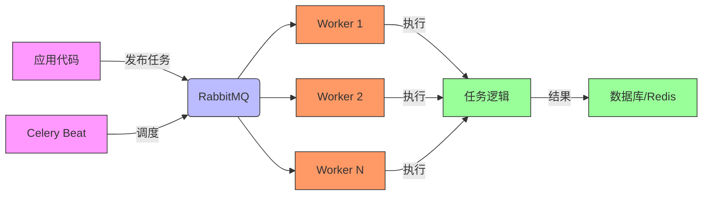
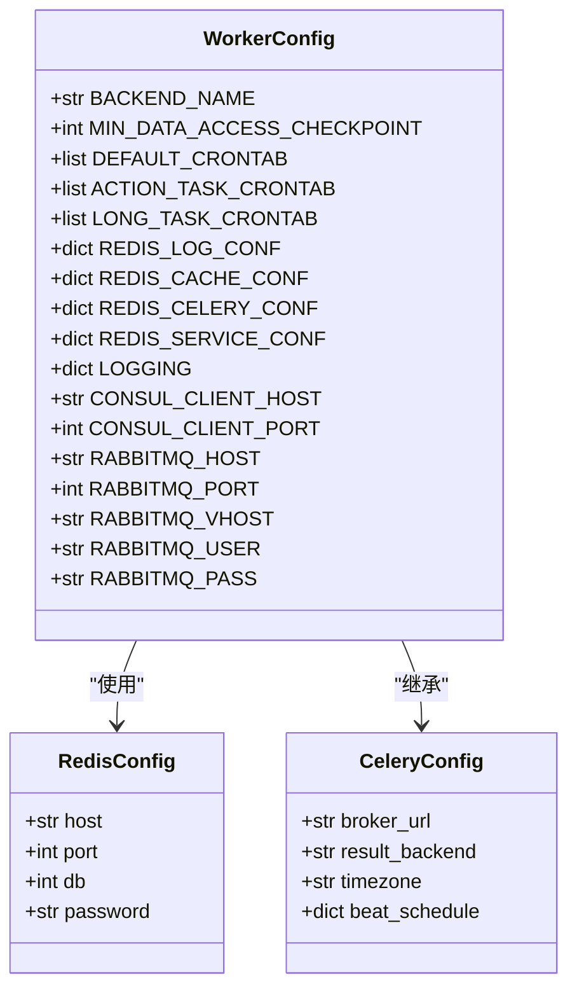
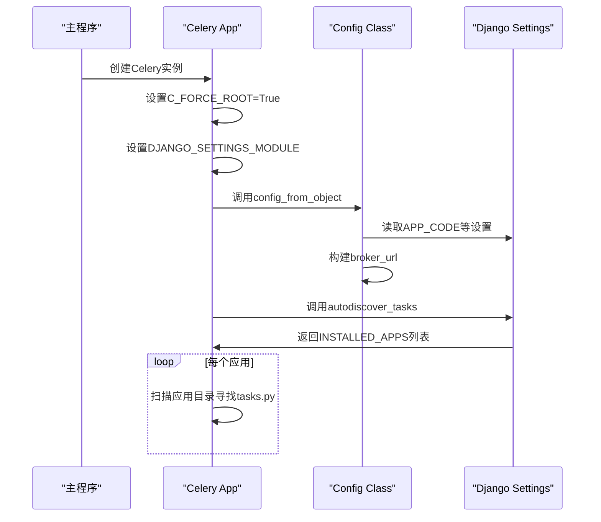
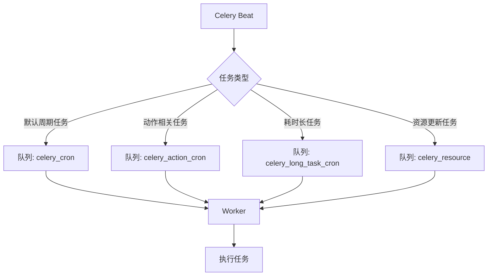
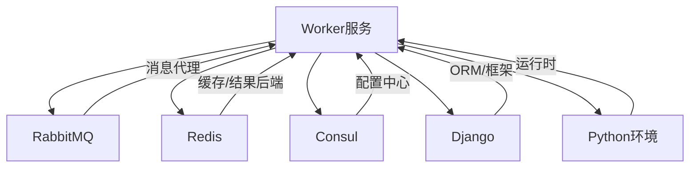

# Worker服务编排

<cite>
**本文档引用的文件**   
- [worker.py](file://bkmonitor/config/role/worker.py)
- [celery.py](file://bkmonitor/config/celery/celery.py)
- [config.py](file://bkmonitor/config/celery/config.py)
- [supervisord.conf](file://bkmonitor/support-files/supervisord.conf)
- [app.py](file://bkmonitor/alarm_backends/service/scheduler/app.py)
- [cron.py](file://bkmonitor/alarm_backends/service/scheduler/tasks/cron.py)
</cite>

## 目录
1. [引言](#引言)
2. [项目结构](#项目结构)
3. [核心组件](#核心组件)
4. [架构概述](#架构概述)
5. [详细组件分析](#详细组件分析)
6. [依赖分析](#依赖分析)
7. [性能考量](#性能考量)
8. [故障排除指南](#故障排除指南)
9. [结论](#结论)

## 引言
本指南旨在深入解析基于蓝鲸监控平台的Worker服务编排机制。通过分析`config/role/worker.py`和`docker-compose.yml`（或等效容器配置）文件，我们将全面探讨Celery Worker容器的配置与运行机制。文档将详细说明Worker服务的启动参数、任务队列配置、并发模式（prefork vs eventlet）及其资源消耗特性。此外，还将解释Worker服务如何从Redis或RabbitMQ消息队列中消费任务，以及任务处理过程中的错误处理和重试机制。最后，涵盖监控指标收集、日志输出格式及性能优化建议，特别是在处理CPU密集型和I/O密集型任务时的配置差异。

## 项目结构
蓝鲸监控平台的项目结构遵循模块化设计，将不同功能划分为独立的目录。核心的Worker服务配置位于`bkmonitor/config/role/`目录下，而Celery相关的配置则分散在`config/celery/`目录中。容器化部署的配置信息主要通过环境变量和`supervisord.conf`模板文件进行管理，而非传统的`docker-compose.yml`。

**图源**
- [worker.py](file://bkmonitor/config/role/worker.py)
- [supervisord.conf](file://bkmonitor/support-files/supervisord.conf)

**节源**
- [worker.py](file://bkmonitor/config/role/worker.py)
- [supervisord.conf](file://bkmonitor/support-files/supervisord.conf)

## 核心组件
Worker服务的核心组件包括Celery应用实例、任务队列、消息代理（RabbitMQ/Redis）以及任务调度器（Celery Beat）。`config/role/worker.py`文件定义了Worker角色的全局配置，如日志级别、缓存设置和数据库连接。`config/celery/celery.py`文件负责初始化Celery应用，加载配置并自动发现任务。`config/celery/config.py`则包含了具体的Celery配置项，如序列化方式、时区和调度计划。

**节源**
- [worker.py](file://bkmonitor/config/role/worker.py#L1-L551)
- [celery.py](file://bkmonitor/config/celery/celery.py#L1-L54)
- [config.py](file://bkmonitor/config/celery/config.py#L1-L122)

## 架构概述
整个Worker服务的架构基于Celery分布式任务队列框架。应用启动时，`celery.py`初始化一个Celery实例，并从`config.py`加载配置。`supervisord.conf`文件定义了如何启动多个Worker进程，每个进程通过`manage.py celery worker`命令连接到消息代理（RabbitMQ）并监听指定的任务队列。任务由各个Django应用（如`alarm_backends`, `metadata`）产生，通过`app.autodiscover_tasks`机制被Worker发现并执行。

**图源**
- [celery.py](file://bkmonitor/config/celery/celery.py)
- [supervisord.conf](file://bkmonitor/support-files/supervisord.conf)
- [config.py](file://bkmonitor/config/celery/config.py)

## 详细组件分析

### Worker配置分析
`config/role/worker.py`是Worker角色的配置入口。它首先导入环境相关的工具函数，然后根据环境变量动态加载对应的配置模块（如`dev.py`, `prod.py`）。该文件定义了多个关键配置：
- **日志配置**：根据`IS_CONTAINER_MODE`和`ENVIRONMENT`决定日志输出到文件还是控制台。
- **缓存配置**：通过`get_redis_settings`和`get_cache_redis_settings`函数从Consul获取Redis连接信息，并为日志、缓存、队列和业务数据分配不同的Redis数据库（DB 7-10）。
- **任务队列定义**：通过`DEFAULT_CRONTAB`, `ACTION_TASK_CRONTAB`, `LONG_TASK_CRONTAB`等列表定义了不同优先级和类型的周期性任务，这些任务将由Celery Beat调度并放入相应的队列。

**图源**
- [worker.py](file://bkmonitor/config/role/worker.py#L1-L551)

**节源**
- [worker.py](file://bkmonitor/config/role/worker.py#L1-L551)

### Celery应用初始化分析
`config/celery/celery.py`文件是Celery应用的入口点。它创建了一个名为`proj`的Celery实例，并强制允许以root权限运行（`platforms.C_FORCE_ROOT = True`）。通过`os.environ.setdefault("DJANGO_SETTINGS_MODULE", "settings")`确保Celery使用正确的Django设置。`app.config_from_object("config.celery.config:Config")`指令让Celery从`config.py`中的`Config`类加载所有配置。`app.autodiscover_tasks`方法会扫描所有已安装的Django应用，自动发现并注册任务。

**图源**
- [celery.py](file://bkmonitor/config/celery/celery.py#L1-L54)
- [config.py](file://bkmonitor/config/celery/config.py#L1-L122)

**节源**
- [celery.py](file://bkmonitor/config/celery/celery.py#L1-L54)

### 任务队列与调度分析
任务队列的配置主要在`config.py`和`scheduler/app.py`中定义。`config.py`中的`Config`类设置了`task_default_queue`为`monitor`，这意味着所有未指定队列的任务将进入此队列。同时，`beat_schedule`定义了由Celery Beat直接调度的少数任务。更复杂的周期性任务配置在`alarm_backends/service/scheduler/tasks/cron.py`中，它通过读取`worker.py`中的`DEFAULT_CRONTAB`等列表，动态生成大量的周期性任务，并根据任务类型分配到`celery_cron`, `celery_action_cron`, `celery_long_task_cron`等不同队列。

**图源**
- [config.py](file://bkmonitor/config/celery/config.py#L1-L122)
- [cron.py](file://bkmonitor/alarm_backends/service/scheduler/tasks/cron.py#L1-L105)

**节源**
- [config.py](file://bkmonitor/config/celery/config.py#L1-L122)
- [cron.py](file://bkmonitor/alarm_backends/service/scheduler/tasks/cron.py#L1-L105)

### Worker启动与并发分析
Worker进程的启动由`supervisord.conf`文件控制。该文件定义了两个主要的Worker程序：
1.  **主Worker**：`command = /cache/.bk/env/bin/python {{.app_container_path}}code/manage.py celery worker -n {{.app_code}}{{.node_name}} -l INFO --autoscale=6,1`。它使用`--autoscale=6,1`参数，表示Worker会根据负载自动调整进程数，最少1个，最多6个。
2.  **资源Worker**：`command = ... -Q celery_resource --autoscale=4,1`。它专门监听`celery_resource`队列，最大并发为4。

并发数的计算在`scheduler/app.py`的`default_celery_worker_num()`函数中实现，它基于CPU核心数的0.6次方乘以1.85来估算，这是一种经验性的优化，旨在平衡CPU利用率和上下文切换开销。

**节源**
- [supervisord.conf](file://bkmonitor/support-files/supervisord.conf#L1-L47)
- [app.py](file://bkmonitor/alarm_backends/service/scheduler/app.py#L30-L97)

## 依赖分析
Worker服务依赖于多个外部组件和内部模块。其核心依赖关系如下：

**图源**
- [worker.py](file://bkmonitor/config/role/worker.py)
- [celery.py](file://bkmonitor/config/celery/celery.py)

**节源**
- [worker.py](file://bkmonitor/config/role/worker.py)
- [celery.py](file://bkmonitor/config/celery/celery.py)

## 性能考量
- **并发模式**：本项目使用默认的prefork（多进程）模式，通过`--autoscale`实现动态伸缩。对于I/O密集型任务，可考虑使用`eventlet`或`gevent`模式以提高并发能力，但需注意其与某些库的兼容性问题。
- **资源消耗**：每个Worker进程会消耗一定的内存。`worker_max_tasks_per_child = 1000`的设置可以防止内存泄漏导致的进程膨胀。`--autoscale`参数能有效应对负载波动，避免资源浪费。
- **序列化**：使用`pickle`序列化，性能较高但仅限于Python环境。若需跨语言，可考虑`json`。
- **错误处理**：任务失败后，Celery会根据配置进行重试。`task_acks_late = True`确保任务在执行完成后才被确认，防止Worker崩溃导致任务丢失。

## 故障排除指南
- **Worker无法启动**：检查`supervisord.conf`中的命令路径和环境变量是否正确。查看`celery.log`日志文件。
- **任务积压**：检查RabbitMQ管理界面，确认队列长度。使用`get_celery_worker_num`脚本检查当前Worker数量，必要时手动增加`-c`参数指定的并发数。
- **任务执行失败**：检查任务代码逻辑和日志。确认数据库连接、网络等依赖服务正常。
- **配置未生效**：确认`NEW_ENV`环境变量是否指向正确的配置文件（如`prod.py`），并检查Consul中相关配置项。

**节源**
- [supervisord.conf](file://bkmonitor/support-files/supervisord.conf)
- [rabbitmq_story.py](file://bkmonitor/alarm_backends/management/story/rabbitmq_story.py)

## 结论
通过对`config/role/worker.py`和相关文件的深入分析，我们全面了解了蓝鲸监控平台中Worker服务的编排机制。该服务采用Celery作为任务队列框架，通过`supervisord`进行进程管理，实现了高可用和可伸缩的任务处理能力。合理的队列划分和动态并发配置确保了系统在不同负载下的稳定性和效率。未来可进一步探索`eventlet`模式以优化I/O密集型任务的性能，并完善监控告警体系以实现更主动的运维。