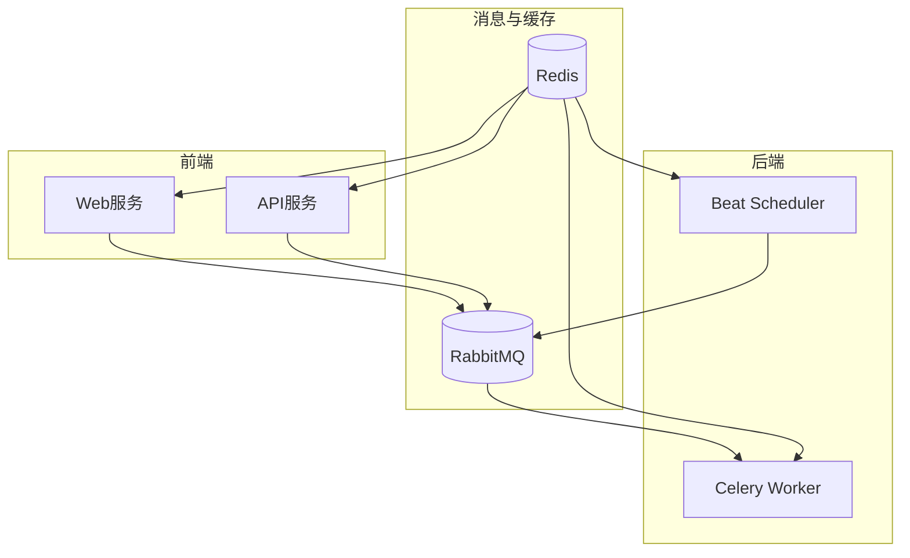
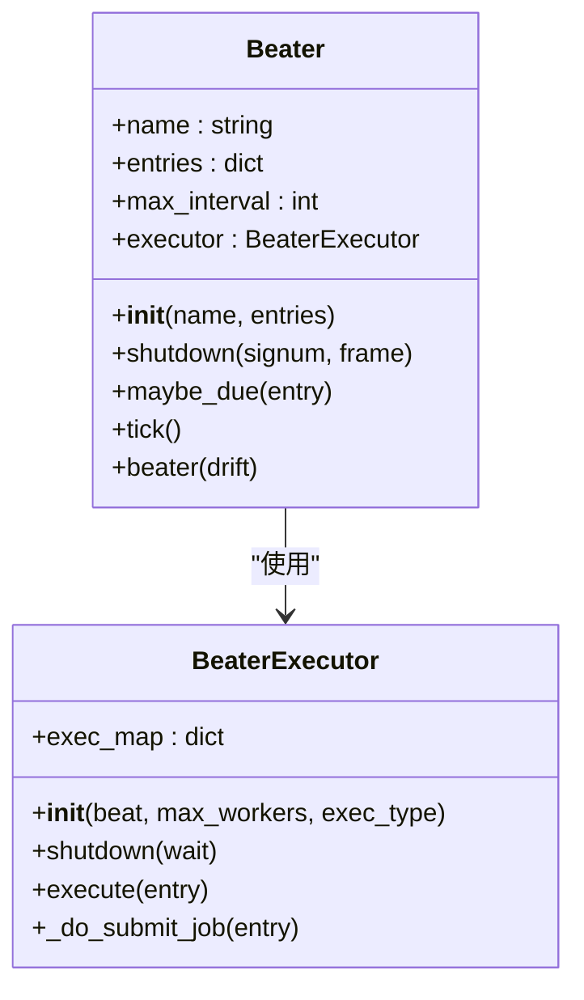

# 容器服务编排

<cite>
**本文档引用的文件**   
- [celery.py](file://bkmonitor/config/celery/celery.py)
- [config.py](file://bkmonitor/config/celery/config.py)
- [web.py](file://bkmonitor/config/role/web.py)
- [worker.py](file://bkmonitor/config/role/worker.py)
- [api.py](file://bkmonitor/config/role/api.py)
- [beater.py](file://bkmonitor/bkmonitor/utils/beater.py)
- [schedulers.py](file://bkmonitor/patches/redbeat/schedulers.py)
- [monitor.py](file://bkmonitor/alarm_backends/service/scheduler/app.py)
</cite>

## 目录
1. [简介](#简介)
2. [项目结构](#项目结构)
3. [核心组件](#核心组件)
4. [架构概述](#架构概述)
5. [详细组件分析](#详细组件分析)
6. [依赖分析](#依赖分析)
7. [性能考虑](#性能考虑)
8. [故障排除指南](#故障排除指南)
9. [结论](#结论)

## 简介
本指南详细阐述了bk-monitor系统在容器化环境中的多服务协作机制。基于对Celery配置文件和角色配置文件的分析，本文档深入解析了Web服务、Celery Worker和Beat Scheduler等核心组件的定义、配置及其相互依赖关系。文档涵盖了服务间的网络通信模式、资源共享机制，以及不同角色容器的配置差异和启动参数。此外，还提供了服务编排的最佳实践，包括资源限制、健康检查、重启策略和日志驱动设置，并探讨了多主机部署场景下的挑战与解决方案。

## 项目结构
bk-monitor项目采用模块化设计，核心功能分散在多个子目录中。`bkmonitor`目录包含主要的应用代码，其中`config`子目录下的`celery`和`role`文件夹分别存放了Celery任务队列和不同服务角色的配置。`alarm_backends`、`apm`、`api`等目录则实现了监控系统的各项具体功能。`packages`目录包含了可复用的组件包。整个项目通过Django框架构建，利用Celery进行异步任务处理，并通过角色配置文件（web.py, worker.py, api.py）实现不同服务实例的差异化部署。

## 核心组件
系统的核心组件由Web服务、Celery Worker和Beat Scheduler构成。Web服务（`web`角色）负责处理用户请求和提供API接口，其配置位于`config/role/web.py`。Celery Worker（`worker`角色）负责执行后台异步任务，配置位于`config/role/worker.py`。Beat Scheduler是Celery的周期性任务调度器，负责将预定义的定时任务发送到消息队列，其配置在`config/celery/config.py`中通过`beat_schedule`字典定义。API服务（`api`角色）是一个特殊角色，它继承了Web和Worker的部分配置，但其任务执行模式被设置为同步，以确保API调用的即时响应。

**Section sources**
- [web.py](file://bkmonitor/config/role/web.py#L1-L520)
- [worker.py](file://bkmonitor/config/role/worker.py#L1-L552)
- [api.py](file://bkmonitor/config/role/api.py#L1-L206)
- [config.py](file://bkmonitor/config/celery/config.py#L1-L123)

## 架构概述
系统采用典型的Web-Worker分离架构。Web服务作为前端入口，接收所有HTTP请求。Celery Worker作为后台处理引擎，从RabbitMQ消息队列中消费任务。Beat Scheduler作为独立的调度进程，根据`crontab`规则，周期性地将任务推送到消息队列。Redis被用作Celery的Broker和Result Backend，同时也用于缓存和会话存储。不同角色的服务通过加载不同的配置文件（`web.py`, `worker.py`, `api.py`）来启动，从而实现功能和行为的差异化。



**Diagram sources **
- [celery.py](file://bkmonitor/config/celery/celery.py#L1-L55)
- [config.py](file://bkmonitor/config/celery/config.py#L1-L123)

## 详细组件分析

### Web服务分析
Web服务是系统的用户交互入口，主要负责处理HTTP请求、渲染页面和调用后台任务。其配置文件`web.py`定义了完整的Django应用设置，包括`INSTALLED_APPS`、`MIDDLEWARE`、`DATABASES`和`CACHES`。Web服务使用数据库（`django.contrib.sessions.backends.db`）或Redis来存储用户会话。日志配置根据部署环境（容器模式或开发环境）动态调整，支持控制台和文件输出。Web服务通过Celery与Worker进行通信，将耗时任务异步化。

**Section sources**
- [web.py](file://bkmonitor/config/role/web.py#L1-L520)

### Celery Worker分析
Celery Worker是后台任务的执行者，其配置文件`worker.py`专注于任务处理和系统监控。它加载了`alarm_backends`、`apm`等核心后台应用。Worker通过`DEFAULT_CRONTAB`和`ACTION_TASK_CRONTAB`等列表定义了大量周期性任务，这些任务涵盖了策略缓存更新、告警检测、数据同步等关键功能。Worker使用Redis作为其消息队列（`REDIS_CELERY_CONF`）和缓存（`REDIS_CACHE_CONF`），并配置了详细的日志轮转策略（`LOGGING`）以确保日志文件不会无限增长。

**Section sources**
- [worker.py](file://bkmonitor/config/role/worker.py#L1-L552)

### Beat Scheduler分析
Beat Scheduler是系统定时任务的“发令枪”。其核心配置位于`config.py`文件的`beat_schedule`字典中，该字典定义了所有周期性任务的名称、执行函数和调度规则。例如，`monitor_web.tasks.update_metric_list`任务被设置为每分钟执行一次（`crontab()`）。调度器的后端被指定为`monitor.schedulers.MonitorDatabaseScheduler`，这意味着调度计划存储在数据库中，便于动态管理。Beat Scheduler的执行方式可以通过环境变量`MONITOR_BEAT_EXEC_TYPE`进行配置，支持`dumy`（单进程）和`thread`（线程池）两种模式，默认为线程池模式以提高并发效率。



**Diagram sources **
- [beater.py](file://bkmonitor/bkmonitor/utils/beater.py#L30-L95)
- [config.py](file://bkmonitor/config/celery/config.py#L1-L123)

### API服务分析
API服务是一个轻量级的角色，其配置文件`api.py`通过继承`web.py`和`worker.py`来复用大部分配置。其关键特性在于，通过`task_always_eager = True`（在`config.py`中根据`ROLE`判断）将Celery任务设置为同步执行，这确保了API调用能够立即得到结果，避免了异步处理带来的延迟。API服务使用独立的日志文件（`kernel_api.log`）和URL路由（`kernel_api.urls`），并配置了专门的中间件（如`ApiTimeZoneMiddleware`）来处理API特有的逻辑。其会话过期时间被设置为极短的60秒，以适应无状态的API调用模式。

**Section sources**
- [api.py](file://bkmonitor/config/role/api.py#L1-L206)
- [config.py](file://bkmonitor/config/celery/config.py#L1-L123)

## 依赖分析
各组件之间通过消息队列和共享配置紧密耦合。Web服务和API服务依赖于Celery和RabbitMQ来分发任务。Celery Worker和Beat Scheduler都依赖于Redis作为Broker和Result Backend，同时也依赖于RabbitMQ进行任务调度。所有角色都依赖于核心的Django应用和数据库。配置文件之间存在继承关系，`api.py`直接导入了`web.py`和`worker.py`的配置，形成了一个依赖链。这种设计实现了配置的复用，但也要求在修改基础配置时需谨慎评估其对所有角色的影响。

```mermaid
graph TD
web.py --> api.py : "被导入"
worker.py --> api.py : "被导入"
config.py --> celery.py : "被导入"
celery.py --> web.py : "被导入"
celery.py --> worker.py : "被导入"
celery.py --> api.py : "被导入"
```

**Diagram sources **
- [api.py](file://bkmonitor/config/role/api.py#L1-L206)
- [web.py](file://bkmonitor/config/role/web.py#L1-L520)
- [worker.py](file://bkmonitor/config/role/worker.py#L1-L552)
- [celery.py](file://bkmonitor/config/celery/celery.py#L1-L55)

## 性能考虑
系统在性能方面进行了多项优化。首先，通过将耗时任务（如数据同步、告警检测）异步化，保证了Web服务的响应速度。其次，合理利用Redis进行缓存，减少了对数据库的直接访问。在资源管理上，Worker角色的`DEFAULT_CRONTAB`列表将大量任务分散在不同的时间点执行，避免了系统在整点出现性能尖峰。对于Beat Scheduler，提供了`dumy`和`thread`两种执行模式，允许在资源紧张的环境中选择更轻量的单进程模式。日志配置中启用了压缩（`LOG_LOGFILE_BACKUP_GZIP`）和轮转，有效控制了磁盘空间的使用。

## 故障排除指南
当遇到服务问题时，应首先检查对应角色的日志文件。Web服务的日志通常位于`LOG_PATH`下以`LOG_FILE_PREFIX`开头的文件中。API服务的日志则位于`kernel_api.log`。对于任务执行失败，应检查Celery Worker的日志以及RabbitMQ和Redis服务是否正常运行。如果定时任务没有按预期执行，需要检查Beat Scheduler进程是否在运行，并核对`config.py`中的`beat_schedule`配置是否正确。若出现连接问题，应验证`get_rabbitmq_settings`、`get_redis_settings`等工具函数返回的连接信息是否准确。

**Section sources**
- [web.py](file://bkmonitor/config/role/web.py#L1-L520)
- [worker.py](file://bkmonitor/config/role/worker.py#L1-L552)
- [api.py](file://bkmonitor/config/role/api.py#L1-L206)
- [config.py](file://bkmonitor/config/celery/config.py#L1-L123)

## 结论
bk-monitor系统通过精心设计的容器服务编排，实现了Web、Worker和Scheduler角色的清晰分离与高效协作。基于角色的配置文件（`web.py`, `worker.py`, `api.py`）是实现这一架构的关键，它允许单一代码库部署出功能各异的服务实例。Celery框架的引入极大地提升了系统的可扩展性和响应能力。未来，可以进一步探索使用`docker-compose.yml`或Kubernetes来自动化这些服务的部署和管理，以更好地适应云原生环境。