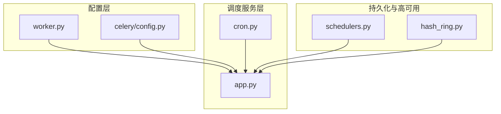
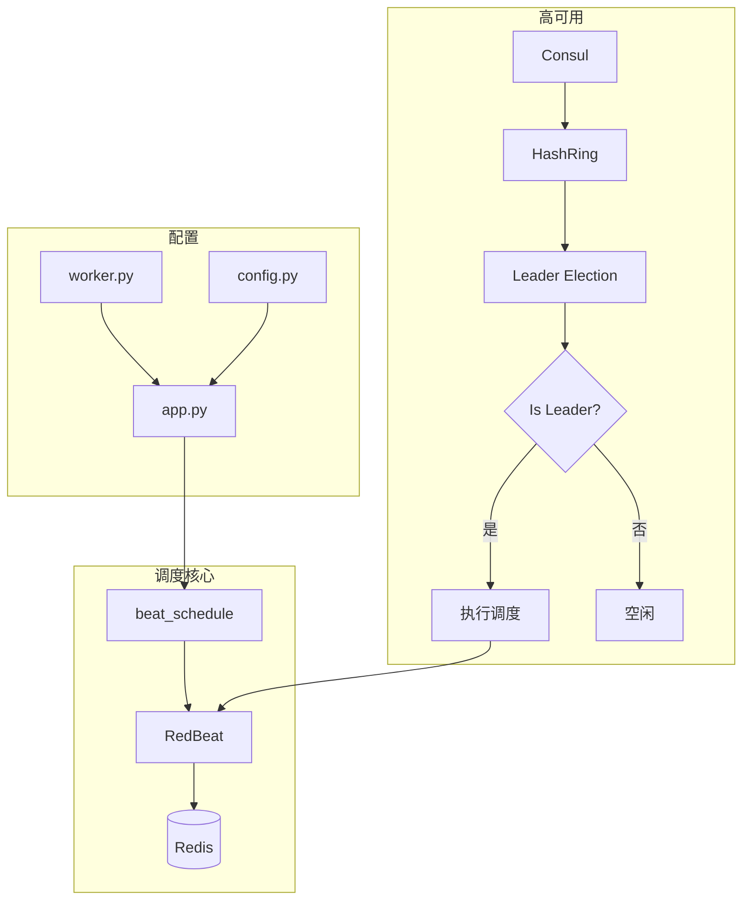
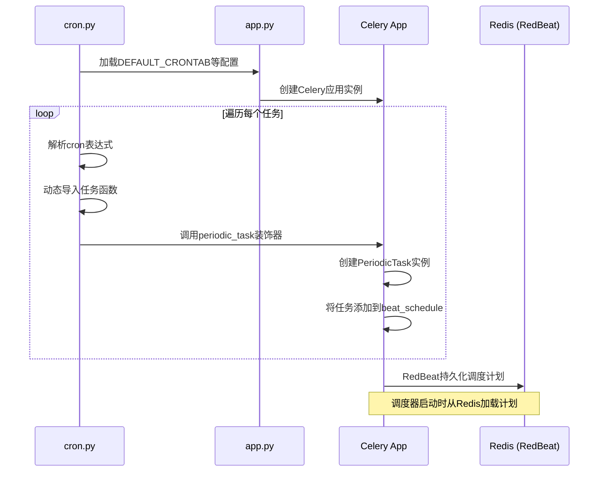
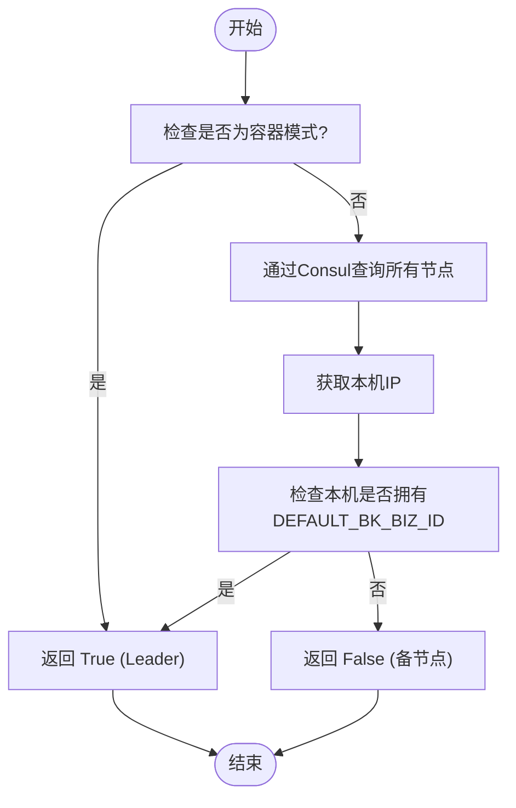
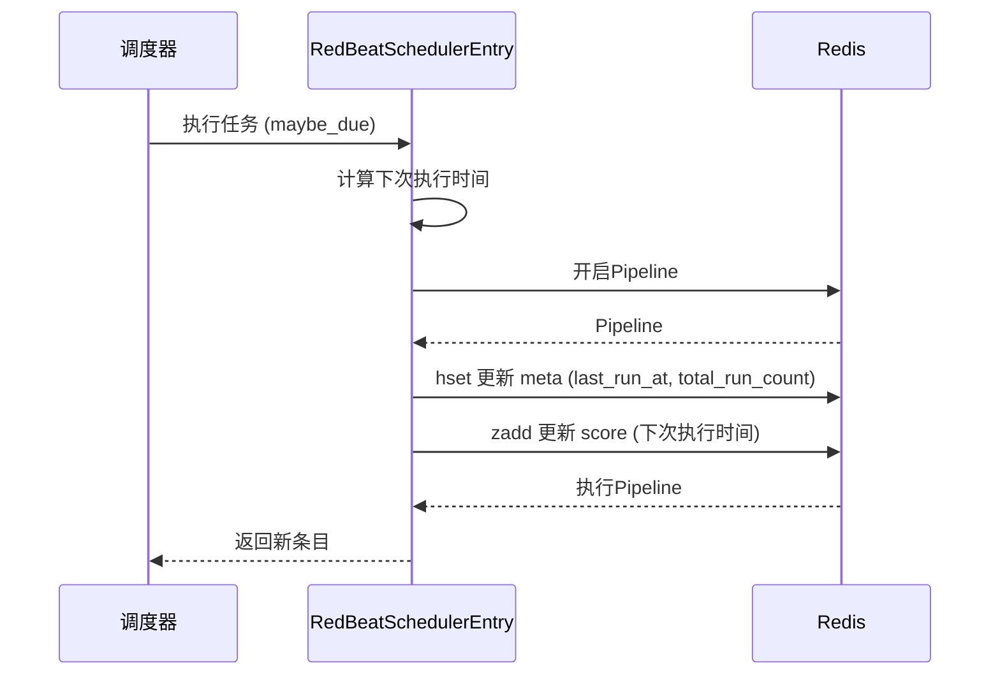
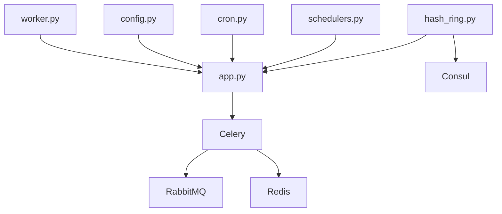

# 调度器服务编排

<cite>
**本文档引用的文件**   
- [app.py](file://bkmonitor/alarm_backends/service/scheduler/app.py)
- [cron.py](file://bkmonitor/alarm_backends/service/scheduler/tasks/cron.py)
- [config.py](file://bkmonitor/config/celery/config.py)
- [worker.py](file://bkmonitor/config/role/worker.py)
- [schedulers.py](file://bkmonitor/patches/redbeat/schedulers.py)
- [beater.py](file://bkmonitor/bkmonitor/utils/beater.py)
- [hash_ring.py](file://bkmonitor/alarm_backends/management/commands/hash_ring.py)
</cite>

## 目录
1. [引言](#引言)
2. [项目结构](#项目结构)
3. [核心组件](#核心组件)
4. [架构概述](#架构概述)
5. [详细组件分析](#详细组件分析)
6. [依赖分析](#依赖分析)
7. [性能考虑](#性能考虑)
8. [故障排除指南](#故障排除指南)
9. [结论](#结论)

## 引言
本文档旨在深入解析基于`worker.py`和`docker-compose.yml`文件的调度器服务编排机制。重点阐述Beat Scheduler容器的定时任务管理，包括其启动配置、时区设置、任务序列化格式和持久化存储方案。同时，详细说明调度器与Celery Worker的协同工作机制，涵盖定时任务的注册、调度和执行流程。文档还将探讨调度器的高可用配置，包括主备切换机制和任务去重策略，并提供调度精度优化建议及分布式环境下的时钟同步解决方案。

## 项目结构
该项目采用模块化设计，核心功能围绕监控平台展开。`bkmonitor`目录是主应用，其中`alarm_backends`模块负责告警处理的核心逻辑，其`service/scheduler`子模块是本分析的重点，包含了调度器应用的实现。`config`目录下的`celery`和`role`子目录分别存放Celery框架的通用配置和不同角色（如worker）的特定配置。`patches`目录中的`redbeat`补丁用于增强调度器的持久化能力。这种结构清晰地分离了配置、核心服务和第三方库的定制化功能。



**图源**
- [worker.py](file://bkmonitor/config/role/worker.py)
- [config.py](file://bkmonitor/config/celery/config.py)
- [app.py](file://bkmonitor/alarm_backends/service/scheduler/app.py)
- [cron.py](file://bkmonitor/alarm_backends/service/scheduler/tasks/cron.py)
- [schedulers.py](file://bkmonitor/patches/redbeat/schedulers.py)
- [hash_ring.py](file://bkmonitor/alarm_backends/management/commands/hash_ring.py)

## 核心组件
调度器服务的核心组件包括：
1.  **Celery App (`app.py`)**: 作为调度器的主应用实例，负责加载配置、发现任务并初始化调度器。
2.  **定时任务定义 (`cron.py`)**: 定义了所有周期性任务的模块路径、执行周期和运行类型，是任务注册的源头。
3.  **Celery 配置 (`config.py`)**: 提供了调度器运行所必需的全局配置，如时区、消息代理和调度器后端。
4.  **Worker 配置 (`worker.py`)**: 定义了Worker角色的环境变量、数据库连接、缓存和消息队列等关键配置。
5.  **RedBeat 调度器补丁 (`schedulers.py`)**: 通过Redis实现任务的持久化存储，确保调度信息在重启后不丢失。
6.  **主备切换机制 (`hash_ring.py`)**: 基于Consul和哈希环实现的Leader选举，保证在分布式环境中只有一个调度器实例处于活跃状态。

**节源**
- [app.py](file://bkmonitor/alarm_backends/service/scheduler/app.py)
- [cron.py](file://bkmonitor/alarm_backends/service/scheduler/tasks/cron.py)
- [config.py](file://bkmonitor/config/celery/config.py)
- [worker.py](file://bkmonitor/config/role/worker.py)
- [schedulers.py](file://bkmonitor/patches/redbeat/schedulers.py)
- [hash_ring.py](file://bkmonitor/alarm_backends/management/commands/hash_ring.py)

## 架构概述
调度器服务采用Celery框架，结合RedBeat和自定义的高可用机制，构建了一个健壮的分布式定时任务系统。其核心架构如下：`worker.py`文件定义了运行环境和基础配置，`config.py`文件指定了Celery的全局行为，如使用`Asia/Shanghai`时区和`DatabaseScheduler`作为调度器。`app.py`文件创建了Celery应用实例，并通过`autodiscover_tasks`自动发现任务。`cron.py`文件中定义的任务通过`periodic_task`装饰器注册到`app`的`beat_schedule`中。为了实现持久化，系统使用了`redbeat`补丁，将调度信息存储在Redis中。最关键的是，通过`HashRing.is_leader()`机制，确保了在多实例部署时，只有一个实例（Leader）会执行调度任务，从而避免了任务重复执行。



**图源**
- [worker.py](file://bkmonitor/config/role/worker.py)
- [config.py](file://bkmonitor/config/celery/config.py)
- [app.py](file://bkmonitor/alarm_backends/service/scheduler/app.py)
- [cron.py](file://bkmonitor/alarm_backends/service/scheduler/tasks/cron.py)
- [schedulers.py](file://bkmonitor/patches/redbeat/schedulers.py)
- [hash_ring.py](file://bkmonitor/alarm_backends/management/commands/hash_ring.py)

## 详细组件分析

### 调度器应用分析
`app.py`是调度器的核心，它通过`Celery("backend")`创建应用实例，并调用`rabbitmq_conf()`函数来加载详细的连接和行为配置。该配置指定了使用`pickle`进行任务序列化，设置了`worker_concurrency`（并发数）和`worker_max_tasks_per_child`（子进程最大任务数）等关键参数。`app.config_from_object(rabbitmq_conf())`将这些配置应用到Celery实例。`TASK_ROOT_MODULES`和`DISCOVER_DIRS`定义了任务发现的范围，确保所有相关的任务模块都能被自动加载。

```mermaid
classDiagram
class CeleryApp {
+string name
+object config
+function config_from_object()
+function autodiscover_tasks()
}
class RabbitmqConf {
+int worker_max_tasks_per_child
+int worker_concurrency
+string task_serializer
+string broker_url
+string result_backend
+string redbeat_redis_url
}
class PeriodicTask {
+bool abstract
+bool ignore_result
+bool relative
+dict options
+function __init__()
+function on_bound()
}
CeleryApp --> RabbitmqConf : "使用配置"
CeleryApp --> PeriodicTask : "注册任务"
CeleryApp --> "beat_schedule" : "存储计划"
```

**图源**
- [app.py](file://bkmonitor/alarm_backends/service/scheduler/app.py#L0-L254)

**节源**
- [app.py](file://bkmonitor/alarm_backends/service/scheduler/app.py#L0-L254)

### 定时任务注册与调度流程
定时任务的注册和调度流程始于`cron.py`文件。该文件定义了一个`queue_define`字典，映射了不同的任务队列（如`celery_cron`, `celery_action_cron`）到`settings`中的CRONTAB配置。通过一个嵌套循环，遍历每个队列及其对应的任务列表。对于每个任务，系统会：
1.  根据`run_type`判断是否在当前集群执行（`global`任务仅在默认集群执行）。
2.  使用`_get_func`动态导入任务函数。
3.  将`cron_expr`字符串解析为`crontab`对象。
4.  使用`periodic_task`装饰器创建一个`PeriodicTask`实例，并将其添加到Celery应用的`beat_schedule`中，同时设置队列、过期时间等选项。



**图源**
- [cron.py](file://bkmonitor/alarm_backends/service/scheduler/tasks/cron.py#L0-L107)
- [app.py](file://bkmonitor/alarm_backends/service/scheduler/app.py#L0-L254)

**节源**
- [cron.py](file://bkmonitor/alarm_backends/service/scheduler/tasks/cron.py#L0-L107)

### 高可用配置分析
调度器的高可用性通过`HashRing`机制实现。`hash_ring.py`文件中的`HashRing`类继承自`ConsulDispatchCommand`，利用Consul服务发现来确定集群中的节点。`is_leader()`方法是核心：
1.  如果是容器化部署（`IS_CONTAINER_MODE`），直接返回`True`，因为容器通常只运行一个实例。
2.  否则，通过Consul查询所有注册的节点，并获取本地主机的IP。
3.  检查本地主机是否被分配了`DEFAULT_BK_BIZ_ID`（蓝鲸业务ID），如果是，则该节点被选为Leader。

只有被选为Leader的节点才会执行`healthz`等关键的周期性任务，其他节点则保持空闲，从而实现了主备切换和任务去重。



**图源**
- [hash_ring.py](file://bkmonitor/alarm_backends/management/commands/hash_ring.py#L0-L70)

**节源**
- [hash_ring.py](file://bkmonitor/alarm_backends/management/commands/hash_ring.py#L0-L70)

### 任务持久化存储方案
任务的持久化存储由`redbeat`库和其补丁`schedulers.py`实现。`RedBeatSchedulerEntry`类是`redbeat`调度条目的核心，它重写了`_next_instance`方法。当一个任务被调度执行后，该方法会更新任务的`last_run_at`和`total_run_count`，并将这些元数据（meta）通过Redis管道（pipeline）写回到Redis的哈希表（hset）中。同时，它会更新任务在ZSET（zadd）中的分数（score），即下次执行的时间。这确保了即使调度器进程重启，也能从Redis中恢复所有任务的执行状态和计划。



**图源**
- [schedulers.py](file://bkmonitor/patches/redbeat/schedulers.py#L0-L108)

**节源**
- [schedulers.py](file://bkmonitor/patches/redbeat/schedulers.py#L0-L108)

## 依赖分析
调度器服务的依赖关系清晰且分层明确。最底层是`worker.py`和`config.py`提供的基础配置，包括数据库、缓存（Redis）、消息队列（RabbitMQ）的连接信息。中间层是`app.py`，它依赖于这些配置来初始化Celery应用。上层是`cron.py`，它依赖于`app.py`来注册任务。`redbeat`补丁直接依赖于`app.py`的Redis配置来实现持久化。`hash_ring.py`则依赖于Consul和Django的`settings`来实现高可用。这种依赖结构确保了配置与逻辑的分离，提高了系统的可维护性。



**图源**
- [worker.py](file://bkmonitor/config/role/worker.py)
- [config.py](file://bkmonitor/config/celery/config.py)
- [app.py](file://bkmonitor/alarm_backends/service/scheduler/app.py)
- [cron.py](file://bkmonitor/alarm_backends/service/scheduler/tasks/cron.py)
- [schedulers.py](file://bkmonitor/patches/redbeat/schedulers.py)
- [hash_ring.py](file://bkmonitor/alarm_backends/management/commands/hash_ring.py)

**节源**
- [app.py](file://bkmonitor/alarm_backends/service/scheduler/app.py)

## 性能考虑
1.  **并发与资源**：`worker_concurrency`根据CPU核心数动态计算，`worker_max_tasks_per_child`限制子进程任务数，防止内存泄漏。
2.  **序列化**：使用`pickle`序列化，性能较高，但需注意其安全性和跨语言兼容性。
3.  **持久化**：`redbeat`使用Redis管道操作，减少了网络往返，提高了持久化效率。
4.  **高可用**：`HashRing`机制避免了多个实例同时调度，减少了资源竞争和任务重复执行的开销。
5.  **调度精度**：`beat_max_loop_interval`设置为60秒，意味着调度器每60秒检查一次任务，这是调度精度的上限。对于更高精度的需求，需要调整此值。

## 故障排除指南
1.  **任务未执行**：检查`HashRing.is_leader()`是否返回`True`，确认当前实例是否为Leader；检查Redis中`redbeat`的ZSET和哈希表，确认任务计划是否已正确持久化。
2.  **任务重复执行**：检查`HashRing`机制是否正常工作，确认Consul中节点注册信息是否正确，确保只有一个Leader。
3.  **连接失败**：检查`worker.py`中的`RABBITMQ_HOST`, `REDIS_HOST`等配置是否正确，确认网络连通性。
4.  **性能瓶颈**：监控`worker_concurrency`和系统负载，根据需要调整并发数；检查任务执行日志，优化耗时过长的任务。
5.  **时区问题**：确认`config.py`中的`timezone`设置为`Asia/Shanghai`，并与服务器系统时区保持一致。

**节源**
- [app.py](file://bkmonitor/alarm_backends/service/scheduler/app.py)
- [cron.py](file://bkmonitor/alarm_backends/service/scheduler/tasks/cron.py)
- [hash_ring.py](file://bkmonitor/alarm_backends/management/commands/hash_ring.py)

## 结论
本文档详细解析了调度器服务的编排机制。该系统通过Celery框架提供基础的定时任务能力，利用`redbeat`实现任务计划的持久化存储，并通过自研的`HashRing`机制确保了在分布式环境下的高可用和任务去重。`worker.py`和`config.py`文件提供了灵活的配置支持。整体架构设计合理，兼顾了可靠性、性能和可维护性。未来可进一步优化调度精度，并探索更高效的时钟同步方案以应对分布式环境下的时间漂移问题。