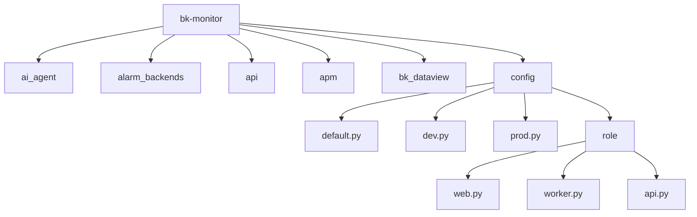
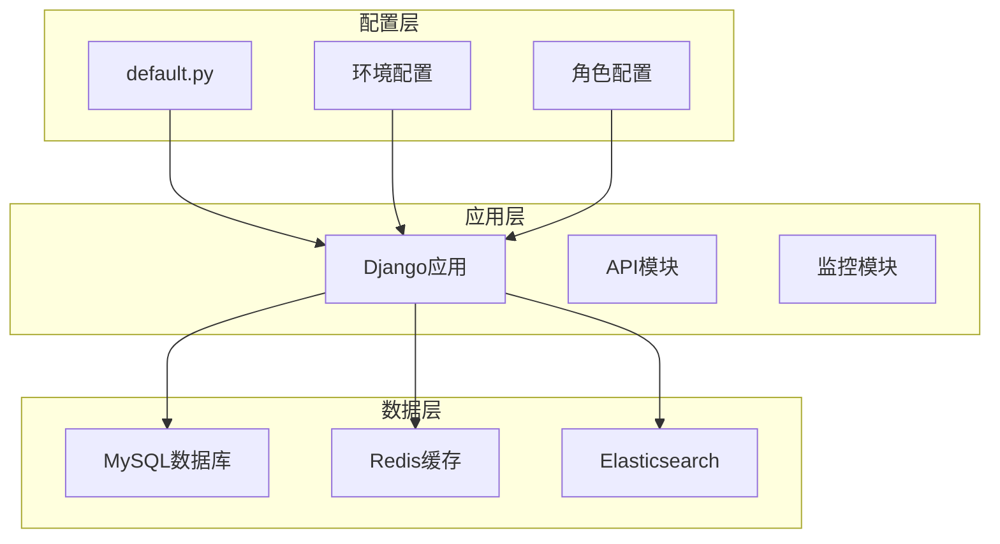
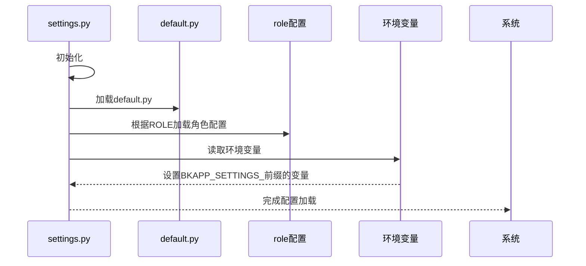
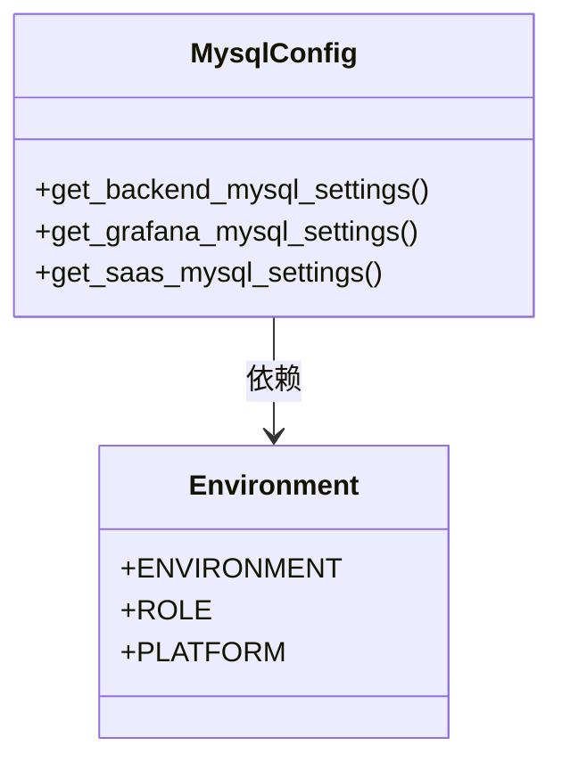
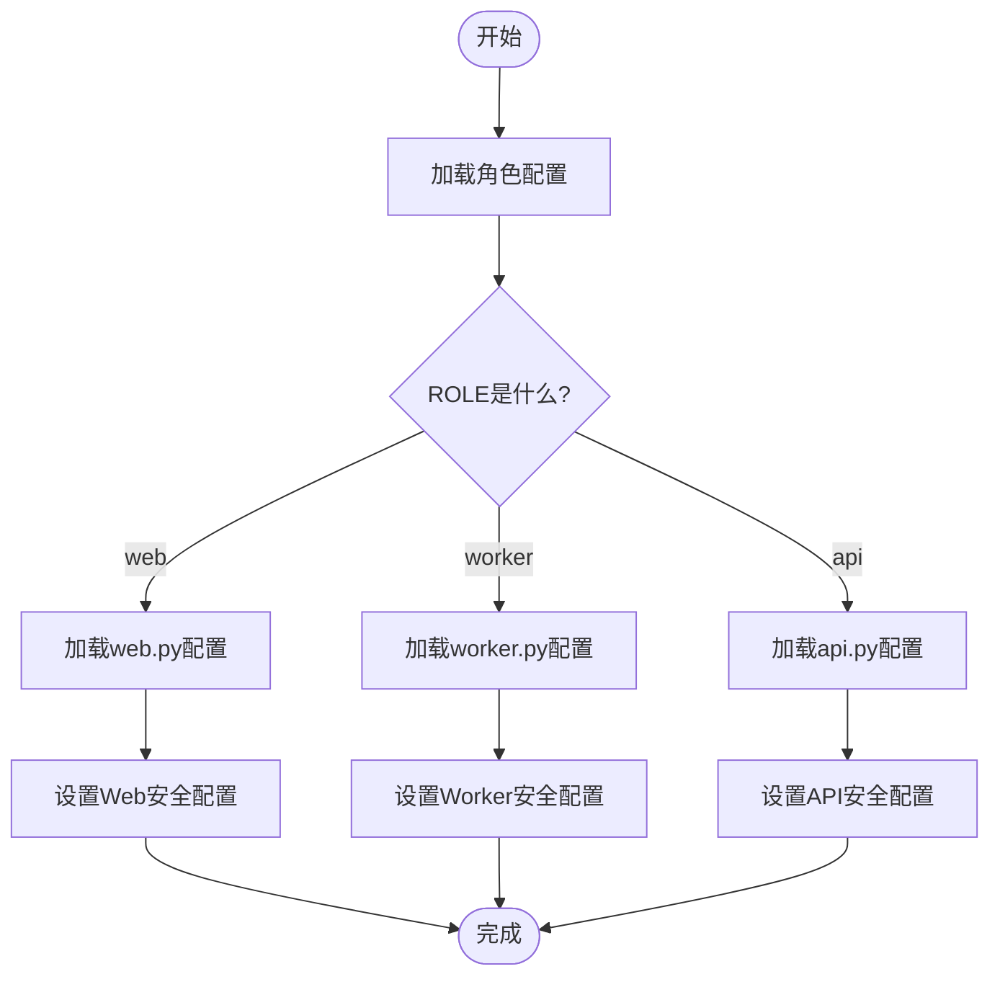
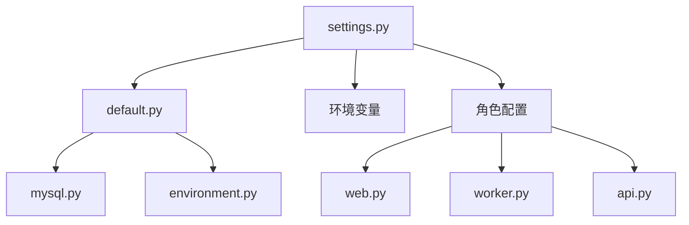

# 安全配置

<cite>
**本文档中引用的文件**   
- [settings.py](file://bkmonitor/settings.py)
- [default.py](file://bkmonitor/config/default.py)
- [environment.py](file://bkmonitor/config/tools/environment.py)
- [mysql.py](file://bkmonitor/config/tools/mysql.py)
- [celery.py](file://bkmonitor/config/celery/celery.py)
- [web.py](file://bkmonitor/config/role/web.py)
- [worker.py](file://bkmonitor/config/role/worker.py)
- [api.py](file://bkmonitor/config/role/api.py)
</cite>

## 目录
1. [简介](#简介)
2. [项目结构](#项目结构)
3. [核心组件](#核心组件)
4. [架构概述](#架构概述)
5. [详细组件分析](#详细组件分析)
6. [依赖分析](#依赖分析)
7. [性能考虑](#性能考虑)
8. [故障排除指南](#故障排除指南)
9. [结论](#结论)

## 简介
本指南详细说明了bk-monitor系统在容器环境中的安全配置策略。文档涵盖敏感信息保护机制、环境变量加密实现方式、密钥管理流程、Django安全配置项最佳实践、安全配置审计与验证方法、常见安全漏洞来源及防范措施，并提供符合安全合规要求的配置模板。

## 项目结构
bk-monitor系统采用模块化设计，主要由多个功能模块组成，包括ai_agent、alarm_backends、api、apm、bk_dataview等。系统使用Django作为Web框架，通过配置文件进行环境和角色的差异化设置。



**图示来源**
- [settings.py](file://bkmonitor/settings.py)
- [default.py](file://bkmonitor/config/default.py)

**本节来源**
- [settings.py](file://bkmonitor/settings.py)
- [default.py](file://bkmonitor/config/default.py)

## 核心组件
系统的核心组件包括Django设置管理、角色配置加载、环境变量处理和安全配置。这些组件共同确保系统在不同环境下的安全运行。

**本节来源**
- [settings.py](file://bkmonitor/settings.py)
- [default.py](file://bkmonitor/config/default.py)

## 架构概述
bk-monitor系统采用分层架构，包括配置层、应用层和数据层。配置层负责加载不同环境和角色的配置；应用层包含各种功能模块；数据层管理数据库和缓存连接。



**图示来源**
- [settings.py](file://bkmonitor/settings.py)
- [default.py](file://bkmonitor/config/default.py)

## 详细组件分析

### Django安全配置分析
Django安全配置是系统安全的基础，包括SECRET_KEY、ALLOWED_HOSTS等关键设置。

#### 安全配置加载流程


**图示来源**
- [settings.py](file://bkmonitor/settings.py)
- [default.py](file://bkmonitor/config/default.py)

#### 敏感信息保护机制
系统通过多种方式保护敏感信息：

1. **环境变量注入**：敏感配置通过环境变量注入，避免硬编码
2. **配置分层**：不同环境使用不同的配置文件
3. **角色分离**：不同角色（web、worker、api）使用不同的配置

```python
# 从环境变量加载配置
SETTING_ENV_PREFIX = "BKAPP_SETTINGS_"
for key, value in list(os.environ.items()):
    upper_key = key.upper()
    if upper_key.startswith(SETTING_ENV_PREFIX):
        settings_key = upper_key.replace(SETTING_ENV_PREFIX, "")
        locals()[settings_key] = value
```

**本节来源**
- [settings.py](file://bkmonitor/settings.py)
- [default.py](file://bkmonitor/config/default.py)

### 数据库安全配置
数据库配置是系统安全的关键部分，系统通过专门的工具模块管理数据库连接信息。

#### 数据库配置工具


**图示来源**
- [mysql.py](file://bkmonitor/config/tools/mysql.py)
- [environment.py](file://bkmonitor/config/tools/environment.py)

#### 数据库连接配置
系统为不同用途的数据库连接提供独立配置：

```python
# 数据库配置
DATABASES = {
    "default": {
        "ENGINE": default_db_engine,
        "NAME": SAAS_MYSQL_NAME,
        "USER": SAAS_MYSQL_USER,
        "PASSWORD": SAAS_MYSQL_PASSWORD,
        "HOST": SAAS_MYSQL_HOST,
        "PORT": SAAS_MYSQL_PORT,
    },
    "monitor_api": {
        "ENGINE": "django.db.backends.mysql",
        "NAME": BACKEND_MYSQL_NAME,
        "USER": BACKEND_MYSQL_USER,
        "PASSWORD": BACKEND_MYSQL_PASSWORD,
        "HOST": BACKEND_MYSQL_HOST,
        "PORT": BACKEND_MYSQL_PORT,
    }
}
```

**本节来源**
- [default.py](file://bkmonitor/config/default.py)
- [mysql.py](file://bkmonitor/config/tools/mysql.py)

### 角色安全配置
系统根据运行角色（web、worker、api）加载不同的安全配置。

#### 角色配置加载


**图示来源**
- [settings.py](file://bkmonitor/settings.py)
- [role/web.py](file://bkmonitor/config/role/web.py)
- [role/worker.py](file://bkmonitor/config/role/worker.py)
- [role/api.py](file://bkmonitor/config/role/api.py)

#### Web角色安全配置
Web角色的配置包括应用代码、密钥和URL设置：

```python
if ROLE == "web":
    APP_ID = APP_CODE = get_env_or_raise("BKPAAS_APP_ID", "APP_ID", "APP_CODE", default="bk_monitorv3")
    APP_TOKEN = SECRET_KEY = get_env_or_raise("BKPAAS_APP_SECRET", "APP_TOKEN", "SECRET_KEY", default="")
    BACKEND_APP_CODE = os.getenv("BK_MONITOR_APP_CODE") or "bk_bkmonitorv3"
```

**本节来源**
- [default.py](file://bkmonitor/config/default.py)
- [web.py](file://bkmonitor/config/role/web.py)

### 环境安全配置
系统支持多种环境（开发、测试、生产）的安全配置。

#### 环境配置映射
```python
DJANGO_CONF_MODULE = "config.{env}".format(
    env={"development": "dev", "testing": "stag", "production": "prod"}.get(ENVIRONMENT)
)
```

#### 开发环境特殊处理
```python
# 开发模式下允许加载本地设置
if RUN_MODE == "DEVELOP":  # noqa
    try:
        from local_settings import *  # noqa
    except ImportError:
        pass
```

**本节来源**
- [settings.py](file://bkmonitor/settings.py)
- [default.py](file://bkmonitor/config/default.py)

## 依赖分析
系统依赖关系清晰，配置文件之间有明确的加载顺序和依赖关系。



**图示来源**
- [settings.py](file://bkmonitor/settings.py)
- [default.py](file://bkmonitor/config/default.py)

**本节来源**
- [settings.py](file://bkmonitor/settings.py)
- [default.py](file://bkmonitor/config/default.py)

## 性能考虑
系统在安全配置方面考虑了性能因素，如数据库连接池和缓存设置。

```python
# 数据库连接池配置
"POOL_OPTIONS": {
    "POOL_SIZE": 5,
    "MAX_OVERFLOW": -1,
    "RECYCLE": 600,
}
```

**本节来源**
- [default.py](file://bkmonitor/config/default.py)

## 故障排除指南
当遇到安全配置问题时，可按以下步骤排查：

1. 检查环境变量是否正确设置
2. 确认角色配置文件是否加载
3. 验证数据库连接信息
4. 检查SECRET_KEY是否设置

**本节来源**
- [settings.py](file://bkmonitor/settings.py)
- [default.py](file://bkmonitor/config/default.py)

## 结论
bk-monitor系统通过分层配置、环境变量注入和角色分离等机制，实现了容器环境下的安全配置。系统遵循安全最佳实践，提供了灵活的配置选项，同时确保了敏感信息的保护。