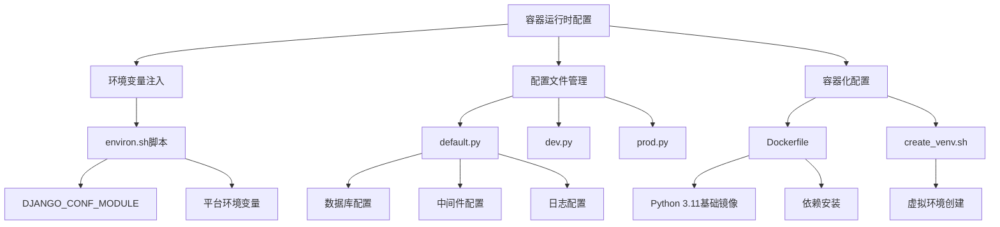
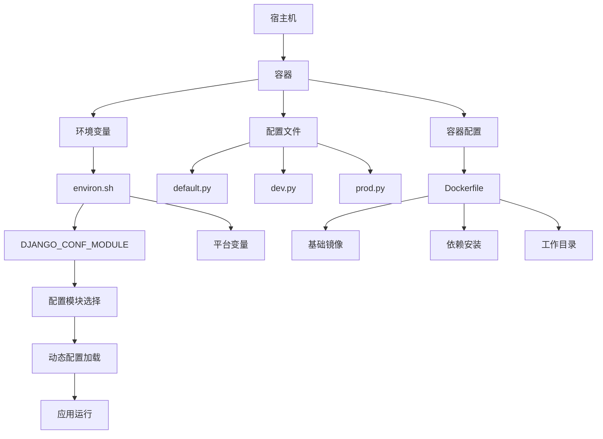
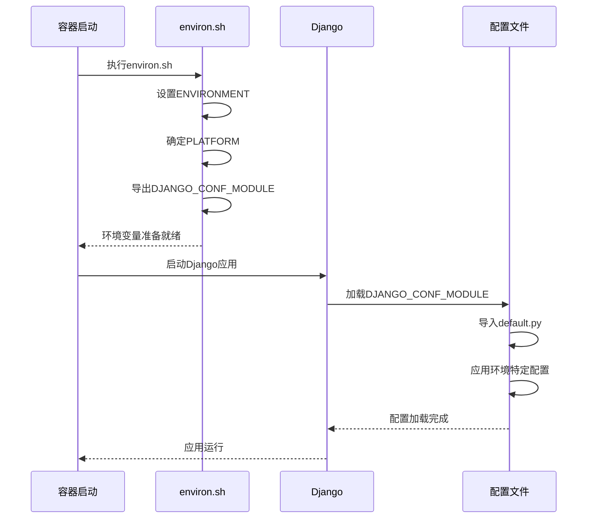
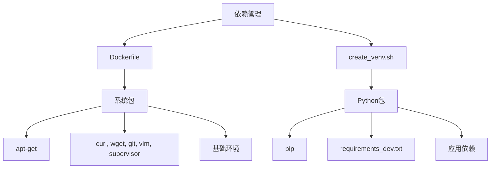

# 容器运行时配置

<cite>
**本文档引用的文件**   
- [environ.sh](file://bkmonitor/bin/environ.sh)
- [dev.py](file://bkmonitor/config/dev.py)
- [prod.py](file://bkmonitor/config/prod.py)
- [default.py](file://bkmonitor/config/default.py)
- [Dockerfile](file://bkmonitor/.devcontainer/Dockerfile)
- [create_venv.sh](file://bkmonitor/.devcontainer/create_venv.sh)
</cite>

## 目录
1. [简介](#简介)
2. [项目结构](#项目结构)
3. [核心组件](#核心组件)
4. [架构概述](#架构概述)
5. [详细组件分析](#详细组件分析)
6. [依赖分析](#依赖分析)
7. [性能考虑](#性能考虑)
8. [故障排除指南](#故障排除指南)
9. [结论](#结论)

## 简介
本文档详细说明了bk-monitor系统在容器环境中的配置管理策略。文档涵盖了环境变量的注入机制、配置文件的挂载方式、敏感信息的安全管理、配置热更新的实现方案以及配置验证的最佳实践。通过分析`environ.sh`脚本、Dockerfile和Python配置文件，揭示了系统如何在容器化环境中进行运行时配置管理。

## 项目结构
bk-monitor项目采用模块化设计，主要配置文件位于`bkmonitor/config/`目录下，包括`default.py`、`dev.py`、`prod.py`等环境特定的配置文件。运行时环境变量通过`bkmonitor/bin/environ.sh`脚本进行设置。容器化配置通过`.devcontainer/Dockerfile`定义，使用Python 3.11作为基础镜像，并包含创建虚拟环境的脚本。



**图示来源**
- [environ.sh](file://bkmonitor/bin/environ.sh)
- [default.py](file://bkmonitor/config/default.py)
- [Dockerfile](file://bkmonitor/.devcontainer/Dockerfile)
- [create_venv.sh](file://bkmonitor/.devcontainer/create_venv.sh)

**本节来源**
- [environ.sh](file://bkmonitor/bin/environ.sh)
- [default.py](file://bkmonitor/config/default.py)
- [Dockerfile](file://bkmonitor/.devcontainer/Dockerfile)

## 核心组件
### 环境变量注入机制
系统通过`environ.sh`脚本设置运行时环境变量，核心是`DJANGO_CONF_MODULE`变量的动态构建。该脚本根据`BKAPP_DEPLOY_PLATFORM`环境变量确定部署平台，并结合环境类型（development、testing、production）来确定最终的Django配置模块路径。

```bash
#!/bin/bash

ENVIRONMENT="development"

if [ 0"$BKAPP_DEPLOY_PLATFORM" = "0" ]; then
    PLATFORM="tencent"
else
    PLATFORM="$BKAPP_DEPLOY_PLATFORM"
fi

export DJANGO_CONF_MODULE="conf.worker.${ENVIRONMENT}.${PLATFORM}"
```

这种机制允许系统在不同部署环境和平台上使用不同的配置组合，实现了配置的灵活性和可扩展性。

**本节来源**
- [environ.sh](file://bkmonitor/bin/environ.sh)

### 配置文件管理策略
系统采用分层配置管理策略，以`default.py`为基础，通过`dev.py`和`prod.py`等环境特定文件进行覆盖。这种设计遵循了Django的配置继承模式，确保了配置的一致性和可维护性。

#### 默认配置文件 (default.py)
`default.py`文件包含系统的基础配置，包括：
- **数据库配置**：通过`get_backend_mysql_settings`等函数动态获取
- **中间件配置**：定义了系统使用的中间件列表
- **日志配置**：通过`get_logging_config_dict`函数生成
- **加密配置**：使用`bkcrypto`库进行数据加密

#### 环境特定配置
环境特定配置文件（如`dev.py`、`prod.py`）通过导入`default.py`并覆盖特定设置来实现配置的差异化：

```python
from .default import *  # noqa

# 本地开发环境
RUN_MODE = "DEVELOP"

# 开发数据库设置
DATABASES = {
    "default": {
        "ENGINE": "django.db.backends.mysql",
        "NAME": APP_CODE,
        "USER": "root",
        "PASSWORD": "",
        "HOST": "localhost",
        "PORT": "3306",
    }
}

DEBUG = True
```

这种分层配置模式使得系统能够在不同环境中保持核心配置的一致性，同时允许必要的环境特定调整。

**本节来源**
- [default.py](file://bkmonitor/config/default.py)
- [dev.py](file://bkmonitor/config/dev.py)
- [prod.py](file://bkmonitor/config/prod.py)

## 架构概述
bk-monitor系统的容器运行时配置架构采用分层设计，将环境变量、配置文件和容器配置分离管理。这种设计提高了系统的可移植性和可维护性。



**图示来源**
- [environ.sh](file://bkmonitor/bin/environ.sh)
- [default.py](file://bkmonitor/config/default.py)
- [Dockerfile](file://bkmonitor/.devcontainer/Dockerfile)

## 详细组件分析
### 容器化配置分析
#### Dockerfile配置
`Dockerfile`定义了容器的基础环境和构建过程：

```dockerfile
FROM python:3.11-bullseye

ARG APT_MIRROR="https://mirrors.tencent.com"
ARG PIP_MIRROR="https://mirrors.tencent.com/pypi/simple"

# 替换镜像源
RUN sed -i "s@http://deb.debian.org/debian@${APT_MIRROR}/debian@g" /etc/apt/sources.list \
    && sed -i "s@http://security.debian.org/debian-security@${APT_MIRROR}/debian-security@g" /etc/apt/sources.list

# 设置默认shell
ENV SHELL /bin/bash

# 安装工具包
RUN apt-get update && apt-get install -y curl wget git vim supervisor

# 替换pip源
RUN mkdir -p ~/.pip && echo "[global]\nindex-url = $PIP_MIRROR/\n" > ~/.pip/pip.conf && pip install --upgrade pip

# 设置Python虚拟环境
ENV VIRTUAL_ENV=/app/code/bkmonitor/venv
ENV PATH="/app/code/bkmonitor/venv/bin:${PATH}"

# 挂载项目目录
VOLUME /app/code

# 设置工作目录
WORKDIR /app/code

# 暴露端口
EXPOSE 8000

# 默认命令
CMD ["sleep", "infinity"]
```

该Dockerfile的关键特性包括：
- 使用腾讯镜像源加速包下载
- 配置Python虚拟环境
- 挂载项目目录以支持开发
- 暴露8000端口供应用使用

#### 虚拟环境创建脚本
`create_venv.sh`脚本负责在容器内创建和配置Python虚拟环境：

```bash
#!/bin/bash

# 安装virtualenv
pip install virtualenv

# 进入项目目录
cd /app/code/bkmonitor

# 创建虚拟环境
if [ ! -d "venv" ]; then
  virtualenv venv
fi

# 激活虚拟环境
source /app/code/bkmonitor/venv/bin/activate

# 安装开发依赖
pip install -r requirements_dev.txt
```

此脚本确保了Python依赖的隔离和可重现性。

**本节来源**
- [Dockerfile](file://bkmonitor/.devcontainer/Dockerfile)
- [create_venv.sh](file://bkmonitor/.devcontainer/create_venv.sh)

### 配置加载流程
系统配置的加载流程遵循特定的顺序和优先级：



**图示来源**
- [environ.sh](file://bkmonitor/bin/environ.sh)
- [default.py](file://bkmonitor/config/default.py)

**本节来源**
- [environ.sh](file://bkmonitor/bin/environ.sh)
- [default.py](file://bkmonitor/config/default.py)

## 依赖分析
系统通过Dockerfile和虚拟环境脚本管理依赖，确保了环境的一致性。虽然未直接提供`requirements.txt`文件，但从`create_venv.sh`脚本可以看出，系统使用`requirements_dev.txt`来管理开发依赖。



**图示来源**
- [Dockerfile](file://bkmonitor/.devcontainer/Dockerfile)
- [create_venv.sh](file://bkmonitor/.devcontainer/create_venv.sh)

## 性能考虑
### 配置缓存与优化
系统在配置管理方面考虑了性能优化：

1. **环境变量缓存**：通过`get_env_or_raise`函数缓存环境变量读取结果
2. **数据库连接池**：使用`dj_db_conn_pool`库管理数据库连接
3. **静态资源配置**：合理设置静态文件路径和版本控制

### 容器资源优化
Dockerfile中的配置也体现了资源优化考虑：

- 使用轻量级的`python:3.11-bullseye`基础镜像
- 合并Dockerfile中的RUN指令以减少镜像层数
- 使用国内镜像源加速依赖下载

## 故障排除指南
### 常见配置问题
#### 环境变量未生效
**症状**：应用未使用预期的配置
**解决方案**：
1. 检查`environ.sh`脚本是否正确执行
2. 验证`DJANGO_CONF_MODULE`环境变量是否正确设置
3. 确认环境变量在容器启动时可用

#### 配置文件加载失败
**症状**：应用启动时报错找不到配置模块
**解决方案**：
1. 检查`config`目录结构是否完整
2. 验证`default.py`、`dev.py`等文件是否存在
3. 确认文件路径和模块名称的正确性

#### 数据库连接问题
**症状**：无法连接到数据库
**解决方案**：
1. 检查数据库配置是否正确
2. 验证数据库服务是否运行
3. 确认网络连接和防火墙设置

**本节来源**
- [default.py](file://bkmonitor/config/default.py)
- [dev.py](file://bkmonitor/config/dev.py)

## 结论
bk-monitor系统的容器运行时配置采用了一套完整的管理策略，通过环境变量、配置文件和容器配置的有机结合，实现了灵活、安全和可维护的配置管理。系统使用`environ.sh`脚本动态设置环境变量，通过分层的Python配置文件管理不同环境的设置，并利用Dockerfile定义容器化环境。这种设计模式不仅提高了系统的可移植性，还为开发、测试和生产环境提供了差异化的配置支持。