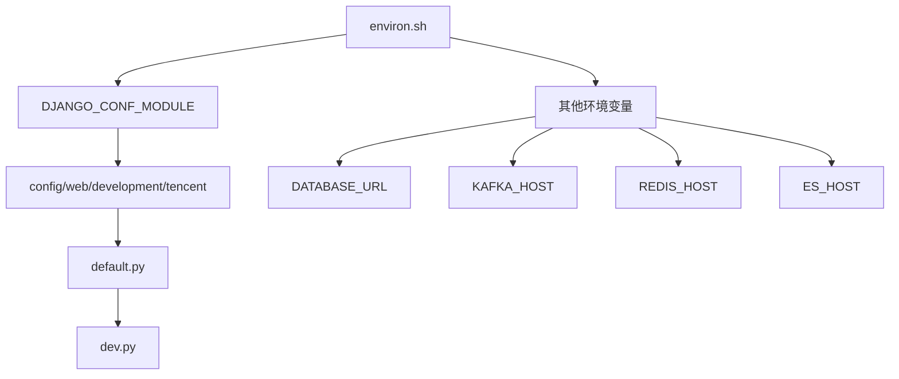
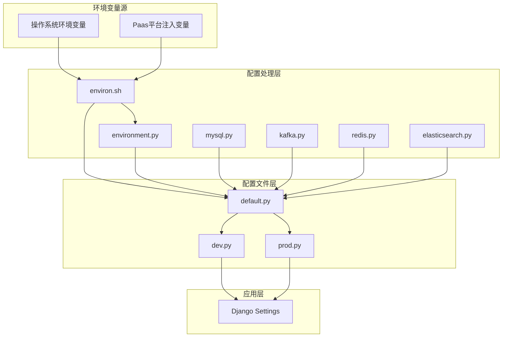
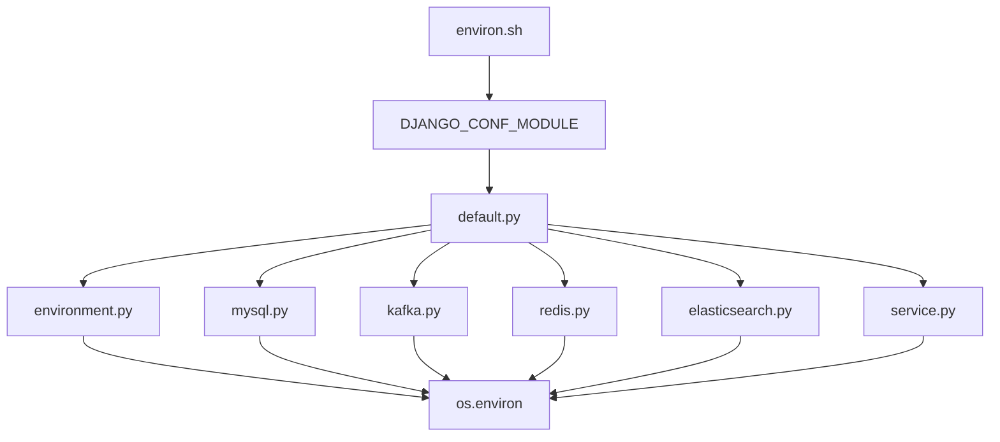

# 环境变量配置

<cite>
**本文档中引用的文件**   
- [environ.sh](file://bkmonitor/bin/environ.sh)
- [default.py](file://bkmonitor/config/default.py)
- [dev.py](file://bkmonitor/config/dev.py)
- [environment.py](file://bkmonitor/config/tools/environment.py)
- [mysql.py](file://bkmonitor/config/tools/mysql.py)
- [kafka.py](file://bkmonitor/config/tools/kafka.py)
- [redis.py](file://bkmonitor/config/tools/redis.py)
- [elasticsearch.py](file://bkmonitor/config/tools/elasticsearch.py)
- [service.py](file://bkmonitor/config/tools/service.py)
- [__init__.py](file://bkmonitor/config/__init__.py)
</cite>

## 目录
1. [简介](#简介)
2. [项目结构](#项目结构)
3. [核心组件](#核心组件)
4. [架构概述](#架构概述)
5. [详细组件分析](#详细组件分析)
6. [依赖分析](#依赖分析)
7. [性能考虑](#性能考虑)
8. [故障排除指南](#故障排除指南)
9. [结论](#结论)

## 简介
本文档详细说明了bk-monitor系统通过environ.sh脚本注入运行时参数的机制。文档解释了关键环境变量的用途，如BK_MONITOR_HOST、BK_MONITOR_PORT、DATABASE_URL等，并提供了环境变量的命名规范和层级结构说明。涵盖了开发、测试、生产环境的变量管理策略，包含实际代码示例展示变量读取和默认值设置。说明了环境变量的验证机制和错误处理流程，并提供了调试环境变量问题的排查方法。

## 项目结构
bk-monitor系统的项目结构清晰，主要配置文件位于`bkmonitor/config`目录下。环境变量相关的脚本和工具分布在`bin`和`config/tools`目录中。核心的环境变量注入机制由`bin/environ.sh`脚本启动，该脚本设置关键的`DJANGO_CONF_MODULE`环境变量，从而引导Django应用加载正确的配置。



**图示来源**
- [environ.sh](file://bkmonitor/bin/environ.sh)
- [default.py](file://bkmonitor/config/default.py)
- [dev.py](file://bkmonitor/config/dev.py)

**本节来源**
- [environ.sh](file://bkmonitor/bin/environ.sh)
- [default.py](file://bkmonitor/config/default.py)

## 核心组件
系统的核心组件包括环境变量注入脚本`environ.sh`、基础配置文件`default.py`、环境特定配置文件（如`dev.py`）以及一系列用于处理特定服务（如MySQL、Kafka、Redis、Elasticsearch）配置的工具模块。这些组件协同工作，确保应用能够在不同环境中正确加载配置。

**本节来源**
- [environ.sh](file://bkmonitor/bin/environ.sh)
- [default.py](file://bkmonitor/config/default.py)
- [dev.py](file://bkmonitor/config/dev.py)

## 架构概述
bk-monitor系统的环境变量配置架构采用分层覆盖模式。`environ.sh`脚本作为入口，设置顶层环境变量。`default.py`提供所有环境的默认配置，而`dev.py`、`prod.py`等文件则根据具体环境覆盖或补充默认值。对于复杂的配置项（如数据库、消息队列），系统使用`config/tools`目录下的专用模块进行解析和处理，这些模块会从环境变量中提取信息并构建最终的配置字典。



**图示来源**
- [environ.sh](file://bkmonitor/bin/environ.sh)
- [environment.py](file://bkmonitor/config/tools/environment.py)
- [mysql.py](file://bkmonitor/config/tools/mysql.py)
- [kafka.py](file://bkmonitor/config/tools/kafka.py)
- [redis.py](file://bkmonitor/config/tools/redis.py)
- [elasticsearch.py](file://bkmonitor/config/tools/elasticsearch.py)
- [default.py](file://bkmonitor/config/default.py)
- [dev.py](file://bkmonitor/config/dev.py)
- [prod.py](file://bkmonitor/config/prod.py)

## 详细组件分析

### 环境变量注入机制分析
`environ.sh`脚本是整个配置流程的起点。它根据Paas平台的版本和部署平台，动态设置`DJANGO_CONF_MODULE`环境变量，该变量决定了Django应用将加载哪个配置模块。

```bash
#!/bin/bash

ENVIRONMENT="development"

if [ 0"$BKAPP_DEPLOY_PLATFORM" = "0" ]; then
    PLATFORM="tencent"
else
    PLATFORM="$BKAPP_DEPLOY_PLATFORM"
fi

export DJANGO_CONF_MODULE="conf.worker.${ENVIRONMENT}.${PLATFORM}"
```

此脚本首先检查`BKAPP_DEPLOY_PLATFORM`环境变量，如果未设置，则默认为"tencent"。然后，它将`DJANGO_CONF_MODULE`导出为`conf.worker.${ENVIRONMENT}.${PLATFORM}`，其中`ENVIRONMENT`默认为"development"。这个环境变量被Django的settings模块读取，从而加载对应的配置文件。

**本节来源**
- [environ.sh](file://bkmonitor/bin/environ.sh)

### 配置文件加载与覆盖分析
`default.py`文件是所有环境配置的基础。它包含了应用运行所需的大部分默认设置。特定环境的配置文件（如`dev.py`）通过导入`default.py`来继承这些默认值，然后根据需要进行覆盖。

`default.py`中的关键代码展示了这一机制：
```python
from .default import *  # noqa
```

`dev.py`文件通过这行代码导入了`default.py`中的所有配置。随后，`dev.py`可以覆盖特定的值，例如将`DEBUG`设置为`True`，并将数据库主机设置为`localhost`。

#### 环境变量读取与默认值设置
系统使用`get_env_or_raise`函数来安全地读取环境变量。该函数定义在`config/__init__.py`中，它接受一个或多个环境变量名作为参数，并返回第一个存在的变量的值。如果所有变量都不存在，且未提供默认值，则抛出`RuntimeError`。

```python
def get_env_or_raise(*keys, default=None):
    """Get an environment variable, if it does not exist, raise an exception"""
    for key in keys:
        value = os.environ.get(key)
        if value:
            return value

    if default is not None:
        return default

    raise RuntimeError(
        'Environment variable "{}" not found, you must set this variable to run this application.'.format(keys)
    )
```

这个函数在`default.py`中被广泛使用，例如在设置应用代码和密钥时：
```python
APP_ID = APP_CODE = get_env_or_raise("BKPAAS_APP_ID", "APP_ID", "APP_CODE", default="bk_monitorv3")
APP_TOKEN = SECRET_KEY = get_env_or_raise("BKPAAS_APP_SECRET", "APP_TOKEN", "SECRET_KEY", default="")
```

**本节来源**
- [default.py](file://bkmonitor/config/default.py)
- [dev.py](file://bkmonitor/config/dev.py)
- [__init__.py](file://bkmonitor/config/__init__.py)

### 服务配置模块分析

#### 数据库配置分析
`mysql.py`工具模块负责处理数据库连接配置。它定义了`get_saas_mysql_settings`和`get_backend_mysql_settings`等函数，这些函数从多个可能的环境变量中读取数据库连接信息。

```python
def get_saas_mysql_settings():
    name = os.getenv("GCS_MYSQL_NAME") or os.getenv("MYSQL_NAME") or os.getenv("DB_NAME", "bk_monitorv3")
    user = os.getenv("GCS_MYSQL_USER") or os.getenv("MYSQL_USER") or os.getenv("DB_USERNAME", "root")
    password = os.getenv("GCS_MYSQL_PASSWORD") or os.getenv("MYSQL_PASSWORD") or os.getenv("DB_PASSWORD", "")
    host = os.getenv("GCS_MYSQL_HOST") or os.getenv("MYSQL_HOST") or os.getenv("DB_HOST", "localhost")
    port = int(os.getenv("GCS_MYSQL_PORT") or os.getenv("MYSQL_PORT") or os.getenv("DB_PORT", "3306"))
    return name, host, port, user, password
```

该函数展示了典型的“多环境变量回退”模式，它会依次检查`GCS_MYSQL_*`、`MYSQL_*`和`DB_*`系列的环境变量，并最终使用一个默认值。这使得配置可以在不同部署环境（如Paas V2和V3）之间无缝切换。

**本节来源**
- [mysql.py](file://bkmonitor/config/tools/mysql.py)

#### 消息队列配置分析
`kafka.py`模块提供了`get_kafka_settings`函数，用于获取Kafka集群的连接信息。

```python
def get_kafka_settings() -> Tuple[List[str], int]:
    host = [os.environ.get("BK_MONITOR_KAFKA_HOST", "kafka.service.consul")]
    port = int(os.environ.get("BK_MONITOR_KAFKA_PORT", 9092))
    return host, port
```

此函数直接从`BK_MONITOR_KAFKA_HOST`和`BK_MONITOR_KAFKA_PORT`环境变量中读取值，如果未设置，则使用默认的Consul服务发现地址和端口。

**本节来源**
- [kafka.py](file://bkmonitor/config/tools/kafka.py)

#### 缓存配置分析
`redis.py`模块的`get_redis_settings`函数根据应用角色（web, worker, api）和环境，决定使用Redis的单机模式还是哨兵模式。

```python
def get_redis_settings():
    ...
    if ROLE in ["worker", "api"]:
        if PAAS_VERSION == "V3" or is_dev:
            mode = "standalone"
        else:
            mode = "sentinel"
        mode = os.environ.get("BK_MONITOR_REDIS_MODE", mode)
        ...
    else:
        cache_backend_type = "RedisCache"
    ...
```

该函数还处理了开发环境的默认主机和端口，确保在本地开发时能够顺利连接到Redis。

**本节来源**
- [redis.py](file://bkmonitor/config/tools/redis.py)

#### 搜索引擎配置分析
`elasticsearch.py`模块的`get_es7_settings`函数根据`fta`参数返回不同的ES集群配置，用于区分自愈（FTA）模块和其他模块的ES连接。

```python
def get_es7_settings(fta=True) -> Tuple[str, int, int, str, str]:
    if fta:
        host = os.getenv("BKAPP_FTA_ES7_HOST") or os.getenv("BK_FTA_ES7_HOST") or "es7.service.consul"
        ...
    else:
        host = os.getenv("BK_MONITOR_ES7_HOST", "es7.service.consul")
        ...
    return host, rest_port, transport_port, user, password
```

这种设计允许系统为不同功能使用不同的ES集群，实现资源隔离。

**本节来源**
- [elasticsearch.py](file://bkmonitor/config/tools/elasticsearch.py)

#### 服务URL配置分析
`service.py`模块的`get_service_url`函数用于获取其他蓝鲸SaaS应用的访问地址。它首先尝试从`BKPAAS_SERVICE_ADDRESSES_BKSAAS`这个Base64编码的JSON字符串中解析服务地址，这是Paas平台注入的标准方式。如果解析失败，则回退到拼接`BK_PAAS_HOST`和应用代码的路径。

```python
def get_service_url(app_code, module_name=None, bk_paas_host=""):
    global _SVC_DATA
    if _SVC_DATA is None:
        _SVC_DATA = {}
        svc_string = os.getenv("BKPAAS_SERVICE_ADDRESSES_BKSAAS")
        svc_list = []
        if svc_string:
            svc_list = json.loads(base64.b64decode(svc_string).decode("utf-8"))
        for svc in svc_list:
            _SVC_DATA[(svc["key"]["bk_app_code"], svc["key"]["module_name"])] = svc["value"]
    ...
    return urllib.parse.urljoin(bk_paas_host, f"/o/{app_code}/")
```

**本节来源**
- [service.py](file://bkmonitor/config/tools/service.py)

## 依赖分析
环境变量配置系统依赖于Python的`os.environ`模块来读取环境变量。其内部模块之间存在清晰的依赖关系：`environ.sh`脚本依赖于操作系统环境；`default.py`依赖于`config/tools`下的各个工具模块来获取服务配置；而这些工具模块又直接依赖于`os.environ`。整个系统通过`get_env_or_raise`函数提供了一个统一的、健壮的环境变量访问接口。



**图示来源**
- [environ.sh](file://bkmonitor/bin/environ.sh)
- [default.py](file://bkmonitor/config/default.py)
- [environment.py](file://bkmonitor/config/tools/environment.py)
- [mysql.py](file://bkmonitor/config/tools/mysql.py)
- [kafka.py](file://bkmonitor/config/tools/kafka.py)
- [redis.py](file://bkmonitor/config/tools/redis.py)
- [elasticsearch.py](file://bkmonitor/config/tools/elasticsearch.py)
- [service.py](file://bkmonitor/config/tools/service.py)

**本节来源**
- [environ.sh](file://bkmonitor/bin/environ.sh)
- [default.py](file://bkmonitor/config/default.py)

## 性能考虑
环境变量的读取发生在应用启动时，对运行时性能影响极小。`get_env_or_raise`函数的实现非常高效，它在找到第一个存在的变量后立即返回。对于频繁访问的配置，Django的settings模块会将其缓存，避免重复解析。使用Consul等服务发现机制可以动态更新配置，而无需重启应用，提高了系统的灵活性和可维护性。

## 故障排除指南
当遇到环境变量相关的问题时，可以按照以下步骤进行排查：

1.  **检查`environ.sh`执行**：确认`environ.sh`脚本是否在应用启动前被执行。检查`DJANGO_CONF_MODULE`环境变量的值是否正确。
2.  **验证关键环境变量**：使用`printenv`或`echo $VAR_NAME`命令检查如`BKAPP_DEPLOY_PLATFORM`、`BKPAAS_ENVIRONMENT`等关键变量是否存在且值正确。
3.  **检查`get_env_or_raise`错误**：如果应用启动失败并抛出`RuntimeError`，错误信息会明确指出缺失的环境变量名。根据错误信息补充相应的环境变量。
4.  **调试配置模块**：在`default.py`或`dev.py`中添加`print()`语句，输出从`get_*_settings`函数返回的配置值，确认它们是否符合预期。
5.  **检查服务可达性**：如果配置正确但服务（如MySQL、Kafka）无法连接，请检查网络连通性和服务本身的运行状态。

**本节来源**
- [environ.sh](file://bkmonitor/bin/environ.sh)
- [__init__.py](file://bkmonitor/config/__init__.py)

## 结论
bk-monitor系统的环境变量配置机制设计精良，采用了分层、模块化的方式。通过`environ.sh`脚本统一入口，`default.py`提供基础配置，专用工具模块处理复杂服务配置，并辅以`get_env_or_raise`这样的健壮函数来保证配置的完整性。这套机制确保了应用能够在开发、测试、生产等多种环境中灵活、可靠地运行。