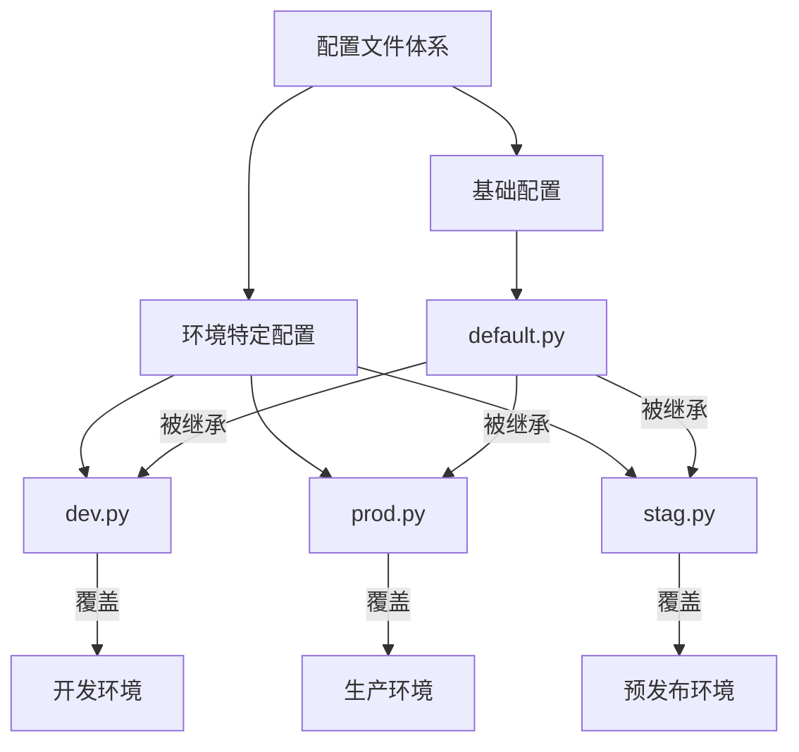
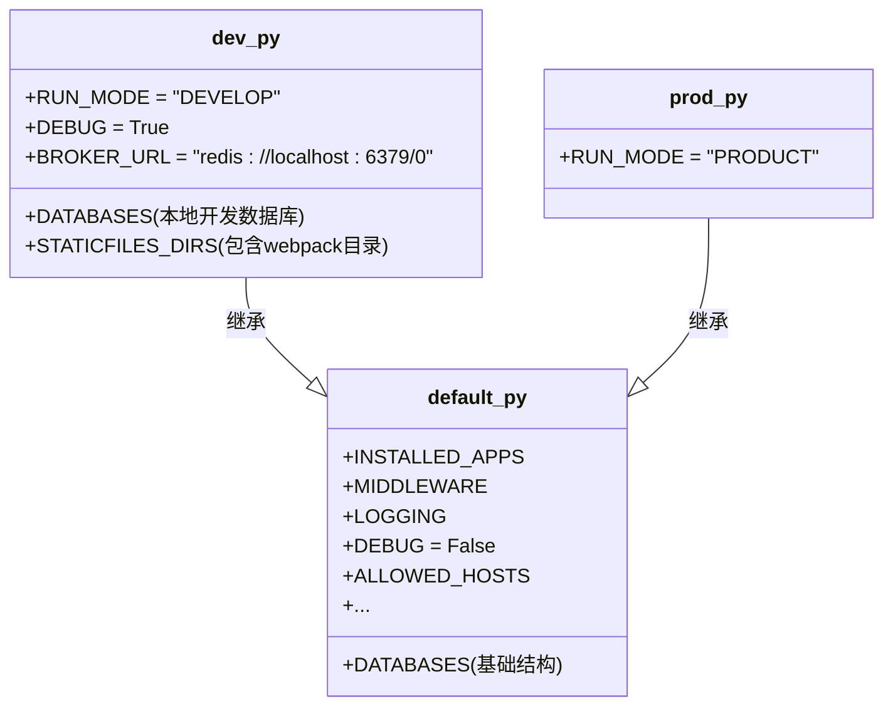
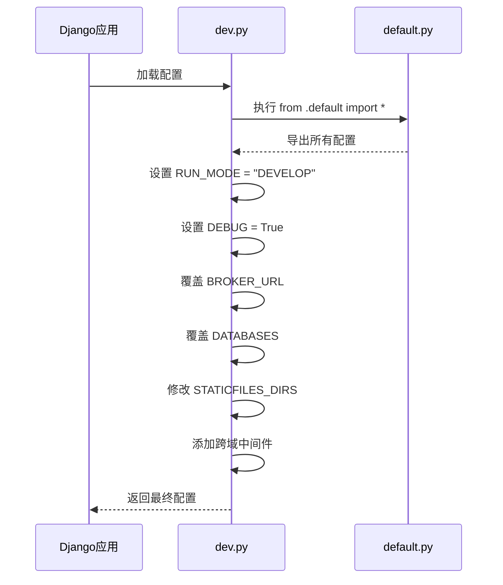
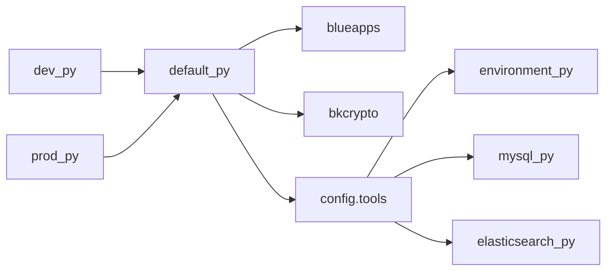

# 配置文件管理

<cite>
**本文档引用的文件**
- [default.py](file://bkmonitor/config/default.py)
- [dev.py](file://bkmonitor/config/dev.py)
- [prod.py](file://bkmonitor/config/prod.py)
</cite>

## 目录
1. [简介](#简介)
2. [项目结构](#项目结构)
3. [核心组件](#核心组件)
4. [架构概述](#架构概述)
5. [详细组件分析](#详细组件分析)
6. [依赖分析](#依赖分析)
7. [性能考虑](#性能考虑)
8. [故障排除指南](#故障排除指南)
9. [结论](#结论)

## 简介
本文档旨在全面阐述bk-monitor系统在容器化环境中的配置文件管理机制。文档详细解析了`dev.py`和`prod.py`配置文件的结构与作用域，阐明了Django配置的继承与覆盖机制。同时，涵盖了配置文件的挂载路径、权限设置、格式要求，以及配置热加载的实现方案和最佳实践。此外，还提供了配置文件版本控制策略、环境差异化配置管理方法，以及配置解析错误的诊断与修复指南。

## 项目结构
bk-monitor项目的配置文件集中存放在`bkmonitor/config/`目录下，采用基于Django框架的模块化配置体系。该体系以`default.py`作为基础配置文件，定义了适用于所有环境的通用设置。通过`dev.py`和`prod.py`等环境特定的配置文件，实现了开发、测试、生产等不同环境的差异化配置。这种分层配置模式遵循了“约定优于配置”的原则，确保了配置的灵活性和可维护性。

**图示来源**
- [default.py](file://bkmonitor/config/default.py)
- [dev.py](file://bkmonitor/config/dev.py)
- [prod.py](file://bkmonitor/config/prod.py)

**本节来源**
- [default.py](file://bkmonitor/config/default.py)
- [dev.py](file://bkmonitor/config/dev.py)
- [prod.py](file://bkmonitor/config/prod.py)

## 核心组件
配置管理的核心组件是`default.py`、`dev.py`和`prod.py`这三个Python文件。`default.py`是整个配置体系的基石，它通过导入Django和蓝鲸PaaS平台的默认设置，并结合项目自身的通用需求，定义了一套完整的、适用于所有环境的基础配置。`dev.py`和`prod.py`则通过`from .default import *`语句继承了`default.py`中的所有配置，并根据各自环境的特点进行覆盖和扩展，从而实现了环境的隔离与定制。

**本节来源**
- [default.py](file://bkmonitor/config/default.py)
- [dev.py](file://bkmonitor/config/dev.py)
- [prod.py](file://bkmonitor/config/prod.py)

## 架构概述
bk-monitor的配置架构采用了一种分层继承模式。`default.py`位于最底层，提供全局默认值。`dev.py`、`prod.py`和`stag.py`位于上层，它们都直接继承自`default.py`。当Django应用启动时，会根据环境变量加载对应的顶层配置文件（如`dev.py`或`prod.py`），该文件会首先加载`default.py`的所有配置，然后执行自身的代码逻辑，覆盖或添加新的配置项。这种架构确保了配置的DRY（Don't Repeat Yourself）原则，减少了重复代码，并使得环境间的差异一目了然。

**图示来源**
- [default.py](file://bkmonitor/config/default.py)
- [dev.py](file://bkmonitor/config/dev.py)
- [prod.py](file://bkmonitor/config/prod.py)

## 详细组件分析
### default.py 分析
`default.py`是配置体系的核心，包含了项目运行所需的所有基础配置。它定义了Django应用的基本设置，如`INSTALLED_APPS`、`MIDDLEWARE`、数据库连接、日志记录、静态文件路径等。此外，它还通过调用`get_backend_mysql_settings()`、`get_grafana_mysql_settings()`等工具函数，从环境变量中动态获取数据库连接信息，实现了配置的外部化。文件中大量的`os.getenv()`调用表明，该系统严重依赖环境变量来注入配置，这在容器化部署中是最佳实践。

**本节来源**
- [default.py](file://bkmonitor/config/default.py#L0-L1631)

### dev.py 分析
`dev.py`文件专为本地开发环境设计。其主要作用是覆盖`default.py`中的某些配置，以适应开发者的本地环境。关键的覆盖项包括：
- **运行模式**：将`RUN_MODE`设置为`"DEVELOP"`，标识当前为开发环境。
- **调试模式**：显式将`DEBUG`设置为`True`，开启Django的调试功能。
- **消息队列**：将`BROKER_URL`指向本地的Redis实例（`redis://localhost:6379/0`），方便开发者在本地测试Celery任务。
- **数据库**：将`DATABASES`配置为使用本地MySQL数据库，用户名为`root`，密码为空，主机为`localhost`，数据库名使用`APP_CODE`。
- **静态文件**：将`STATICFILES_DIRS`扩展，添加了`webpack`目录，以便开发服务器能直接提供由Webpack构建的前端资源。
- **跨域支持**：如果启用了前后端分离开发模式（`FRONTEND_BACKEND_SEPARATION`），则会动态地将`corsheaders`应用和中间件添加到配置中，并允许所有来源的跨域请求。

**图示来源**
- [dev.py](file://bkmonitor/config/dev.py#L0-L74)

**本节来源**
- [dev.py](file://bkmonitor/config/dev.py#L0-L74)

### prod.py 分析
`prod.py`文件用于生产环境。与`dev.py`相比，它的内容非常简洁。其主要作用是将`RUN_MODE`设置为`"PRODUCT"`，以明确标识生产环境。值得注意的是，`prod.py`中没有显式地将`DEBUG`设置为`False`，这是因为`default.py`中已经通过`DEBUG = TEMPLATE_DEBUG = bool(os.getenv("DEBUG", "false").lower() == "true") or ENVIRONMENT == "development"`的逻辑确保了在非开发环境（如生产环境）下`DEBUG`为`False`。这体现了配置继承的优越性，避免了在生产配置中重复设置安全相关的选项。`prod.py`同样包含了跨域支持的逻辑，这表明在生产环境中，前后端分离的架构同样需要处理跨域问题。

**本节来源**
- [prod.py](file://bkmonitor/config/prod.py#L0-L23)

## 依赖分析
配置文件之间存在明确的依赖关系。`dev.py`和`prod.py`都直接依赖于`default.py`，通过`import *`的方式继承其所有配置。这种依赖关系是单向且清晰的。此外，`default.py`本身依赖于多个外部模块和工具函数，例如`blueapps`（蓝鲸PaaS应用框架）、`bkcrypto`（加密库）、以及`config.tools`目录下的`environment.py`、`mysql.py`、`elasticsearch.py`等工具模块。这些工具模块负责从环境变量中解析和构建具体的配置值，实现了配置逻辑的解耦。

**图示来源**
- [default.py](file://bkmonitor/config/default.py)
- [dev.py](file://bkmonitor/config/dev.py)
- [prod.py](file://bkmonitor/config/prod.py)

**本节来源**
- [default.py](file://bkmonitor/config/default.py)
- [dev.py](file://bkmonitor/config/dev.py)
- [prod.py](file://bkmonitor/config/prod.py)

## 性能考虑
在配置管理层面，对性能的主要考虑体现在数据库连接池和日志配置上。`default.py`中通过`dj_db_conn_pool`库实现了数据库连接池，这对于高并发的生产环境至关重要，可以有效避免频繁创建和销毁数据库连接带来的性能开销。日志配置（`LOGGING`）也通过`get_logging_config_dict`函数进行了优化，确保了日志记录的效率。在`dev.py`中，虽然使用了本地数据库和消息队列，但这仅限于开发环境，不会影响生产性能。生产环境的性能更多地依赖于`default.py`中定义的、从环境变量加载的、指向高性能集群的配置。

## 故障排除指南
当遇到配置相关的问题时，应遵循以下步骤进行排查：
1.  **确认环境变量**：检查容器或部署脚本中是否正确设置了所有必需的环境变量，如`BKPAAS_APP_ID`、`BKPAAS_APP_SECRET`、数据库连接信息等。这是最常见的问题来源。
2.  **检查配置继承**：确认`dev.py`或`prod.py`是否正确地从`default.py`继承了配置。检查`from .default import *`语句是否存在且无语法错误。
3.  **验证配置覆盖**：检查环境特定的配置文件（如`dev.py`）是否正确地覆盖了预期的配置项。例如，在开发环境中，确保`BROKER_URL`指向了正确的Redis地址。
4.  **审查日志**：查看应用启动日志，Django通常会在启动时输出加载的配置信息，或者在配置错误时抛出异常，这些日志是诊断问题的关键。
5.  **检查文件路径**：确保Django的`settings`模块能够正确找到`config`目录下的配置文件。这通常由项目的`__init__.py`文件和Django的`DJANGO_SETTINGS_MODULE`环境变量控制。

**本节来源**
- [default.py](file://bkmonitor/config/default.py)
- [dev.py](file://bkmonitor/config/dev.py)
- [prod.py](file://bkmonitor/config/prod.py)

## 结论
bk-monitor系统的配置文件管理采用了一种清晰、高效且符合最佳实践的分层继承架构。以`default.py`为基础，通过`dev.py`和`prod.py`等文件进行环境特定的覆盖，实现了配置的复用和环境的隔离。该系统深度依赖环境变量进行配置注入，非常适合容器化和云原生部署。通过合理使用Django的配置机制和外部工具，该架构在保证灵活性的同时，也兼顾了安全性和性能。遵循本文档的指南，可以有效地管理和维护系统的配置，确保其在不同环境中稳定运行。