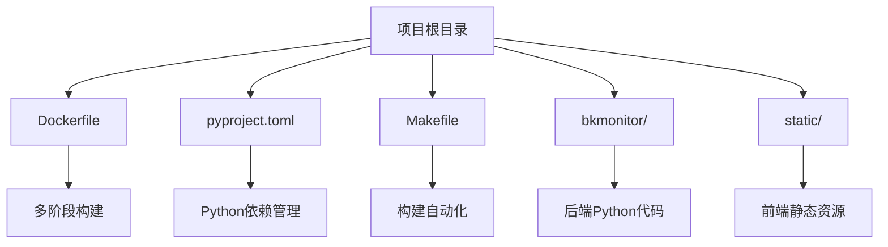
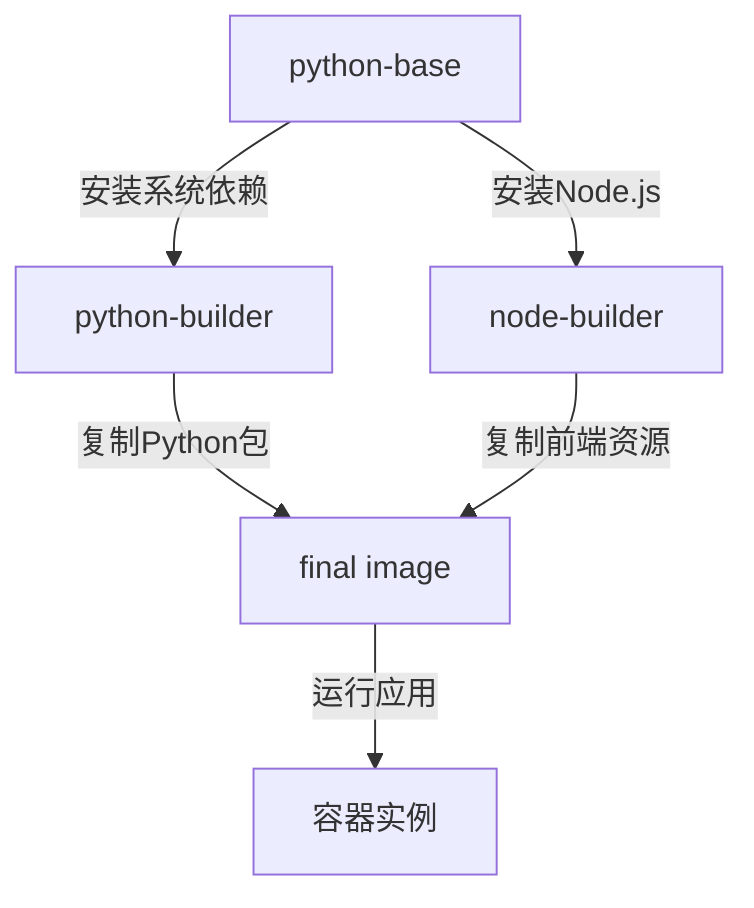
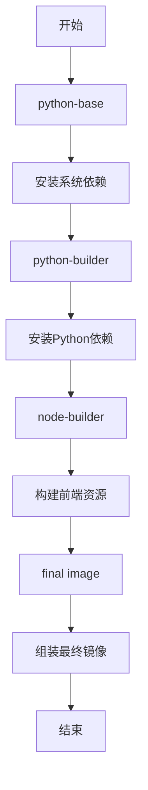
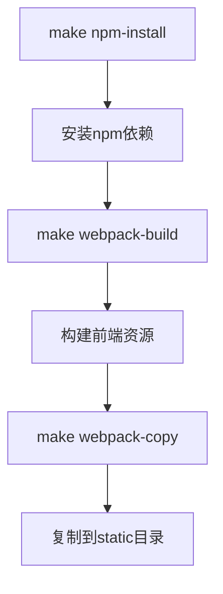
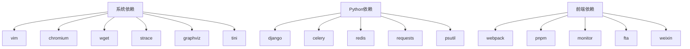

# 容器镜像构建

<cite>
**本文档中引用的文件**  
- [Dockerfile](file://bkmonitor/Dockerfile)
- [pyproject.toml](file://pyproject.toml)
- [Makefile](file://bkmonitor/Makefile)
</cite>

## 目录
1. [简介](#简介)
2. [项目结构](#项目结构)
3. [核心组件](#核心组件)
4. [架构概述](#架构概述)
5. [详细组件分析](#详细组件分析)
6. [依赖分析](#依赖分析)
7. [性能考虑](#性能考虑)
8. [故障排除指南](#故障排除指南)
9. [结论](#结论)

## 简介
本文档详细解析bk-monitor系统的Docker镜像构建过程。通过分析Dockerfile、pyproject.toml和Makefile等关键文件，深入探讨了多阶段构建、Python依赖管理、前端资源构建以及容器优化策略。文档旨在为开发、测试和生产环境提供全面的构建指导。

## 项目结构
bk-monitor项目采用模块化设计，主要包含后端Python应用、前端资源、配置文件和构建脚本。核心应用位于`bkmonitor`目录下，使用Django框架。前端资源通过webpack构建，静态文件存放在`static`目录。构建过程由Dockerfile和Makefile共同驱动，实现了自动化和标准化。



**Diagram sources**
- [Dockerfile](file://bkmonitor/Dockerfile)
- [pyproject.toml](file://pyproject.toml)
- [Makefile](file://bkmonitor/Makefile)

**Section sources**
- [Dockerfile](file://bkmonitor/Dockerfile)
- [pyproject.toml](file://pyproject.toml)
- [Makefile](file://bkmonitor/Makefile)

## 核心组件
容器镜像构建的核心组件包括：
- **Dockerfile**: 定义了多阶段构建流程，从基础镜像到最终镜像的完整过程。
- **pyproject.toml**: 使用现代Python依赖管理标准，替代了传统的requirements.txt。
- **Makefile**: 提供了前端构建和测试镜像构建的自动化命令。

**Section sources**
- [Dockerfile](file://bkmonitor/Dockerfile)
- [pyproject.toml](file://pyproject.toml)
- [Makefile](file://bkmonitor/Makefile)

## 架构概述
bk-monitor的容器镜像构建采用多阶段架构，分为四个主要阶段：基础环境准备、Python依赖构建、前端资源构建和最终镜像组装。这种架构有效分离了构建环境和运行环境，显著减小了最终镜像的体积。



**Diagram sources**
- [Dockerfile](file://bkmonitor/Dockerfile)

## 详细组件分析

### Dockerfile分析
Dockerfile采用多阶段构建策略，确保了构建过程的高效性和最终镜像的轻量化。

#### 多阶段构建流程


**Diagram sources**
- [Dockerfile](file://bkmonitor/Dockerfile)

**Section sources**
- [Dockerfile](file://bkmonitor/Dockerfile)

#### 基础镜像选择
构建从`python:3.11-bookworm`基础镜像开始，并使用`uv`工具进行依赖管理。`uv`是一个快速的Python包安装器和虚拟环境管理器，相比pip能显著提升依赖安装速度。

```dockerfile
FROM python:3.11-bookworm AS python-base
COPY --from=ghcr.io/astral-sh/uv:latest /uv /uvx /bin/
```

#### 系统依赖安装
在`python-base`阶段，安装了必要的系统工具和字体：
- **vim**: 文本编辑器
- **chromium**: 无头浏览器，用于前端测试或截图
- **wget**: 文件下载工具
- **strace**: 系统调用跟踪工具
- **graphviz**: 图形可视化工具
- **tini**: 轻量级init进程，用于处理僵尸进程

同时，安装了思源黑体和思源宋体，确保容器内能正确显示中文。

#### Python依赖管理
项目采用现代Python依赖管理方式，使用`pyproject.toml`和`uv.lock`文件。`pyproject.toml`定义了项目元数据和依赖，`uv.lock`则锁定了依赖的精确版本。

```dockerfile
RUN --mount=type=cache,target=/root/.cache/uv \
    --mount=type=bind,source=pyproject.toml,target=pyproject.toml \
    --mount=type=bind,source=uv.lock,target=uv.lock \
    uv venv venv --seed --link-mode=copy && . venv/bin/activate && uv sync --locked --no-install-project --no-dev --active
```

此指令使用`--mount`选项实现缓存和绑定挂载，提高了构建效率。

#### 前端资源构建
前端构建使用独立的`node:20-bullseye-slim`镜像，避免了Node.js环境对Python环境的干扰。

```dockerfile
FROM node:20-bullseye-slim AS node-builder
RUN npm install -g pnpm@10
COPY ./webpack /app/webpack
RUN cd /app/webpack/ && npm run prod \
    && mkdir -p /app/dist && mv apm monitor fta weixin trace external /app/dist/
```

#### 最终镜像组装
最终镜像从`python-base`阶段继承，复制了构建好的Python虚拟环境和前端资源，并设置了正确的用户权限和环境变量。

```dockerfile
FROM python-base
COPY --from=python-builder --chown=${username}:${username} /app/venv /app/venv
COPY --from=node-builder --chown=${username}:${username} /app/dist/ /app/code/static/
COPY --chown=${username}:${username} . /app/code/
```

### 构建自动化分析
Makefile提供了前端构建的自动化命令，与Dockerfile形成互补。



**Diagram sources**
- [Makefile](file://bkmonitor/Makefile)

**Section sources**
- [Makefile](file://bkmonitor/Makefile)

## 依赖分析
项目依赖分为系统依赖、Python依赖和前端依赖。



**Diagram sources**
- [Dockerfile](file://bkmonitor/Dockerfile)
- [pyproject.toml](file://pyproject.toml)
- [Makefile](file://bkmonitor/Makefile)

## 性能考虑
构建过程充分考虑了性能优化：
- **多阶段构建**: 分离构建和运行环境，减小镜像体积。
- **缓存利用**: 使用`--mount=type=cache`缓存uv和npm依赖。
- **层合并**: 将多个RUN指令合并，减少镜像层数。
- **镜像瘦身**: 使用`--no-install-recommends`和清理apt缓存。

## 故障排除指南
### 依赖冲突
**现象**: `uv sync`命令失败，提示版本冲突。
**解决方案**: 
1. 更新`uv.lock`文件：`uv lock`
2. 清理缓存后重试：`rm -rf /root/.cache/uv && docker build ...`

### 网络问题
**现象**: 下载依赖或字体时超时。
**解决方案**:
1. 确保`replace_debian_source`参数为true，使用腾讯镜像源。
2. 检查网络代理设置。

### 权限错误
**现象**: 容器启动失败，提示权限不足。
**解决方案**:
1. 确保`/data/`, `/app/`, `/home/${username}`目录的所有者正确。
2. 检查`USER ${username}`指令是否正确执行。

**Section sources**
- [Dockerfile](file://bkmonitor/Dockerfile)

## 结论
bk-monitor系统的Docker镜像构建过程体现了现代软件工程的最佳实践。通过多阶段构建、现代依赖管理和自动化脚本，实现了高效、可靠和可重复的构建流程。该构建方案不仅适用于生产环境，也为开发和测试提供了坚实的基础。