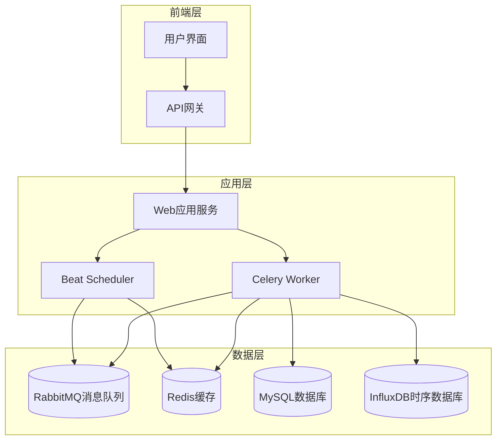
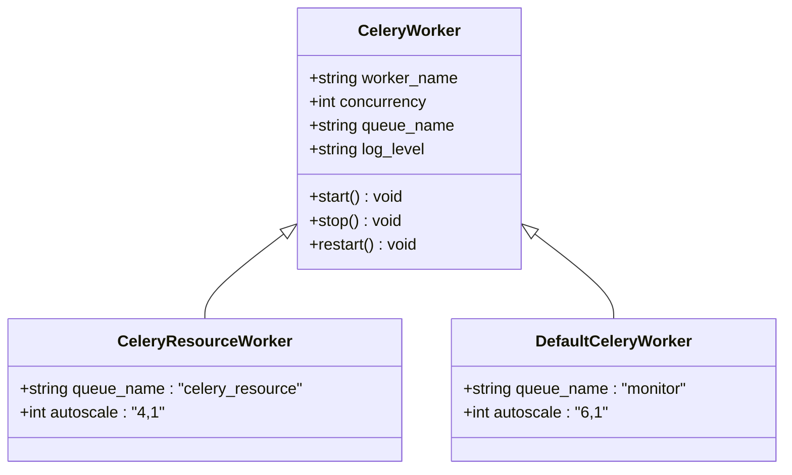
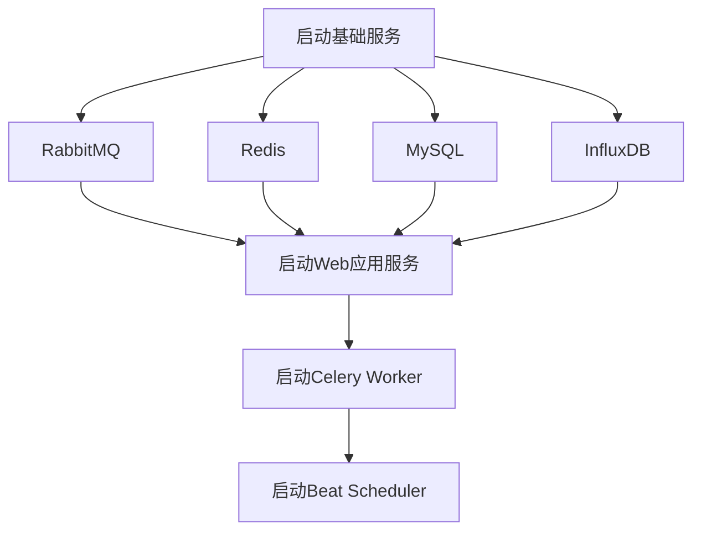
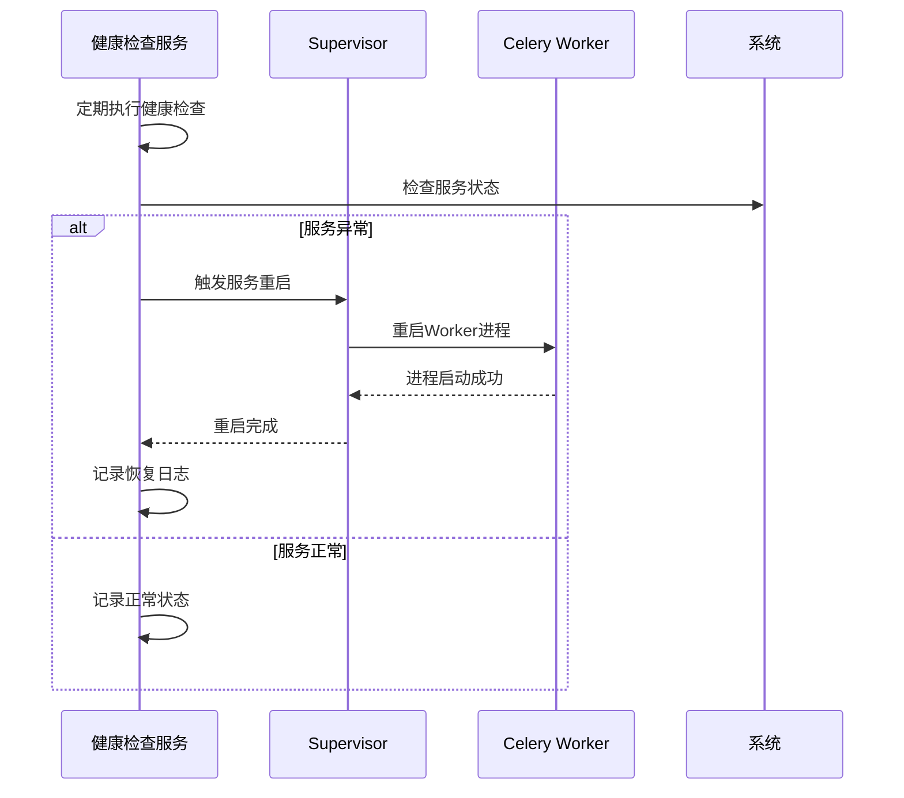
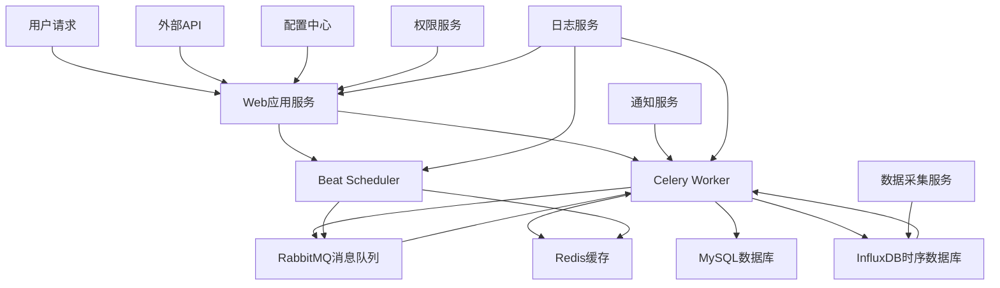

# 服务依赖与启动管理

<cite>
**本文档引用文件**  
- [manage.sh](file://bkmonitor/bin/manage.sh)
- [environ.sh](file://bkmonitor/bin/environ.sh)
- [supervisord.conf](file://bkmonitor/support-files/supervisord.conf)
- [app.py](file://bkmonitor/alarm_backends/service/scheduler/app.py)
- [cron.py](file://bkmonitor/alarm_backends/service/scheduler/tasks/cron.py)
- [healthz.py](file://bkmonitor/alarm_backends/management/commands/healthz.py)
</cite>

## 目录
1. [引言](#引言)
2. [系统架构概览](#系统架构概览)
3. [核心服务组件分析](#核心服务组件分析)
4. [服务依赖关系与启动顺序](#服务依赖关系与启动顺序)
5. [服务启动管理脚本详解](#服务启动管理脚本详解)
6. [Supervisor进程管理配置](#supervisor进程管理配置)
7. [服务健康检查与故障恢复机制](#服务健康检查与故障恢复机制)
8. [服务依赖图谱](#服务依赖图谱)
9. [服务启停标准化流程](#服务启停标准化流程)
10. [总结](#总结)

## 引言
本文档旨在全面解析bk-monitor系统的服务依赖关系与启动管理机制。通过深入分析系统架构中的核心服务组件、依赖关系、启动脚本和进程管理配置，为运维人员提供一套完整的系统管理指南。文档详细说明了Web应用、Celery Worker、Beat Scheduler等关键服务的交互模式和启动顺序，确保系统能够稳定可靠地运行。

## 系统架构概览
bk-monitor系统采用分布式微服务架构，主要由Web应用服务、后台任务处理服务（Celery Worker）、定时任务调度服务（Beat Scheduler）和数据采集服务等核心组件构成。系统通过消息队列（RabbitMQ）实现服务间的异步通信，通过Redis实现任务调度和状态共享，通过Supervisor实现关键服务的高可用性管理。



**图示来源**  
- [supervisord.conf](file://bkmonitor/support-files/supervisord.conf#L32-L46)
- [app.py](file://bkmonitor/alarm_backends/service/scheduler/app.py#L92-L131)

## 核心服务组件分析

### Web应用服务
Web应用服务是系统的入口，负责处理用户请求、提供API接口和管理界面。该服务基于Django框架构建，通过Gunicorn作为WSGI服务器运行。Web服务不仅处理前端请求，还负责触发后台任务和定时任务。

### Celery Worker服务
Celery Worker是后台任务处理的核心组件，负责执行各种异步任务，包括告警处理、数据聚合、策略计算等。根据任务类型的不同，系统配置了多个Celery Worker实例，分别处理不同类型的任务队列。



**图示来源**  
- [supervisord.conf](file://bkmonitor/support-files/supervisord.conf#L32-L46)
- [app.py](file://bkmonitor/alarm_backends/service/scheduler/app.py#L92-L131)

### Beat Scheduler服务
Beat Scheduler是定时任务调度器，负责按照预定的时间间隔触发周期性任务。系统使用RedBeat作为Celery的调度后端，将调度信息存储在Redis中，确保在多节点部署时的调度一致性。

### 数据采集服务
数据采集服务负责从各种数据源收集监控数据，包括主机指标、应用性能数据、日志数据等。采集到的数据经过处理后存储到相应的数据库中，供后续分析和告警使用。

## 服务依赖关系与启动顺序
系统各服务之间存在明确的依赖关系，正确的启动顺序对于系统稳定运行至关重要。服务启动应遵循以下顺序：

1. **基础服务**：首先启动RabbitMQ、Redis、MySQL等基础服务
2. **Web应用服务**：启动Web应用服务，初始化数据库连接和配置
3. **Celery Worker服务**：启动后台任务处理服务，连接消息队列
4. **Beat Scheduler服务**：启动定时任务调度服务，开始调度周期性任务

这种启动顺序确保了服务间的依赖关系得到满足，避免因依赖服务未启动而导致的错误。



**图示来源**  
- [supervisord.conf](file://bkmonitor/support-files/supervisord.conf#L32-L46)
- [app.py](file://bkmonitor/alarm_backends/service/scheduler/app.py#L92-L131)

## 服务启动管理脚本详解
系统提供了`manage.sh`脚本作为服务启动的统一入口，该脚本封装了各种服务的启动命令，简化了运维操作。

### manage.sh脚本分析
`manage.sh`脚本位于`bkmonitor/bin/`目录下，是系统服务管理的主要入口。脚本首先设置运行环境，然后调用Django的`manage.py`执行相应的命令。

```bash
#!/bin/bash
SCRIPT_DIR=`dirname $0`
cd $SCRIPT_DIR && cd .. || exit 1

source bin/environ.sh

############
# MainLoop #
############

echo "[ INFO ] DJANGO_CONF_MODULE: \"$DJANGO_CONF_MODULE\"" >&2

${PYTHON_BIN:-python} manage.py $@
```

**脚本功能说明**：
- `SCRIPT_DIR`：获取脚本所在目录
- `source bin/environ.sh`：加载环境变量配置
- `${PYTHON_BIN:-python} manage.py $@`：执行Django管理命令，传递所有参数

**脚本来源**  
- [manage.sh](file://bkmonitor/bin/manage.sh#L1-L13)

### environ.sh环境配置
`environ.sh`脚本负责设置系统运行所需的环境变量，包括部署环境、平台类型和Django配置模块等。

```bash
#!/bin/bash

ENVIRONMENT="development"

if [ 0"$BKAPP_DEPLOY_PLATFORM" = "0" ]; then
    PLATFORM="tencent"
else
    PLATFORM="$BKAPP_DEPLOY_PLATFORM"
fi

export DJANGO_CONF_MODULE="conf.worker.${ENVIRONMENT}.${PLATFORM}"
```

**环境变量说明**：
- `ENVIRONMENT`：部署环境，如development、production等
- `PLATFORM`：部署平台，如tencent等
- `DJANGO_CONF_MODULE`：Django配置模块路径，根据环境和平台动态生成

**脚本来源**  
- [environ.sh](file://bkmonitor/bin/environ.sh#L1-L12)

## Supervisor进程管理配置
系统使用Supervisor作为进程管理工具，确保关键服务的高可用性。Supervisor配置文件`supervisord.conf`定义了各个服务的启动参数、日志路径和自动重启策略。

### Supervisor配置分析
```ini
[program: {{.app_code}}_uwsgi]
command = /cache/.bk/env/bin/gunicorn wsgi -w 4 -t 8 -p {{.app_container_path}}run/nginx.pid -b unix:{{.app_container_path}}run/nginx.sock -e SCRIPT_NAME=/o/{{.app_code}} -e DJANGO_SETTINGS_MODULE=settings --timeout 300 --max-requests 1000
directory = {{.app_container_path}}code/
stdout_logfile = {{.app_container_path}}logs/{{.app_code}}/uwsgi.log
redirect_stderr = true
autorestart = true
environment = {{.environment}}

[program: {{.app_code}}_celery]
command = /cache/.bk/env/bin/python {{.app_container_path}}code/manage.py celery worker -n {{.app_code}}{{.node_name}} -l INFO --autoscale=6,1
directory = {{.app_container_path}}code/
stdout_logfile = {{.app_container_path}}logs/{{.app_code}}/celery.log
redirect_stderr = true
stopwaitsecs = 10
autorestart = true
environment = {{.environment}}

[program: {{.app_code}}_celery_resource]
command = /cache/.bk/env/bin/python {{.app_container_path}}code/manage.py celery worker -n {{.app_code}}{{.node_name}} -l INFO --autoscale=4,1 -Q celery_resource
directory = {{.app_container_path}}code/
stdout_logfile = {{.app_container_path}}logs/{{.app_code}}/celery.log
redirect_stderr = true
stopwaitsecs = 10
autorestart = true
environment = {{.environment}}
```

**配置项说明**：
- `command`：服务启动命令
- `directory`：工作目录
- `stdout_logfile`：标准输出日志文件路径
- `redirect_stderr`：是否将错误输出重定向到标准输出
- `autorestart`：是否自动重启，true表示服务异常退出后自动重启
- `stopwaitsecs`：停止服务时的等待时间（秒）
- `environment`：环境变量

**配置来源**  
- [supervisord.conf](file://bkmonitor/support-files/supervisord.conf#L32-L46)

## 服务健康检查与故障恢复机制
系统内置了完善的健康检查机制，能够自动检测服务状态并在发现问题时进行故障恢复。

### 健康检查命令
系统通过`healthz`管理命令实现健康检查功能，该命令定期检查各个服务组件的运行状态。

```python
class Command(BaseCommand):
    help = "运维小帮手"

    def add_arguments(self, parser):
        parser.add_argument(
            "-d",
            action="store_true",
            help="以守护进程方式运行",
        )
        parser.add_argument(
            "-i", metavar="SECONDS", dest="interval", type=int, default=600, help="运行间隔（秒）"
        )

    def handle(self, *args, **options):
        if options.get("d"):
            self.run_daemon(interval=options["interval"])
        else:
            self.run_once(options.get("t"))
```

**健康检查流程**：
1. 定期执行健康检查
2. 检查各服务组件的状态
3. 发现问题时记录并尝试自动修复
4. 通过通知渠道（如短信、微信）告警

### 故障自动恢复策略
系统采用多层次的故障恢复策略：

1. **进程级恢复**：通过Supervisor的`autorestart`功能，实现服务进程的自动重启
2. **任务级恢复**：Celery Worker具有任务重试机制，确保重要任务最终能够完成
3. **系统级恢复**：健康检查服务定期检测系统状态，发现问题时触发修复流程



**代码来源**  
- [healthz.py](file://bkmonitor/alarm_backends/management/commands/healthz.py#L69-L114)

## 服务依赖图谱
为了帮助运维人员更好地理解系统拓扑结构，以下是系统各组件之间的依赖关系图谱。



**图谱来源**  
- [supervisord.conf](file://bkmonitor/support-files/supervisord.conf#L32-L46)
- [app.py](file://bkmonitor/alarm_backends/service/scheduler/app.py#L92-L131)
- [healthz.py](file://bkmonitor/alarm_backends/management/commands/healthz.py#L69-L114)

## 服务启停标准化流程
为了确保系统稳定运行，建议遵循以下标准化的服务启停流程。

### 服务启动流程
1. **准备阶段**：
   - 确认所有基础服务（RabbitMQ、Redis、MySQL等）已启动
   - 检查磁盘空间、内存等系统资源充足
   - 确认配置文件正确无误

2. **启动阶段**：
   ```bash
   # 1. 启动Web应用服务
   supervisorctl start bkmonitor_uwsgi
   
   # 2. 启动Celery Worker
   supervisorctl start bkmonitor_celery
   
   # 3. 启动Celery Resource Worker
   supervisorctl start bkmonitor_celery_resource
   
   # 4. 启动Beat Scheduler
   supervisorctl start bkmonitor_beat
   ```

3. **验证阶段**：
   - 检查各服务进程状态
   - 验证服务日志无异常
   - 通过健康检查命令确认系统状态

### 服务停止流程
1. **准备阶段**：
   - 通知相关人员服务将要停止
   - 确认无重要任务正在执行

2. **停止阶段**：
   ```bash
   # 1. 停止Beat Scheduler
   supervisorctl stop bkmonitor_beat
   
   # 2. 停止Celery Worker
   supervisorctl stop bkmonitor_celery
   supervisorctl stop bkmonitor_celery_resource
   
   # 3. 停止Web应用服务
   supervisorctl stop bkmonitor_uwsgi
   ```

3. **验证阶段**：
   - 确认所有服务进程已停止
   - 检查系统资源释放情况

### 注意事项
- **启动顺序**：必须严格按照依赖关系的顺序启动服务
- **停止顺序**：与启动顺序相反，先停止上层服务，再停止底层服务
- **监控日志**：启停过程中密切关注服务日志，及时发现并处理异常
- **备份配置**：在进行重大变更前，务必备份相关配置文件

## 总结
本文档详细解析了bk-monitor系统的服务依赖关系与启动管理机制。通过分析系统架构、核心组件、启动脚本、进程管理和健康检查机制，为运维人员提供了一套完整的系统管理指南。正确的服务启动顺序、完善的进程管理配置和自动化的故障恢复机制，共同确保了系统的高可用性和稳定性。建议运维人员严格按照本文档提供的标准化流程进行操作，以保障系统的可靠运行。