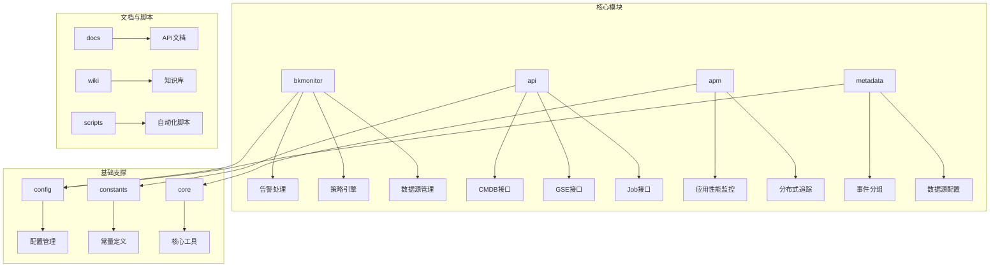
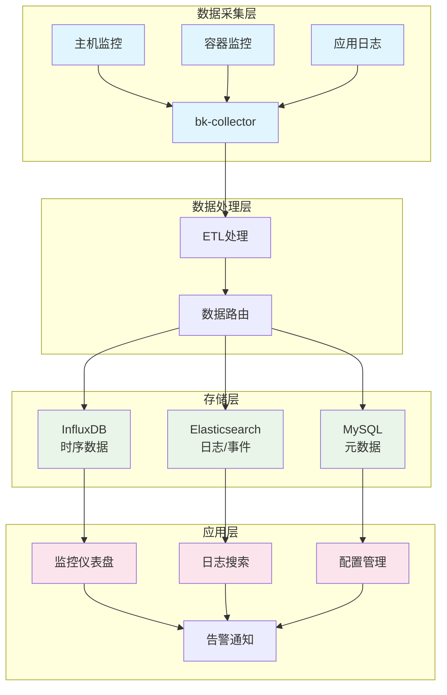
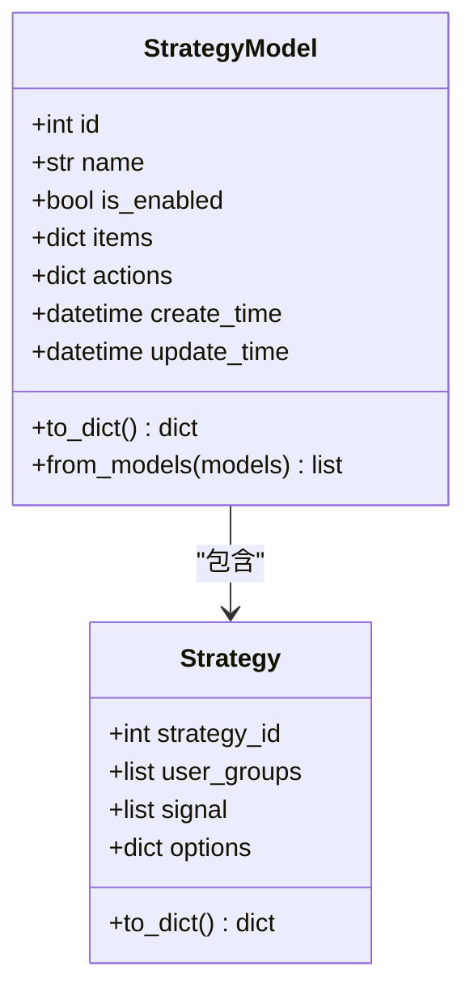
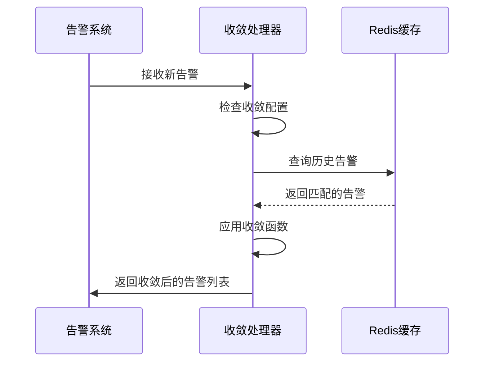
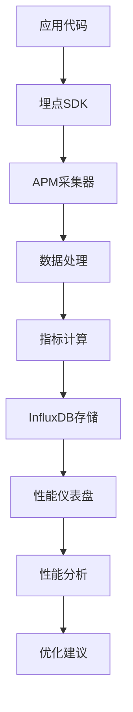
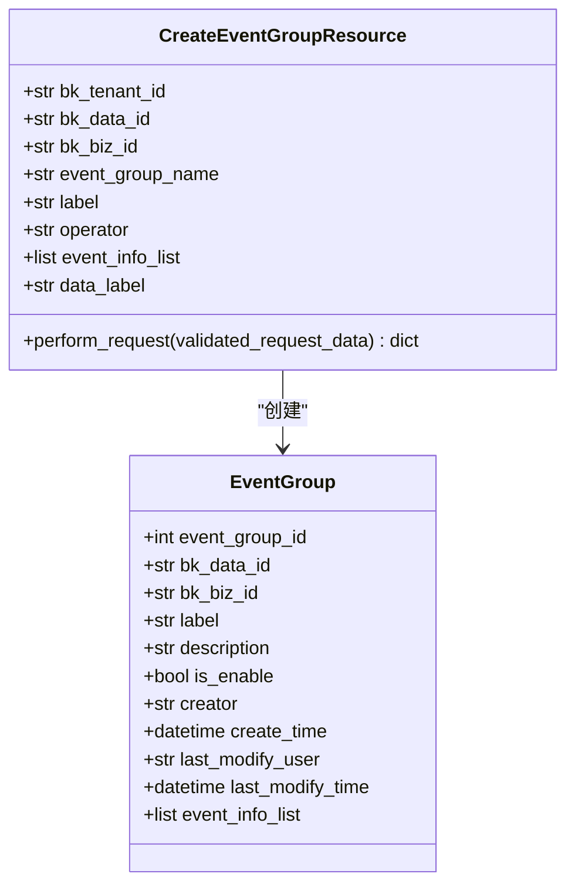
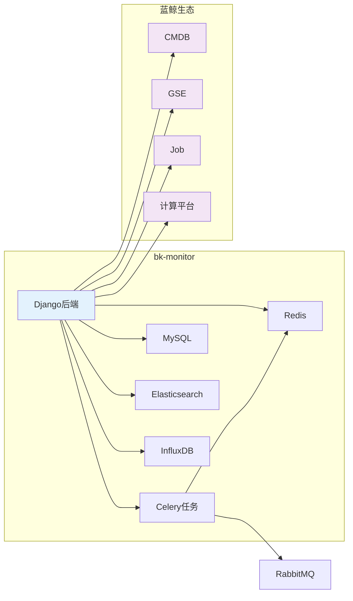

# 项目概述

<cite>
**本文档引用的文件**
- [bkmonitor关联BCS集群.md](file:///Users/zhangsan/bk-monitor/wiki/bkmonitor关联BCS集群.md)
- [GSE(通用服务引擎).md](file:///Users/zhangsan/bk-monitor/wiki/GSE(通用服务引擎).md)
- [alarm_backends\service\converge\dimension.py](file:///Users/zhangsan/bk-monitor/bkmonitor/alarm_backends/service/converge/dimension.py)
- [alarm_backends\service\converge\processor.py](file:///Users/zhangsan/bk-monitor/bkmonitor/alarm_backends/service/converge/processor.py)
- [constants\action.py](file:///Users/zhangsan/bk-monitor/bkmonitor/constants/action.py)
- [config\celery\celery.py](file:///Users/zhangsan/bk-monitor/bkmonitor/config/celery/celery.py)
- [alarm_backends\service\scheduler\app.py](file:///Users/zhangsan/bk-monitor/bkmonitor/alarm_backends/service/scheduler/app.py)
- [alarm_backends\core\storage\redis.py](file:///Users/zhangsan/bk-monitor/bkmonitor/alarm_backends/core/storage/redis.py)
- [apm\core\platform_config.py](file:///Users/zhangsan/bk-monitor/bkmonitor/apm/core/platform_config.py)
- [metadata\resources\resources.py](file:///Users/zhangsan/bk-monitor/bkmonitor/metadata/resources/resources.py)
- [kernel_api\views\v4\strategy_v3.py](file:///Users/zhangsan/bk-monitor/bkmonitor/kernel_api/views/v4/strategy_v3.py)
</cite>

## 目录
1. [引言](#引言)
2. [项目结构](#项目结构)
3. [核心功能模块](#核心功能模块)
4. [系统架构设计](#系统架构设计)
5. [详细组件分析](#详细组件分析)
6. [依赖关系分析](#依赖关系分析)
7. [性能考量](#性能考量)
8. [故障排除指南](#故障排除指南)
9. [结论](#结论)

## 引言
蓝鲸监控（bk-monitor）平台是一个企业级的综合监控系统，旨在为大规模分布式环境提供全面的可观测性解决方案。本项目概述将深入介绍bk-monitor的核心功能、架构设计和应用场景。作为蓝鲸智云（BlueKing）生态的核心组件，bk-monitor不仅提供基础的指标采集和告警功能，还集成了APM（应用性能监控）、事件管理、智能分析等高级能力。系统通过Django框架构建后端服务，利用Celery实现异步任务处理，并依赖MySQL、Redis和Elasticsearch等技术组件进行数据存储与检索。bk-monitor与蓝鲸生态中的CMDB（配置管理数据库）、GSE（通用服务引擎）、Job（作业平台）等组件深度集成，形成了一个完整的自动化运维体系。本文档旨在为初学者提供概念性概述，同时为经验丰富的开发者提供技术细节，帮助理解系统的整体边界、服务依赖和部署拓扑。

## 项目结构
bk-monitor项目采用模块化设计，代码结构清晰，各模块职责分明。项目根目录下包含多个核心子目录，如`ai_agent`、`bkmonitor`、`api`、`apm`、`metadata`等，每个子目录代表一个功能模块或服务。`bkmonitor`是核心监控模块，包含了告警处理、策略引擎、数据源管理等关键功能。`api`目录定义了与蓝鲸生态中其他组件的接口，如CMDB、GSE、Job等，确保了系统的集成能力。`apm`模块专注于应用性能监控，提供了对分布式追踪和性能指标的深度支持。`metadata`模块负责元数据管理，包括事件分组、数据源配置等。此外，项目还包含`config`、`constants`、`core`等基础支撑模块，以及`docs`、`wiki`等文档资源。这种结构化的组织方式使得系统易于维护和扩展。

**图示来源**
- [bkmonitor](file:///Users/zhangsan/bk-monitor/bkmonitor)
- [api](file:///Users/zhangsan/bk-monitor/bkmonitor/api)
- [apm](file:///Users/zhangsan/bk-monitor/bkmonitor/apm)
- [metadata](file:///Users/zhangsan/bk-monitor/bkmonitor/metadata)

## 核心功能模块
bk-monitor平台的核心功能围绕监控数据的全生命周期管理展开，主要包括指标采集、告警处理、APM监控和事件管理四大模块。

### 指标采集
通过`bk-collector`采集器从各种数据源（如主机、容器、应用）收集监控数据。采集器支持多种协议和格式，能够自动发现监控目标并上报数据。

### 告警处理
告警处理模块是系统的核心，负责根据预定义的策略对监控数据进行分析，触发告警，并通过多种渠道通知相关人员。该模块支持复杂的告警收敛和降噪策略，避免告警风暴。

### APM监控
APM模块提供对应用性能的深度监控，包括分布式追踪、性能指标采集和分析。它能够帮助开发者快速定位性能瓶颈，优化应用性能。

### 事件管理
事件管理模块负责对监控事件进行分类、聚合和处理。它支持创建事件分组，定义事件处理流程，并与告警系统集成，实现事件的闭环管理。

**模块来源**
- [bkmonitor](file:///Users/zhangsan/bk-monitor/bkmonitor)
- [apm](file:///Users/zhangsan/bk-monitor/bkmonitor/apm)
- [metadata](file:///Users/zhangsan/bk-monitor/bkmonitor/metadata)

## 系统架构设计
bk-monitor采用分层架构设计，整体分为数据采集层、数据处理层、存储层和应用层。数据采集层由`bk-collector`组成，负责从各种数据源收集监控数据。数据处理层包括ETL（提取、转换、加载）处理和数据路由，对采集到的数据进行清洗、标准化和路由。存储层由多种数据库组成，包括InfluxDB用于存储时序数据，Elasticsearch用于存储日志和事件数据，MySQL用于存储元数据。应用层是系统的前端，提供用户界面和API接口，供用户配置监控策略、查看监控数据和管理告警。

**图示来源**
- [bkmonitor关联BCS集群.md](file:///Users/zhangsan/bk-monitor/wiki/bkmonitor关联BCS集群.md)
- [config\celery\celery.py](file:///Users/zhangsan/bk-monitor/bkmonitor/config/celery/celery.py)

## 详细组件分析
本节将对bk-monitor中的关键组件进行深入分析，包括策略引擎、告警收敛、APM监控和事件管理。

### 策略引擎分析
策略引擎是bk-monitor的核心，负责定义和执行监控策略。策略配置包括监控目标、检测条件、告警级别和通知方式等。策略引擎通过`kernel_api\views\v4\strategy_v3.py`中的`StrategyModel`类实现，支持复杂的条件过滤和动态更新。

**图示来源**
- [kernel_api\views\v4\strategy_v3.py](file:///Users/zhangsan/bk-monitor/bkmonitor/kernel_api/views/v4/strategy_v3.py)
- [bkmonitor\strategy\new_strategy.py](file:///Users/zhangsan/bk-monitor/bkmonitor/strategy/new_strategy.py)

### 告警收敛分析
告警收敛功能旨在减少重复告警，提高告警的有效性。系统通过`alarm_backends\service\converge`模块实现告警收敛，支持基于时间窗口和维度的收敛策略。收敛配置包括`converge_func`（收敛函数）、`timedelta`（时间窗口）和`condition`（收敛条件）等参数。

**图示来源**
- [alarm_backends\service\converge\processor.py](file:///Users/zhangsan/bk-monitor/bkmonitor/alarm_backends/service/converge/processor.py)
- [alarm_backends\service\converge\dimension.py](file:///Users/zhangsan/bk-monitor/bkmonitor/alarm_backends/service/converge/dimension.py)
- [constants\action.py](file:///Users/zhangsan/bk-monitor/bkmonitor/constants/action.py)

### APM监控分析
APM模块通过`apm\core\platform_config.py`定义内置指标和配置规则，支持对应用性能的全面监控。内置指标包括`bk_apm_count`、`bk_apm_duration`等，用于衡量请求的计数、持续时间等性能指标。

**图示来源**
- [apm\core\platform_config.py](file:///Users/zhangsan/bk-monitor/bkmonitor/apm/core/platform_config.py)

### 事件管理分析
事件管理模块通过`metadata\resources\resources.py`中的`CreateEventGroupResource`类实现事件分组的创建和管理。事件分组允许用户将相关的事件归类，便于统一处理和分析。

**图示来源**
- [metadata\resources\resources.py](file:///Users/zhangsan/bk-monitor/bkmonitor/metadata/resources/resources.py)

## 依赖关系分析
bk-monitor系统依赖于多个外部组件和技术栈，形成了一个复杂的依赖网络。系统后端基于Django框架，使用Celery进行异步任务处理，通过RabbitMQ作为消息代理。数据存储方面，系统依赖MySQL存储元数据，Redis作为缓存和任务队列，Elasticsearch存储日志和事件数据，InfluxDB存储时序数据。此外，系统与蓝鲸生态中的多个组件深度集成，包括CMDB用于获取主机和业务信息，GSE用于执行远程命令和文件分发，Job用于执行运维任务。

**图示来源**
- [config\celery\celery.py](file:///Users/zhangsan/bk-monitor/bkmonitor/config/celery/celery.py)
- [alarm_backends\service\scheduler\app.py](file:///Users/zhangsan/bk-monitor/bkmonitor/alarm_backends/service/scheduler/app.py)
- [alarm_backends\core\storage\redis.py](file:///Users/zhangsan/bk-monitor/bkmonitor/alarm_backends/core/storage/redis.py)

## 性能考量
bk-monitor在设计时充分考虑了性能和可扩展性。系统通过异步任务处理和消息队列来解耦高延迟操作，确保核心服务的响应速度。数据存储采用分布式数据库，支持水平扩展，能够处理大规模监控数据。缓存机制被广泛应用于减少数据库查询，提高系统整体性能。此外，系统支持多集群部署，可以根据业务需求灵活调整资源分配。

## 故障排除指南
当遇到系统问题时，建议按照以下步骤进行排查：
1. 检查Django后端服务是否正常运行。
2. 查看Celery任务队列是否有积压任务。
3. 检查Redis、MySQL、Elasticsearch等数据库的连接和性能。
4. 查阅系统日志，定位具体错误信息。
5. 验证与蓝鲸生态组件的集成是否正常。

## 结论
bk-monitor是一个功能强大、架构完善的企业级监控平台。它不仅提供了基础的监控能力，还通过与蓝鲸生态的深度集成，实现了自动化运维的闭环。系统的模块化设计和分层架构使其易于维护和扩展。未来，随着AI和大数据技术的发展，bk-monitor有望在智能告警、预测性维护等方面实现更多创新。