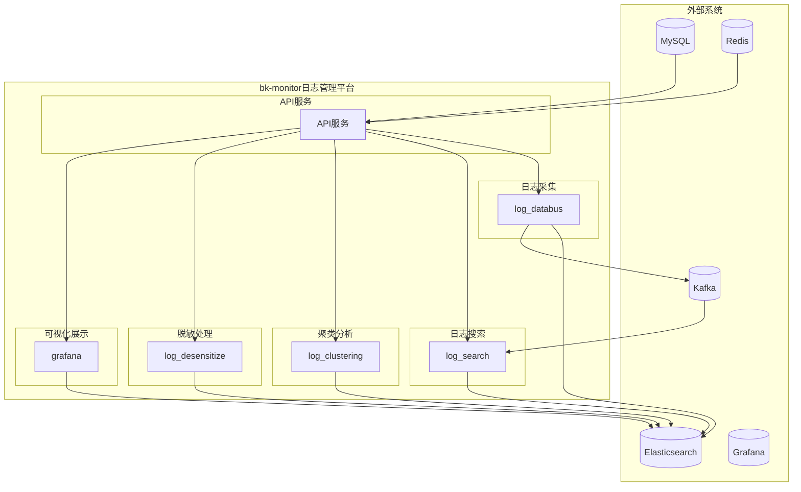

# 项目概述

<cite>
**本文档引用的文件**
- [README.md](file://README.md)
- [settings.py](file://bklog/settings.py)
- [urls.py](file://bklog/urls.py)
- [default.py](file://bklog/config/default.py)
- [requirements.txt](file://bklog/requirements.txt)
- [architecture.md](file://docs/overview/architecture.md)
- [code_framework.md](file://docs/overview/code_framework.md)
- [log_search/apps.py](file://bklog/apps/log_search/apps.py)
- [log_databus/apps.py](file://bklog/apps/log_databus/apps.py)
- [log_clustering/apps.py](file://bklog/apps/log_clustering/apps.py)
</cite>

## 目录
1. [引言](#引言)
2. [项目结构](#项目结构)
3. [核心功能](#核心功能)
4. [架构设计](#架构设计)
5. [技术栈](#技术栈)
6. [蓝鲸PaaS平台集成](#蓝鲸paas平台集成)
7. [系统上下文图](#系统上下文图)
8. [结论](#结论)

## 引言

蓝鲸监控平台（BK-MONITOR）是蓝鲸智云官方推出的一款监控平台产品，旨在满足不同监控场景的需求，提高监控的及时性、准确性和智能化水平。该平台依托于蓝鲸PaaS平台，具备丰富的数据采集能力、大规模的数据处理能力和简单易用的特点，同时提供强大的平台扩展能力。bk-monitor日志管理平台作为蓝鲸生态中的日志解决方案，专注于日志的采集、搜索、聚类分析、脱敏处理和可视化展示等核心功能。

本项目概述文档旨在为初学者提供高层次的理解，同时为经验丰富的开发者提供足够的技术深度。文档将详细介绍bk-monitor日志管理平台的核心功能和架构设计，解释其在蓝鲸生态中的定位，并阐述与其他蓝鲸组件的集成方式。

**文档来源**
- [README.md](file://README.md)

## 项目结构

bk-monitor日志管理平台的项目结构遵循Django框架的标准布局，同时根据微服务化设计进行了优化。项目根目录包含多个子目录和文件，其中`bklog/`目录是核心应用所在位置。`bklog/`目录下包含`apps/`目录，该目录中每个子目录代表一个独立的Django应用，如`log_search`、`log_databus`、`log_clustering`等，这些应用分别负责不同的功能模块。

`config/`目录包含不同环境的配置文件，如`dev.py`、`prod.py`等，用于区分开发、测试和生产环境的配置。`docs/`目录包含项目的文档，如架构设计、代码框架等。`scripts/`目录包含各种脚本，用于部署、测试等操作。`static/`和`templates/`目录分别存放静态资源和模板文件。

**文档来源**
- [README.md](file://README.md)
- [project_structure](file://project_structure)

## 核心功能

bk-monitor日志管理平台的核心功能包括日志采集、搜索、聚类分析、脱敏处理和可视化展示。这些功能通过多个独立的Django应用实现，每个应用负责特定的功能模块。

### 日志采集

日志采集功能由`log_databus`应用实现，负责从各种数据源收集日志数据。该应用支持多种采集方式，包括文件采集、网络采集等，并能够将采集到的数据发送到Elasticsearch进行存储和索引。

### 日志搜索

日志搜索功能由`log_search`应用实现，提供强大的日志查询能力。用户可以通过关键词、时间范围、日志级别等条件进行搜索，并支持复杂的查询语法。该应用还提供了实时日志查看功能，帮助用户快速定位问题。

### 聚类分析

聚类分析功能由`log_clustering`应用实现，利用机器学习算法对日志数据进行聚类，帮助用户发现日志中的模式和异常。该功能可以自动识别日志中的常见错误和异常情况，提高问题排查的效率。

### 脱敏处理

脱敏处理功能由`log_desensitize`应用实现，用于保护敏感信息。该应用可以在日志数据进入系统之前对其进行脱敏处理，确保敏感信息不会被泄露。

### 可视化展示

可视化展示功能由`grafana`应用实现，提供丰富的图表和仪表盘，帮助用户直观地了解日志数据的分布和趋势。用户可以自定义仪表盘，添加各种图表，如柱状图、折线图等。

**文档来源**
- [README.md](file://README.md)
- [urls.py](file://bklog/urls.py)
- [log_search/apps.py](file://bklog/apps/log_search/apps.py)
- [log_databus/apps.py](file://bklog/apps/log_databus/apps.py)
- [log_clustering/apps.py](file://bklog/apps/log_clustering/apps.py)

## 架构设计

bk-monitor日志管理平台采用基于Django框架的MVC架构模式和微服务化设计。整个系统由多个独立的Django应用组成，每个应用负责特定的功能模块，通过API进行通信。这种设计使得系统具有良好的可扩展性和可维护性。

### MVC架构模式

MVC（Model-View-Controller）架构模式将应用程序分为三个主要部分：模型（Model）、视图（View）和控制器（Controller）。模型负责数据的存储和管理，视图负责数据的展示，控制器负责处理用户请求并协调模型和视图之间的交互。在bk-monitor中，每个Django应用都遵循MVC架构模式，确保代码的清晰和模块化。

### 微服务化设计

微服务化设计将系统分解为多个小型、独立的服务，每个服务都可以独立部署和扩展。在bk-monitor中，每个功能模块作为一个独立的Django应用，通过API进行通信。这种设计使得系统更加灵活，可以根据需要独立扩展某个服务，而不会影响其他服务。

**文档来源**
- [README.md](file://README.md)
- [code_framework.md](file://docs/overview/code_framework.md)
- [settings.py](file://bklog/settings.py)

## 技术栈

bk-monitor日志管理平台的技术栈包括Django 4.2.22、Django REST framework、Celery等关键技术。这些技术的选择确保了系统的高性能、高可用性和易维护性。

### Django 4.2.22

Django是一个高级的Python Web框架，允许快速开发安全和维护性高的网站。bk-monitor使用Django 4.2.22版本，利用其强大的ORM、URL路由、模板引擎等功能，构建了稳定可靠的后端服务。

### Django REST framework

Django REST framework是一个强大的工具包，用于构建Web API。bk-monitor使用Django REST framework来创建RESTful API，提供标准化的接口供前端和其他服务调用。

### Celery

Celery是一个分布式任务队列，用于处理异步任务和定时任务。bk-monitor使用Celery来处理日志采集、聚类分析等耗时任务，确保系统的响应速度和稳定性。

### 其他技术

- **Elasticsearch**: 用于日志数据的存储和搜索。
- **MySQL**: 用于存储系统配置和元数据。
- **Redis**: 用于缓存和消息队列。
- **Kafka**: 用于日志数据的传输。
- **Grafana**: 用于日志数据的可视化展示。

**文档来源**
- [requirements.txt](file://bklog/requirements.txt)
- [settings.py](file://bklog/settings.py)

## 蓝鲸PaaS平台集成

bk-monitor日志管理平台作为蓝鲸PaaS平台的一部分，与蓝鲸PaaS平台紧密集成。通过蓝鲸PaaS平台，bk-monitor可以轻松地与其他蓝鲸组件（如IAM、CMDB）进行集成，形成完整的监控闭环。

### IAM集成

IAM（Identity and Access Management）是蓝鲸PaaS平台的身份和访问管理服务。bk-monitor通过IAM实现用户身份验证和权限管理，确保只有授权用户才能访问系统资源。

### CMDB集成

CMDB（Configuration Management Database）是蓝鲸PaaS平台的配置管理数据库。bk-monitor通过CMDB获取主机和应用的配置信息，实现对主机和应用的全面监控。

### 其他集成

- **BK-LOG**: 与蓝鲸日志平台集成，实现日志数据的统一管理和分析。
- **BK-SOPS**: 与标准运维平台集成，实现自动化运维任务。
- **BK-CMDB**: 与配置管理平台集成，实现资产和应用的管理。

**文档来源**
- [README.md](file://README.md)
- [default.py](file://bklog/config/default.py)

## 系统上下文图

**图示来源**
- [urls.py](file://bklog/urls.py)
- [settings.py](file://bklog/settings.py)
- [requirements.txt](file://bklog/requirements.txt)

## 结论

bk-monitor日志管理平台作为蓝鲸生态中的日志解决方案，具备强大的日志采集、搜索、聚类分析、脱敏处理和可视化展示功能。通过基于Django框架的MVC架构模式和微服务化设计，系统具有良好的可扩展性和可维护性。与蓝鲸PaaS平台的紧密集成，使得bk-monitor能够与其他蓝鲸组件协同工作，形成完整的监控闭环。无论是初学者还是经验丰富的开发者，都可以通过本项目概述文档获得对bk-monitor日志管理平台的全面理解。

**文档来源**
- [README.md](file://README.md)
- [architecture.md](file://docs/overview/architecture.md)
- [code_framework.md](file://docs/overview/code_framework.md)