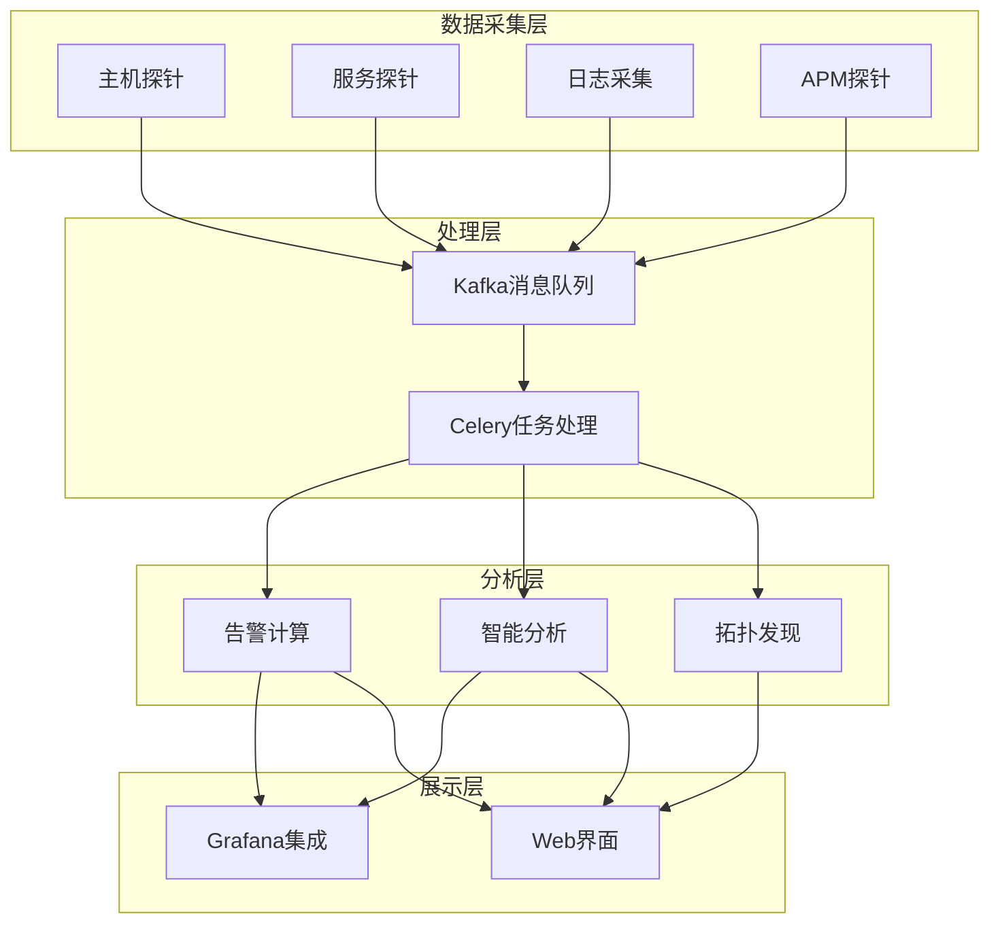
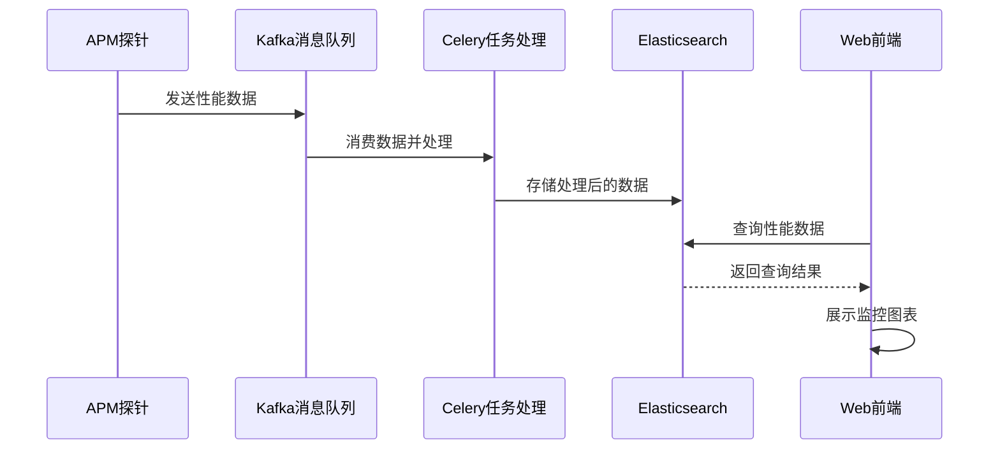

# 项目概述

<cite>
**本文档引用的文件**
- [README.md](file://README.md)
- [settings.py](file://bkmonitor/settings.py)
- [urls.py](file://bkmonitor/urls.py)
- [architecture.md](file://docs/overview/architecture.md)
- [apps.py](file://bkmonitor/apm/apps.py)
- [views.py](file://bkmonitor/apm/views.py)
- [resources.py](file://bkmonitor/apm/resources.py)
- [application.py](file://bkmonitor/apm/models/application.py)
- [config.py](file://bkmonitor/apm/models/config.py)
</cite>

## 目录
1. [引言](#引言)
2. [系统架构](#系统架构)
3. [核心功能模块](#核心功能模块)
4. [数据流与处理流程](#数据流与处理流程)
5. [Django框架与蓝鲸PaaS集成](#djangoframework与蓝鲸paas集成)
6. [外部服务集成](#外部服务集成)
7. [关键设计决策](#关键设计决策)

## 引言

蓝鲸APM（应用性能监控）系统是蓝鲸智云监控平台的重要组成部分，旨在为企业级应用提供全面的性能监控解决方案。该系统基于蓝鲸PaaS平台构建，通过采集、处理、分析和展示应用的性能数据，帮助运维人员及时发现和解决性能问题，保障在线业务的稳定运行。

作为蓝鲸生态体系中的关键监控组件，bk-apm监控平台不仅具备丰富的数据采集能力，还提供了强大的数据处理和分析功能。系统支持多种监控场景，包括主机监控、服务拨测、分布式追踪（Tracing）、指标监控（Metrics）、日志监控（Logs）和性能剖析（Profiling），能够满足不同规模和复杂度的应用监控需求。

本概述文档将详细介绍bk-apm监控平台的整体架构、核心功能和技术实现，为初学者提供概念性介绍，同时为经验丰富的开发者提供技术细节和设计决策依据。

**Section sources**
- [README.md](file://README.md)
- [architecture.md](file://docs/overview/architecture.md)

## 系统架构

bk-apm监控平台采用分层架构设计，将系统划分为清晰的层次，每个层次负责特定的功能，通过标准化的接口进行通信。这种架构设计提高了系统的可维护性、可扩展性和灵活性。

系统整体架构从下至上可分为四个主要层次：数据采集层、处理层、分析层和展示层。各层次之间通过消息队列、API接口等方式进行数据交换和通信，形成了一个完整的监控闭环。

**Diagram sources**
- [architecture.md](file://docs/overview/architecture.md)
- [apps.py](file://bkmonitor/apm/apps.py)

## 核心功能模块

bk-apm监控平台的核心功能模块围绕应用性能监控的各个方面展开，主要包括应用管理、数据源配置、拓扑发现、查询服务和配置管理等。

应用管理模块负责应用的创建、启停和删除操作。通过`ApmApplication`模型，系统可以管理每个应用的基本信息、状态和功能开关。用户可以通过API创建新的应用实例，并根据需要开启或关闭Tracing、Metrics、Logs和Profiling等功能。

数据源配置模块负责管理不同类型数据的存储配置。系统支持将Trace、Metric、Log和Profile数据存储到不同的ES集群中，并允许用户自定义存储周期、副本数量和分片大小等参数。`TraceDataSource`、`MetricDataSource`、`LogDataSource`和`ProfileDataSource`等模型分别负责不同类型数据源的创建、启动和停止。

拓扑发现模块是系统的核心功能之一，负责从采集的性能数据中自动发现应用的拓扑结构。通过`DiscoverContainer`注册不同的发现器（Discover），系统可以处理Trace、Metric和Profiling等不同类型的数据，生成服务、实例和调用关系的拓扑图。`EndpointDiscover`、`HostDiscover`、`InstanceDiscover`、`NodeDiscover`和`RelationDiscover`等发现器共同构成了完整的拓扑发现能力。

查询服务模块提供了丰富的API接口，支持对性能数据的查询和分析。`ApplicationViewSet`、`TopoViewSet`和`ProfilingViewSet`等视图集通过`ResourceRoute`定义了多个查询接口，包括应用列表查询、拓扑实例查询、远程服务关系查询、性能剖析数据查询等。这些接口为前端展示和外部系统集成提供了数据支持。

配置管理模块负责管理应用的运行时配置，包括Apdex配置、采样配置、维度配置、自定义服务配置等。`ReleaseAppConfigResource`和`DeleteAppConfigResource`等资源类提供了配置的发布和删除功能，通过Celery异步任务`refresh_apm_application_config`将配置变更应用到系统中。

**Section sources**
- [apps.py](file://bkmonitor/apm/apps.py)
- [views.py](file://bkmonitor/apm/views.py)
- [resources.py](file://bkmonitor/apm/resources.py)
- [application.py](file://bkmonitor/apm/models/application.py)

## 数据流与处理流程

bk-apm监控平台的数据流从采集到告警的完整路径清晰明确，确保了性能数据的完整性和及时性。整个数据流可以分为数据采集、数据传输、数据处理、数据存储和数据展示五个阶段。

在数据采集阶段，APM探针部署在应用服务器上，通过字节码增强技术（Bytecode Instrumentation）自动采集应用的性能数据。探针会收集方法调用、SQL执行、HTTP请求等关键性能指标，并将这些数据以OpenTelemetry等标准格式发送到数据采集层。

在数据传输阶段，采集到的性能数据通过Kafka消息队列进行异步传输。Kafka作为高吞吐量、低延迟的消息中间件，能够有效解耦数据生产者和消费者，保证数据的可靠传输和流量削峰。不同类型的性能数据（Trace、Metric、Log、Profile）会被发送到不同的Kafka主题中，便于后续的分类处理。

在数据处理阶段，Celery任务处理系统从Kafka中消费性能数据，并执行各种处理任务。这些任务包括数据解析、格式转换、拓扑发现、指标计算和告警检测等。Celery的分布式任务队列机制确保了处理任务的高效执行和故障恢复能力。处理后的数据会被存储到Elasticsearch等存储系统中，供后续查询和分析使用。

在数据存储阶段，处理后的性能数据被持久化存储到Elasticsearch集群中。系统支持为不同类型的数据配置不同的存储集群和存储策略，包括存储周期、副本数量和分片大小等。通过DataLink机制，系统可以实现数据的跨集群复制和预计算，提高数据查询的效率和灵活性。

在数据展示阶段，前端界面通过API接口从后端系统获取性能数据，并以图表、列表和拓扑图等形式展示给用户。Grafana作为专业的可视化工具，被集成到系统中，提供丰富的图表类型和灵活的仪表板配置。Web界面则提供了应用管理、拓扑查看、性能剖析和告警管理等功能，为用户提供完整的监控体验。

**Diagram sources**
- [resources.py](file://bkmonitor/apm/resources.py)
- [application.py](file://bkmonitor/apm/models/application.py)

## Django框架与蓝鲸PaaS集成

bk-apm监控平台基于Django框架构建，充分利用了Django的MVC架构、ORM系统、URL路由和中间件等特性，实现了高效、可维护的Web应用开发。同时，系统深度集成了蓝鲸PaaS平台，利用PaaS提供的各种服务和能力，构建了一个完整的监控生态系统。

Django框架在项目中扮演了核心角色，负责处理HTTP请求、管理数据库模型、提供API接口和渲染前端页面。`settings.py`文件配置了系统的各种参数，包括数据库连接、缓存配置、中间件设置和第三方服务集成等。`urls.py`文件定义了系统的URL路由，将不同的URL路径映射到相应的视图函数或类。

在模型层，系统使用Django的ORM系统定义了各种数据模型，如`ApmApplication`、`TraceDataSource`、`MetricDataSource`等。这些模型不仅定义了数据表的结构，还封装了业务逻辑和数据操作方法。通过Django的迁移系统，系统可以方便地管理数据库模式的变更，确保数据的一致性和完整性。

在视图层，系统采用了基于类的视图（Class-Based Views）和REST框架，提供了灵活的API设计能力。`ResourceViewSet`和`ResourceRoute`等抽象类和装饰器简化了API的定义和实现，使得开发者可以专注于业务逻辑的编写。通过DRF（Django REST Framework）的序列化器，系统可以方便地处理请求和响应数据的验证、转换和格式化。

在集成蓝鲸PaaS方面，系统通过`api/`目录下的各种客户端与PaaS平台的其他服务进行交互。例如，`cmdb/`客户端用于获取主机和业务的配置信息，`job/`客户端用于执行远程命令和文件分发，`bk_paas/`客户端用于管理SaaS应用的生命周期。这些集成使得bk-apm监控平台能够与蓝鲸生态中的其他组件无缝协作，形成一个完整的运维解决方案。

**Section sources**
- [settings.py](file://bkmonitor/settings.py)
- [urls.py](file://bkmonitor/urls.py)
- [application.py](file://bkmonitor/apm/models/application.py)

## 外部服务集成

bk-apm监控平台与蓝鲸生态中的多个外部服务进行了深度集成，包括蓝鲸PaaS、CMDB、Job等，这些集成极大地增强了系统的功能和适用性。

与蓝鲸PaaS的集成是系统的基础，PaaS平台为bk-apm提供了运行环境、用户认证、权限管理和API网关等核心服务。通过PaaS平台，bk-apm可以方便地部署和管理，与其他SaaS应用共享用户和权限体系，通过统一的API网关对外提供服务。

与CMDB（配置管理数据库）的集成使得系统能够获取主机、服务和业务的完整配置信息。`cmdb/client.py`文件定义了与CMDB服务交互的客户端，通过调用CMDB的API，系统可以获取主机的IP地址、操作系统、所属业务等信息，以及服务的部署架构和依赖关系。这些信息对于拓扑发现、告警关联和根因分析等高级功能至关重要。

与Job服务的集成使得系统能够执行远程命令和文件分发操作。通过调用Job服务的API，系统可以向目标主机下发APM探针的安装包，执行探针的安装和配置脚本，以及收集主机的系统信息。这种集成方式避免了系统需要直接管理主机的SSH连接，提高了安全性和可管理性。

此外，系统还集成了其他多个蓝鲸服务，如`bk_login`用于用户登录认证，`iam`用于细粒度的权限控制，`grafana`用于数据可视化，`unify_query`用于统一的数据查询接口等。这些集成使得bk-apm监控平台能够充分利用蓝鲸生态的丰富能力，为用户提供一站式的监控解决方案。

**Section sources**
- [cmdb/client.py](file://bkmonitor/api/cmdb/client.py)
- [job/default.py](file://bkmonitor/api/job/default.py)
- [bk_paas/default.py](file://bkmonitor/api/bk_paas/default.py)

## 关键设计决策

bk-apm监控平台在设计和实现过程中做出了一系列关键决策，这些决策体现了系统的架构理念和技术选型思路。

首先，系统采用了微服务架构的设计思想，将不同的功能模块划分为独立的组件，通过API接口进行通信。这种设计提高了系统的可维护性和可扩展性，使得各个组件可以独立开发、测试和部署。例如，数据采集、数据处理、数据分析和数据展示等功能都被设计为相对独立的模块，通过消息队列和API接口进行解耦。

其次，系统选择了Elasticsearch作为主要的存储引擎，充分利用了其强大的全文搜索、聚合分析和高并发查询能力。通过将性能数据存储在Elasticsearch中，系统可以支持复杂的查询条件、多维度的数据分析和实时的监控展示。同时，系统通过DataLink机制实现了数据的跨集群复制和预计算，进一步提高了数据查询的效率和灵活性。

再次，系统采用了异步任务处理机制，通过Celery和Kafka实现了数据处理的异步化和分布式。这种设计不仅提高了系统的吞吐量和响应速度，还增强了系统的可靠性和容错能力。当某个处理任务失败时，Celery可以自动重试，确保数据不会丢失。

最后，系统注重与蓝鲸生态的集成，通过标准化的API接口与PaaS、CMDB、Job等服务进行交互。这种集成策略使得bk-apm能够充分利用蓝鲸平台的基础设施和公共服务，避免了重复造轮子，提高了开发效率和系统稳定性。

这些关键设计决策共同构成了bk-apm监控平台的技术基础，使其能够满足企业级应用性能监控的复杂需求。

**Section sources**
- [settings.py](file://bkmonitor/settings.py)
- [apps.py](file://bkmonitor/apm/apps.py)
- [resources.py](file://bkmonitor/apm/resources.py)