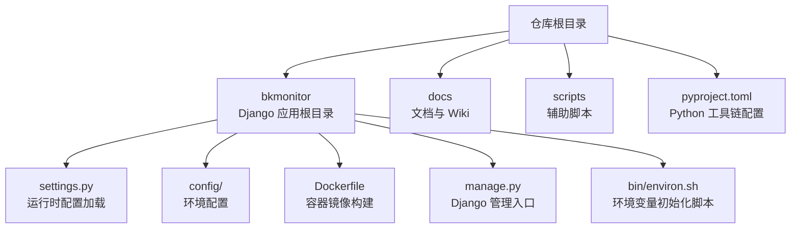
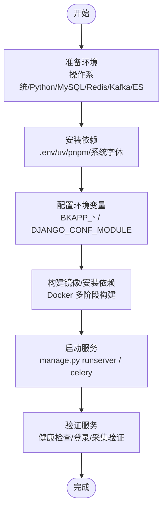
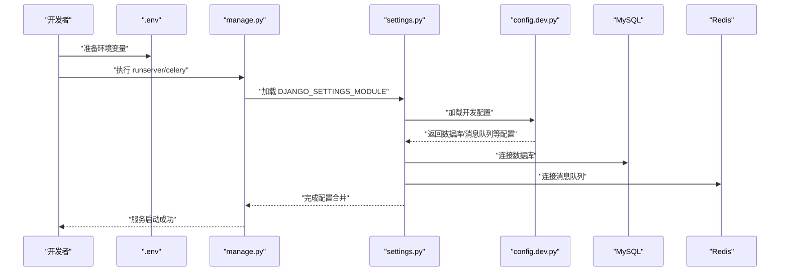
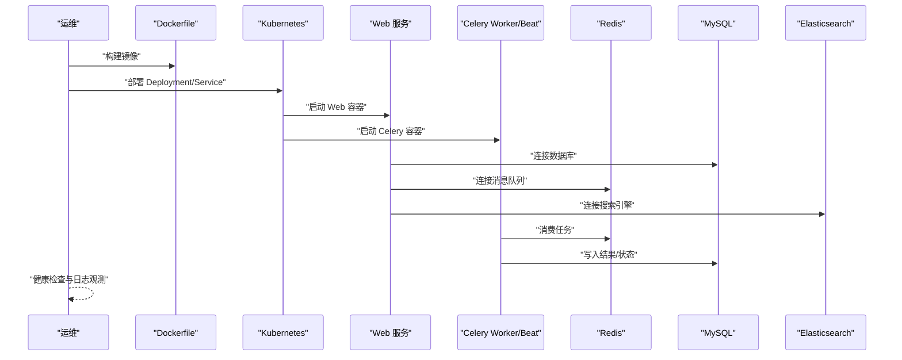
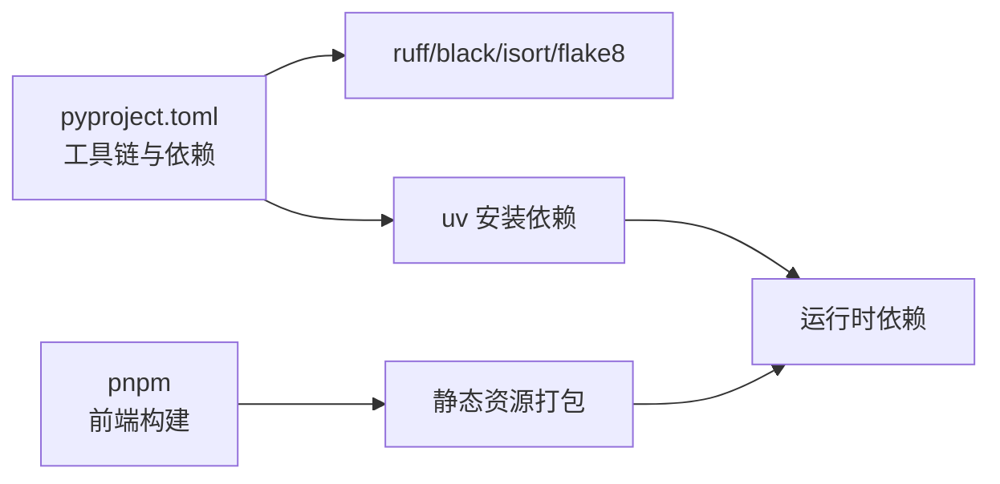

# 快速开始

<cite>
**本文引用的文件**
- [README.md](file://README.md)
- [bkmonitor/settings.py](file://bkmonitor/settings.py)
- [bkmonitor/config/default.py](file://bkmonitor/config/default.py)
- [bkmonitor/config/dev.py](file://bkmonitor/config/dev.py)
- [bkmonitor/config/prod.py](file://bkmonitor/config/prod.py)
- [bkmonitor/Dockerfile](file://bkmonitor/Dockerfile)
- [bkmonitor/manage.py](file://bkmonitor/manage.py)
- [bkmonitor/bin/environ.sh](file://bkmonitor/bin/environ.sh)
- [pyproject.toml](file://pyproject.toml)
</cite>

## 目录
1. [简介](#简介)
2. [项目结构](#项目结构)
3. [核心组件](#核心组件)
4. [架构总览](#架构总览)
5. [详细组件分析](#详细组件分析)
6. [依赖分析](#依赖分析)
7. [性能考虑](#性能考虑)
8. [故障排查指南](#故障排查指南)
9. [结论](#结论)
10. [附录](#附录)

## 简介
本指南面向首次接触蓝鲸智云监控平台的用户，提供从零开始的安装部署步骤与快速上手流程。内容覆盖环境准备、依赖安装、配置设置、首次运行验证，并区分开发环境与生产环境的部署方式。同时给出常见部署场景的配置要点与最佳实践，帮助不同技术水平的用户快速完成体验与生产部署。

## 项目结构
蓝鲸监控平台采用 Django 项目组织方式，核心入口与配置位于 bkmonitor 目录，包含 settings 加载、环境配置、Docker 化打包与启动脚本等。仓库根目录提供统一的工具链配置与文档入口。

图表来源
- [bkmonitor/settings.py:1-110](file://bkmonitor/settings.py#L1-L110)
- [bkmonitor/config/default.py:1-120](file://bkmonitor/config/default.py#L1-L120)
- [bkmonitor/Dockerfile:1-86](file://bkmonitor/Dockerfile#L1-L86)
- [bkmonitor/manage.py:1-49](file://bkmonitor/manage.py#L1-L49)
- [bkmonitor/bin/environ.sh:1-13](file://bkmonitor/bin/environ.sh#L1-L13)

章节来源
- [README.md:1-52](file://README.md#L1-L52)
- [bkmonitor/settings.py:1-110](file://bkmonitor/settings.py#L1-L110)
- [bkmonitor/config/default.py:1-120](file://bkmonitor/config/default.py#L1-L120)
- [bkmonitor/Dockerfile:1-86](file://bkmonitor/Dockerfile#L1-L86)
- [bkmonitor/manage.py:1-49](file://bkmonitor/manage.py#L1-L49)
- [bkmonitor/bin/environ.sh:1-13](file://bkmonitor/bin/environ.sh#L1-L13)
- [pyproject.toml:1-63](file://pyproject.toml#L1-L63)

## 核心组件
- 运行时配置加载
  - settings.py 负责根据环境变量与角色加载配置模块，合并基础配置并注入环境变量覆盖项，同时兼容旧版数据库配置与 Django 版本差异。
- 环境配置
  - config/default.py 提供默认配置骨架，包含数据库、中间件、日志、国际化、API 网关、ES 连接、Celery 并发、静态资源、站点路径等关键项。
  - config/dev.py 与 config/prod.py 分别覆盖开发与生产运行模式，前者提供本地数据库与 Broker 示例，后者设定生产运行模式。
- 容器化与打包
  - Dockerfile 使用多阶段构建，分别完成 Python 依赖安装、前端资源打包与最终镜像生成，提供 ENTRYPOINT 与 CMD 启动命令。
- 管理入口
  - manage.py 负责加载 .env、自动创建符号链接、设置 DJANGO_SETTINGS_MODULE 并执行 Django 命令行。
- 环境变量初始化
  - environ.sh 用于初始化 ENVIRONMENT 与 DJANGO_CONF_MODULE，便于按角色与平台加载对应配置。

章节来源
- [bkmonitor/settings.py:1-110](file://bkmonitor/settings.py#L1-L110)
- [bkmonitor/config/default.py:1-1836](file://bkmonitor/config/default.py#L1-L1836)
- [bkmonitor/config/dev.py:1-67](file://bkmonitor/config/dev.py#L1-L67)
- [bkmonitor/config/prod.py:1-15](file://bkmonitor/config/prod.py#L1-L15)
- [bkmonitor/Dockerfile:1-86](file://bkmonitor/Dockerfile#L1-L86)
- [bkmonitor/manage.py:1-49](file://bkmonitor/manage.py#L1-L49)
- [bkmonitor/bin/environ.sh:1-13](file://bkmonitor/bin/environ.sh#L1-L13)

## 架构总览
下图展示了从环境准备到首次运行的关键步骤与组件交互：

图表来源
- [bkmonitor/Dockerfile:1-86](file://bkmonitor/Dockerfile#L1-L86)
- [bkmonitor/manage.py:1-49](file://bkmonitor/manage.py#L1-L49)
- [bkmonitor/config/dev.py:1-67](file://bkmonitor/config/dev.py#L1-L67)
- [bkmonitor/config/default.py:1-1836](file://bkmonitor/config/default.py#L1-L1836)

## 详细组件分析

### 开发环境部署（快速体验）
- 环境准备
  - 操作系统：Linux/macOS/Windows（推荐 Linux）
  - Python：3.10+（使用 uv 管理虚拟环境）
  - 数据库：MySQL 5.7/8.0（兼容 Django 4.2+）
  - 消息队列：Redis（本地示例）
  - 搜索引擎：Elasticsearch 7.x（如需自愈/FTA）
  - 可选：Kafka（数据链路）、Grafana（可视化）
- 依赖安装
  - 使用 uv 安装 Python 依赖（锁定版本），前端使用 pnpm 构建。
- 配置设置
  - 创建 .env 并设置 BKAPP_* 系列变量（应用 ID/密钥、数据库、ES、API 网关等）。
  - 确认 DJANGO_CONF_MODULE 指向开发配置（config.dev）。
  - 若使用 Celery，设置 BROKER_URL 为 Redis。
- 首次运行
  - 执行 manage.py 运行 Django 开发服务器，或启动 celery worker/beat。
  - 访问站点路径，完成登录与基础配置。
- 验证方法
  - 访问健康检查接口、查看日志输出、尝试创建简单策略与采集任务。

图表来源
- [bkmonitor/manage.py:1-49](file://bkmonitor/manage.py#L1-L49)
- [bkmonitor/settings.py:1-110](file://bkmonitor/settings.py#L1-L110)
- [bkmonitor/config/dev.py:1-67](file://bkmonitor/config/dev.py#L1-L67)

章节来源
- [bkmonitor/config/dev.py:1-67](file://bkmonitor/config/dev.py#L1-L67)
- [bkmonitor/config/default.py:1-1836](file://bkmonitor/config/default.py#L1-L1836)
- [bkmonitor/manage.py:1-49](file://bkmonitor/manage.py#L1-L49)
- [bkmonitor/Dockerfile:1-86](file://bkmonitor/Dockerfile#L1-L86)

### 生产环境部署（完整方案）
- 环境准备
  - 使用容器化部署（Docker/Kubernetes），确保 MySQL、Redis、ES、Kafka 等外部依赖稳定可用。
  - 准备证书与域名，配置 API 网关与组件访问地址。
- 配置设置
  - 将生产配置（config.prod.py）与角色配置（config.role.*）注入环境变量或挂载到容器。
  - 设置 DATABASES、ES、消息队列、站点路径、静态资源等关键项。
- 部署与启动
  - 使用 Dockerfile 构建镜像，ENTRYPOINT 与 CMD 指定运行命令。
  - 在容器编排平台启动 Web/Celery/Beat 等服务副本。
- 验证方法
  - 访问站点首页与健康检查接口，确认登录、策略、采集、告警推送等链路正常。

图表来源
- [bkmonitor/Dockerfile:1-86](file://bkmonitor/Dockerfile#L1-L86)
- [bkmonitor/config/prod.py:1-15](file://bkmonitor/config/prod.py#L1-L15)
- [bkmonitor/config/default.py:1-1836](file://bkmonitor/config/default.py#L1-L1836)

章节来源
- [bkmonitor/config/prod.py:1-15](file://bkmonitor/config/prod.py#L1-L15)
- [bkmonitor/config/default.py:1-1836](file://bkmonitor/config/default.py#L1-L1836)
- [bkmonitor/Dockerfile:1-86](file://bkmonitor/Dockerfile#L1-L86)

### 配置要点与最佳实践
- 环境变量
  - 应用标识：BKPAAS_APP_ID/BKPAAS_APP_SECRET（或 BK_MONITOR_APP_CODE/BK_MONITOR_APP_SECRET）
  - 数据库：BACKEND_* 与 SAAS_* 数据库连接参数
  - ES：FTA_ES7_HOST/PORT/USER/PASSWORD
  - API 网关：BKAPP_APIGW_BASE_URL、BK_COMPONENT_API_URL
  - 站点路径：BK_SITE_URL/BKPAAS_SUB_PATH、FORCE_SCRIPT_NAME
  - 日志与调试：DEBUG、LOG_LEVEL、LOGGING
- 数据库兼容
  - Django 4.2+ 对 MySQL 5.7 的兼容性已做补丁，无需额外改动。
- Celery 并发与队列
  - 通过环境变量设置并发数与 Broker，建议使用 Redis 或 RabbitMQ。
- 静态资源与国际化
  - 静态资源路径与远程静态域名，国际化语言包与会话键。
- 容器化部署
  - 使用多阶段构建，分离前端与后端依赖，设置 UTF-8 与中文字体支持。

章节来源
- [bkmonitor/config/default.py:1-1836](file://bkmonitor/config/default.py#L1-L1836)
- [bkmonitor/settings.py:1-110](file://bkmonitor/settings.py#L1-L110)
- [bkmonitor/Dockerfile:1-86](file://bkmonitor/Dockerfile#L1-L86)
- [pyproject.toml:1-63](file://pyproject.toml#L1-L63)

## 依赖分析
- Python 工具链
  - 使用 ruff/black/isort/flake8 等工具规范代码风格与质量，锁定第三方依赖。
- 前端构建
  - 使用 pnpm 管理前端依赖，构建静态资源并打包到最终镜像。
- 运行时依赖
  - Django、Celery、MySQL、Redis、ES、Kafka 等，均通过环境变量与配置文件统一管理。

图表来源
- [pyproject.toml:1-63](file://pyproject.toml#L1-L63)
- [bkmonitor/Dockerfile:1-86](file://bkmonitor/Dockerfile#L1-L86)

章节来源
- [pyproject.toml:1-63](file://pyproject.toml#L1-L63)
- [bkmonitor/Dockerfile:1-86](file://bkmonitor/Dockerfile#L1-L86)

## 性能考虑
- 数据库连接池与自动清理
  - 通过 CONN_MAX_AGE 与自动清理间隔减少连接开销。
- Celery 并发与队列
  - 合理设置并发数与队列，避免阻塞与内存占用过高。
- 日志级别与采样
  - 生产环境建议降低日志级别，必要时启用采样与异步写入。
- 前端静态资源
  - 使用 CDN 与缓存策略，减少带宽与延迟。

## 故障排查指南
- 启动失败
  - 检查 .env 是否正确加载，DJANGO_SETTINGS_MODULE 是否指向正确配置。
  - 查看 manage.py 输出的符号链接创建与 patch 行为。
- 数据库连接异常
  - 核对 DATABASES 配置与网络连通性，确认字符集与时区设置。
- 消息队列异常
  - 确认 BROKER_URL 与认证信息，检查队列与消费者状态。
- 健康检查
  - 访问健康检查接口，结合日志定位问题。

章节来源
- [bkmonitor/manage.py:1-49](file://bkmonitor/manage.py#L1-L49)
- [bkmonitor/settings.py:1-110](file://bkmonitor/settings.py#L1-L110)
- [bkmonitor/config/default.py:1-1836](file://bkmonitor/config/default.py#L1-L1836)

## 结论
通过本指南，您可以基于开发环境快速体验蓝鲸监控平台的核心能力，或基于生产环境完成完整的部署与验证。建议在开发阶段先完成最小可用配置，再逐步引入消息队列、搜索引擎与外部组件，最终在生产环境采用容器化与自动化编排实现高可用部署。

## 附录
- 文档入口与支持
  - 项目 README 提供总体概览与官方文档入口。
- 常见问题
  - 如遇版本兼容或依赖冲突，优先核对 Python 与系统依赖版本，参考工具链配置与 Dockerfile。

章节来源
- [README.md:1-52](file://README.md#L1-L52)