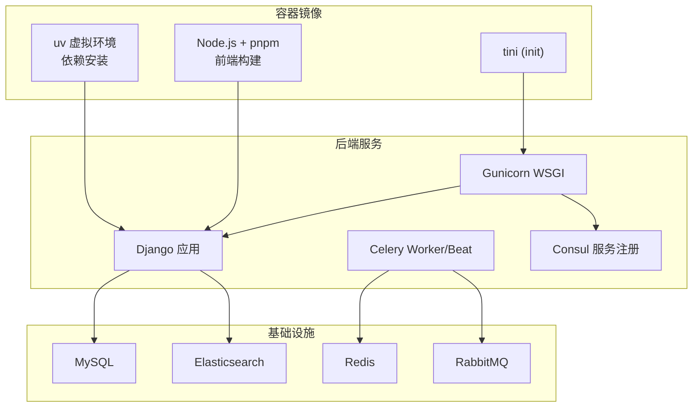
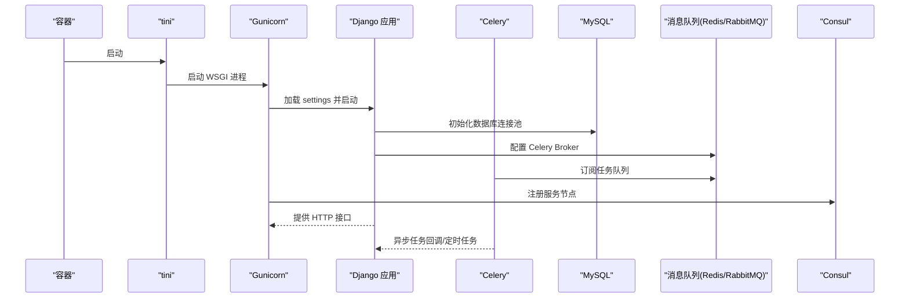
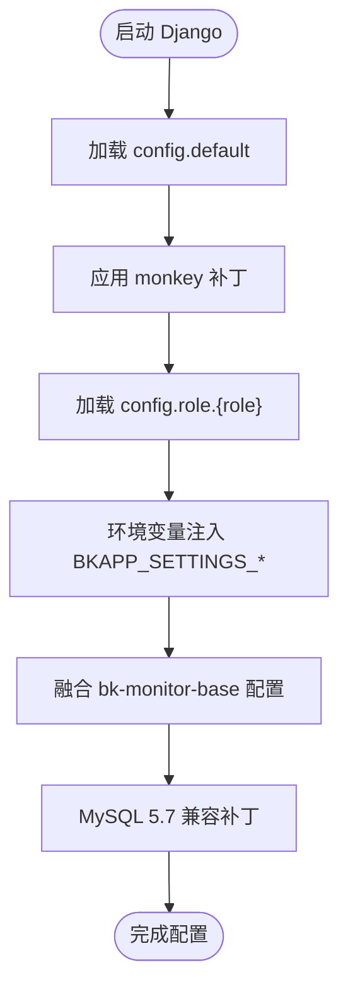
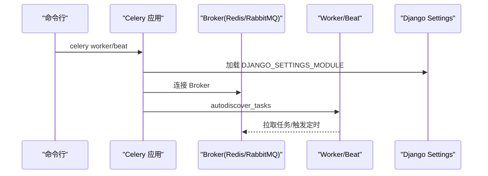
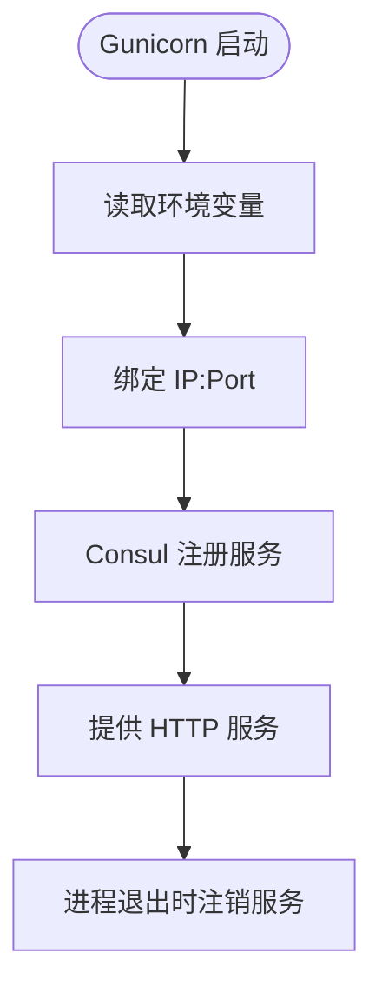
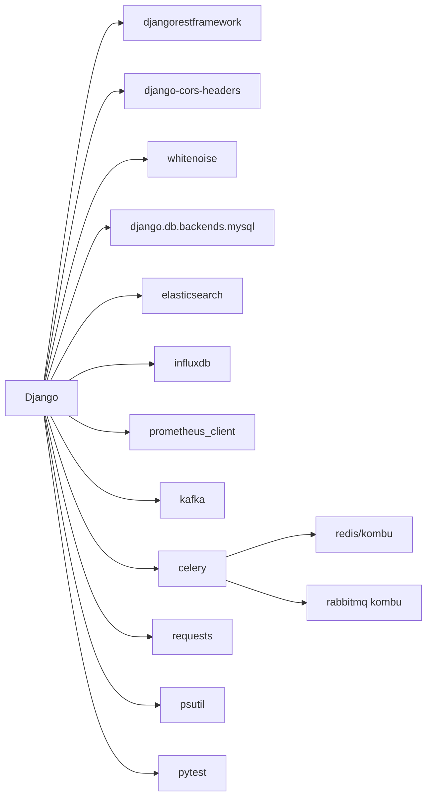

# 技术栈

<cite>
**本文引用的文件**
- [pyproject.toml](file://pyproject.toml)
- [settings.py](file://bkmonitor/settings.py)
- [default.py](file://bkmonitor/config/default.py)
- [dev.py](file://bkmonitor/config/dev.py)
- [prod.py](file://bkmonitor/config/prod.py)
- [celery.py](file://bkmonitor/config/celery/celery.py)
- [gunicorn_config.py](file://bkmonitor/gunicorn_config.py)
- [Dockerfile](file://bkmonitor/Dockerfile)
- [manage.py](file://bkmonitor/manage.py)
- [package-lock.json](file://package-lock.json)
</cite>

## 目录
1. [简介](#简介)
2. [项目结构](#项目结构)
3. [核心组件](#核心组件)
4. [架构总览](#架构总览)
5. [详细组件分析](#详细组件分析)
6. [依赖分析](#依赖分析)
7. [性能考虑](#性能考虑)
8. [故障排查指南](#故障排查指南)
9. [结论](#结论)
10. [附录](#附录)

## 简介
本文件面向蓝鲸智云监控平台（bk-monitor）的技术栈说明，覆盖后端 Python 生态、Web 框架、数据库、消息队列、容器与编排、以及前端构建链路等。文档旨在帮助开发者快速理解技术选型、配置要点、兼容性与升级路径，并提供学习指南与最佳实践建议。

## 项目结构
- 后端采用 Django 4.x 作为 Web 框架，结合 Celery 作为异步任务与定时任务引擎，使用 Gunicorn 作为 WSGI 服务器。
- 数据库以 MySQL 为主，兼容 Django 对 MySQL 5.7 的最低版本策略（通过补丁适配）。
- 消息队列支持 Redis 与 RabbitMQ（开发环境示例），用于 Celery 任务分发。
- 前端资源通过 webpack 构建并打包到静态目录，容器镜像中包含 Node.js 与 pnpm 以支持前端构建。
- 容器运行时使用 tini 作为 init，Python 运行环境通过 uv 管理虚拟环境与依赖安装。

图表来源
- [Dockerfile:1-86](file://bkmonitor/Dockerfile#L1-L86)
- [gunicorn_config.py:29-91](file://bkmonitor/gunicorn_config.py#L29-L91)
- [celery.py:13-31](file://bkmonitor/config/celery/celery.py#L13-L31)
- [default.py:781-800](file://bkmonitor/config/default.py#L781-L800)

章节来源
- [Dockerfile:1-86](file://bkmonitor/Dockerfile#L1-L86)
- [manage.py:18-49](file://bkmonitor/manage.py#L18-L49)
- [settings.py:18-110](file://bkmonitor/settings.py#L18-L110)
- [default.py:1-120](file://bkmonitor/config/default.py#L1-L120)

## 核心组件
- Python 与包管理
  - Python 版本目标：py310（ruff 目标版本）
  - 包管理工具：uv（镜像中安装，支持 venv、sync、seed）
  - 代码质量：black、isort、flake8、ruff
- Web 框架与服务器
  - Django：主应用框架，兼容 MySQL 5.7（通过补丁）
  - Gunicorn：WSGI 服务器，支持 Consul 服务注册/注销
- 异步任务与定时
  - Celery：任务队列与定时任务，支持 worker/beat
- 数据库
  - MySQL：默认后端与 SaaS 数据库配置，兼容 Django 4.2+ 对 MySQL 5.7 的最低版本策略
- 缓存与消息队列
  - Redis：Celery Broker（开发环境示例）
  - RabbitMQ：Celery Broker（注释示例）
- 前端构建
  - Node.js 20 + pnpm（10）+ webpack：前端资源构建
- 容器与运行
  - TencentOS Server 4 minimal 基础镜像
  - tini 作为 init，Python 虚拟环境通过 uv 创建与激活

章节来源
- [pyproject.toml:39-63](file://pyproject.toml#L39-L63)
- [Dockerfile:1-86](file://bkmonitor/Dockerfile#L1-L86)
- [gunicorn_config.py:29-91](file://bkmonitor/gunicorn_config.py#L29-L91)
- [celery.py:13-31](file://bkmonitor/config/celery/celery.py#L13-L31)
- [default.py:781-800](file://bkmonitor/config/default.py#L781-L800)
- [dev.py:39-67](file://bkmonitor/config/dev.py#L39-L67)

## 架构总览
下图展示了从容器启动到请求处理、任务调度与服务注册的整体流程。

图表来源
- [Dockerfile:52-86](file://bkmonitor/Dockerfile#L52-L86)
- [gunicorn_config.py:56-91](file://bkmonitor/gunicorn_config.py#L56-L91)
- [celery.py:22-31](file://bkmonitor/config/celery/celery.py#L22-L31)
- [default.py:781-800](file://bkmonitor/config/default.py#L781-L800)

## 详细组件分析

### Django 配置与运行
- 配置加载顺序：config.default → blueapps.patch → config.{env} → config.role.{role}
- 环境变量注入：通过 BKAPP_SETTINGS_ 前缀将环境变量注入 Django settings
- MySQL 兼容性：对 Django 4.2+ 不再官方支持 MySQL 5.7 的限制进行补丁，确保最小版本为 5.7
- 多数据库路由：bk_dataview.router.DBRouter 与可选的 TableVisitCountRouter
- 静态资源与站点路径：SITE_URL、STATIC_ROOT、STATIC_URL、MEDIA_ROOT/MEDIA_URL
- 国际化与时区：LOCALE_PATHS、USE_I18N/LANGUAGES、TIME_ZONE、USE_DEPRECATED_PYTZ

图表来源
- [settings.py:18-110](file://bkmonitor/settings.py#L18-L110)
- [default.py:47-94](file://bkmonitor/config/default.py#L47-L94)

章节来源
- [settings.py:18-110](file://bkmonitor/settings.py#L18-L110)
- [default.py:47-94](file://bkmonitor/config/default.py#L47-L94)

### Celery 任务与定时任务
- Broker：支持 Redis（开发示例）与 RabbitMQ（注释示例）
- Worker/Beat：通过命令行参数选择 worker 或 beat 角色
- 日志：setup_logging 与 beat_init 钩子，确保日志配置与连接清理
- 并发：CELERYD_CONCURRENCY 可通过环境变量调整

图表来源
- [celery.py:22-31](file://bkmonitor/config/celery/celery.py#L22-L31)
- [dev.py:39-67](file://bkmonitor/config/dev.py#L39-L67)
- [default.py:113-115](file://bkmonitor/config/default.py#L113-L115)

章节来源
- [celery.py:13-50](file://bkmonitor/config/celery/celery.py#L13-L50)
- [dev.py:39-67](file://bkmonitor/config/dev.py#L39-L67)
- [default.py:113-115](file://bkmonitor/config/default.py#L113-L115)

### Gunicorn 与服务注册
- 绑定地址与工作进程：可通过环境变量配置
- 服务注册：通过 Consul TCP 健康检查注册/注销服务节点
- 工作类：支持 gevent（如需）

图表来源
- [gunicorn_config.py:29-91](file://bkmonitor/gunicorn_config.py#L29-L91)

章节来源
- [gunicorn_config.py:29-91](file://bkmonitor/gunicorn_config.py#L29-L91)

### 数据库配置与兼容性
- 默认数据库配置：后端 DB 与 SaaS DB，分别通过工具函数生成
- 连接复用：DATABASE_CONNECTION_AUTO_CLEAN_INTERVAL、CONN_MAX_AGE
- MySQL 5.7 兼容：通过补丁最小数据库版本为 5.7（MariaDB 为 10.4）
- 数据库路由：bk_dataview.router.DBRouter，可选 TableVisitCountRouter

章节来源
- [default.py:781-800](file://bkmonitor/config/default.py#L781-L800)
- [default.py:240-245](file://bkmonitor/config/default.py#L240-L245)
- [settings.py:74-92](file://bkmonitor/settings.py#L74-L92)
- [default.py:775-780](file://bkmonitor/config/default.py#L775-L780)

### 容器与构建
- 基础镜像：TencentOS Server 4 minimal
- Python：uv 安装虚拟环境并同步依赖
- 前端：Node.js 20 + pnpm（10）+ webpack 构建产物拷贝至静态目录
- 运行：tini 作为 init，ENTRYPOINT 与 CMD 组合启动 Django

章节来源
- [Dockerfile:1-86](file://bkmonitor/Dockerfile#L1-L86)

### 环境与配置要点
- 开发环境：本地 Redis Broker、本地 MySQL 示例
- 生产环境：RUN_MODE=PRODUCT，具体数据库与服务地址通过环境变量注入
- 环境变量注入：BKAPP_SETTINGS_ 前缀将键值注入 Django settings
- 站点路径与静态资源：SITE_URL、STATIC_URL、STATIC_ROOT、MEDIA_ROOT/MEDIA_URL

章节来源
- [dev.py:21-67](file://bkmonitor/config/dev.py#L21-L67)
- [prod.py:11-15](file://bkmonitor/config/prod.py#L11-L15)
- [default.py:137-166](file://bkmonitor/config/default.py#L137-L166)
- [settings.py:57-64](file://bkmonitor/settings.py#L57-L64)

## 依赖分析
- Python 生态与第三方库
  - Django、djangorestframework、django-cors-headers、whitenoise、celery、redis、kombu、elasticsearch、influxdb、requests、psutil、prometheus_client、kafka、kazoo、apscheduler、pytest 等
- 代码质量与格式化
  - black、isort、flake8、ruff（目标 py310）
- 前端构建
  - Node.js 20 + pnpm（10）+ webpack（仓库包含 webpack 目录）

图表来源
- [pyproject.toml:23-30](file://pyproject.toml#L23-L30)
- [Dockerfile:39-49](file://bkmonitor/Dockerfile#L39-L49)

章节来源
- [pyproject.toml:23-30](file://pyproject.toml#L23-L30)
- [package-lock.json:1-7](file://package-lock.json#L1-L7)

## 性能考虑
- 数据库连接复用：通过 CONN_MAX_AGE 与 DATABASE_CONNECTION_AUTO_CLEAN_INTERVAL 控制连接生命周期
- MySQL 5.7 兼容：避免使用 MySQL 8.0 特性，减少迁移成本
- Celery 并发：CELERYD_CONCURRENCY 可按 CPU/内存调优
- 前端静态资源：Whitenoise 提供静态文件服务，建议在反向代理层启用缓存与压缩
- Gunicorn：根据 CPU 核心数与内存设置合适的 workers 数量

## 故障排查指南
- Django 配置加载失败
  - 检查 config.role.{role} 导入是否成功，确认 sys.path 是否包含 packages 与 ai_agent/sdk
  - 确认 BKAPP_SETTINGS_ 前缀的环境变量是否正确注入
- MySQL 兼容问题
  - 若出现数据库版本校验异常，确认补丁已生效（minimum_database_version）
- Celery 任务不执行
  - 检查 BROKER_URL 是否正确（Redis/RabbitMQ）
  - 确认 autodiscover_tasks 是否能发现任务模块
  - 查看 setup_logging 与 beat_init 日志
- Gunicorn 服务未注册
  - 检查 Consul 地址与健康检查 TCP 端口
  - 确认 DEPLOY_MODE 与 LAN_IP/BK_MONITOR_KERNELAPI_PORT 环境变量
- 前端资源 404
  - 确认 webpack 构建产物已拷贝至静态目录
  - 检查 SITE_URL 与 STATIC_URL 配置

章节来源
- [settings.py:46-72](file://bkmonitor/settings.py#L46-L72)
- [settings.py:74-92](file://bkmonitor/settings.py#L74-L92)
- [celery.py:22-31](file://bkmonitor/config/celery/celery.py#L22-L31)
- [gunicorn_config.py:56-91](file://bkmonitor/gunicorn_config.py#L56-L91)
- [Dockerfile:47-50](file://bkmonitor/Dockerfile#L47-L50)

## 结论
本项目采用成熟的 Python/Django 技术栈，结合 Celery 实现异步与定时任务，使用 Gunicorn 提供生产级 WSGI 服务，并通过 Consul 完成服务注册与发现。容器化方面使用 uv 管理 Python 依赖，Node.js/pnpm/webpack 完成前端构建。整体技术选型兼顾稳定性与可维护性，适合大规模监控场景。

## 附录

### 版本与兼容性
- Python：目标 py310（ruff）
- Django：4.x（兼容 MySQL 5.7 补丁）
- MySQL：5.7（MariaDB 最低 10.4）
- Node.js：20（pnpm 10）
- 前端构建：webpack（仓库包含 webpack 目录）

章节来源
- [pyproject.toml:42-42](file://pyproject.toml#L42-L42)
- [Dockerfile:39-49](file://bkmonitor/Dockerfile#L39-L49)
- [settings.py:74-92](file://bkmonitor/settings.py#L74-L92)

### 升级路径建议
- Python/Django：先在 dev 环境验证，逐步提升版本，关注数据库兼容补丁是否仍需
- Celery：保持与当前 Broker（Redis/RabbitMQ）兼容，升级前先做任务回放测试
- Gunicorn：按 CPU/内存与负载评估 workers 数量，必要时迁移到更高版本
- 前端：Node.js 20 稳定后，逐步升级 pnpm/webpack 版本，注意构建产物兼容性

### 学习指南与最佳实践
- 学习路径
  - Django 入门与配置体系
  - Celery 任务与定时任务实践
  - Gunicorn 与服务注册（Consul）
  - uv 与容器化部署
- 最佳实践
  - 使用 BKAPP_SETTINGS_ 前缀集中注入环境变量
  - 通过补丁维持 MySQL 5.7 兼容，避免频繁数据库迁移
  - Celery 并发与队列隔离，按业务拆分队列
  - 前端构建产物统一管理，静态资源 CDN 化