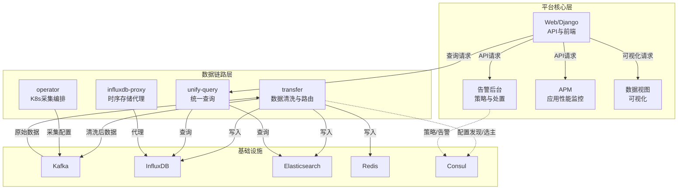
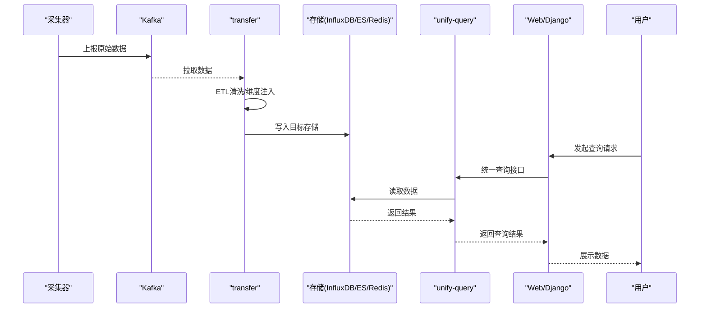
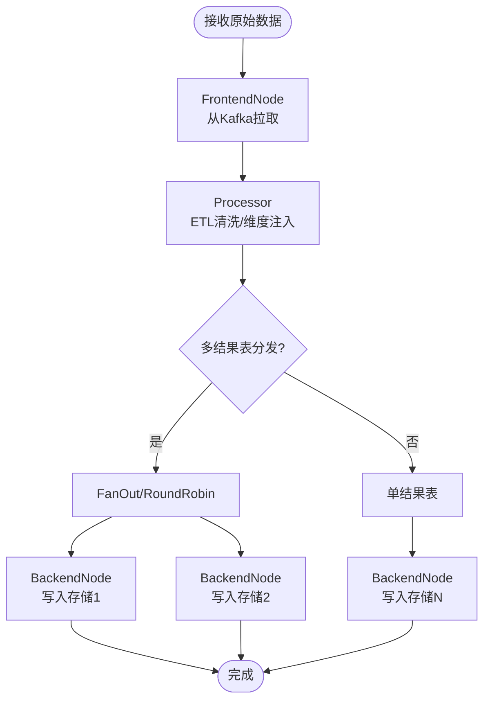
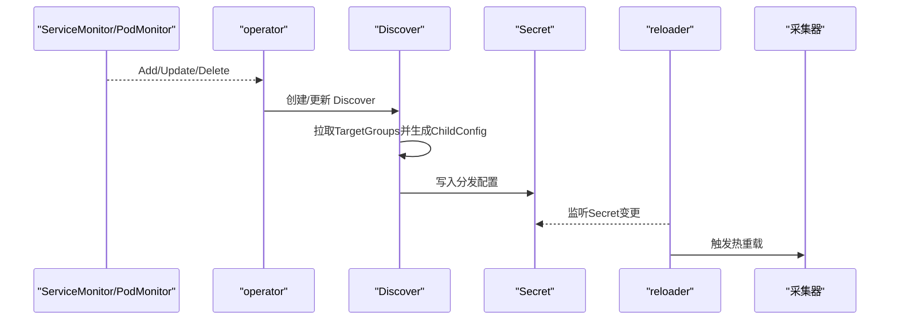
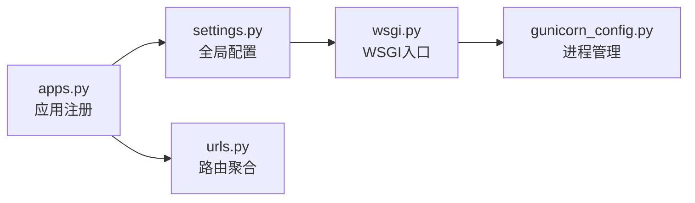
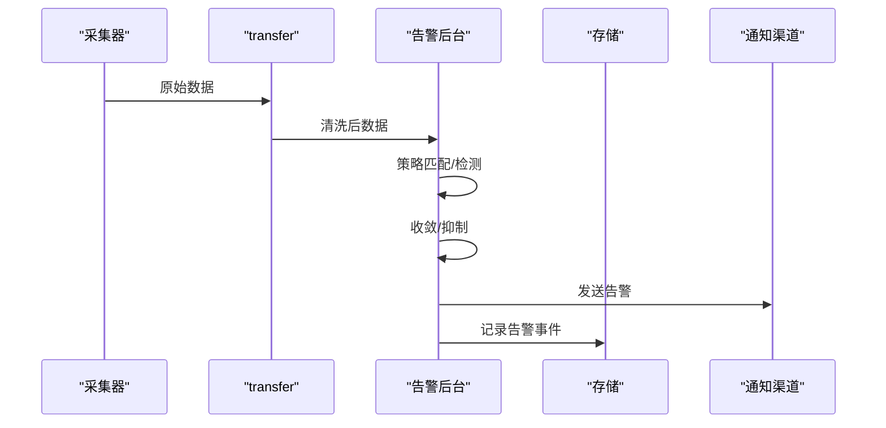
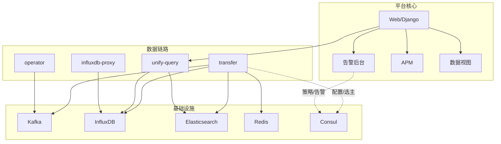

# 架构概览

<cite>
**本文档引用的文件**
- [README.md](file://README.md)
- [架构设计](file://docs/overview/architecture.md)
- [设计理念](file://docs/overview/design.md)
- [代码框架](file://docs/overview/code_framework.md)
- [transfer 架构](file://ai-docs/bkmonitor-datalink/docs/transfer/architecture.md)
- [operator 架构](file://ai-docs/bkmonitor-datalink/docs/operator/architecture.md)
- [告警后台模块说明](file://ai-docs/bk-monitor/docs/告警后台(alarm_backends)/modules/README.md)
- [告警数据流](file://ai-docs/bk-monitor/docs/告警后台(alarm_backends)/告警数据流.md)
- [部署架构](file://ai-docs/bk-monitor/docs/告警后台(alarm_backends)/部署架构.md)
- [bkmonitor 应用入口](file://bkmonitor/apps.py)
- [alarm_backends 应用入口](file://bkmonitor/alarm_backends/apps.py)
- [apm 应用入口](file://bkmonitor/apm/apps.py)
- [apm_ebpf 应用入口](file://bkmonitor/apm_ebpf/apps.py)
- [bk_dataview 应用入口](file://bkmonitor/bk_dataview/apps.py)
- [settings 配置](file://bkmonitor/settings.py)
- [urls 路由](file://bkmonitor/urls.py)
- [Celery 配置](file://config/celery/default.py)
- [Celery 生产环境配置](file://config/celery/prod.py)
- [Celery 开发环境配置](file://config/celery/dev.py)
- [Celery 环境变量脚本](file://bkmonitor/bin/celery_environ.sh)
- [Celery 启动脚本](file://bkmonitor/bin/api_manage.sh)
- [Gunicorn 配置](file://gunicorn_config.py)
- [WSGI 入口](file://bkmonitor/wsgi.py)
- [Django 管理入口](file://bkmonitor/manage.py)
- [Dockerfile](file://Dockerfile)
- [Dockerfile.monitor.dev](file://Dockerfile.monitor.dev)
- [Makefile](file://Makefile)
- [pyproject.toml](file://pyproject.toml)
- [version.yaml](file://bkmonitor/version.yaml)
- [version/app.yml](file://bkmonitor/version/app.yml)
- [version/project.yml](file://bkmonitor/version/project.yml)
</cite>

## 目录
1. [简介](#简介)
2. [项目结构](#项目结构)
3. [核心组件](#核心组件)
4. [架构总览](#架构总览)
5. [详细组件分析](#详细组件分析)
6. [依赖关系分析](#依赖关系分析)
7. [性能考量](#性能考量)
8. [故障排查指南](#故障排查指南)
9. [结论](#结论)
10. [附录](#附录)

## 简介
本文件面向架构师与高级开发者，提供蓝鲸智云监控平台的整体架构综述。文档聚焦于系统的高层设计、技术选型与组件分布，解释监控数据采集层、处理层、存储层与展示层的架构设计，阐述微服务与分布式特性、高可用性考虑，覆盖数据流向、服务调用关系与系统边界，并提供架构图示与组件说明，帮助快速理解系统整体布局。

## 项目结构
蓝鲸监控平台采用多模块分层组织，核心模块包括：
- 数据链路（Datalink）：负责采集、传输与路由，包含 transfer（清洗与路由）、operator（K8s 采集编排）、unify-query（统一查询）、influxdb-proxy（时序存储代理）等。
- 平台核心（bkmonitor）：提供 Web 服务、API、告警后台、APM、数据视图等能力。
- 配置与运行（config、scripts、bin）：提供 Celery、Gunicorn、Docker、Makefile 等运行支撑。
- 文档与知识库（docs、ai-docs）：包含设计理念、架构设计、部署与运维文档。

**图表来源**
- [transfer 架构](file://ai-docs/bkmonitor-datalink/docs/transfer/architecture.md)
- [operator 架构](file://ai-docs/bkmonitor-datalink/docs/operator/architecture.md)

**章节来源**
- [README.md](file://README.md)
- [架构设计](file://docs/overview/architecture.md)
- [设计理念](file://docs/overview/design.md)
- [代码框架](file://docs/overview/code_framework.md)

## 核心组件
- 数据链路核心
  - transfer：负责从消息队列拉取原始数据，执行 ETL 清洗与维度注入，将数据写入多种存储（Kafka、InfluxDB、Elasticsearch、Redis）。
  - operator：在 Kubernetes 环境中通过 CRD 管理采集任务，动态下发配置到 Worker，实现采集器的自动编排与热重载。
  - unify-query：提供统一查询接口，屏蔽底层存储差异，支持时序与日志的跨存储查询。
  - influxdb-proxy：对 InfluxDB 访问进行代理与优化，提升查询稳定性与性能。
- 平台核心
  - Web/Django：提供 REST API、权限与认证、中间件、静态资源与模板渲染。
  - 告警后台：负责告警策略、检测、收敛、收敛、通知与处置的全生命周期管理。
  - APM：提供应用拓扑、链路追踪、探针配置与性能分析。
  - 数据视图：提供仪表盘、图表与报表的可视化能力。
- 基础设施
  - Kafka：作为采集数据的缓冲与分发通道。
  - InfluxDB/Elasticsearch/Redis：分别承担时序数据、日志与事件、缓存与会话等存储职责。
  - Consul：提供配置发现、集群选主与健康检查。

**章节来源**
- [transfer 架构](file://ai-docs/bkmonitor-datalink/docs/transfer/architecture.md)
- [operator 架构](file://ai-docs/bkmonitor-datalink/docs/operator/architecture.md)
- [告警后台模块说明](file://ai-docs/bk-monitor/docs/告警后台(alarm_backends)/modules/README.md)

## 架构总览
蓝鲸监控平台采用“采集-传输-存储-查询-展示”的分层架构，结合微服务与分布式设计，确保高吞吐、低延迟与高可用。

- 微服务与分布式
  - transfer 与 operator 以独立进程运行，通过 Consul 进行配置发现与选主，实现分布式调度与故障自愈。
  - 每个 DataID 对应独立的处理流水线，支持多结果表分发与并行处理，提升扩展性。
- 数据流
  - 采集器上报原始数据至 Kafka；transfer 从 Kafka 拉取，执行 ETL 清洗后写入目标存储；查询侧通过 unify-query 统一访问；展示侧通过 Web/Django 提供 API 与可视化。
- 高可用性
  - 通过 Kafka 的分区与副本、InfluxDB/ES 的集群部署、Consul 的健康检查与选主，以及 transfer 的自愈机制，保障系统在节点故障下的持续运行。

**图表来源**
- [transfer 架构](file://ai-docs/bkmonitor-datalink/docs/transfer/architecture.md)
- [operator 架构](file://ai-docs/bkmonitor-datalink/docs/operator/architecture.md)

## 详细组件分析

### 数据链路层

#### transfer：数据清洗与路由
- 职责
  - 从 Kafka 拉取采集器上报的原始数据。
  - 执行 ETL 清洗（字段提取、格式转换、维度注入）。
  - 将处理后的数据写入目标存储（Kafka、InfluxDB、Elasticsearch、Redis）。
- 架构要点
  - Pipeline 管理：每个 DataID 对应一个 Pipeline，内部由 Frontend、Processor、Backend 三类节点组成。
  - 多结果表分发：支持 FanOut/RoundRobin 分发策略，实现多结果表并行处理。
  - 调度与自愈：通过 Consul 进行配置发现与选主，定期检查 Pipeline 状态并自动重启异常实例。
- 关键指标
  - scheduler_running_pipelines、pipeline_frontend_dropped_total、kafka_backend_dropped_total 等，用于监控处理吞吐与丢弃情况。

**图表来源**
- [transfer 架构](file://ai-docs/bkmonitor-datalink/docs/transfer/architecture.md)

**章节来源**
- [transfer 架构](file://ai-docs/bkmonitor-datalink/docs/transfer/architecture.md)

#### operator：K8s 采集编排
- 职责
  - 通过 CRD（DataID、BkLogConfig 等）管理采集任务。
  - Watch ServiceMonitor/PodMonitor，生成采集配置并写入 Secret。
  - Reloader 进程在 Worker Pod 内监听 Secret 变更，触发采集器热重载。
- 架构要点
  - 两进程架构：operator（主控制器）+ reloader（Worker 内进程）。
  - Discover 接口抽象多种服务发现（Kubernetes、HTTP、Etcd、Polaris）。
  - ChildConfig 用于生成分发到 StatefulSet/DaemonSet 的子配置，支持按节点/副本分发。
- 工作流
  - operator 监听 CRD 与 ServiceMonitor/PodMonitor，生成 Discover 实例，计算 ChildConfig 并写入 Secret；Reloader 监听 Secret 变更，写入本地文件并发送信号触发采集器重载。

**图表来源**
- [operator 架构](file://ai-docs/bkmonitor-datalink/docs/operator/architecture.md)

**章节来源**
- [operator 架构](file://ai-docs/bkmonitor-datalink/docs/operator/architecture.md)

#### unify-query：统一查询
- 职责
  - 提供统一查询接口，屏蔽底层存储差异，支持时序与日志的跨存储查询。
- 设计理念
  - 通过抽象存储接口与查询路由，实现查询的透明化与可扩展性。

**章节来源**
- [transfer 架构](file://ai-docs/bkmonitor-datalink/docs/transfer/architecture.md)

#### influxdb-proxy：时序存储代理
- 职责
  - 对 InfluxDB 访问进行代理与优化，提升查询稳定性与性能。
- 设计理念
  - 通过代理层实现连接池、限流与缓存，降低直连压力。

**章节来源**
- [transfer 架构](file://ai-docs/bkmonitor-datalink/docs/transfer/architecture.md)

### 平台核心层

#### Web/Django：API 与服务编排
- 职责
  - 提供 REST API、权限与认证、中间件、静态资源与模板渲染。
  - 通过 WSGI 入口与 Gunicorn 运行，支持多进程部署。
- 关键入口
  - 应用注册：bkmonitor、alarm_backends、apm、apm_ebpf、bk_dataview 等模块在 apps.py 中注册。
  - 路由：根路由在 urls.py 中聚合各模块路由。
  - 配置：settings.py 统一管理 Django 配置，Celery 配置位于 config/celery 下。

**图表来源**
- [bkmonitor 应用入口](file://bkmonitor/apps.py)
- [alarm_backends 应用入口](file://bkmonitor/alarm_backends/apps.py)
- [apm 应用入口](file://bkmonitor/apm/apps.py)
- [apm_ebpf 应用入口](file://bkmonitor/apm_ebpf/apps.py)
- [bk_dataview 应用入口](file://bkmonitor/bk_dataview/apps.py)
- [settings 配置](file://bkmonitor/settings.py)
- [urls 路由](file://bkmonitor/urls.py)
- [Gunicorn 配置](file://gunicorn_config.py)
- [WSGI 入口](file://bkmonitor/wsgi.py)

**章节来源**
- [bkmonitor 应用入口](file://bkmonitor/apps.py)
- [alarm_backends 应用入口](file://bkmonitor/alarm_backends/apps.py)
- [apm 应用入口](file://bkmonitor/apm/apps.py)
- [apm_ebpf 应用入口](file://bkmonitor/apm_ebpf/apps.py)
- [bk_dataview 应用入口](file://bkmonitor/bk_dataview/apps.py)
- [settings 配置](file://bkmonitor/settings.py)
- [urls 路由](file://bkmonitor/urls.py)
- [Gunicorn 配置](file://gunicorn_config.py)
- [WSGI 入口](file://bkmonitor/wsgi.py)

#### 告警后台：策略与处置
- 职责
  - 告警策略管理、检测、收敛、通知与处置的全生命周期管理。
- 数据流
  - 告警数据流从采集到处置的完整链路，包含策略下发、检测执行、收敛与通知等环节。
- 部署架构
  - 告警后台支持独立部署与集群化运行，结合 Consul 实现配置发现与选主。

**图表来源**
- [告警数据流](file://ai-docs/bk-monitor/docs/告警后台(alarm_backends)/告警数据流.md)
- [部署架构](file://ai-docs/bk-monitor/docs/告警后台(alarm_backends)/部署架构.md)

**章节来源**
- [告警数据流](file://ai-docs/bk-monitor/docs/告警后台(alarm_backends)/告警数据流.md)
- [部署架构](file://ai-docs/bk-monitor/docs/告警后台(alarm_backends)/部署架构.md)
- [告警后台模块说明](file://ai-docs/bk-monitor/docs/告警后台(alarm_backends)/modules/README.md)

#### APM：应用性能监控
- 职责
  - 提供应用拓扑、链路追踪、探针配置与性能分析。
- 设计理念
  - 通过探针与后端处理分离，支持 eBPF 等高性能采集方式，结合统一查询与可视化能力。

**章节来源**
- [apm 应用入口](file://bkmonitor/apm/apps.py)
- [apm_ebpf 应用入口](file://bkmonitor/apm_ebpf/apps.py)

#### 数据视图：可视化
- 职责
  - 提供仪表盘、图表与报表的可视化能力，支撑监控数据的展示与分析。
- 设计理念
  - 通过统一查询接口与前端组件化，实现灵活的可视化组合。

**章节来源**
- [bk_dataview 应用入口](file://bkmonitor/bk_dataview/apps.py)

### 基础设施与运行支撑

#### Celery 任务队列
- 职责
  - 提供异步任务与定时任务能力，支撑告警、报告、导出等后台任务。
- 配置
  - 默认配置位于 config/celery/default.py，生产与开发环境分别在 prod.py 与 dev.py。
  - 通过环境变量脚本与启动脚本进行统一管理。

**章节来源**
- [Celery 配置](file://config/celery/default.py)
- [Celery 生产环境配置](file://config/celery/prod.py)
- [Celery 开发环境配置](file://config/celery/dev.py)
- [Celery 环境变量脚本](file://bkmonitor/bin/celery_environ.sh)
- [Celery 启动脚本](file://bkmonitor/bin/api_manage.sh)

#### Docker 与构建
- 职责
  - 提供容器化打包与开发环境镜像，简化部署与本地开发。
- 关键文件
  - Dockerfile 与 Dockerfile.monitor.dev 用于构建生产与开发镜像。
  - Makefile、pyproject.toml 用于项目构建与依赖管理。

**章节来源**
- [Dockerfile](file://Dockerfile)
- [Dockerfile.monitor.dev](file://Dockerfile.monitor.dev)
- [Makefile](file://Makefile)
- [pyproject.toml](file://pyproject.toml)

#### 版本与发布
- 职责
  - 统一版本信息与发布元数据，便于追踪与回滚。
- 关键文件
  - version.yaml、version/app.yml、version/project.yml。

**章节来源**
- [version.yaml](file://bkmonitor/version.yaml)
- [version/app.yml](file://bkmonitor/version/app.yml)
- [version/project.yml](file://bkmonitor/version/project.yml)

## 依赖关系分析

**图表来源**
- [transfer 架构](file://ai-docs/bkmonitor-datalink/docs/transfer/architecture.md)
- [operator 架构](file://ai-docs/bkmonitor-datalink/docs/operator/architecture.md)

**章节来源**
- [transfer 架构](file://ai-docs/bkmonitor-datalink/docs/transfer/architecture.md)
- [operator 架构](file://ai-docs/bkmonitor-datalink/docs/operator/architecture.md)

## 性能考量
- 吞吐与延迟
  - transfer 通过多结果表分发与并行处理（multiNum）提升吞吐；Frontend/Processor/Backend 采用无缓冲通道实现背压，避免过载。
  - operator 通过共享服务发现与 ChildConfig 哈希缓存减少重复计算，Reloader 采用兜底定时器保证配置生效。
- 存储优化
  - InfluxDB 批量写入与缓冲区管理；Elasticsearch 支持多版本兼容与批量写入；Redis 用于高频缓存与会话。
- 查询优化
  - unify-query 屏蔽底层差异，提供统一查询接口；influxdb-proxy 优化连接与查询路径。
- 可用性
  - Consul 选主与健康检查；transfer 自愈机制；Kafka 分区与副本；存储集群化部署。

[本节为通用性能指导，无需特定文件引用]

## 故障排查指南
- transfer 无数据
  - 检查集群节点存活与 DataID 分配；确认 scheduler_running_pipelines 指标；查看 dropped 指标定位丢弃层；必要时提升日志级别跟踪数据流。
- operator 配置不生效
  - 检查 CRD 与 ServiceMonitor/PodMonitor 变更；确认 Secret 写入与 Reloader 重载；核对 Discover 生成的 ChildConfig。
- 告警不触发或重复
  - 核查策略配置与收敛规则；检查告警数据流与存储写入；关注通知渠道状态。
- 查询异常
  - 检查 unify-query 与存储连通性；确认 influxdb-proxy 代理状态；验证查询参数与权限。

**章节来源**
- [transfer 架构](file://ai-docs/bkmonitor-datalink/docs/transfer/architecture.md)
- [告警数据流](file://ai-docs/bk-monitor/docs/告警后台(alarm_backends)/告警数据流.md)

## 结论
蓝鲸智云监控平台通过清晰的分层架构与微服务化设计，实现了从采集、传输、存储到查询与展示的完整监控闭环。transfer 与 operator 作为数据链路核心，提供了高吞吐、可扩展的数据处理能力；Web/Django、告警后台、APM 与数据视图为上层业务提供统一的监控与可观测性能力。结合 Consul、Kafka、InfluxDB/ES/Redis 等基础设施，平台在分布式与高可用方面具备良好基础，适合大规模生产环境部署与演进。

[本节为总结性内容，无需特定文件引用]

## 附录
- 相关文档链接
  - [设计理念](file://docs/overview/design.md)
  - [架构设计](file://docs/overview/architecture.md)
  - [代码框架](file://docs/overview/code_framework.md)
- 关键入口
  - [Django 管理入口](file://bkmonitor/manage.py)
  - [WSGI 入口](file://bkmonitor/wsgi.py)

[本节为补充信息，无需特定文件引用]