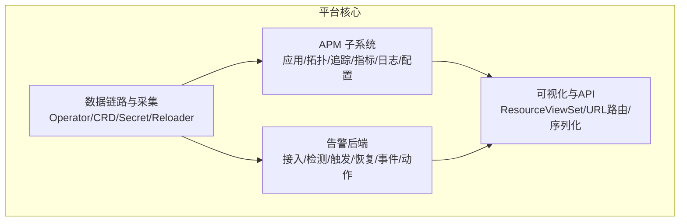
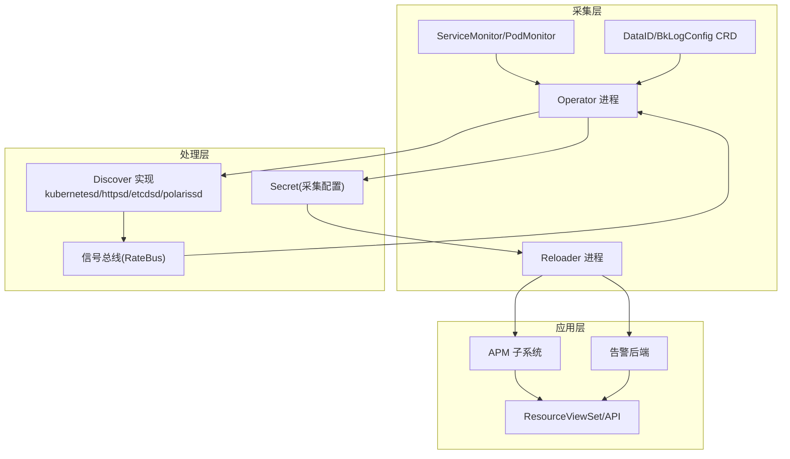
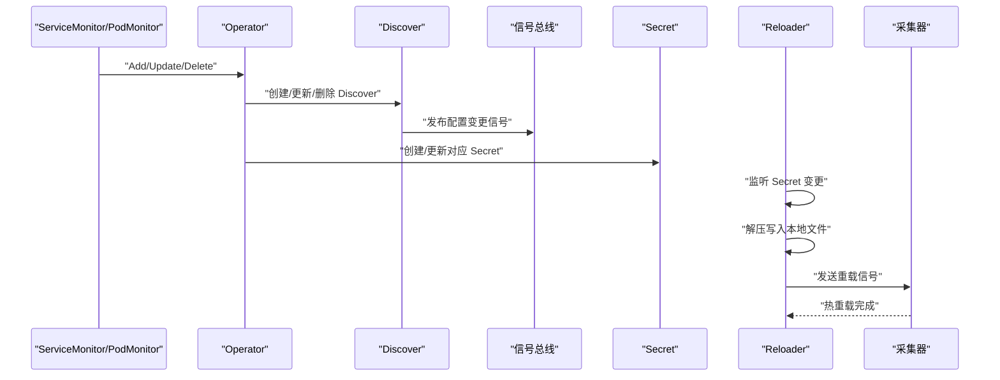
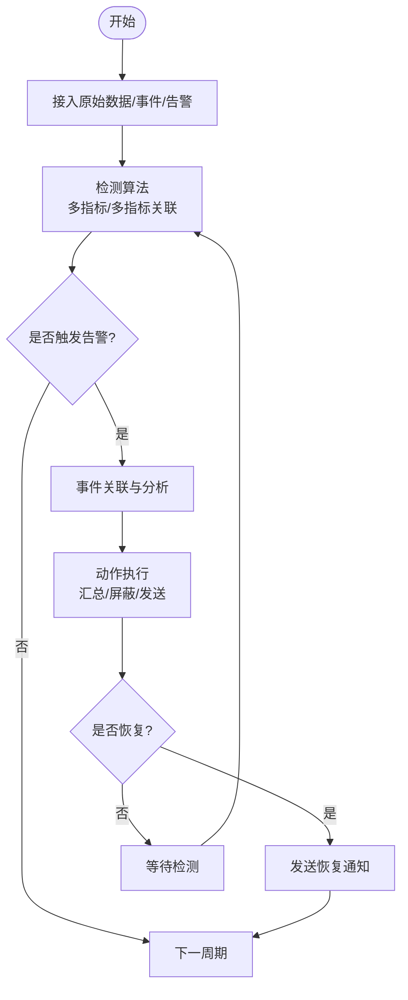
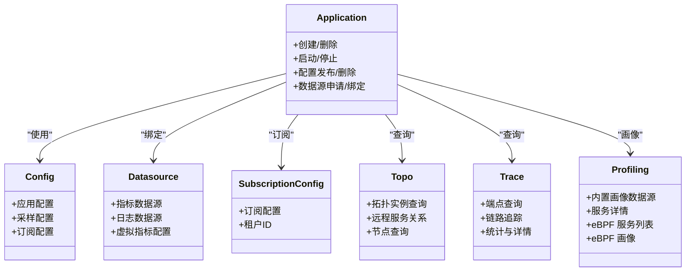
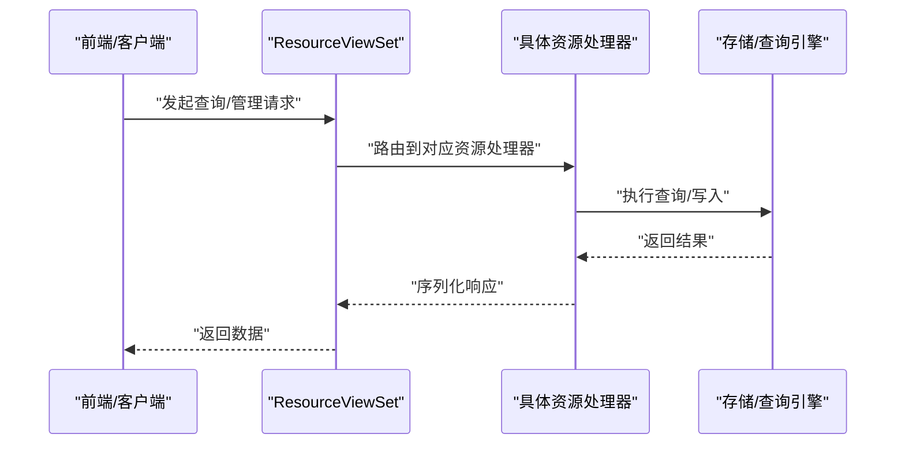
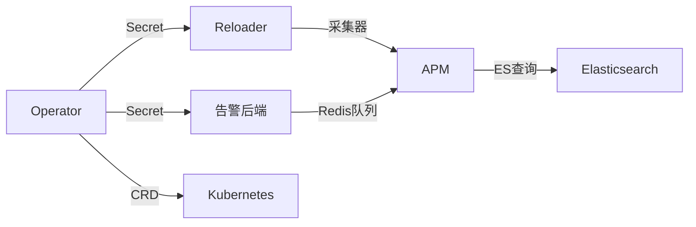

# 核心特性

<cite>
**本文档引用的文件**
- [README.md](file://README.md)
- [bkmonitor/README.md](file://bkmonitor/README.md)
- [bkmonitor/apm/views.py](file://bkmonitor/apm/views.py)
- [bkmonitor/alarm_backends/service/README.md](file://bkmonitor/alarm_backends/service/README.md)
- [ai-docs/bkmonitor-datalink/docs/operator/architecture.md](file://ai-docs/bkmonitor-datalink/docs/operator/architecture.md)
- [bkmonitor/apm/core/application_config.py](file://bkmonitor/apm/core/application_config.py)
- [bkmonitor/apm/core/discover/__init__.py](file://bkmonitor/apm/core/discover/__init__.py)
- [bkmonitor/apm/core/discover/base.py](file://bkmonitor/apm/core/discover/base.py)
- [bkmonitor/apm/core/discover/kubernetesd.py](file://bkmonitor/apm/core/discover/kubernetesd.py)
- [bkmonitor/apm/core/discover/httpsd.py](file://bkmonitor/apm/core/discover/httpsd.py)
- [bkmonitor/apm/core/discover/etcdsd.py](file://bkmonitor/apm/core/discover/etcdsd.py)
- [bkmonitor/apm/core/discover/polarissd.py](file://bkmonitor/apm/core/discover/polarissd.py)
- [bkmonitor/apm/core/discover/shareddiscovery.py](file://bkmonitor/apm/core/discover/shareddiscovery.py)
- [bkmonitor/apm/models/application.py](file://bkmonitor/apm/models/application.py)
- [bkmonitor/apm/models/config.py](file://bkmonitor/apm/models/config.py)
- [bkmonitor/apm/models/datasource.py](file://bkmonitor/apm/models/datasource.py)
- [bkmonitor/apm/models/profile.py](file://bkmonitor/apm/models/profile.py)
- [bkmonitor/apm/models/subscription_config.py](file://bkmonitor/apm/models/subscription_config.py)
- [bkmonitor/apm/models/topo.py](file://bkmonitor/apm/models/topo.py)
- [bkmonitor/apm/utils/es_search.py](file://bkmonitor/apm/utils/es_search.py)
- [bkmonitor/apm/utils/time.py](file://bkmonitor/apm/utils/time.py)
- [bkmonitor/apm/utils/ui_optimizations.py](file://bkmonitor/apm/utils/ui_optimizations.py)
- [bkmonitor/apm/utils/report_event.py](file://bkmonitor/apm/utils/report_event.py)
- [bkmonitor/apm/task/tasks.py](file://bkmonitor/apm/task/tasks.py)
- [bkmonitor/apm_ebpf/handlers/deepflow.py](file://bkmonitor/apm_ebpf/handlers/deepflow.py)
- [bkmonitor/apm_ebpf/handlers/provisioning.py](file://bkmonitor/apkmonitor/apm_ebpf/handlers/provisioning.py)
- [bkmonitor/apm_ebpf/handlers/relation.py](file://bkmonitor/apm_ebpf/handlers/relation.py)
- [bkmonitor/apm_ebpf/handlers/workload.py](file://bkmonitor/apm_ebpf/handlers/workload.py)
- [bkmonitor/apm_ebpf/models/workload.py](file://bkmonitor/apm_ebpf/models/workload.py)
- [bkmonitor/apm_ebpf/task/tasks.py](file://bkmonitor/apm_ebpf/task/tasks.py)
- [bkmonitor/apm_ebpf/constants.py](file://bkmonitor/apm_ebpf/constants.py)
- [bkmonitor/apm_ebpf/resource.py](file://bkmonitor/apm_ebpf/resource.py)
- [bkmonitor/apm_ebpf/apps.py](file://bkmonitor/apm_ebpf/apps.py)
- [bkmonitor/apm_ebpf/admin.py](file://bkmonitor/apm_ebpf/admin.py)
- [bkmonitor/apm_ebpf/__init__.py](file://bkmonitor/apm_ebpf/__init__.py)
- [bkmonitor/apm_ebpf/migrations/0001_initial.py](file://bkmonitor/apm_ebpf/migrations/0001_initial.py)
- [bkmonitor/apm_ebpf/migrations/0002_clusterrelation.py](file://bkmonitor/apm_ebpf/migrations/0002_clusterrelation.py)
- [bkmonitor/apm_ebpf/migrations/0003_auto_20231207_1520.py](file://bkmonitor/apm_ebpf/migrations/0003_auto_20231207_1520.py)
- [bkmonitor/apm_ebpf/migrations/0004_merge_20231211_1735.py](file://bkmonitor/apm_ebpf/migrations/0004_merge_20231211_1735.py)
- [bkmonitor/apm_ebpf/migrations/0005_deepflowdashboardrecord.py](file://bkmonitor/apm_ebpf/migrations/0005_deepflowdashboardrecord.py)
- [bkmonitor/apm_ebpf/migrations/__init__.py](file://bkmonitor/apm_ebpf/migrations/__init__.py)
- [bkmonitor/apm/migrations/0001_initial.py](file://bkmonitor/apm/migrations/0001_initial.py)
- [bkmonitor/apm/migrations/0002_initbuilt_config.py](file://bkmonitor/apm/migrations/0002_initbuilt_config.py)
- [bkmonitor/apm/migrations/0003_subscriptionconfig.py](file://bkmonitor/apm/migrations/0003_subscriptionconfig.py)
- [bkmonitor/apm/migrations/0004_apdexconfig_samplerconfig.py](file://bkmonitor/apm/migrations/0004_apm/migrations/0004_apdexconfig_samplerconfig.py)
- [bkmonitor/apm/migrations/0005_auto_20220524_2018.py](file://bkmonitor/apm/migrations/0005_auto_20220524_2018.py)
- [bkmonitor/apm/migrations/0006_auto_20220614_1735.py](file://bkmonitor/apm/migrations/0006_auto_20220614_1735.py)
- [bkmonitor/apm/migrations/0007_auto_20220627_2145.py](file://bkmonitor/apm/migrations/0007_auto_20220627_2145.py)
- [bkmonitor/apm/migrations/0008_auto_20220629_1817.py](file://bkmonitor/apm/migrations/0008_auto_20220629_1817.py)
- [bkmonitor/apm/migrations/0009_auto_20220701_1532.py](file://bkmonitor/apm/migrations/0009_auto_20220701_1532.py)
- [bkmonitor/apm/migrations/0010_auto_20220708_1537.py](file://bkmonitor/apm/migrations/0010_auto_20220708_1537.py)
- [bkmonitor/apm/migrations/0011_delete_traceapprelation.py](file://bkmonitor/apm/migrations/0011_delete_traceapprelation.py)
- [bkmonitor/apm/migrations/0012_auto_20220721_2126.py](file://bkmonitor/apm/migrations/0012_auto_20220721_2126.py)
- [bkmonitor/apm/migrations/0013_auto_20220902_1829.py](file://bkmonitor/apm/migrations/0013_auto_20220902_1829.py)
- [bkmonitor/apm/migrations/0014_initbuilt_metric_dimensions.py](file://bkmonitor/apm/migrations/0014_initbuilt_metric_dimensions.py)
- [bkmonitor/apm/migrations/0014_metricdatasource_bk_data_virtual_metric_config.py](file://bkmonitor/apm/migrations/0014_metricdatasource_bk_data_virtual_metric_config.py)
- [bkmonitor/apm/migrations/0015_merge_20221008_1621.py](file://bkmonitor/apm/migrations/0015_merge_20221008_1621.py)
- [bkmonitor/apm/migrations/0016_qpsconfig.py](file://bkmonitor/apm/migrations/0016_qpsconfig.py)
- [bkmonitor/apm/migrations/0017_auto_20221024_1640.py](file://bkmonitor/apm/migrations/0017_auto_20221024_1640.py)
- [bkmonitor/apm/migrations/0018_tupdate_metric_dimensions.py](file://bkmonitor/apm/migrations/0018_tupdate_metric_dimensions.py)
- [bkmonitor/apm/migrations/0019_datalink_influxdb_cluster_name.py](file://bkmonitor/apm/migrations/0019_datalink_influxdb_cluster_name.py)
- [bkmonitor/apm/migrations/0020_auto_20230309_1547.py](file://bkmonitor/apm/migrations/0020_auto_20230309_1547.py)
- [bkmonitor/apm/migrations/0021_datalink_pre_calculate_config.py](file://bkmonitor/apm/migrations/0021_datalink_pre_calculate_config.py)
- [bkmonitor/apm/migrations/0022_ebpfapplicationconfig.py](file://bkmonitor/apm/migrations/0022_ebpfapplicationconfig.py)
- [bkmonitor/apm/migrations/0023_auto_20230718_1657.py](file://bkmonitor/apm/migrations/0023_auto_20230718_1657.py)
- [bkmonitor/apm/migrations/0023_licenseconfig.py](file://bkmonitor/apm/migrations/0023_licenseconfig.py)
- [bkmonitor/apm/migrations/0024_auto_20230726_1124.py](file://bkmonitor/apm/migrations/0024_auto_20230726_1124.py)
- [bkmonitor/apm/migrations/0024_merge_0023_auto_20230718_1657_0023_licenseconfig.py](file://bkmonitor/apm/migrations/0024_merge_0023_auto_20230718_1657_0023_licenseconfig.py)
- [bkmonitor/apm/migrations/0025_auto_20230711_1505.py](file://bkmonitor/apm/migrations/0025_auto_20230711_1505.py)
- [bkmonitor/apm/migrations/0026_merge_20230801_1918.py](file://bkmonitor/apm/migrations/0026_merge_20230801_1918.py)
- [bkmonitor/apm/migrations/0027_auto_20230802_1027.py](file://bkmonitor/apm/migrations/0027_auto_20230802_1027.py)
- [bkmonitor/apm/migrations/0028_dbconfig.py](file://bkmonitor/apm/migrations/0028_dbconfig.py)
- [bkmonitor/apm/migrations/0029_probeconfig.py](file://bkmonitor/apm/migrations/0029_probeconfig.py)
- [bkmonitor/apm/migrations/0030_auto_20230816_1651.py](file://bkmonitor/apm/migrations/0030_auto_20230816_1651.py)
- [bkmonitor/apm/migrations/0031_auto_20230829_1416.py](file://bkmonitor/apm/migrations/0031_auto_20230829_1416.py)
- [bkmonitor/apm/migrations/0032_alter_normaltypevalueconfig_type.py](file://bkmonitor/apm/migrations/0032_alter_normaltypevalueconfig_type.py)
- [bkmonitor/apm/migrations/0032_auto_20231017_1646.py](file://bkmonitor/apm/migrations/0032_auto_20231017_1646.py)
- [bkmonitor/apm/migrations/0032_auto_20231219_2003.py](file://bkmonitor/apm/migrations/0032_auto_20231219_2003.py)
- [bkmonitor/apm/migrations/0033_auto_20240111_1434.py](file://bkmonitor/apm/migrations/0033_auto_20240111_1434.py)
- [bkmonitor/apm/migrations/0033_merge_0032_auto_20231017_1646_0032_auto_20231219_2003.py](file://bkmonitor/apm/migrations/0033_merge_0032_auto_20231017_1646_0032_auto_20231219_2003.py)
- [bkmonitor/apm/migrations/0033_merge_0032_auto_20231128_1157.py](file://bkmonitor/apm/migrations/0033_merge_0032_auto_20231128_1157.py)
- [bkmonitor/apm/migrations/0034_merge_20231229_1707.py](file://bkmonitor/apm/migrations/0034_merge_20231229_1707.py)
- [bkmonitor/apm/migrations/0035_merge_20240115_1605.py](file://bkmonitor/apm/migrations/0035_merge_20240115_1605.py)
- [bkmonitor/apm/migrations/0036_alter_profiledatasource_retention.py](file://bkmonitor/apm/migrations/0036_alter_profiledatasource_retention.py)
- [bkmonitor/apm/migrations/0037_apmapplication_is_enabled_profiling.py](file://bkmonitor/apm/migrations/0037_apmapplication_is_enabled_profiling.py)
- [bkmonitor/apm/migrations/0038_profiledatasource_profile_bk_biz_id.py](file://bkmonitor/apm/migrations/0038_profiledatasource_profile_bk_biz_id.py)
- [bkmonitor/apm/migrations/0039_profileservice_sample_type.py](file://bkmonitor/apm/migrations/0039_profileservice_sample_type.py)
- [bkmonitor/apm/migrations/0040_profileservice_is_large.py](file://bkmonitor/apm/migrations/0040_profileservice_is_large.py)
- [bkmonitor/apm/migrations/0041_apmtopodiscoverrule_sort.py](file://bkmonitor/apm/migrations/0041_apmtopodiscoverrule_sort.py)
- [bkmonitor/apm/migrations/0042_add_application_token_and_log_datasource.py](file://bkmonitor/apm/migrations/0042_add_application_token_and_log_datasource.py)
- [bkmonitor/apm/migrations/0043_alter_profiledatasource_profile_bk_biz_id.py](file://bkmonitor/apm/migrations/0043_alter_profiledatasource_profile_bk_biz_id.py)
- [bkmonitor/apm/migrations/0044_bcsclusterdefaultapplicationrelation.py](file://bkmonitor/apm/migrations/0044_bcsclusterdefaultapplicationrelation.py)
- [bkmonitor/apm/migrations/0045_auto_20241203_1450.py](file://bkmonitor/apm/migrations/0045_auto_20241203_1450.py)
- [bkmonitor/apm/migrations/0046_toponode_source.py](file://bkmonitor/apm/migrations/0046_toponode_source.py)
- [bkmonitor/apm/migrations/0047_auto_20250123_1930.py](file://bkmonitor/apm/migrations/0047_auto_20250123_1930.py)
- [bkmonitor/apm/migrations/0048_auto_20250418_1123.py](file://bkmonitor/apm/migrations/0048_auto_20250418_1123.py)
- [bkmonitor/apm/migrations/0049_subscriptionconfig_bk_tenant_id.py](file://bkmonitor/apm/migrations/0049_subscriptionconfig_bk_tenant_id.py)
- [bkmonitor/apm/migrations/0050_toponode_is_permanent.py](file://bkmonitor/apm/migrations/0050_toponode_is_permanent.py)
- [bkmonitor/apm/migrations/0051_auto_20251017_1101.py](file://bkmonitor/apm/migrations/0051_auto_20251017_1101.py)
- [bkmonitor/apm/migrations/0052_add_profiledatasource_v4.py](file://bkmonitor/apm/migrations/0052_add_profiledatasource_v4.py)
- [bkmonitor/apm/migrations/__init__.py](file://bkmonitor/apm/migrations/__init__.py)
- [bkmonitor/apm/urls.py](file://bkmonitor/apm/urls.py)
- [bkmonitor/apm/resources.py](file://bkmonitor/apm/resources.py)
- [bkmonitor/apm/serializers.py](file://bkmonitor/apm/serializers.py)
- [bkmonitor/apm/types.py](file://bkmonitor/apm/types.py)
- [bkmonitor/apm/constants.py](file://bkmonitor/apm/constants.py)
- [bkmonitor/apm/admin.py](file://bkmonitor/apm/admin.py)
- [bkmonitor/apm/apps.py](file://bkmonitor/apm/apps.py)
- [bkmonitor/apm/__init__.py](file://bkmonitor/apm/__init__.py)
- [bkmonitor/apm_ebpf/apps.py](file://bkmonitor/apm_ebpf/apps.py)
- [bkmonitor/apm_ebpf/admin.py](file://bkmonitor/apm_ebpf/admin.py)
- [bkmonitor/apm_ebpf/__init__.py](file://bkmonitor/apm_ebpf/__init__.py)
- [bkmonitor/apm_ebpf/constants.py](file://bkmonitor/apm_ebpf/constants.py)
- [bkmonitor/apm_ebpf/resource.py](file://bkmonitor/apm_ebpf/resource.py)
- [bkmonitor/apm_ebpf/task/tasks.py](file://bkmonitor/apm_ebpf/task/tasks.py)
- [bkmonitor/apm_ebpf/handlers/deepflow.py](file://bkmonitor/apm_ebpf/handlers/deepflow.py)
- [bkmonitor/apm_ebpf/handlers/provisioning.py](file://bkmonitor/apm_ebpf/handlers/provisioning.py)
- [bkmonitor/apm_ebpf/handlers/relation.py](file://bkmonitor/apm_ebpf/handlers/relation.py)
- [bkmonitor/apm_ebpf/handlers/workload.py](file://bkmonitor/apm_ebpf/handlers/workload.py)
- [bkmonitor/apm_ebpf/models/workload.py](file://bkmonitor/apm_ebpf/models/workload.py)
- [bkmonitor/apm_ebpf/migrations/0001_initial.py](file://bkmonitor/apm_ebpf/migrations/0001_initial.py)
- [bkmonitor/apm_ebpf/migrations/0002_clusterrelation.py](file://bkmonitor/apm_ebpf/migrations/0002_clusterrelation.py)
- [bkmonitor/apm_ebpf/migrations/0003_auto_20231207_1520.py](file://bkmonitor/apm_ebpf/migrations/0003_auto_20231207_1520.py)
- [bkmonitor/apm_ebpf/migrations/0004_merge_20231211_1735.py](file://bkmonitor/apm_ebpf/migrations/0004_merge_20231211_1735.py)
- [bkmonitor/apm_ebpf/migrations/0005_deepflowdashboardrecord.py](file://bkmonitor/apm_ebpf/migrations/0005_deepflowdashboardrecord.py)
- [bkmonitor/apm_ebpf/migrations/__init__.py](file://bkmonitor/apm_ebpf/migrations/__init__.py)
- [bkmonitor/apm_ebpf/migrations/0001_initial.py](file://bkmonitor/apm_ebpf/migrations/0001_initial.py)
- [bkmonitor/apm_ebpf/migrations/0002_clusterrelation.py](file://bkmonitor/apm_ebpf/migrations/0002_clusterrelation.py)
- [bkmonitor/apm_ebpf/migrations/0003_auto_20231207_1520.py](file://bkmonitor/apm_ebpf/migrations/0003_auto_20231207_1520.py)
- [bkmonitor/apm_ebpf/migrations/0004_merge_20231211_1735.py](file://bkmonitor/apm_ebpf/migrations/0004_merge_20231211_1735.py)
- [bkmonitor/apm_ebpf/migrations/0005_deepflowdashboardrecord.py](file://bkmonitor/apm_ebpf/migrations/0005_deepflowdashboardrecord.py)
- [bkmonitor/apm_ebpf/migrations/__init__.py](file://bkmonitor/apm_ebpf/migrations/__init__.py)
</cite>

## 目录
1. [简介](#简介)
2. [项目结构](#项目结构)
3. [核心组件](#核心组件)
4. [架构总览](#架构总览)
5. [详细组件分析](#详细组件分析)
6. [依赖分析](#依赖分析)
7. [性能考虑](#性能考虑)
8. [故障排查指南](#故障排查指南)
9. [结论](#结论)
10. [附录](#附录)

## 简介
本文件聚焦蓝鲸智云监控平台的核心特性，围绕“监控数据采集、告警处理、APM 全栈监控、可视化展示”四大能力，系统阐述其业务价值、技术实现亮点、配置与扩展方式，并给出面向不同角色用户的理解与使用指导。平台依托蓝鲸 PaaS 生态，具备强大的数据采集与处理能力、可扩展的告警链路、完善的 APM 全链路可观测能力，以及丰富的可视化与集成接口，能够覆盖从基础设施到应用层的全栈监控场景。

## 项目结构
- 平台采用模块化分层组织，核心模块包括：
  - APM 子系统：应用拓扑、服务追踪、指标与日志关联、eBPF/DeepFlow 探针、配置与订阅管理。
  - 告警后端：数据接入、检测、触发、恢复、事件关联、动作执行与自监控。
  - 数据链路与采集：operator 架构、CRD 资源、Secret 热重载、服务发现与采集分发。
  - 可视化与 API：REST 资源视图集、URL 路由、序列化与类型定义。
- 项目根 README 提供总体概览与入口；bkmonitor/README 提供开发与运行环境说明。

章节来源
- [README.md:13-21](file://README.md#L13-L21)
- [bkmonitor/README.md:19-21](file://bkmonitor/README.md#L19-L21)

## 核心组件
- 监控数据采集
  - 基于 Kubernetes Operator 的自动化采集：通过 CRD 定义采集任务，动态下发 Secret，Worker Pod 热重载生效，支持多种服务发现与采集目标匹配。
  - 支持 Prometheus ServiceMonitor/PodMonitor、HTTP、Etcd、北极星等多种服务发现方式，适配多集群与混合云场景。
- 告警处理
  - 告警流水线模块化：接入、检测、触发、恢复、事件关联、动作执行与自监控，形成完整的闭环。
  - Redis 队列与键空间规划，保障跨服务数据流转与持久化。
- APM 全栈监控
  - 应用配置与发布：应用创建、配置下发、指标维度管理、数据源申请与绑定。
  - 拓扑与追踪：服务拓扑、端点查询、链路追踪、统计与详情查询。
  - eBPF/DeepFlow：服务列表、探针配置、关系与工作负载联动。
- 可视化展示
  - REST 资源视图集统一暴露查询与管理接口，支持前端按需调用。
  - 通过 URL 路由与序列化器，提供稳定、可扩展的 API 层。

章节来源
- [ai-docs/bkmonitor-datalink/docs/operator/architecture.md:1-249](file://ai-docs/bkmonitor-datalink/docs/operator/architecture.md#L1-L249)
- [bkmonitor/alarm_backends/service/README.md:1-120](file://bkmonitor/alarm_backends/service/README.md#L1-L120)
- [bkmonitor/apm/views.py:11-142](file://bkmonitor/apm/views.py#L11-L142)

## 架构总览
下图展示平台核心模块之间的交互关系与数据流向，体现“采集—处理—告警—可视化”的整体闭环。

图表来源
- [ai-docs/bkmonitor-datalink/docs/operator/architecture.md:45-181](file://ai-docs/bkmonitor-datalink/docs/operator/architecture.md#L45-L181)
- [bkmonitor/apm/views.py:67-142](file://bkmonitor/apm/views.py#L67-L142)

章节来源
- [ai-docs/bkmonitor-datalink/docs/operator/architecture.md:45-181](file://ai-docs/bkmonitor-datalink/docs/operator/architecture.md#L45-L181)
- [bkmonitor/apm/views.py:67-142](file://bkmonitor/apm/views.py#L67-L142)

## 详细组件分析

### 监控数据采集（Operator 与 Reloader）
- 设计要点
  - 两进程架构：Operator 负责 CRD 监听与 Secret 生成，Reloader 在 Worker Pod 内监听 Secret 变更并触发采集器热重载。
  - Discover 抽象：统一服务发现接口，支持多种实现（K8s、HTTP、Etcd、北极星），并通过共享发现减少重复拉取。
  - 配置分发：按 StatefulSet/ DaemonSet/ 事件类型拆分 Secret，结合哈希与轮询策略分配到多个 Worker。
- 关键流程
  - Operator 启动等待 DataID 监听器初始化，Watch ServiceMonitor/PodMonitor，生成 Discover 并定期拉取 TargetGroups，经 relabel 生成 ChildConfig，发布到信号总线。
  - 收到信号后，聚合各 Discover 的子配置，创建/更新对应 Secret；Reloader 监听自身 Secret，解压写入本地文件并发送重载信号。
- 适用场景
  - 大规模多集群指标采集、日志采集、事件采集、时钟同步采集。
  - 动态扩缩容与无感配置变更。

图表来源
- [ai-docs/bkmonitor-datalink/docs/operator/architecture.md:129-181](file://ai-docs/bkmonitor-datalink/docs/operator/architecture.md#L129-L181)

章节来源
- [ai-docs/bkmonitor-datalink/docs/operator/architecture.md:45-181](file://ai-docs/bkmonitor-datalink/docs/operator/architecture.md#L45-L181)

### 告警处理（告警流水线）
- 模块划分
  - 接入(access)：原始数据/事件/告警数据拉取、维度补充、范围过滤、标准化输出。
  - 检测(detect)：多指标计算与关联，输出异常。
  - 触发(trigger)：异常+检测结果触发事件。
  - 恢复(recovery)：未恢复事件+检测结果判断恢复，输出恢复动作。
  - 事件(event)：事件关联与分析，输出通知动作。
  - 动作(action)：通知汇总、屏蔽、发送。
  - 自监控(selfmon)：日志轮转、QoS 检测与简单告警。
- Redis 规划
  - 键前缀规范与 DB 分配：配置、队列、Celery Broker、服务自身数据分别落库，确保隔离与可清理性。
- 适用场景
  - 多源异构数据融合检测、复杂规则组合与阈值/趋势/智能检测、事件关联与收敛、通知渠道统一编排。

图表来源
- [bkmonitor/alarm_backends/service/README.md:1-120](file://bkmonitor/alarm_backends/service/README.md#L1-L120)

章节来源
- [bkmonitor/alarm_backends/service/README.md:1-120](file://bkmonitor/alarm_backends/service/README.md#L1-L120)

### APM 全栈监控（应用、拓扑、追踪、eBPF/DeepFlow）
- 应用与配置
  - 应用创建/删除、启动/停止、配置发布与删除、数据源申请与绑定、指标维度管理。
  - 应用配置模型、数据源模型、订阅配置模型支撑配置生命周期管理。
- 拓扑与追踪
  - 服务拓扑实例查询、远程服务关系、节点查询；端点、链路追踪、统计与详情查询。
  - 查询支持 ES 搜索、字段统计、Top-K 等能力。
- eBPF/DeepFlow
  - 服务列表查询、探针配置、关系与工作负载联动，支持 Dashboard 记录与集群关系。
- 适用场景
  - 应用上线前的性能基线建立、线上问题的端到端定位、热点函数与慢调用分析、跨服务依赖与瓶颈识别。

图表来源
- [bkmonitor/apm/models/application.py](file://bkmonitor/apm/models/application.py)
- [bkmonitor/apm/models/config.py](file://bkmonitor/apm/models/config.py)
- [bkmonitor/apm/models/datasource.py](file://bkmonitor/apm/models/datasource.py)
- [bkmonitor/apm/models/subscription_config.py](file://bkmonitor/apm/models/subscription_config.py)
- [bkmonitor/apm/models/topo.py](file://bkmonitor/apm/models/topo.py)
- [bkmonitor/apm/models/profile.py](file://bkmonitor/apm/models/profile.py)

章节来源
- [bkmonitor/apm/views.py:67-142](file://bkmonitor/apm/views.py#L67-L142)
- [bkmonitor/apm/models/application.py](file://bkmonitor/apm/models/application.py)
- [bkmonitor/apm/models/config.py](file://bkmonitor/apm/models/config.py)
- [bkmonitor/apm/models/datasource.py](file://bkmonitor/apm/models/datasource.py)
- [bkmonitor/apm/models/subscription_config.py](file://bkmonitor/apm/models/subscription_config.py)
- [bkmonitor/apm/models/topo.py](file://bkmonitor/apm/models/topo.py)
- [bkmonitor/apm/models/profile.py](file://bkmonitor/apm/models/profile.py)

### 可视化展示（ResourceViewSet 与 API）
- API 设计
  - ResourceViewSet 将查询与管理接口统一暴露，便于前端按需调用。
  - 路由与序列化器分离职责，保证接口稳定性与扩展性。
- 适用场景
  - 控制台页面、第三方系统集成、自动化脚本与 AI 辅助诊断。

图表来源
- [bkmonitor/apm/views.py:67-142](file://bkmonitor/apm/views.py#L67-L142)
- [bkmonitor/apm/urls.py](file://bkmonitor/apm/urls.py)
- [bkmonitor/apm/resources.py](file://bkmonitor/apm/resources.py)
- [bkmonitor/apm/serializers.py](file://bkmonitor/apm/serializers.py)

章节来源
- [bkmonitor/apm/views.py:67-142](file://bkmonitor/apm/views.py#L67-L142)
- [bkmonitor/apm/urls.py](file://bkmonitor/apm/urls.py)
- [bkmonitor/apm/resources.py](file://bkmonitor/apm/resources.py)
- [bkmonitor/apm/serializers.py](file://bkmonitor/apm/serializers.py)

## 依赖分析
- 组件耦合与内聚
  - APM 与采集层通过 Secret 与 Reloader 解耦，实现配置与执行分离。
  - 告警后端通过 Redis 队列与信号总线实现模块间解耦，提升可扩展性与可靠性。
- 外部依赖与集成点
  - Kubernetes CRD 与 Operator 生态：ServiceMonitor/PodMonitor、自定义 CRD。
  - Redis：队列、Broker、服务内部数据存储。
  - Elasticsearch：APM 查询与统计。
- 循环依赖风险
  - 通过接口抽象（如 Discover）与资源视图集路由避免循环依赖。

图表来源
- [ai-docs/bkmonitor-datalink/docs/operator/architecture.md:45-181](file://ai-docs/bkmonitor-datalink/docs/operator/architecture.md#L45-L181)
- [bkmonitor/alarm_backends/service/README.md:81-120](file://bkmonitor/alarm_backends/service/README.md#L81-L120)

章节来源
- [ai-docs/bkmonitor-datalink/docs/operator/architecture.md:45-181](file://ai-docs/bkmonitor-datalink/docs/operator/architecture.md#L45-L181)
- [bkmonitor/alarm_backends/service/README.md:81-120](file://bkmonitor/alarm_backends/service/README.md#L81-L120)

## 性能考虑
- 采集性能
  - 通过共享服务发现与 TargetGroup 去重，降低重复拉取开销。
  - ChildConfig 哈希校验与轮询分配，平衡 Worker 负载与配置变更频率。
- 处理性能
  - Redis 多 DB 分离，避免热键竞争；队列与信号总线解耦，提升吞吐。
  - 告警检测模块支持多指标关联与范围过滤，减少无效计算。
- APM 性能
  - ES 查询优化与字段统计 Top-K，降低大结果集传输与渲染压力。
  - eBPF/DeepFlow 探针按需采集，减少系统开销。
- 可观测性
  - 自监控模块对日志轮转、QoS 进行检测与告警，保障系统健康。

## 故障排查指南
- 采集侧
  - 检查 CRD 是否正确创建、Operator 是否监听到变更、Secret 是否生成与更新、Reloader 是否收到变更并触发重载。
  - 关注服务发现配置与标签匹配，确认目标端点可达。
- 告警侧
  - 核对 Redis 键前缀与 DB 分配是否符合预期，检查队列与 Broker 配置。
  - 关注检测规则与阈值设置，验证异常输出与事件触发链路。
- APM 侧
  - 核对应用配置发布状态、数据源绑定与指标维度，检查 ES 映射与查询权限。
  - eBPF/DeepFlow 探针状态与工作负载关系，确认 Dashboard 记录与集群关系正常。
- 可视化侧
  - 检查 ResourceViewSet 路由与序列化器，确认请求参数与返回格式一致。

章节来源
- [ai-docs/bkmonitor-datalink/docs/operator/architecture.md:129-181](file://ai-docs/bkmonitor-datalink/docs/operator/architecture.md#L129-L181)
- [bkmonitor/alarm_backends/service/README.md:81-120](file://bkmonitor/alarm_backends/service/README.md#L81-L120)
- [bkmonitor/apm/views.py:67-142](file://bkmonitor/apm/views.py#L67-L142)

## 结论
蓝鲸智云监控平台以“采集—处理—告警—可视化”为主线，构建了覆盖基础设施到应用层的全栈监控能力。通过 Operator 架构实现采集的自动化与弹性，通过模块化的告警流水线保障告警的高可靠与高扩展，通过 APM 全链路能力支撑线上问题快速定位与性能优化，通过统一的 API 与资源视图集实现可视化与集成的灵活性。平台适合对稳定性、可扩展性与智能化有较高要求的生产环境。

## 附录
- 配置与扩展
  - 采集：CRD 定义、服务发现策略、Secret 热重载策略。
  - 告警：检测算法与规则、Redis 队列与键空间规划、动作通道配置。
  - APM：应用配置与发布、数据源绑定、eBPF/DeepFlow 探针配置。
  - 可视化：ResourceViewSet 路由与序列化器扩展、前端调用规范。
- 集成方式
  - 通过 REST API 与 CRD 与蓝鲸生态集成，支持多集群、多云与混合云场景。
- 角色指导
  - 运维工程师：关注采集与告警配置、Redis 与存储健康。
  - 平台工程师：关注 Operator 与 CRD 生命周期、Secret 管理与热重载。
  - 应用工程师：关注 APM 配置、拓扑与追踪、eBPF/DeepFlow 使用。
  - 产品/运营：关注可视化面板与报表、通知策略与收敛规则。