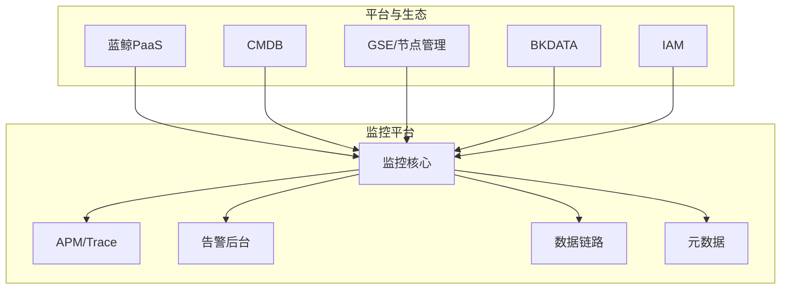
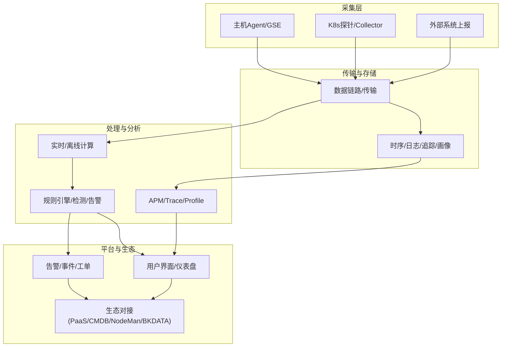
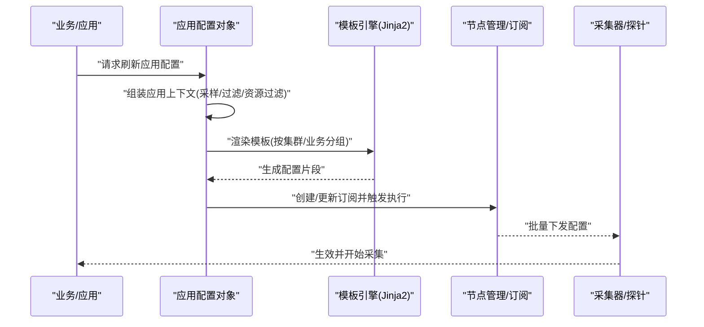
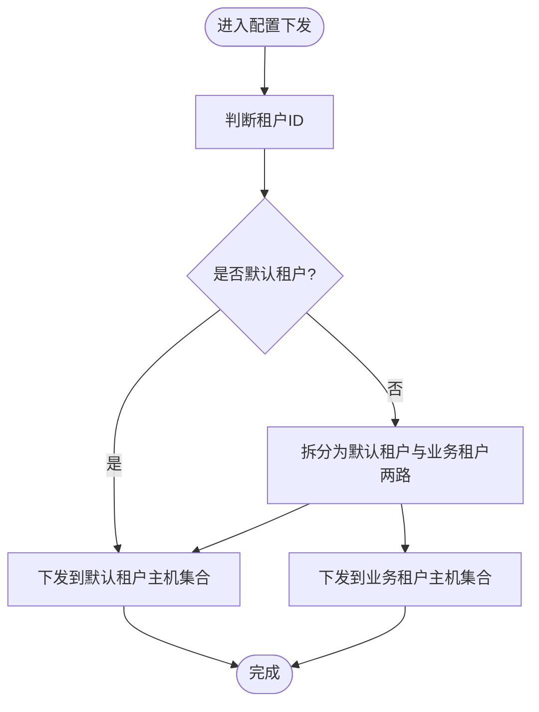
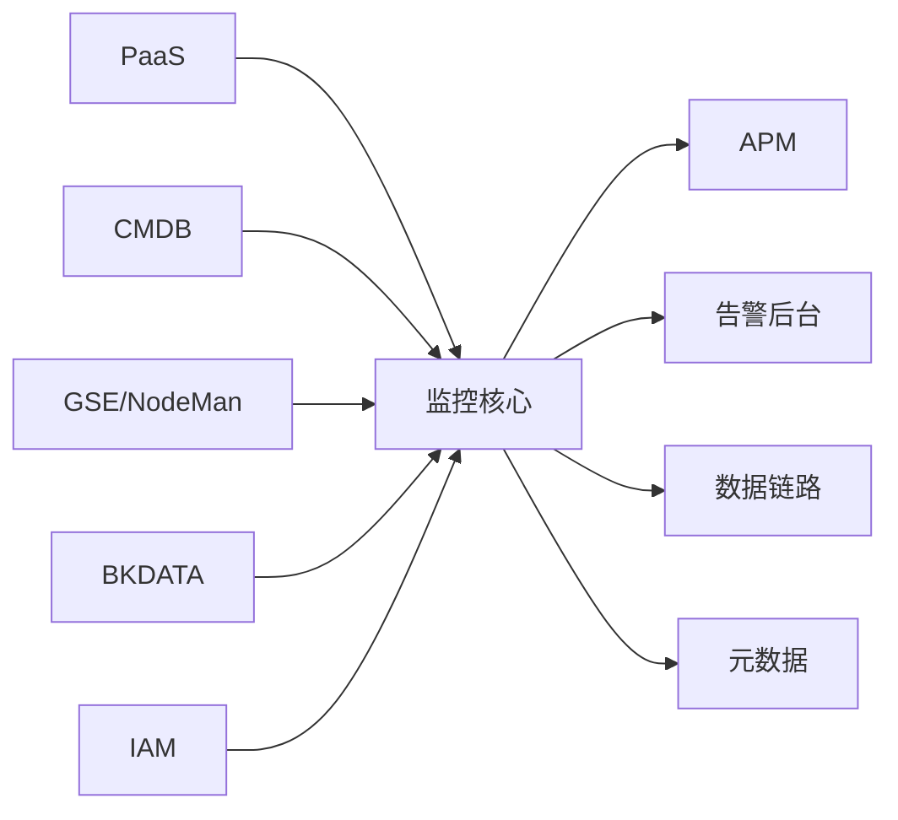

# 设计理念

<cite>
**本文引用的文件**
- [README.md](file://README.md)
- [common.py](file://bkmonitor/constants/common.py)
- [application_config.py](file://bkmonitor/apm/core/application_config.py)
- [架构设计.md](file://docs/overview/architecture.md)
- [代码框架.md](file://docs/overview/code_framework.md)
- [设计.md](file://docs/overview/design.md)
</cite>

## 目录
1. [引言](#引言)
2. [项目结构](#项目结构)
3. [核心组件](#核心组件)
4. [架构总览](#架构总览)
5. [详细组件分析](#详细组件分析)
6. [依赖分析](#依赖分析)
7. [性能考量](#性能考量)
8. [故障排查指南](#故障排查指南)
9. [结论](#结论)
10. [附录](#附录)

## 引言
本文件系统化阐述蓝鲸智云监控平台的设计理念与工程实践，围绕以下主题展开：
- 设计原则、核心价值观与技术哲学
- 易用性与功能性的平衡，扩展性与稳定性的权衡
- 平台化思维、开放性设计与生态集成
- 用户体验设计、系统架构设计与数据治理
- 具体设计案例与决策依据，帮助开发者理解“为何如此设计”

平台定位为蓝鲸生态的监控底座，强调“可观测性闭环”“多场景适配”“智能化与自动化”，并通过模块化、可插拔、可配置的方式支撑大规模数据采集、处理与告警。

章节来源
- [README.md:13-15](file://README.md#L13-L15)

## 项目结构
从仓库组织看，项目采用“多子系统+平台化组件”的分层布局：
- 核心业务域：监控、告警、APM、数据链路等
- 平台基础：权限、空间、元数据、API网关对接、中间件与工具
- 文档与规范：设计、架构、代码框架、运维指南
- 生态对接：与PaaS、CMDB、GSE、NodeMan、BKDATA、ITSMS等的集成

章节来源
- [README.md:17-20](file://README.md#L17-L20)

## 核心组件
本节聚焦平台化设计的关键构件及其职责边界，体现“平台化思维”和“开放性设计”。

- 多租户与默认租户策略
  - 使用统一默认租户ID以兼容多租户与非多租户场景，降低接入复杂度，保证逻辑一致性。
  - 通过常量与配置抽象，避免在业务层反复判断租户差异。

- APM应用配置下发与模板化
  - 以“应用配置”为中心，结合Jinja2模板与多种配置类型（采样、指标过滤、资源过滤、服务发现、速率限制等），实现按业务/应用粒度的精细化控制。
  - 支持传统主机与K8s集群两类部署形态，统一通过订阅/配置映射完成批量下发。

- 权限与空间
  - 通过空间与权限模块，将资源访问与业务域隔离，确保跨业务安全与合规。

- 数据治理与元数据
  - 以元数据为核心枢纽，串联采集、存储、查询与展示，提供统一的数据血缘与治理视图。

章节来源
- [common.py:127-129](file://bkmonitor/constants/common.py#L127-L129)
- [application_config.py:52-84](file://bkmonitor/apm/core/application_config.py#L52-L84)
- [application_config.py:86-148](file://bkmonitor/apm/core/application_config.py#L86-L148)

## 架构总览
平台采用“平台+生态”的双层架构：
- 平台层：提供统一的采集、存储、计算、告警、可视化与运营能力
- 生态层：与蓝鲸生态组件解耦对接，形成可观测性闭环

章节来源
- [架构设计.md](file://docs/overview/architecture.md)
- [代码框架.md](file://docs/overview/code_framework.md)

## 详细组件分析

### APM应用配置下发流程
该流程体现了“开放性设计”与“平台化思维”：通过统一的配置模型与模板，将业务侧的观测需求转化为可执行的采集/处理策略，并以订阅方式批量下发到目标节点或集群。

图表来源
- [application_config.py:58-84](file://bkmonitor/apm/core/application_config.py#L58-L84)
- [application_config.py:109-147](file://bkmonitor/apm/core/application_config.py#L109-L147)

章节来源
- [application_config.py:52-84](file://bkmonitor/apm/core/application_config.py#L52-L84)
- [application_config.py:86-148](file://bkmonitor/apm/core/application_config.py#L86-L148)

### 多租户与默认租户策略
- 设计动机：统一多租户与非多租户场景的逻辑，减少业务侧分支判断，提升一致性与可维护性
- 实现要点：使用默认租户ID作为兜底，按需区分租户下发范围；在K8s场景中支持“全局配置+业务配置”的组合下发

图表来源
- [application_config.py:77-83](file://bkmonitor/apm/core/application_config.py#L77-L83)
- [common.py:127-129](file://bkmonitor/constants/common.py#L127-L129)

章节来源
- [application_config.py:76-83](file://bkmonitor/apm/core/application_config.py#L76-L83)
- [common.py:127-129](file://bkmonitor/constants/common.py#L127-L129)

### 权限与空间
- 空间与权限模块负责资源域隔离与访问控制，确保跨业务/多租户场景下的安全与合规
- 与平台其他模块解耦，通过接口/序列化/校验器等抽象层对接

章节来源
- [README.md:35-41](file://README.md#L35-L41)

### 数据治理与元数据
- 元数据作为数据治理中枢，贯穿采集、存储、查询、展示全链路
- 提供统一的数据血缘、命名规范与质量度量，支撑跨系统协同与审计

章节来源
- [README.md:35-41](file://README.md#L35-L41)

## 依赖分析
平台内部模块之间呈现“平台内聚、生态解耦”的特征：
- 平台内：监控核心、APM、告警后台、数据链路、元数据等模块内聚度高，接口清晰
- 生态解耦：通过API网关、组件SDK与统一认证/鉴权对接，避免强绑定

图表来源
- [README.md:35-41](file://README.md#L35-L41)

章节来源
- [README.md:35-41](file://README.md#L35-L41)

## 性能考量
- 配置下发批量化与幂等：通过订阅与哈希比对，避免重复下发与抖动
- 模板渲染与资源过滤：在配置阶段完成资源裁剪与过滤，降低下游压力
- K8s集群分组与按需下发：仅对需要的业务/集群下发配置，减少广播风暴
- 采样与速率限制：在应用层即刻控制流量，保障系统稳定性

章节来源
- [application_config.py:109-147](file://bkmonitor/apm/core/application_config.py#L109-L147)
- [application_config.py:282-307](file://bkmonitor/apm/core/application_config.py#L282-L307)

## 故障排查指南
- 配置下发失败
  - 检查订阅是否存在、参数是否变化导致MD5不一致
  - 核对目标主机/集群是否在白名单内
- APM采集异常
  - 校验应用配置上下文是否完整（采样/过滤/资源过滤）
  - 确认模板渲染结果与期望一致
- 多租户场景
  - 确认租户ID与默认租户策略是否匹配
  - 核对下发范围是否正确

章节来源
- [application_config.py:595-636](file://bkmonitor/apm/core/application_config.py#L595-L636)
- [application_config.py:109-147](file://bkmonitor/apm/core/application_config.py#L109-L147)

## 结论
蓝鲸智云监控平台的设计以“平台化思维”为核心，通过“开放性设计”与“生态集成”实现可观测性闭环。在工程实践中，强调：
- 易用性与功能性的平衡：以统一配置模型与模板化能力降低接入成本，同时保留高级定制空间
- 扩展性与稳定性的权衡：通过批量化下发、资源过滤与采样控制，兼顾吞吐与稳定性
- 用户体验与系统架构的协同：前端仪表盘与后端配置/计算解耦，提升可维护性与可演进性
- 数据治理与跨域协作：以元数据与权限体系保障数据质量与安全

## 附录
- 设计理念与原则
  - 平台化：统一能力沉淀与复用，降低业务接入成本
  - 开放性：标准化接口与配置模型，支持多生态对接
  - 生态集成：与PaaS、CMDB、GSE、NodeMan、BKDATA等形成闭环
  - 用户体验：以“可用、好用、易用”为目标，简化复杂场景
  - 数据治理：以元数据为核心，贯穿全生命周期

章节来源
- [设计.md](file://docs/overview/design.md)
- [架构设计.md](file://docs/overview/architecture.md)
- [代码框架.md](file://docs/overview/code_framework.md)