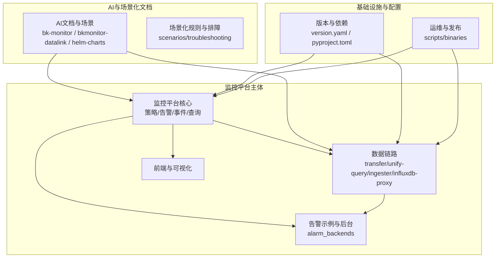
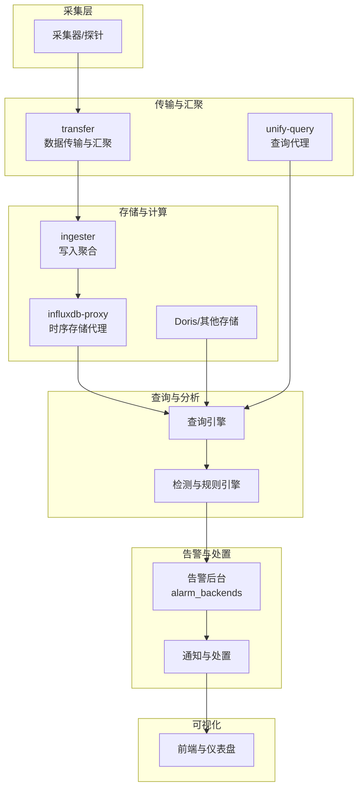
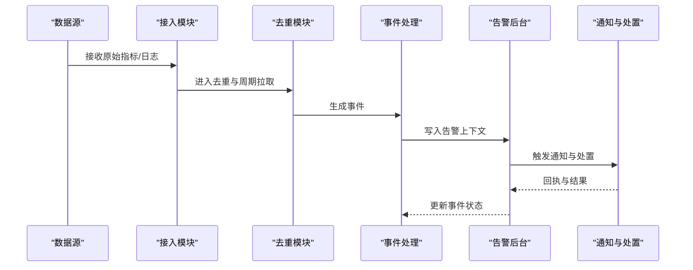
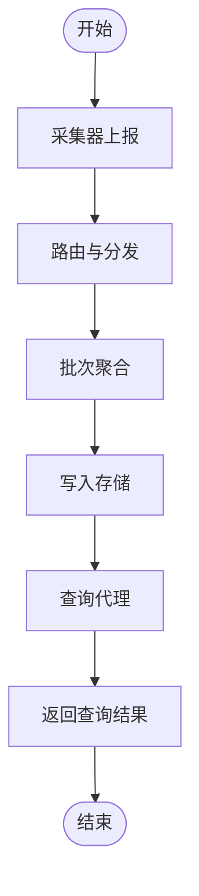
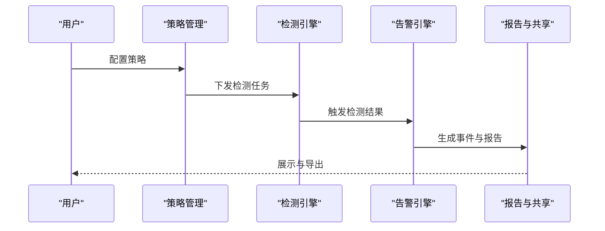
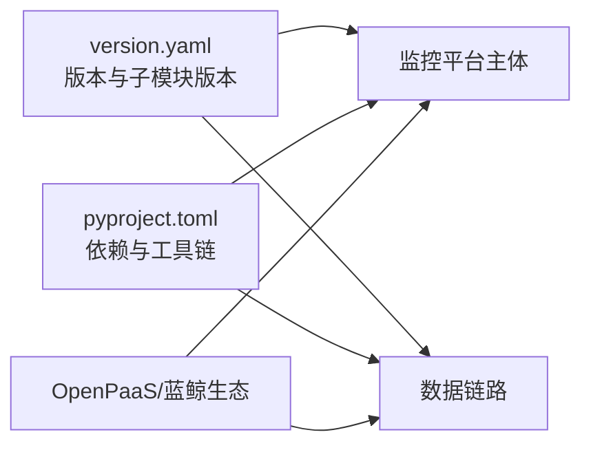

# 项目介绍

<cite>
**本文引用的文件**
- [README.md](file://README.md)
- [bkmonitor/README.md](file://bkmonitor/README.md)
- [bkmonitor/version.yaml](file://bkmonitor/version.yaml)
- [pyproject.toml](file://pyproject.toml)
- [ai-docs/bk-monitor/docs/告警后台(alarm_backends)/告警数据流.md](file://ai-docs/bk-monitor/docs/告警后台(alarm_backends)/告警数据流.md)
- [ai-docs/bk-monitor/docs/告警后台(alarm_backends)/部署架构.md](file://ai-docs/bk-monitor/docs/告警后台(alarm_backends)/部署架构.md)
- [ai-docs/bkmonitor-datalink/docs/transfer/architecture.md](file://ai-docs/bkmonitor-datalink/docs/transfer/architecture.md)
- [docs/wiki/README.md](file://docs/wiki/README.md)
</cite>

## 目录
1. [简介](#简介)
2. [项目结构](#项目结构)
3. [核心组件](#核心组件)
4. [架构总览](#架构总览)
5. [详细组件分析](#详细组件分析)
6. [依赖分析](#依赖分析)
7. [性能考虑](#性能考虑)
8. [故障排查指南](#故障排查指南)
9. [结论](#结论)
10. [附录](#附录)

## 简介
蓝鲸智云监控平台（BLUEKING-MONITOR）是蓝鲸智云官方推出的面向企业级场景的统一监控平台，具备强大的数据采集能力、大规模数据处理能力与可扩展的平台能力。平台依托蓝鲸 PaaS，区别于传统 C/S 架构，能够与蓝鲸生态形成监控闭环，覆盖从采集、传输、存储、查询、检测、告警到处置的全链路能力，致力于提升监控的及时性、准确性与智能化水平，为在线业务提供稳定保障。

- 当前版本与发布状态：主分支在开发过程中可能处于不稳定状态，请以官方发布的稳定版本为准；项目提供版本号与子模块版本清单，便于追踪发布状态与依赖范围。
- 许可证：项目采用 MIT 许可证，便于社区协作与二次开发。
- 社区与支持：提供产品文档、蓝鲸论坛等渠道，便于用户获取帮助与参与社区建设。

章节来源
- [README.md:13-15](file://README.md#L13-L15)
- [README.md:4-5](file://README.md#L4-L5)
- [README.md:50-51](file://README.md#L50-L51)
- [bkmonitor/version.yaml:1-11](file://bkmonitor/version.yaml#L1-L11)

## 项目结构
项目采用多模块、多子系统的组织方式，围绕“监控平台主体 + 数据链路 + AI 辅助能力 + 场景化文档”展开。核心模块包括：
- 监控平台主体：提供策略、告警、事件、仪表盘、查询等核心能力。
- 数据链路（bkmonitor-datalink）：负责采集、传输、写入、查询代理等数据通路。
- AI 文档与场景：提供告警示例、部署架构、数据流说明等知识库。
- 配置与工具：版本、依赖、构建与运行脚本等。

下面给出一个概览图，展示主要模块之间的关系与职责边界：

章节来源
- [README.md:17-21](file://README.md#L17-L21)
- [bkmonitor/README.md:19-21](file://bkmonitor/README.md#L19-L21)

## 核心组件
- 监控平台核心：提供策略管理、检测算法、告警触发、事件与工单联动、报告与共享等能力，支撑多场景监控需求。
- 告警示例与后台：沉淀大量告警示例与后台处理流程，覆盖接入、去重、周期拉取、事件处理、ES 深分页优化等主题，确保告警处理的稳定性与高性能。
- 数据链路：包含 transfer、unify-query、ingester、influxdb-proxy 等组件，承担采集、汇聚、写入、查询代理等职责，支撑高吞吐与低延迟的数据通路。
- 可视化与前端：提供仪表盘、图表与交互体验，配合后端 API 实现完整的监控可视化闭环。
- 配置与版本：通过 version.yaml 统一管理主版本与子模块版本，pyproject.toml 管理依赖与工具链，确保开发与发布的一致性。

章节来源
- [bkmonitor/README.md:19-21](file://bkmonitor/README.md#L19-L21)
- [bkmonitor/version.yaml:1-11](file://bkmonitor/version.yaml#L1-L11)
- [pyproject.toml:39-61](file://pyproject.toml#L39-L61)

## 架构总览
平台整体架构由“采集-传输-存储-查询-检测-告警-处置-可视化”构成，强调高可用、可扩展与可观测性。告警示例与后台文档提供了告警数据流与部署架构的详细说明，数据链路文档则阐述了 transfer 等组件的架构设计与职责划分。

图示来源
- [ai-docs/bk-monitor/docs/告警后台(alarm_backends)/告警数据流.md](file://ai-docs/bk-monitor/docs/告警后台(alarm_backends)/告警数据流.md)
- [ai-docs/bk-monitor/docs/告警后台(alarm_backends)/部署架构.md](file://ai-docs/bk-monitor/docs/告警后台(alarm_backends)/部署架构.md)
- [ai-docs/bkmonitor-datalink/docs/transfer/architecture.md](file://ai-docs/bkmonitor-datalink/docs/transfer/architecture.md)

## 详细组件分析

### 告警示例与后台（alarm_backends）
该模块沉淀了大量告警示例与后台处理流程，覆盖接入、去重、周期拉取、事件处理、ES 深分页优化等主题，确保告警处理的稳定性与高性能。其核心流程如下：

图示来源
- [ai-docs/bk-monitor/docs/告警后台(alarm_backends)/告警数据流.md](file://ai-docs/bk-monitor/docs/告警后台(alarm_backends)/告警数据流.md)
- [ai-docs/bk-monitor/docs/告警后台(alarm_backends)/modules/access/去重机制详解.md](file://ai-docs/bk-monitor/docs/告警后台(alarm_backends)/modules/access/去重机制详解.md)
- [ai-docs/bk-monitor/docs/告警后台(alarm_backends)/modules/access/周期拉取与数据不遗漏保障机制.md](file://ai-docs/bk-monitor/docs/告警后台(alarm_backends)/modules/access/周期拉取与数据不遗漏保障机制.md)

章节来源
- [ai-docs/bk-monitor/docs/告警后台(alarm_backends)/告警数据流.md](file://ai-docs/bk-monitor/docs/告警后台(alarm_backends)/告警数据流.md)
- [ai-docs/bk-monitor/docs/告警后台(alarm_backends)/部署架构.md](file://ai-docs/bk-monitor/docs/告警后台(alarm_backends)/部署架构.md)

### 数据链路（bkmonitor-datalink）
数据链路模块负责采集、传输、写入与查询代理，确保高吞吐与低延迟的数据通路。transfer 组件的架构设计与职责划分如下：

图示来源
- [ai-docs/bkmonitor-datalink/docs/transfer/architecture.md](file://ai-docs/bkmonitor-datalink/docs/transfer/architecture.md)

章节来源
- [ai-docs/bkmonitor-datalink/docs/transfer/architecture.md](file://ai-docs/bkmonitor-datalink/docs/transfer/architecture.md)

### 监控平台核心（策略/检测/告警）
监控平台核心模块提供策略管理、检测算法、告警触发、事件与工单联动、报告与共享等能力。其处理流程如下：

图示来源
- [bkmonitor/README.md:19-21](file://bkmonitor/README.md#L19-L21)

章节来源
- [bkmonitor/README.md:19-21](file://bkmonitor/README.md#L19-L21)

## 依赖分析
- 版本与子模块：主版本与子模块版本通过 version.yaml 统一管理，便于发布与回溯。
- 依赖与工具链：pyproject.toml 管理代码风格、静态检查、格式化与测试工具，确保开发质量与一致性。
- 生态依赖：与蓝鲸 PaaS、OpenPaaS 等生态组件协同，形成监控闭环。

图示来源
- [bkmonitor/version.yaml:1-11](file://bkmonitor/version.yaml#L1-L11)
- [pyproject.toml:39-61](file://pyproject.toml#L39-L61)

章节来源
- [bkmonitor/version.yaml:1-11](file://bkmonitor/version.yaml#L1-L11)
- [pyproject.toml:39-61](file://pyproject.toml#L39-L61)

## 性能考虑
- 告警后台的去重与周期拉取机制：通过去重机制与周期拉取保障数据完整性与处理效率，避免重复告警与数据丢失。
- ES 深分页优化：采用 scan 替换 search-after/PIT 技术方案，降低大结果集查询的内存与 CPU 开销。
- 数据链路的批处理与路由：通过批次聚合与路由分发，减少网络与存储压力，提升整体吞吐。

章节来源
- [ai-docs/bk-monitor/docs/告警后台(alarm_backends)/modules/access/去重机制性能优化分析.md](file://ai-docs/bk-monitor/docs/告警后台(alarm_backends)/modules/access/去重机制性能优化分析.md)
- [ai-docs/bk-monitor/docs/告警后台(alarm_backends)/modules/alert/ES深分页-scan替换search-after-PIT技术方案.md](file://ai-docs/bk-monitor/docs/告警后台(alarm_backends)/modules/alert/ES深分页-scan替换search-after-PIT技术方案.md)
- [ai-docs/bkmonitor-datalink/docs/transfer/architecture.md](file://ai-docs/bkmonitor-datalink/docs/transfer/architecture.md)

## 故障排查指南
- 告警数据流与后台：通过告警数据流与部署架构文档，定位数据流转与部署问题，结合去重与周期拉取机制排查异常。
- 场景化排障：利用场景化排障文档与规则，快速定位常见问题并提供解决方案。
- 文档与知识库：AI 文档与场景化知识库提供丰富的告警示例与最佳实践，便于快速复盘与改进。

章节来源
- [ai-docs/bk-monitor/docs/告警后台(alarm_backends)/告警数据流.md](file://ai-docs/bk-monitor/docs/告警后台(alarm_backends)/告警数据流.md)
- [ai-docs/bk-monitor/docs/告警后台(alarm_backends)/部署架构.md](file://ai-docs/bk-monitor/docs/告警后台(alarm_backends)/部署架构.md)
- [docs/wiki/README.md](file://docs/wiki/README.md)

## 结论
蓝鲸智云监控平台以“采集-传输-存储-查询-检测-告警-处置-可视化”的完整链路为核心，结合告警示例与后台、数据链路与 AI 场景化知识库，形成可扩展、可治理、可智能的企业级监控体系。依托蓝鲸生态，平台实现了监控闭环与跨系统协同，适合对稳定性与可观测性有高要求的大型企业与复杂业务场景。

## 附录
- 项目背景与价值主张：平台以蓝鲸 PaaS 为基础，提供统一监控能力，强调及时性、准确性与智能化，服务于在线业务的稳定运行。
- 技术栈与架构决策：采用模块化与子系统分离的设计，结合数据链路与告警示例，确保高吞吐、低延迟与高可用。
- 新用户认知框架：建议从“数据流与告警后台”“数据链路架构”“监控平台核心能力”三方面入手，逐步建立对平台的整体认知。

章节来源
- [README.md:13-15](file://README.md#L13-L15)
- [bkmonitor/README.md:19-21](file://bkmonitor/README.md#L19-L21)
- [ai-docs/bk-monitor/docs/告警后台(alarm_backends)/告警数据流.md](file://ai-docs/bk-monitor/docs/告警后台(alarm_backends)/告警数据流.md)
- [ai-docs/bkmonitor-datalink/docs/transfer/architecture.md](file://ai-docs/bkmonitor-datalink/docs/transfer/architecture.md)