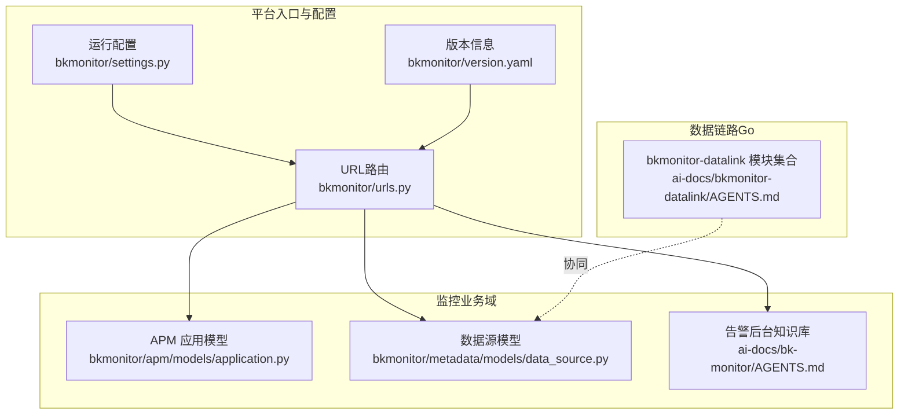
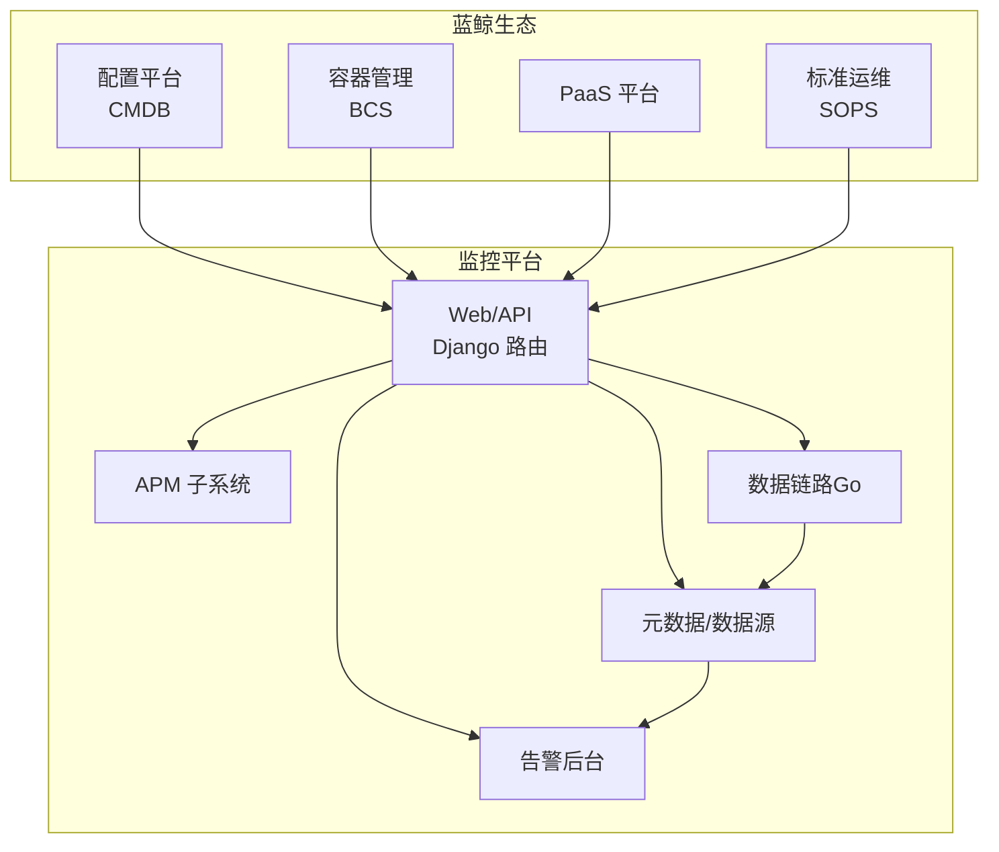
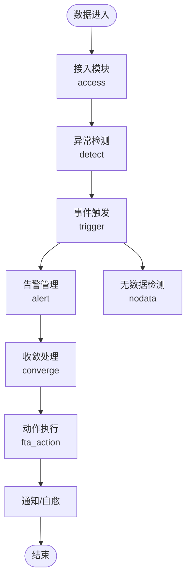
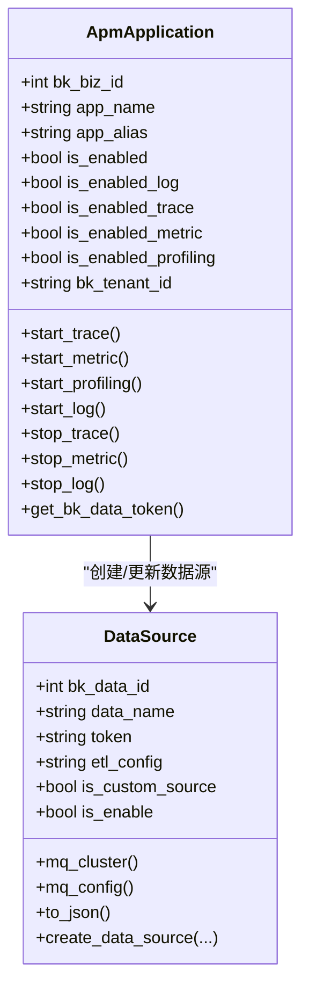
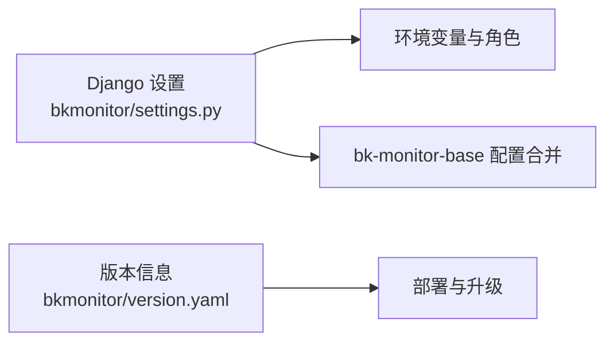

# 项目概述

<cite>
**本文引用的文件**   
- [README.md](file://README.md)
- [LICENSE.txt](file://LICENSE.txt)
- [bkmonitor/version.yaml](file://bkmonitor/version.yaml)
- [bkmonitor/settings.py](file://bkmonitor/settings.py)
- [bkmonitor/urls.py](file://bkmonitor/urls.py)
- [ai-docs/bk-monitor/AGENTS.md](file://ai-docs/bk-monitor/AGENTS.md)
- [ai-docs/bkmonitor-datalink/AGENTS.md](file://ai-docs/bkmonitor-datalink/AGENTS.md)
- [bkmonitor/apm/models/application.py](file://bkmonitor/apm/models/application.py)
- [bkmonitor/metadata/models/data_source.py](file://bkmonitor/metadata/models/data_source.py)
</cite>

## 目录
1. [简介](#简介)
2. [项目结构](#项目结构)
3. [核心组件](#核心组件)
4. [架构总览](#架构总览)
5. [详细组件分析](#详细组件分析)
6. [依赖分析](#依赖分析)
7. [性能考量](#性能考量)
8. [故障排查指南](#故障排查指南)
9. [结论](#结论)
10. [附录](#附录)

## 简介
蓝鲸智云监控平台（bk-monitor）是蓝鲸生态中的核心监控基础设施之一，定位为企业级可观测性平台，覆盖采集、传输、存储、查询、分析与告警的全链路能力。项目强调“高并发、可扩展、智能化”，依托蓝鲸 PaaS 能力，提供统一的多租户、多业务、多场景的监控解决方案。

- 价值主张
  - 采集与传输：对接多种采集器与数据链路，支持 Kafka、InfluxDB、ES 等多存储后端。
  - 数据治理：提供数据源、结果表、字段、ETL 等统一治理能力，支持多链路版本演进。
  - APM/Trace：提供应用性能监控、调用链追踪、剖析与日志联动分析。
  - 告警闭环：基于分布式任务队列的告警后台，实现“接入-检测-收敛-动作”的自动化闭环。
  - 生态协同：与蓝鲸配置平台、容器管理、流程服务等能力深度集成，形成监控闭环。

- 设计理念
  - 分层解耦：前端 Web/API 层、业务域模型层、数据链路层、存储层职责清晰。
  - 多租户与多版本：支持 v3/v4 数据链路并行，平滑演进。
  - 可观测性自举：平台内置指标采集、Prometheus 指标聚合网关、健康检查与版本日志。

- 技术特色
  - Python/Django 主栈，Celery 分布式任务，Redis/Kafka/ES/InfluxDB 等中间件。
  - APM 子系统支持 Trace/Metric/Log/Profiling 多维度数据源管理与启停。
  - 数据源模型抽象完善，支持跨系统（GSE/BKDATA）分配与注册。

- 在蓝鲸生态中的定位
  - 作为监控底座，向上支撑各 SaaS 与业务线的监控诉求；向下连接采集器、传输与存储，形成“采集-传输-存储-查询-分析-告警”的完整闭环。

- 版本与许可
  - 项目采用 MIT 许可证，便于二次开发与生态协作。
  - 平台版本与子模块版本在版本文件中明确标注，便于部署与升级管理。

**章节来源**
- [README.md:1-52](file://README.md#L1-L52)
- [LICENSE.txt:1-13](file://LICENSE.txt#L1-L13)
- [bkmonitor/version.yaml:1-11](file://bkmonitor/version.yaml#L1-L11)

## 项目结构
项目采用“多子系统 + 多文档 + 多语言”组织方式：
- 主应用与配置：Django 主工程、配置与路由入口、版本与发布信息。
- 数据链路与采集：bkmonitor-datalink（Go 实现），包含采集器、传输、统一查询、Operator 等模块。
- 监控业务域：APM、告警后台、元数据、数据源、Web/API 等。
- 文档与知识库：AI 专家系统（AI Docs）与场景化知识库，指导开发、排障与规范。

**图表来源**
- [bkmonitor/urls.py:58-97](file://bkmonitor/urls.py#L58-L97)
- [bkmonitor/settings.py:10-110](file://bkmonitor/settings.py#L10-L110)
- [bkmonitor/version.yaml:1-11](file://bkmonitor/version.yaml#L1-L11)
- [bkmonitor/apm/models/application.py:36-343](file://bkmonitor/apm/models/application.py#L36-L343)
- [bkmonitor/metadata/models/data_source.py:66-800](file://bkmonitor/metadata/models/data_source.py#L66-L800)
- [ai-docs/bk-monitor/AGENTS.md:101-115](file://ai-docs/bk-monitor/AGENTS.md#L101-L115)
- [ai-docs/bkmonitor-datalink/AGENTS.md:108-124](file://ai-docs/bkmonitor-datalink/AGENTS.md#L108-L124)

**章节来源**
- [bkmonitor/urls.py:58-97](file://bkmonitor/urls.py#L58-L97)
- [bkmonitor/settings.py:10-110](file://bkmonitor/settings.py#L10-L110)
- [ai-docs/bk-monitor/AGENTS.md:101-115](file://ai-docs/bk-monitor/AGENTS.md#L101-L115)
- [ai-docs/bkmonitor-datalink/AGENTS.md:108-124](file://ai-docs/bkmonitor-datalink/AGENTS.md#L108-L124)

## 核心组件
- 路由与入口
  - URL 路由集中定义，包含 Web/API、Swagger 文档、静态资源、指标暴露等。
  - 通过环境变量与角色配置动态加载 Django 设置，支持多环境与多角色部署。

- APM 应用与数据源
  - APM 应用模型支持 Trace/Metric/Log/Profiling 数据源的启停与配置。
  - 数据源模型抽象了数据链路、ETL、存储、空间授权等关键能力，支持多链路版本与跨系统分配。

- 告警后台（AI Docs）
  - 基于 Celery 的分布式任务流，覆盖接入、检测、收敛、告警、动作执行等环节。
  - 存储介质包括 Redis/Kafka/ES/MySQL 等，强调高吞吐与可靠性。

- 数据链路（Go）
  - 包含采集器、传输、统一查询、Operator、InfluxDB 代理等模块，支撑大规模数据接入与转发。

**章节来源**
- [bkmonitor/urls.py:58-97](file://bkmonitor/urls.py#L58-L97)
- [bkmonitor/settings.py:41-110](file://bkmonitor/settings.py#L41-L110)
- [bkmonitor/apm/models/application.py:36-210](file://bkmonitor/apm/models/application.py#L36-L210)
- [bkmonitor/metadata/models/data_source.py:66-200](file://bkmonitor/metadata/models/data_source.py#L66-L200)
- [ai-docs/bk-monitor/AGENTS.md:101-115](file://ai-docs/bk-monitor/AGENTS.md#L101-L115)
- [ai-docs/bkmonitor-datalink/AGENTS.md:108-124](file://ai-docs/bkmonitor-datalink/AGENTS.md#L108-L124)

## 架构总览
下图展示平台在蓝鲸生态中的定位与关键交互：

**图表来源**
- [README.md:35-42](file://README.md#L35-L42)
- [bkmonitor/urls.py:58-97](file://bkmonitor/urls.py#L58-L97)
- [ai-docs/bk-monitor/AGENTS.md:101-115](file://ai-docs/bk-monitor/AGENTS.md#L101-L115)
- [ai-docs/bkmonitor-datalink/AGENTS.md:108-124](file://ai-docs/bkmonitor-datalink/AGENTS.md#L108-L124)

## 详细组件分析

### 组件A：告警数据流（基于 Celery 的分布式任务）
- 数据流路径
  - 数据源 → access（接入）→ detect（异常检测）→ trigger（事件触发）→ alert（告警管理）→ converge（收敛）→ fta_action（动作执行）→ 通知/自愈
  - nodata（无数据检测）贯穿其中，保障长时间无数据场景的告警闭环。

- 存储与介质
  - Redis DB9：服务间队列（重要，不可随意清理）
  - Redis DB10：服务自身数据
  - ES：事件/告警/动作持久化
  - MySQL：元数据/策略配置
  - Kafka：事件数据流

**图表来源**
- [ai-docs/bk-monitor/AGENTS.md:101-115](file://ai-docs/bk-monitor/AGENTS.md#L101-L115)

**章节来源**
- [ai-docs/bk-monitor/AGENTS.md:101-115](file://ai-docs/bk-monitor/AGENTS.md#L101-L115)

### 组件B：APM 应用与数据源管理
- 应用启停与数据源
  - 支持按需开启/关闭 Trace/Metric/Log/Profiling 数据源，并自动创建/更新对应存储配置。
  - 提供统一的 Token 生成与兼容逻辑，保障上报校验与历史兼容。

- 数据源模型
  - 抽象数据源、ETL、存储、空间授权、跨系统（GSE/BKDATA）分配与注册。
  - 支持多链路版本（v3/v4）与纳秒级时间戳清洗配置。

**图表来源**
- [bkmonitor/apm/models/application.py:36-210](file://bkmonitor/apm/models/application.py#L36-L210)
- [bkmonitor/metadata/models/data_source.py:66-200](file://bkmonitor/metadata/models/data_source.py#L66-L200)

**章节来源**
- [bkmonitor/apm/models/application.py:36-210](file://bkmonitor/apm/models/application.py#L36-L210)
- [bkmonitor/metadata/models/data_source.py:66-200](file://bkmonitor/metadata/models/data_source.py#L66-L200)

### 组件C：数据链路（Go）模块
- 模块组成
  - 采集器（bkmonitorbeat）、传输（transfer）、统一查询（unify-query）、Operator（operator）、采集器（collector）、摄入（ingester）、InfluxDB 代理（influxdb-proxy）、GSE 通用库（libgse）、日志边车（bk-log-sidecar）、监控 Worker（bk-monitor-worker）、SLI Webhook（sliwebhook）、工具库（utils）等。

- 适用场景
  - 采集器链路侧问题排查与技术方案参考，统一查询与传输路由的实现细节。

**章节来源**
- [ai-docs/bkmonitor-datalink/AGENTS.md:108-124](file://ai-docs/bkmonitor-datalink/AGENTS.md#L108-L124)

## 依赖分析
- 运行时依赖
  - Django 配置通过环境变量与角色动态加载，支持多环境部署。
  - 通过 bk-monitor-base 合并 Django 配置，补充缺失项并初始化数据库连接。

- 版本与子模块
  - 平台版本与子模块版本在版本文件中声明，便于统一管理与升级。

**图表来源**
- [bkmonitor/settings.py:41-110](file://bkmonitor/settings.py#L41-L110)
- [bkmonitor/version.yaml:1-11](file://bkmonitor/version.yaml#L1-L11)

**章节来源**
- [bkmonitor/settings.py:41-110](file://bkmonitor/settings.py#L41-L110)
- [bkmonitor/version.yaml:1-11](file://bkmonitor/version.yaml#L1-L11)

## 性能考量
- 高吞吐与低延迟
  - 告警后台采用 Celery 分布式任务与多介质（Redis/Kafka/ES/MySQL）组合，满足高并发场景。
  - 数据链路模块（Go）通过专用进程与高效序列化，降低采集与传输开销。

- 存储与查询
  - 支持多种存储后端（ES/InfluxDB/Kafka），根据场景选择最优方案。
  - 数据源模型支持字段自发现与 ETL 优化，提升查询效率。

- 可观测性
  - 平台内置指标暴露与 Prometheus 聚合网关，便于外部监控与告警。

[本节为通用指导，无需具体文件分析]

## 故障排查指南
- 告警后台排障
  - 优先查看 AI Docs 中的场景化知识库，按“识别场景→加载规则→执行任务”流程进行。
  - 快速定位：告警数据流、Redis 路由、Kafka 消费、ES 字段与索引、MySQL 元数据。

- 数据链路排障
  - 采集器链路侧问题优先检索历史案例索引，避免重复造轮子。
  - 采集器项目文档与链路修炼指南可作为技术方案参考。

- 通用建议
  - 先复用历史案例，再深入代码分析。
  - 使用知识库中的路径变量与环境配置，避免硬编码。

**章节来源**
- [ai-docs/bk-monitor/AGENTS.md:13-40](file://ai-docs/bk-monitor/AGENTS.md#L13-L40)
- [ai-docs/bk-monitor/AGENTS.md:118-135](file://ai-docs/bk-monitor/AGENTS.md#L118-L135)
- [ai-docs/bkmonitor-datalink/AGENTS.md:32-57](file://ai-docs/bkmonitor-datalink/AGENTS.md#L32-L57)
- [ai-docs/bkmonitor-datalink/AGENTS.md:127-139](file://ai-docs/bkmonitor-datalink/AGENTS.md#L127-L139)

## 结论
蓝鲸智云监控平台以“采集-传输-存储-查询-分析-告警”全链路能力为核心，结合 APM、元数据与告警后台等子系统，构建了企业级可观测性底座。通过多租户、多版本与生态协同，平台既能满足复杂场景的监控需求，又能与蓝鲸生态无缝衔接，形成闭环。借助 AI Docs 与场景化知识库，团队可快速定位问题、规范开发与排障流程，显著提升交付效率与稳定性。

[本节为总结性内容，无需具体文件分析]

## 附录
- 版本与发布
  - 平台版本与子模块版本在版本文件中明确，便于部署与升级管理。
- 许可与贡献
  - 项目采用 MIT 许可证，欢迎社区贡献与反馈。
- 社区与支持
  - 提供产品文档、论坛与生态链接，便于获取帮助与交流。

**章节来源**
- [bkmonitor/version.yaml:1-11](file://bkmonitor/version.yaml#L1-L11)
- [LICENSE.txt:1-13](file://LICENSE.txt#L1-L13)
- [README.md:31-42](file://README.md#L31-L42)