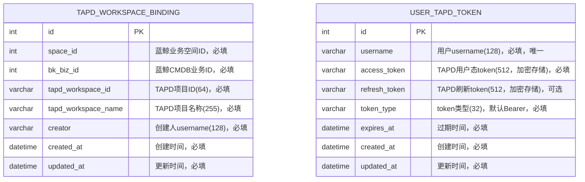
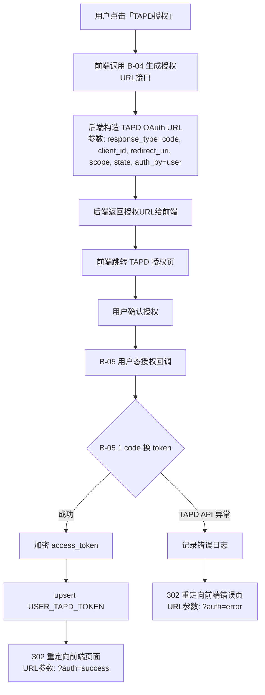
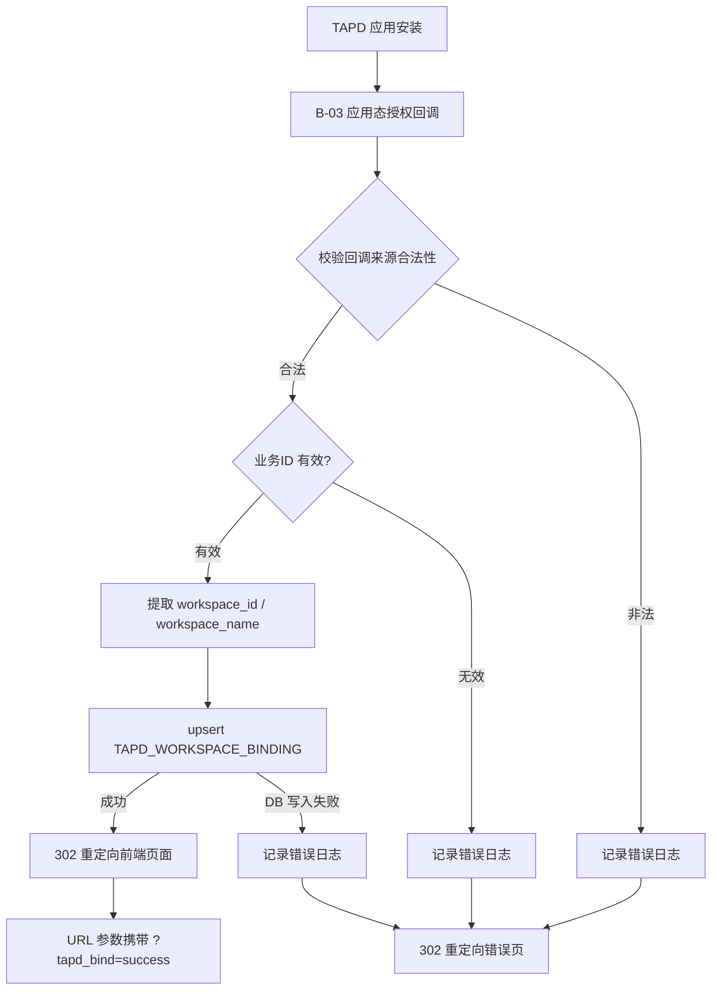
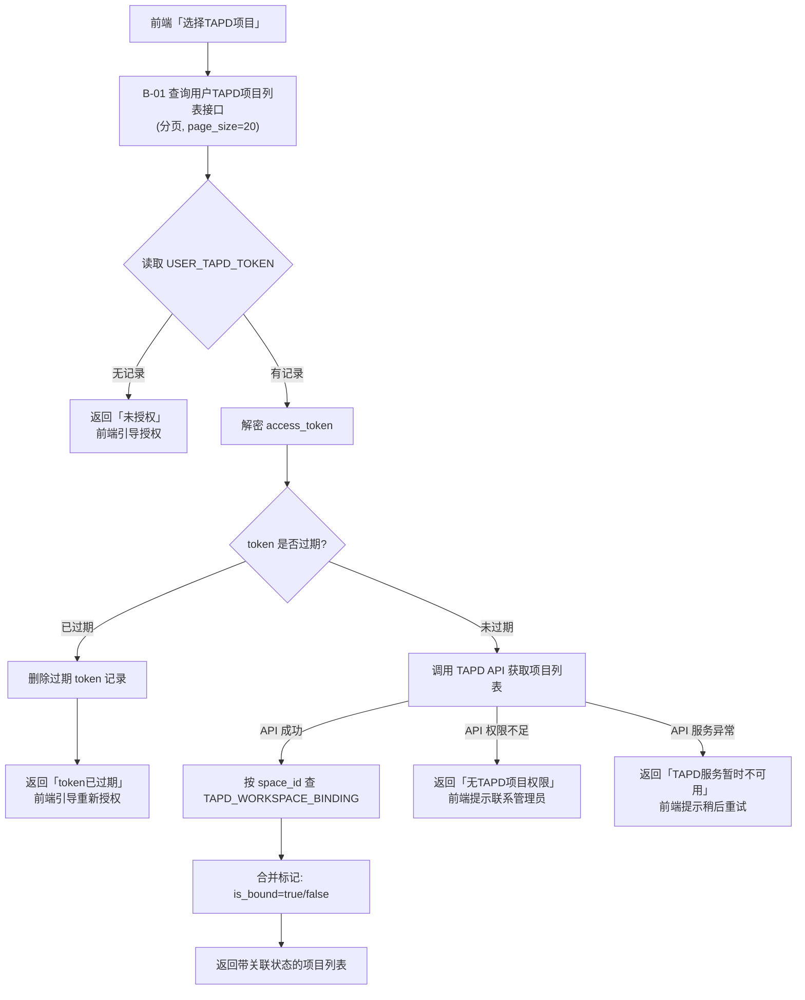
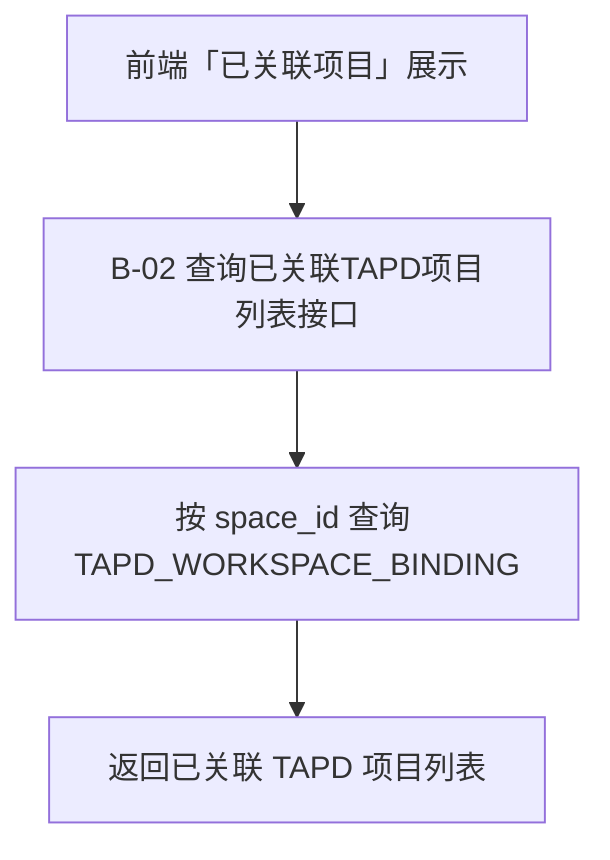
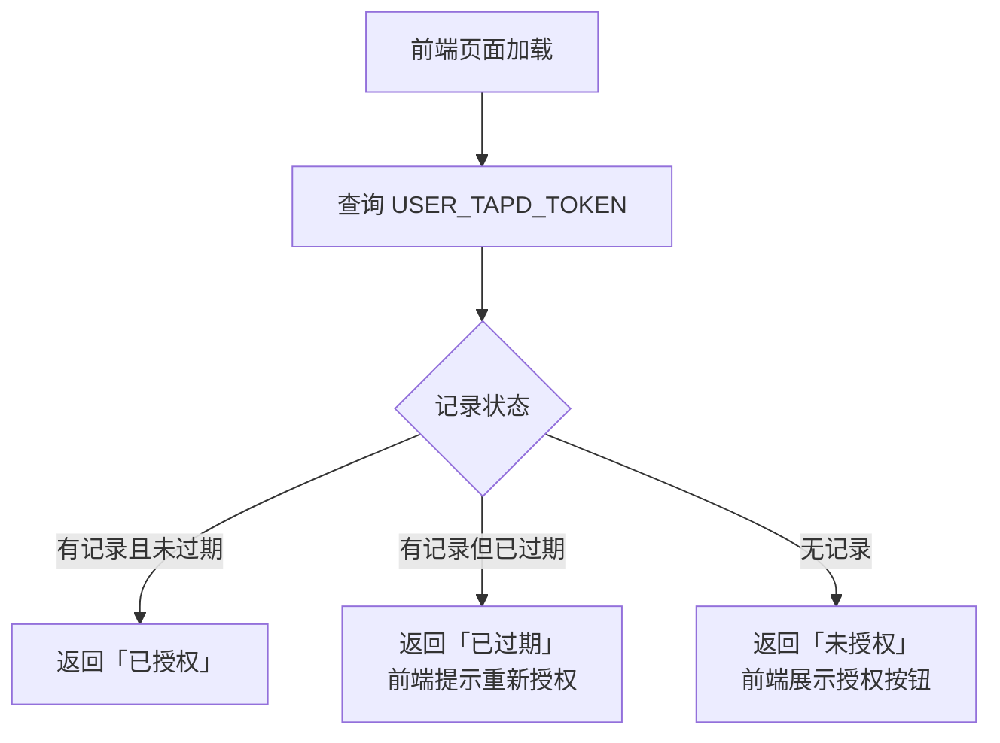
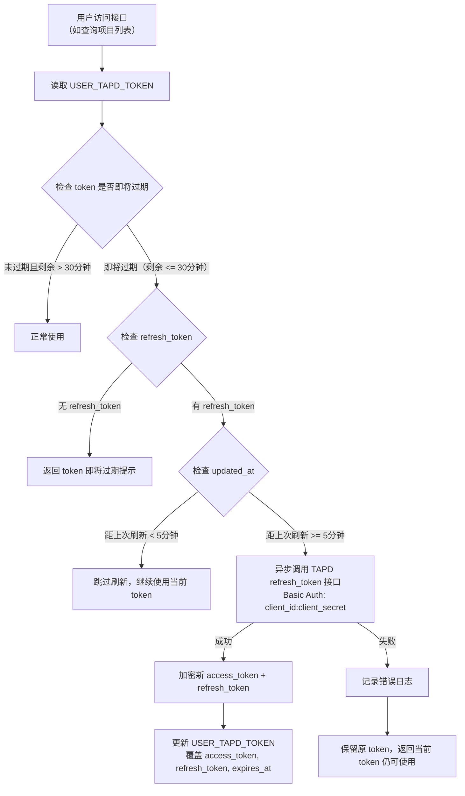
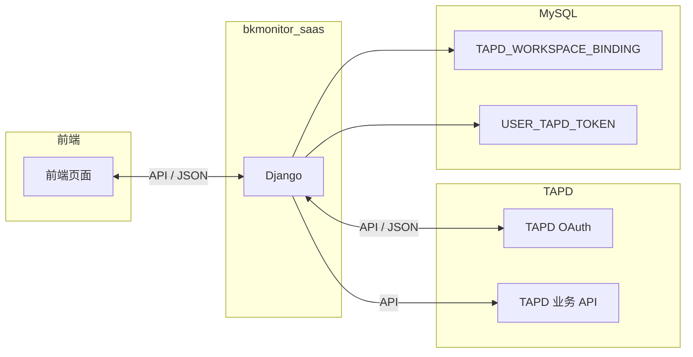

# TAPD 授权与建单 — 数据模型与数据流

> 基于 `requirement.md` 生成，聚焦授权部分的数据建模。

---

## 1. 场景类型

**简单 CRUD** — 单条写入/更新，无并发冲突，单机部署，数据量级低。满足快速通道条件。

---

## 2. 核心实体

| 实体 | 说明 | 来源 | 存储 |
|------|------|------|------|
| **TAPD 项目关联** | space_id 与 tapd_workspace_id 的多对多映射，一次关联全空间共享 | 需求 D-01 | MySQL |
| **用户 TAPD Token** | 用户维度的 TAPD OAuth access_token 存储 | 需求 D-02 | MySQL |

**外部实体（非持久化，参与数据流）**：

| 外部实体 | 说明 |
|----------|------|
| TAPD OAuth 服务 | 用户态/应用态授权、code 换 token |
| TAPD 业务 API | 获取用户项目列表 |
| 前端页面 | 重定向目标 |

---

## 3. ER 图

### 字段清单

| 实体 | 字段 | 类型 | 约束 | 说明 |
|------|------|------|------|------|
| TAPD_WORKSPACE_BINDING | id | int | PK, 自增 | 主键 |
| TAPD_WORKSPACE_BINDING | space_id | int | 必填 | 蓝鲸业务空间 ID |
| TAPD_WORKSPACE_BINDING | bk_biz_id | int | 必填 | 蓝鲸 CMDB 业务 ID |
| TAPD_WORKSPACE_BINDING | tapd_workspace_id | varchar(64) | 必填 | TAPD 项目 ID |
| TAPD_WORKSPACE_BINDING | tapd_workspace_name | varchar(255) | 必填 | TAPD 项目名称 |
| TAPD_WORKSPACE_BINDING | creator | varchar(128) | 必填 | 发起关联的用户 |
| TAPD_WORKSPACE_BINDING | created_at | datetime | 必填 | 创建时间 |
| TAPD_WORKSPACE_BINDING | updated_at | datetime | 必填 | 更新时间 |
| TAPD_WORKSPACE_BINDING | (space_id, tapd_workspace_id) | - | **唯一约束** | 保证关联幂等 |
| USER_TAPD_TOKEN | id | int | PK, 自增 | 主键 |
| USER_TAPD_TOKEN | username | varchar(128) | 必填, **唯一** | 一个用户一条 token 记录 |
| USER_TAPD_TOKEN | access_token | varchar(512) | 必填 | TAPD 用户态 access_token，**加密存储** |
| USER_TAPD_TOKEN | refresh_token | varchar(512) | 可选 | TAPD 刷新 token，**加密存储**，TAPD 可能不返回 |
| USER_TAPD_TOKEN | token_type | varchar(32) | 必填 | 默认 `Bearer` |
| USER_TAPD_TOKEN | expires_at | datetime | 必填 | access_token 过期时间 |
| USER_TAPD_TOKEN | created_at | datetime | 必填 | 创建时间 |
| USER_TAPD_TOKEN | updated_at | datetime | 必填 | 更新时间，**同时用于防重复刷新判断** |

### 设计说明

- **TAPD_WORKSPACE_BINDING**：唯一约束 `(space_id, tapd_workspace_id)` 实现关联幂等，重复授权无副作用
- **USER_TAPD_TOKEN**：`username` 唯一，同一用户重复授权时更新 token（upsert），不新增记录
- **refresh_token**：TAPD 可能不返回 refresh_token（取决于应用配置），字段可选
- **异步刷新策略**：用户访问时触发检查，token 即将过期（剩余 <= 30 分钟）且距上次刷新 >= 5 分钟时，后台异步刷新
- **防重复刷新**：通过 `updated_at` 字段判断，刷新间隔不低于 5 分钟（`now() - updated_at >= 5min`）
- **刷新失败处理**：保留原 token 不清除，返回当前 token 仍可使用

### 安全策略

| 项目 | 策略 | 说明 |
|------|------|------|
| `access_token` 存储 | **加密存储** | 使用 Django `cryptography` 库（Fernet 对称加密）或 bkmonitor 现有加密工具，写入时加密、读取时解密 |
| 数据库访问控制 | 最小权限原则 | 仅 bkmonitor_saas 应用账号可访问 `USER_TAPD_TOKEN` 表 |
| 日志脱敏 | `access_token` 禁止明文落日志 | 日志中仅记录 token 前 8 位 + `***` |

### Token 存储方案评估：MySQL + Redis 双层策略

| 方案 | 优势 | 劣势 | 适用场景 |
|------|------|------|----------|
| **仅 MySQL** | 持久化可靠、事务保证、已有基础设施 | 每次读取需解密、高并发时 DB 压力 | 一期（数据量低、并发低） |
| **仅 Redis** | 读写快、天然支持 TTL 过期 | 重启丢失、需额外持久化方案 | 不推荐（token 需持久化） |
| **MySQL + Redis** | 兼顾持久化与性能、Redis TTL 自动过期 | 架构复杂度增加、需维护一致性 | 二期（高并发时） |

**推荐方案**：一期仅用 MySQL，二期按需引入 Redis 缓存层。

**二期 Redis 缓存策略**：
- **写入**：授权成功后，同时写 MySQL（加密）+ Redis（明文，TTL = token 剩余有效期）
- **读取**：优先读 Redis，未命中则读 MySQL 解密后回填 Redis
- **过期**：Redis TTL 自动淘汰，MySQL 定期清理过期记录
- **一致性**：用户重新授权时，同时更新 MySQL + Redis

### 接口鉴权方案

| 接口 | 鉴权方式 | 说明 |
|------|----------|------|
| B-01 查询用户 TAPD 项目列表 | **登录态 + IAM 权限** | 需用户已登录蓝鲸，且拥有当前 space_id 的操作权限 |
| B-02 查询已关联 TAPD 项目列表 | **登录态 + IAM 权限** | 同上 |
| B-03 应用态授权回调 | **TAPD 回调签名校验** | 由 TAPD 侧回调，校验请求来源合法性（签名/白名单 IP） |
| B-04 生成授权 URL | **登录态** | 需用户已登录 |
| B-05 用户态授权回调 | **TAPD 回调** | 由 TAPD 302 重定向回来，携带 code |
| B-06 解除关联 | **登录态 + IAM 权限** | 需用户已登录，且拥有当前 space_id 的管理权限 |

---

## 4. 数据流图

### 4.1 用户态授权流程（Token 获取）

**涉及实体**：`USER_TAPD_TOKEN`（写入）

**异常处理**：
- code 无效/过期：返回前端提示「授权失败，请重试」
- TAPD API 不可用：记录错误日志，返回前端提示「服务暂时不可用，请稍后重试」
- 数据库写入失败：事务回滚，返回前端错误提示

### 4.2 应用态授权流程（项目关联）

**涉及实体**：`TAPD_WORKSPACE_BINDING`（写入）

**异常处理**：
- 业务 ID 无效：302 重定向到前端，URL 带 `?tapd_bind=error&reason=invalid_biz_id`
- 重复回调（幂等）：唯一约束保证 upsert 无副作用，正常返回成功
- 前端状态感知：重定向 URL 携带 `?tapd_bind=success`，前端检测该参数后刷新关联列表

### 4.3 查询用户 TAPD 项目列表

**涉及实体**：`USER_TAPD_TOKEN`（读取）、`TAPD_WORKSPACE_BINDING`（读取，比对标记已关联状态）

**异常处理**：
- Token 不存在/过期：前端引导重新授权
- TAPD API 超时/异常：返回友好错误码，不影响已关联项目展示
- 用户无 TAPD 项目：返回空列表，前端展示「暂无项目」

### 4.4 查询已关联 TAPD 项目列表

**涉及实体**：`TAPD_WORKSPACE_BINDING`（读取）

### 4.5 查询用户授权状态

**涉及实体**：`USER_TAPD_TOKEN`（读取）

### 4.6 异步刷新 Token

**涉及实体**：`USER_TAPD_TOKEN`（读取 + 更新）

**触发条件**：
- **用户访问时触发**：用户调用需要 TAPD 权限的接口时（如查询项目列表）
- **Token 即将过期**：`expires_at - now() < 30 分钟`（提前刷新，避免用户感知中断）
- **异步执行**：刷新操作在后台异步执行，不阻塞用户请求

**防重复刷新策略**：
- 检查 `updated_at` 字段（刷新会更新此字段）
- 刷新间隔不低于 5 分钟（`now() - updated_at >= 5min`）
- 使用数据库行锁（`SELECT ... FOR UPDATE`）防止并发刷新

**异常处理**：
- TAPD API 失败：记录错误日志，**保留原 token**，返回当前 token 仍可使用
- refresh_token 无效：记录错误日志，保留原 token（可能是临时问题）
- 数据库更新失败：事务回滚，不影响用户当前请求
- 多次重试失败：token 最终过期后，用户需重新授权

### 数据流总览

---

## 5. 数据流汇总

| 流程 | 触发 | 读 | 写 | 外部依赖 | 异常处理 |
|------|------|----|----|----------|----------|
| 用户态授权 | 用户点击授权按钮 | - | `USER_TAPD_TOKEN` | TAPD OAuth | code 无效/token 换失败/DB 写入失败 |
| 应用态授权 | TAPD 回调 | - | `TAPD_WORKSPACE_BINDING` | TAPD 回调 | 业务 ID 无效/重复回调/DB 写入失败 |
| 查询用户 TAPD 项目 | 前端选择项目 | `USER_TAPD_TOKEN` + `TAPD_WORKSPACE_BINDING` | - | TAPD 业务 API | token 过期/TAPD API 不可用/空列表 |
| 查询已关联项目 | 前端展示 | `TAPD_WORKSPACE_BINDING` | - | - | - |
| 查询授权状态 | 前端页面加载 | `USER_TAPD_TOKEN` | - | - | 无记录/已过期 |
| 异步刷新 Token | 用户访问时触发 | `USER_TAPD_TOKEN` | `USER_TAPD_TOKEN` | TAPD refresh_token 接口 | 无 refresh_token/刷新失败/重复刷新 |

---

## 6. 关键设计决策

1. **存储选型**：MySQL（关系简单、数据量低、需事务保证）
2. **幂等策略**：唯一约束 + upsert（MySQL `INSERT ... ON DUPLICATE KEY UPDATE`）
3. **Token 管理**：存储 `refresh_token`（TAPD 可能不返回，字段可选），支持异步刷新
4. **异步刷新策略**：用户访问时触发检查，token 即将过期（`expires_at - now() < 30min`）且距上次刷新 >= 5 分钟时，后台异步刷新，刷新失败保留原 token
5. **Token 安全**：`access_token` 和 `refresh_token` 均加密存储（Fernet 对称加密），日志脱敏
6. **接口鉴权**：用户态接口走登录态 + IAM 权限，回调接口走来源校验
7. **分页策略**：B-01 项目列表接口支持分页（默认 page_size=20），其余列表接口数据量低无需分页
8. **前端状态感知**：B-03 回调成功后通过 302 重定向 URL 参数通知前端（`?tapd_bind=success`）
9. **Issue 系统**：本期不涉及，后续建单阶段再评估是否扩展 `IssueDocument`

---

## 7. 待确认项

| # | 内容 | 阶段 | 来源 |
|---|------|------|------|
| 1 | B-03 回调中业务 ID 如何映射到 `space_id` + `bk_biz_id`（查 CMDB？查业务接口？） | 设计 | 初始 |
| 2 | 建单阶段是否需要在 `IssueDocument` 扩展 TAPD 单据关联字段 | 建单需求 | 初始 |
| 3 | `access_token` 加密方案选型：Fernet vs bkmonitor 现有加密工具 | 设计 | 质疑审查 |
| 4 | B-03 回调校验方案：签名校验 vs 白名单 IP | 设计 | 质疑审查 |
| 5 | TAPD 应用是否配置了 refresh_token 权限（决定是否返回 refresh_token） | 设计 | demo 参考 |
| 6 | 异步刷新任务的执行频率和提前量（当前：5分钟检查，提前30分钟刷新） | 设计 | demo 参考 |
