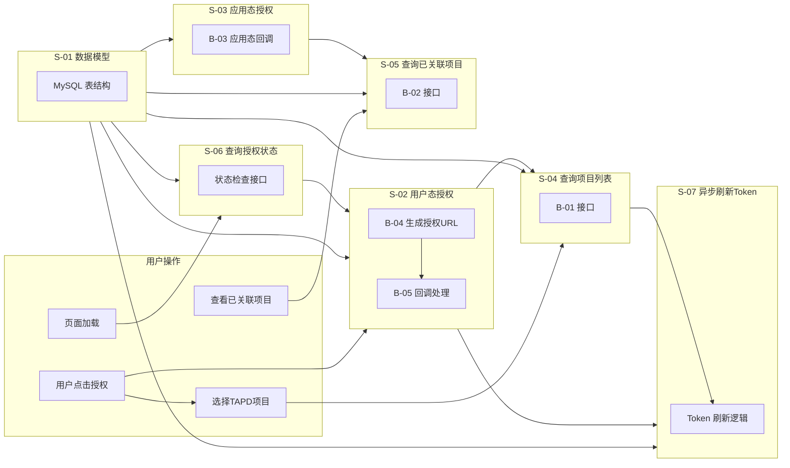
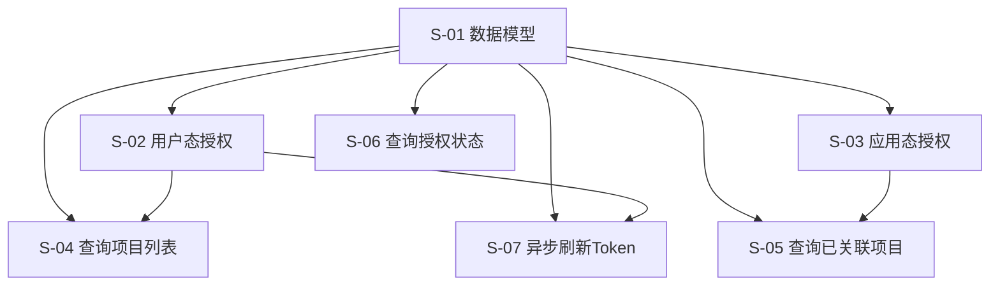

# TAPD 授权与建单 — 技术设计文档

> 状态：设计中

---

## 1. 需求背景 & 目标

### 背景

TAPD 存在两套独立的 OAuth 授权流程：用户态授权（获取用户 access_token）和应用态授权（关联 TAPD 项目）。监控平台需要整合这两套流程，让用户感知为线性操作。

### 目标

1. 实现用户态 OAuth 授权，获取用户 TAPD access_token
2. 实现应用态 OAuth 授权，关联 TAPD 项目到蓝鲸业务空间
3. 提供项目查询、关联查询、授权状态查询等接口
4. 支持异步刷新 Token，提升用户体验

### 不在范围内

- Issue 单据创建功能（本期不涉及）
- TAPD 项目详情查询（仅需项目列表）
- 用户权限管理（使用现有 IAM）

---

## 2. 关键环节一览图

---

## 3. 总体方案设计

### 子需求节点图

### 共享术语速查

| 术语 | 定义 | 所属子需求 |
|------|------|-----------|
| `space_id` | 蓝鲸业务空间 ID | S-01 |
| `bk_biz_id` | 蓝鲸 CMDB 业务 ID | S-01 |
| `tapd_workspace_id` | TAPD 项目 ID | S-01 |
| `access_token` | TAPD 用户态访问令牌 | S-01, S-02 |
| `refresh_token` | TAPD 刷新令牌 | S-01, S-07 |
| `expires_at` | Token 过期时间 | S-01, S-07 |

---

## 4. 全局风险 & 跨子需求依赖

### 跨子需求风险

| 风险 | 影响子需求 | 缓解措施 |
|------|-----------|----------|
| TAPD OAuth 服务不可用 | S-02, S-03, S-07 | 错误重试 + 降级提示 |
| Token 加密方案不一致 | S-01, S-02, S-07 | 统一使用 Fernet 加密 |
| 数据库表结构变更 | 所有子需求 | Migration 版本控制 |

### 接口契约变化风险

| 接口 | 变更类型 | 影响范围 |
|------|----------|----------|
| B-01 查询项目列表 | 新增 | S-04 |
| B-02 查询已关联项目 | 新增 | S-05 |
| B-03 应用态授权回调 | 新增 | S-03 |
| B-04 生成授权URL | 新增 | S-02 |
| B-05 用户态授权回调 | 新增 | S-02 |

### 共享术语变更风险

| 术语 | 变更风险 | 影响子需求 |
|------|----------|-----------|
| `access_token` | 加密算法变更 | S-01, S-02, S-07 |
| `refresh_token` | 存储方式变更 | S-01, S-07 |
| `expires_at` | 时区处理变更 | S-01, S-07 |
