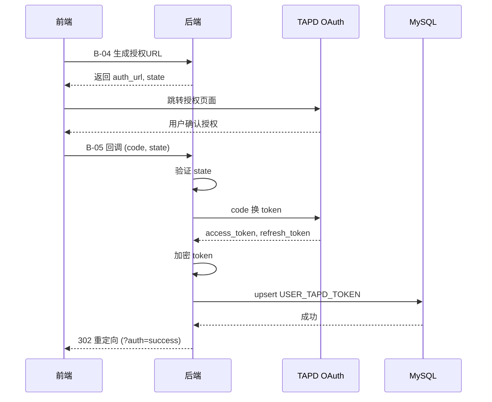

# S-02 用户态授权

> 状态：设计中

---

## ★ 1. 术语

| 术语 | 含义 | 引用 |
|------|------|------|
| `code` | TAPD OAuth 授权码，有效期 10 分钟 | — |
| `access_token` | TAPD 用户态访问令牌，有效期 2 小时 | 见父文档 §4.3 |
| `refresh_token` | TAPD 刷新令牌，用于异步刷新 access_token | 见父文档 §4.3 |
| `state` | OAuth 防 CSRF 参数，随机字符串 | — |

---

## ★ 2. 现状（AS-IS）

### 2.1 现状描述

当前蓝鲸监控平台无 TAPD 用户态授权功能。用户需要在 TAPD 系统中手动操作，无法在监控平台中获取 TAPD access_token。

### 2.2 痛点

- 痛点 1：用户无法在监控平台中直接访问 TAPD 项目数据
- 痛点 2：无 Token 存储机制，每次访问都需要重新授权
- 痛点 3：Token 过期后用户无感知，导致功能不可用

---

## ★ 3. 方案（TO-BE）

### 3.1 方案概述

实现完整的 OAuth 2.0 用户态授权流程：前端调用 B-04 获取授权 URL，用户在 TAPD 授权后，TAPD 回调 B-05 接口，后端用 code 换取 access_token 并加密存储到 `USER_TAPD_TOKEN` 表。

### 3.2 关键决策点

| 决策 | 选择 | 理由 | 备选方案 | 否决原因 |
|------|------|------|----------|----------|
| 授权流程 | 后端返回 URL，前端跳转 | 符合 SPA 架构，前端控制跳转 | 后端 302 跳转 | 前端无法控制跳转时机 |
| Token 存储 | 加密存储到 MySQL | 持久化可靠，安全 | 明文存储 | 安全风险高 |
| 授权结果通知 | URL 参数传递状态 | 简单直接，无需额外接口 | WebSocket 通知 | 实现复杂，一期无必要 |

### 3.3 行为差异对照表

| 场景 | AS-IS | TO-BE | 影响 |
|------|-------|-------|------|
| 用户授权 | 无授权流程 | 完整 OAuth 流程 | 新增功能 |
| Token 存储 | 无存储 | 加密存储到 MySQL | 新增功能 |
| 授权状态 | 无状态检查 | 可查询授权状态 | 新增功能 |

---

## ★ 4a. 接口设计

### 4a.1 对外接口

#### B-04 生成授权 URL

```python
class GenerateAuthUrlResource(Resource):
    """生成 TAPD 用户态授权 URL"""
    
    class RequestSerializer(serializers.Serializer):
        space_id = serializers.IntegerField(label="业务空间ID")
    
    class ResponseSerializer(serializers.Serializer):
        auth_url = serializers.URLField(label="TAPD 授权 URL")
        state = serializers.CharField(label="防 CSRF 状态码")
    
    def perform_request(self, validated_request_data):
        # 构造 OAuth URL
        # 参数: response_type=code, client_id, redirect_uri, scope, state, auth_by=user
        pass
```

| 接口 | 输入 | 输出 | 异常 |
|------|------|------|------|
| B-04 生成授权 URL | `space_id` | `auth_url, state` | `空间不存在` |

#### B-05 用户态授权回调

```python
class UserAuthCallbackResource(Resource):
    """TAPD 用户态授权回调"""
    
    class RequestSerializer(serializers.Serializer):
        code = serializers.CharField(label="授权码")
        state = serializers.CharField(label="防 CSRF 状态码")
    
    class ResponseSerializer(serializers.Serializer):
        status = serializers.CharField(label="授权状态")
        message = serializers.CharField(label="提示信息")
    
    def perform_request(self, validated_request_data):
        # 1. 验证 state 参数
        # 2. 用 code 换取 access_token
        # 3. 加密存储到 USER_TAPD_TOKEN
        # 4. 302 重定向到前端
        pass
```

| 接口 | 输入 | 输出 | 异常 |
|------|------|------|------|
| B-05 用户态授权回调 | `code, state` | `302 重定向` | `code 无效, state 不匹配, TAPD API 异常` |

### 4a.2 内部协作接口

| 接口 | 调用方 | 被调用方 | 说明 |
|------|--------|----------|------|
| `encrypt_token()` | B-05 | 加密模块 | 加密 access_token |
| `decrypt_token()` | 其他子需求 | 加密模块 | 解密 access_token |
| `upsert_token()` | B-05 | 数据库操作 | 插入或更新 Token 记录 |

### 4a.3 契约变更声明

| 变更类型 | 接口 | 变更内容 | 影响的子需求 |
|---------|------|---------|------------|
| 新增 | B-04 生成授权 URL | 全新接口 | S-04, S-06 |
| 新增 | B-05 用户态授权回调 | 全新接口 | S-04, S-07 |

---

## +5. 时序图



---

## +6. 异常处理

| 场景 | 行为 | 是否对外暴露 |
|------|------|:----------:|
| code 无效/过期 | 返回前端错误提示「授权失败，请重试」 | 是 |
| state 不匹配 | 返回前端错误提示「授权失败，请重试」 | 是 |
| TAPD API 不可用 | 记录错误日志，返回前端「服务暂时不可用」 | 是 |
| Token 加密失败 | 记录错误日志，返回前端「授权失败」 | 是 |
| 数据库写入失败 | 记录错误日志，返回前端「授权失败」 | 是 |

---

## +10. 影响范围

| 影响对象 | 影响类型 | 影响描述 | 是否破坏性变更 |
|---------|---------|---------|:----------:|
| `fta_web/issue/` | 接口变更 | 新增 2 个 Resource | 否 |
| `urls.py` | 接口变更 | 新增 2 个 URL 路由 | 否 |
| 前端页面 | 行为变更 | 新增授权按钮和回调处理 | 否 |

---

## +11. 待定问题

| 编号 | 问题 | 影响范围 | 建议决策时间 | 负责人 |
|------|------|---------|------------|--------|
| T-01 | TAPD OAuth 配置参数（client_id, client_secret, redirect_uri） | S-02 | 实施前 | 运维 |
| T-02 | 前端授权页面 URL 格式和参数 | S-02 | 实施前 | 前端开发 |
