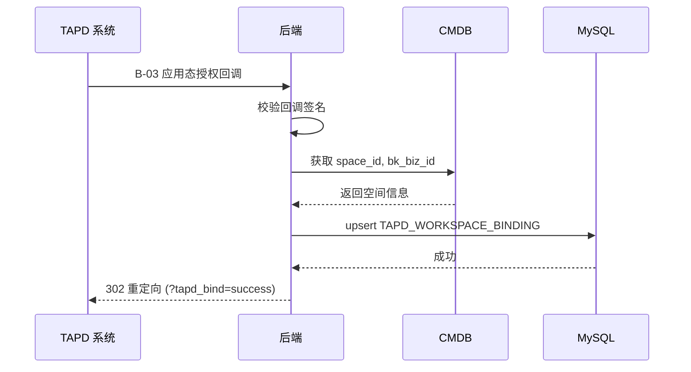

# S-03 应用态授权

> 状态：设计中

---

## ★ 1. 术语

| 术语 | 含义 | 引用 |
|------|------|------|
| `workspace_id` | TAPD 项目 ID | 见父文档 §4.3 |
| `workspace_name` | TAPD 项目名称 | 见父文档 §4.3 |
| `upsert` | MySQL 的 INSERT ... ON DUPLICATE KEY UPDATE 语法 | 见 S-01 §1 |

---

## ★ 2. 现状（AS-IS）

### 2.1 现状描述

当前蓝鲸监控平台无法与 TAPD 项目关联。用户需要在 TAPD 系统中手动配置应用授权，无法在监控平台中自动关联项目。

### 2.2 痛点

- 痛点 1：用户需要在 TAPD 系统中手动配置应用授权，操作复杂
- 痛点 2：无法在监控平台中查看已关联的 TAPD 项目
- 痛点 3：关联关系需要手动维护，容易出现数据不一致

---

## ★ 3. 方案（TO-BE）

### 3.1 方案概述

实现 TAPD 应用态授权回调接口（B-03），当用户在 TAPD 中安装蓝鲸监控应用时，TAPD 会回调该接口，后端校验回调合法性后，将 `workspace_id` 和 `workspace_name` 存储到 `TAPD_WORKSPACE_BINDING` 表，实现项目关联。

### 3.2 关键决策点

| 决策 | 选择 | 理由 | 备选方案 | 否决原因 |
|------|------|------|----------|----------|
| 回调校验方式 | 签名校验 | 安全性高，TAPD 标准做法 | 白名单 IP | IP 可能变化，维护成本高 |
| 关联幂等策略 | 唯一约束 + upsert | 数据库层面保证，简单可靠 | 应用层去重 | 并发时可能重复插入 |
| 业务 ID 映射 | 查 CMDB 获取 space_id | 复用现有数据 | 手动映射 | 维护成本高 |

### 3.3 行为差异对照表

| 场景 | AS-IS | TO-BE | 影响 |
|------|-------|-------|------|
| 项目关联 | 无关联关系 | 自动关联 TAPD 项目 | 新增功能 |
| 关联查询 | 无查询接口 | 可查询已关联项目 | 新增功能 |
| 重复关联 | 无处理 | 幂等处理，无副作用 | 新增功能 |

---

## ★ 4a. 接口设计

### 4a.1 对外接口

#### B-03 应用态授权回调

```python
class AppInstallCallbackResource(Resource):
    """TAPD 应用态授权回调"""
    
    class RequestSerializer(serializers.Serializer):
        biz_id = serializers.IntegerField(label="业务ID")
        workspace_id = serializers.CharField(label="TAPD项目ID")
        workspace_name = serializers.CharField(label="TAPD项目名称")
    
    class ResponseSerializer(serializers.Serializer):
        status = serializers.CharField(label="关联状态")
        message = serializers.CharField(label="提示信息")
    
    def perform_request(self, validated_request_data):
        # 1. 校验回调来源合法性（签名校验）
        # 2. 从业务ID获取 space_id + bk_biz_id
        # 3. upsert TAPD_WORKSPACE_BINDING
        # 4. 302 重定向到前端
        pass
```

| 接口 | 输入 | 输出 | 异常 |
|------|------|------|------|
| B-03 应用态授权回调 | `biz_id, workspace_id, workspace_name` | `302 重定向` | `签名无效, 业务ID无效, DB写入失败` |

### 4a.2 内部协作接口

| 接口 | 调用方 | 被调用方 | 说明 |
|------|--------|----------|------|
| `validate_signature()` | B-03 | 签名校验模块 | 校验 TAPD 回调签名 |
| `get_space_info()` | B-03 | CMDB 接口 | 获取 space_id 和 bk_biz_id |
| `upsert_binding()` | B-03 | 数据库操作 | 插入或更新关联记录 |

### 4a.3 契约变更声明

| 变更类型 | 接口 | 变更内容 | 影响的子需求 |
|---------|------|---------|------------|
| 新增 | B-03 应用态授权回调 | 全新接口 | S-05 |

---

## +5. 时序图



---

## +6. 异常处理

| 场景 | 行为 | 是否对外暴露 |
|------|------|:----------:|
| 签名校验失败 | 记录错误日志，返回 403 | 是 |
| 业务 ID 无效 | 记录错误日志，302 重定向错误页 | 是 |
| CMDB 接口异常 | 记录错误日志，302 重定向错误页 | 是 |
| 数据库写入失败 | 记录错误日志，302 重定向错误页 | 是 |
| 重复回调（幂等） | 正常返回成功，无副作用 | 否 |

---

## +10. 影响范围

| 影响对象 | 影响类型 | 影响描述 | 是否破坏性变更 |
|---------|---------|---------|:----------:|
| `fta_web/issue/` | 接口变更 | 新增 1 个 Resource | 否 |
| `urls.py` | 接口变更 | 新增 1 个 URL 路由 | 否 |
| TAPD 系统 | 行为变更 | 需要配置回调 URL | 否 |

---

## +11. 待定问题

| 编号 | 问题 | 影响范围 | 建议决策时间 | 负责人 |
|------|------|---------|------------|--------|
| T-01 | TAPD 回调签名校验方案（签名算法、密钥） | S-03 | 实施前 | 后端开发 |
| T-02 | CMDB 接口调用方式和权限 | S-03 | 实施前 | 后端开发 |
| T-03 | TAPD 应用安装配置（回调 URL 格式） | S-03 | 实施前 | 运维 |
