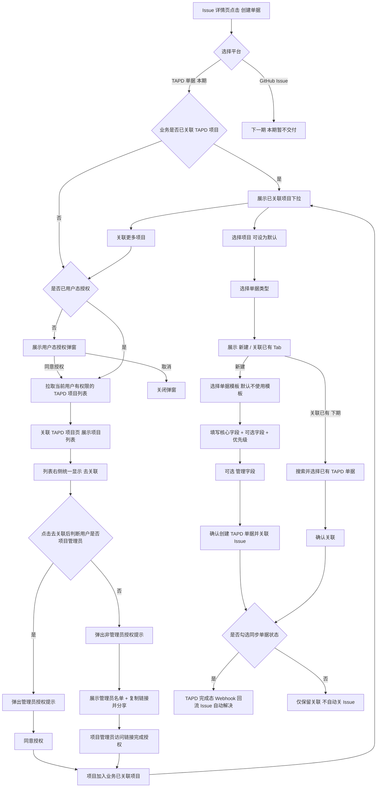

# Issue 创建 TAPD 单据

> **原型链接**：[http://43.160.245.57:8000/demo1-issue-detail.html](http://43.160.245.57:8000/demo1-issue-detail.html)
> （右下角「显示设计标注」可查看交互说明 #19 - #29）
>
> **设计稿**：[https://codesign.woa.com/app/design/659236590537053/689185142120406/inspect](https://codesign.woa.com/app/design/659236590537053/689185142120406/inspect)

> ⚠️ **本期范围**：仅交付「创建单据 → TAPD 单据」。GitHub Issue 建单放到下一期，本期原型中的 GitHub 入口仅作占位示意，不在本期需求与验收范围内。

---

## 1. 背景与目标

在可观测平台中，Issue 是对运行期问题（告警 / 故障）的聚合载体。研发处理一个 Issue 时，往往需要在研发协作平台（TAPD）登记一张可跟踪的单据（Bug / 任务 / 需求），并将单据与 Issue 双向关联。

### 现状痛点

- **跨系统跳转、重复录入**：用户需离开监控平台到 TAPD 手动建单，标题 / 描述 / 处理人等信息重复填写。
- **项目授权链路不清晰**：创建单据前既需要用户态授权拉取项目列表，也需要项目级应用态授权，二者权限主体不同，需在产品上明确分层。
- **字段差异大**：不同业务、不同单据模板要求的必填 / 默认字段不一致，统一表单无法满足。
- **缺少上下文回填**：建单时无法自动带出 Issue 的根因、修复建议、Suspect Commit、影响范围等信息。
- **状态割裂**：单据在 TAPD 关闭后，Issue 仍需人工同步状态。

### 目标

在 Issue 详情页内一站式创建 / 关联 TAPD 单据，做到「先完成项目授权、再选择项目建单、AI 预填、模板驱动字段、可记忆默认、状态自动回流」。

---

## 2. 名词解释

（待补充）

---

## 3. 用户与典型场景

| 用户角色 | 描述 |
|----------|------|
| **值班 / 处理人** | 收到告警生成的 Issue，需快速建单并指派给责任人跟踪修复。 |
| **SRE / 业务管理员** | 首次使用 TAPD 建单能力时，需要完成当前业务可用 TAPD 项目的授权关联。 |
| **TAPD 项目管理员** | 负责审批蓝鲸监控对 TAPD 项目的应用态授权。 |
| **研发负责人** | 希望团队建单字段规范统一，并固定常用项目 / 模板，减少重复操作。 |

### 场景示例

登录服务 NPE 告警 → 生成 Issue → 首次使用时关联「IEG-登录服务」TAPD 项目 → 一键创建 Bug 单 → 指派给提交者 → 单据关闭后 Issue 自动解决。

---

## 4. 功能范围

本期 TAPD 单据能力包含：

- **TAPD 用户态授权**：拉取当前用户有权限的 TAPD 项目列表。
- **TAPD 项目应用态授权**：项目管理员授权蓝鲸监控关联当前 TAPD 项目。
- **业务已关联项目选择**：仅展示已完成应用态授权的项目，可设置默认项目。
- **关联更多项目**：业务已有项目后，仍可继续从用户有权限项目中追加关联。
- **前置选择**：项目 + 单据类型。
- **两种模式**：
  - 新建。
  - 关联已有（下期处理）。
- **单据模板与字段映射**（下期处理）。
- **字段体系**：核心字段 + 可选字段库 + 管理字段。
- **默认选项记忆**（设为默认 / 记住最近选择）。
- **AI 预填与推荐**（下期处理）。
- **单据状态同步**。

---

## 5. 产品逻辑图

---

## 6. 详细功能需求

### 6.1 入口与平台切换

- Issue 详情页提供「创建单据」下拉。本期仅交付 TAPD 单据；GitHub Issue 为下一期能力，下拉中暂作占位，不在本期范围。
- 弹窗标题随平台切换（本期为「TAPD 单据」）。
- （下一期）GitHub 分支不涉及授权 / 项目 / 模板：隐藏项目、模板栏与「设为默认」，仅保留单据类型 + 核心字段，直接进入表单。

### 6.2 TAPD 用户态授权前置

- 点击「TAPD 单据」打开弹窗时，系统先判断当前业务是否已有已关联 TAPD 项目。
- **若业务已有已关联项目**：直接展示已关联项目下拉，无需先展示用户态授权页。
- **若业务没有已关联项目**：
  - 若用户未完成用户态授权，弹窗只展示用户态授权页。
  - 用户态授权只用于读取「当前用户在 TAPD 有权限的项目列表」和角色信息，不直接创建或修改单据。
  - 点击「同意授权并拉取项目」后，进入「关联 TAPD 项目」页面。
  - 点击「取消授权」关闭弹窗。
- 未完成用户态授权和项目应用态授权前，不展示建单表单、底部「确认创建」按钮，也不展示「新建 / 关联已有」Tab。

### 6.3 关联 TAPD 项目

- 用户态授权完成后，展示「关联 TAPD 项目」页面。
- 页面列出当前用户有权限的 TAPD 项目列表。
- 列表右侧统一展示「去关联」按钮。
- 点击「去关联」后，再根据当前用户是否为该项目管理员弹出不同授权提示（这里直接渲染后台返回的链接就行）：
  - **项目管理员**：弹出管理员授权提示页，展示授权权限清单和「同意授权」按钮。
  - **非项目管理员**：弹出非管理员授权提示页，展示红色提示、项目管理员名单和「复制链接并分享」按钮。

### 6.4 已关联项目选择与关联更多项目

- 当业务已有已关联 TAPD 项目时，打开 TAPD 单据弹窗直接展示项目下拉。
- 项目下拉仅展示已完成应用态授权的项目，不展示仅用户有权限但未完成应用态授权的项目。
- 项目可设为默认；下次打开弹窗优先选中默认项目。
- 项目选择区提供「关联更多项目」入口：
  - 若用户已完成用户态授权，直接进入项目列表。
  - 若用户未完成用户态授权，先展示用户态授权页。
- 追加项目时仍复用「去关联 → 管理员 / 非管理员授权提示」流程。

### 6.7 前置选择：项目 + 单据类型

- 已完成项目关联后展示前置选择条：项目（必填）、单据类型（必填，Bug / 任务 / 需求）。
- 两者用于筛选下方可用的单据模板（单据类型为模板的前置条件）。
- 项目 / 单据类型确定后，下方才出现「新建 / 关联已有」Tab，用户据此选择新建还是关联。
- 切换项目 / 类型会即时重新筛选可用模板。

### 6.8 模式：新建 / 关联已有

- **新建**：选择单据模板 → 填写表单 → 确认创建，生成新单据并与 Issue 关联。
- **关联已有**（下期处理）：搜索框按单据 ID / 标题检索已有 TAPD 单据，选中后「确认关联」，不新建单据。
- 两种模式共用底部「同步单据状态」开关（见 6.13）。

### 6.9 单据模板与字段映射（下期处理）

- 模板下拉首项为「不使用模板（直接创建）」（默认值），只填核心字段即可快速建单。
- 选择模板后自动带出该模板预置的字段集合，并通过字段映射从 Issue 上下文回填默认值。
- 模板按「项目 + 单据类型」过滤，只展示匹配的模板。

### 6.10 字段体系

- **核心字段**（固定必填、锁定不可移除）：单据类型、标题、描述、处理人。
- **可选字段库**：取决于 TAPD 不同单据类型的可选字段。
- **管理字段**：点击「管理字段」打开配置面板，可从可选字段库中勾选加入单据、并设置是否必填；只能选已有字段，不能新增字段；核心字段锁定展示、不可取消；保存后即时生效。
- 核心字段与可选字段在表单中统一排版、不分区；优先级字段固定置于表单末尾。

### 6.11 默认选项记忆（设为默认 / 记住最近选择）

- 「项目 / 单据类型 / 单据模板」三个下拉旁均提供「设为默认」按钮。
- 点击后将当前选项记为个人默认值并本地持久化，下次打开弹窗自动选中，无需重复选择；按钮高亮为「当前为默认」。
- 再次点击可取消默认。
- 默认项目只能在业务已关联项目中生效；如果默认项目不再可用，则回退到已关联项目列表首项。
- 默认模板兜底：默认模板仅在「该项目 + 该单据类型」筛选出的可用模板中生效，否则回退「不使用模板（直接创建）」。
- 未设置默认时的系统默认：项目 = 已关联项目首项、单据类型 = Bug、模板 = 不使用模板。

### 6.12 AI 预填与推荐（下期处理）

- **标题**：AI 自动生成（含 Issue 摘要）。
- **描述**：AI 自动填充，含【问题描述】【根因分析】【修复建议】【关联信息（Issue ID / Suspect Commit / 监控策略）】。
- **处理人**：AI 基于 Suspect Commit 提交者推荐。
- **优先级**：AI 基于影响范围建议（如自动设为 P0）。
- **可选字段默认值**：按字段映射来源自动回填（如测试人员 ← Suspect Commit 提交者、模块 ← 监控策略、需求来源 ← Issue 来源、验收标准 ← 修复建议）。

### 6.13 单据状态同步

- 弹窗底部提供「同步单据状态」勾选项。
- **勾选后**：当该单据在外部平台进入已完成类状态（TAPD「已关闭 / 已解决」）时，本 Issue 自动流转为「已解决」。
- **不勾选**：则仅保留关联，不因单据关闭而自动关 Issue。
- 生产环境由 TAPD Webhook 推送单据状态变更后触发 Issue 流转。

---

## 7. 状态与规则

### 7.1 TAPD 授权状态

| 状态 | 含义 | 页面表现 |
|------|------|----------|
| **未用户态授权** | 用户尚未授权蓝鲸监控读取自己的 TAPD 项目列表 | 展示用户态授权页 |
| **已用户态授权 + 无已关联项目** | 已能拉取用户有权限项目，但业务尚未完成项目应用态授权 | 展示「关联 TAPD 项目」列表 |
| **已用户态授权 + 已关联项目** | 业务已有可用于建单的 TAPD 项目 | 直接展示项目下拉和建单表单 |
| **追加关联项目** | 用户从已关联项目表单点击「关联更多项目」 | 进入项目列表，复用「去关联」授权流程 |

### 7.2 项目关联规则

- 用户有权限项目列表来自用户态授权结果。
- 业务可建单项目来自应用态授权结果。
- 项目列表右侧统一显示「去关联」，不直接暴露当前用户角色。
- 授权说明不常驻在项目列表下方，仅在点击「去关联」后弹窗展示。
- 项目管理员可直接授权关联项目。
- 非项目管理员只能复制授权链接给项目管理员，由项目管理员完成授权。
- 项目完成应用态授权后，才进入项目下拉并参与默认项目记忆。

---

## 8. 字段清单

### 8.1 核心字段（固定必填）

| 字段 | 类型 | 默认 / 来源 |
|------|------|-------------|
| 项目 | 下拉 | 仅展示业务已关联项目，可设为个人默认 |
| 单据类型 | 下拉（Bug/任务/需求） | 默认 Bug，可设为个人默认 |
| 标题 | 文本 | AI 自动生成（下期） |
| 描述 | 多行文本 | AI 自动填充（根因 + 修复建议 + 关联信息，下期） |
| 处理人 | 下拉 | AI 推荐（Suspect Commit 提交者 / 值班人 / Issue 负责人，下期） |
| 优先级 | 下拉（P0~P3） | AI 建议，置于表单末尾 |

### 8.2 可选字段库（管理字段中勾选）

取决于 TAPD 不同项目、不同单据类型下的字段配置。

---

## 9. 交互规则与边界

- **项目授权是硬门禁**：未完成业务项目应用态授权时，不允许进入建单表单。
- **用户态授权不等于可建单**：用户态授权只表示可拉取项目列表，只有项目完成应用态授权后才可用于建单。
- **顺序约束**：
  - 业务已关联项目 → 项目 + 类型 → 新建 / 关联已有
  - 业务未关联项目 → 用户态授权 → 项目列表 → 应用态授权 → 项目 + 类型
- **创建前校验**：核心字段及被设为必填的可选字段需校验非空；未完成项目关联时拦截创建并提示。
- **管理字段范围**：仅能从可选字段库勾选，不支持自定义新增字段；取消勾选的字段不进入单据。
- **默认值与记忆**：个人默认本地持久化（演示用 localStorage），按用户维度生效；默认项目必须属于业务已关联项目。
- **关联模式**（下期处理）：不创建新单据，仅建立 Issue ↔ 单据关联关系。
- **范围边界**：GitHub Issue 建单不在本期交付范围，顺延至下一期。

---

## 10. 待确认问题

本文档依据交互原型 `demo1-issue-detail.html` 整理，最终以评审结论为准。

---

> **关联文件**：
> - `tapd_oauth_demo_bak.py`：TAPD 用户态 OAuth 2.0 测试 Demo
> - 原型页面：`http://43.160.245.57:8000/demo1-issue-detail.html`
> - 设计稿：`https://codesign.woa.com/app/design/659236590537053/689185142120406/inspect`
