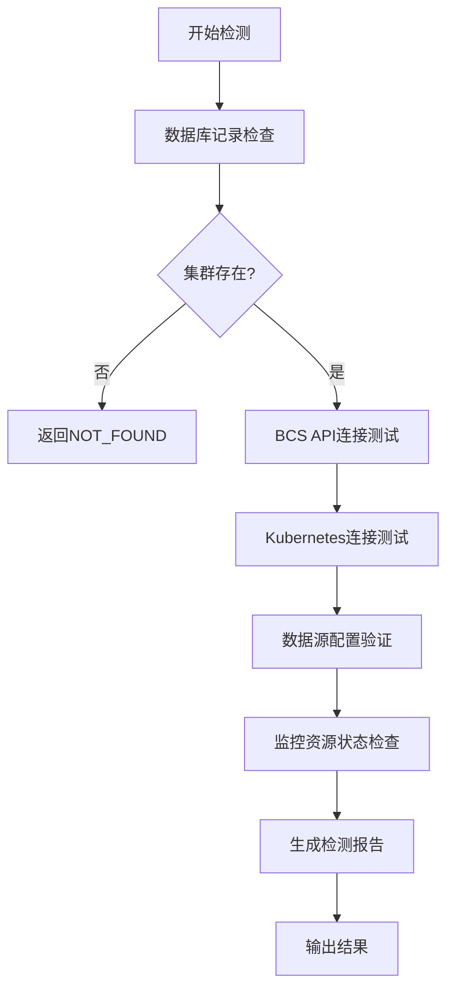

# BCS集群关联状态检测功能实现

## 功能概述

基于用户需求，我为bk-monitor项目新增了一个Django管理命令 `check_bcs_cluster_status`，用于检测指定BCS集群在整个监控关联链路中的运行状态。该命令可以全面诊断集群从注册到数据采集的各个环节是否正常。

## 实现背景

在bk-monitor项目中，BCS集群的关联涉及复杂的链路：

1. **集群注册阶段**：通过 [`discover_bcs_clusters()`](d:\projects\bk-monitor\bkmonitor\metadata\task\bcs.py#L179-L381) 函数自动发现和注册BCS集群
2. **数据源创建**：为每个集群创建6种类型的数据源（K8S指标、自定义指标、K8S事件等）
3. **监控资源初始化**：在集群中部署DataID配置、ServiceMonitor、PodMonitor等资源
4. **数据采集链路**：通过bk-collector采集器收集监控数据
5. **数据传输存储**：数据经过ETL处理后存储到时序数据库

当集群关联出现问题时，需要能够快速定位是哪个环节出现了异常。

## 核心文件

### 1. 主命令文件
**文件路径**: `bkmonitor/metadata/management/commands/check_bcs_cluster_status.py`

**主要功能**:
- 检测集群数据库记录状态
- 测试BCS API连接性
- 验证Kubernetes集群连接
- 检查数据源配置完整性
- 检查监控资源状态
- 支持文本和JSON两种输出格式

**核心检测方法**:
```python
def check_cluster_status(self, cluster_id: str, timeout: int = 30) -> Dict:
    """执行完整的集群状态检测"""
    # 1. 数据库记录检查
    db_check = self.check_database_record(cluster_id)
    
    # 2. BCS API连接测试  
    bcs_api_check = self.check_bcs_api_connection(cluster_info, timeout)
    
    # 3. Kubernetes集群连接测试
    k8s_check = self.check_kubernetes_connection(cluster_info, timeout)
    
    # 4. 数据源配置验证
    datasource_check = self.check_datasource_configuration(cluster_info)
    
    # 5. 监控资源状态检查
    monitor_check = self.check_monitor_resources(cluster_info)
```

### 2. 使用文档
**文件路径**: `docs/bcs_cluster_status_check_guide.md`

**内容包括**:
- 详细的命令参数说明
- 各种使用场景示例
- 常见问题诊断方法
- 故障排除流程
- 最佳实践建议

### 3. 测试脚本
**文件路径**: `test_bcs_cluster_check.py`

**测试覆盖**:
- 命令帮助信息
- 参数验证
- 不存在集群处理
- 存在集群检测
- 输出格式验证
- 超时参数测试

## 技术实现要点

### 1. 遵循项目规范

参考了项目中现有的管理命令结构，如：
- [`update_bcs_cluster_cloud_id_config.py`](d:\projects\bk-monitor\bkmonitor\metadata\management\commands\update_bcs_cluster_cloud_id_config.py)
- [`query_storage_cluster.py`](d:\projects\bk-monitor\bkmonitor\metadata\management\commands\query_storage_cluster.py)

确保代码风格和错误处理方式与项目保持一致。

### 2. 充分利用现有API

命令充分利用了项目中已有的API和工具函数：
- `api.kubernetes.fetch_k8s_cluster_list()` - 获取BCS集群列表
- `BCSClusterInfo.objects` - 数据库操作
- `cluster_info.api_client` - Kubernetes客户端
- `ServiceMonitorInfo/PodMonitorInfo` - 监控资源模型

### 3. 全面的错误处理

```python
try:
    # 各种检测操作
    result = self.check_specific_component()
except SpecificException as e:
    # 特定异常处理
    result["issues"].append(f"特定错误: {str(e)}")
except Exception as e:
    # 通用异常处理
    result["status"] = "ERROR"
    result["issues"].append(f"检测异常: {str(e)}")
```

### 4. 灵活的输出格式

支持两种输出格式：
- **文本格式**: 适合人工查看，有颜色标识和格式化输出
- **JSON格式**: 适合脚本解析和自动化集成

### 5. 详细的中文注释

根据项目中的代码注释规范，为所有函数和关键逻辑添加了详细的中文注释，包括：
- 函数整体流程说明
- 参数和返回值描述
- 业务逻辑解释
- 异常处理说明
- 注意事项和限制

## 检测链路设计

命令设计了完整的检测链路，覆盖BCS集群关联的各个关键环节：



每个检测环节都会：
1. 记录检测状态（SUCCESS/WARNING/ERROR/NOT_FOUND）
2. 收集详细信息
3. 记录发现的问题
4. 提供诊断建议

## 使用示例

### 基本检测
```bash
python manage.py check_bcs_cluster_status --cluster-id BCS-K8S-00001
```

### JSON格式输出（适合脚本解析）
```bash
python manage.py check_bcs_cluster_status --cluster-id BCS-K8S-00001 --format json
```

### 自定义超时时间
```bash
python manage.py check_bcs_cluster_status --cluster-id BCS-K8S-00001 --timeout 60
```

## 输出示例

### 成功案例（文本格式）
```
============================================================
BCS集群关联状态检测报告
============================================================
集群ID: BCS-K8S-00001
检测时间: 2024-01-01T12:00:00+08:00
执行时间: 5.23秒
整体状态: SUCCESS

详细检测结果:

  DATABASE: SUCCESS
    业务ID: 1001
    集群状态: running

  BCS_API: SUCCESS

  KUBERNETES: SUCCESS
    节点统计: 3/3 就绪

  DATASOURCES: SUCCESS

  MONITOR_RESOURCES: SUCCESS
    ServiceMonitor: 5个
    PodMonitor: 3个
```

### 异常案例（JSON格式）
```json
{
  "cluster_id": "BCS-K8S-00001",
  "status": "ERROR",
  "details": {
    "database": {
      "status": "SUCCESS"
    },
    "bcs_api": {
      "status": "ERROR",
      "issues": ["BCS API连接失败: Connection timeout"]
    },
    "kubernetes": {
      "status": "ERROR", 
      "issues": ["Kubernetes API调用失败: 403 Forbidden"]
    }
  },
  "errors": ["检测发现多个错误"],
  "execution_time": 10.5
}
```

## 扩展性设计

命令设计考虑了良好的扩展性：

1. **检测项目可扩展**: 可以轻松添加新的检测方法
2. **输出格式可扩展**: 可以添加XML、YAML等新格式
3. **集成友好**: JSON输出便于与监控系统集成
4. **配置灵活**: 超时时间等参数可配置

## 测试验证

提供了完整的测试脚本 `test_bcs_cluster_check.py`，包括：

- 功能测试：验证命令各项功能正常
- 异常测试：验证错误处理机制
- 格式测试：验证输出格式正确性
- 参数测试：验证参数处理逻辑

## 部署和使用

### 1. 将命令文件放置到正确位置
```
bkmonitor/metadata/management/commands/check_bcs_cluster_status.py
```

### 2. 确保Django环境正确
```bash
export DJANGO_SETTINGS_MODULE=settings
```

### 3. 运行测试验证
```bash
python test_bcs_cluster_check.py
```

### 4. 开始使用
```bash
python manage.py check_bcs_cluster_status --cluster-id YOUR_CLUSTER_ID
```

## 与现有功能的关系

该命令与项目中现有的BCS相关功能形成互补：

- **[`discover_bcs_clusters()`](d:\projects\bk-monitor\bkmonitor\metadata\task\bcs.py#L179-L381)**: 负责集群发现和注册
- **`refresh_bcs_monitor_info()`**: 负责刷新监控信息
- **`check_bcs_cluster_status`**: 负责状态检测和问题诊断

这样形成了完整的BCS集群生命周期管理链路。

## 总结

该功能的实现充分考虑了bk-monitor项目的架构特点和使用场景，提供了：

1. **全面的检测覆盖**: 从数据库到Kubernetes集群的完整链路检测
2. **友好的用户体验**: 清晰的输出格式和详细的问题描述
3. **良好的可维护性**: 清晰的代码结构和详细的注释
4. **强大的扩展性**: 便于后续功能扩展和集成
5. **完整的文档**: 详细的使用指南和故障排除方法

通过该命令，运维人员可以快速定位BCS集群关联问题，大大提高了问题排查效率。