# BCS集群状态检查增强功能说明

## 概述

本次增强大幅扩展了 `check_bcs_cluster_status.py` 命令的检查能力，从原有的5项基础检查扩展到11项全面的集群状态检查，覆盖了BCS集群监控链路的各个关键环节。

## 新增检查项详解

### 6. 数据存储链路检查 (check_storage_clusters)
**功能**: 验证监控数据的存储配置和集群健康状态
- **InfluxDB存储检查**: 验证时序数据存储集群状态
- **Elasticsearch存储检查**: 验证事件和日志数据存储集群状态
- **存储关联关系验证**: 检查数据源与结果表的存储映射关系
- **集群健康状态**: 验证存储集群的可用性和配置正确性

### 7. Consul配置检查 (check_consul_configuration) 
**功能**: 验证监控配置中心的数据同步状态
- **数据源配置验证**: 检查各数据源在Consul中的配置完整性
- **结果表配置检查**: 验证结果表配置是否正确同步到Consul
- **配置版本检查**: 检查配置的最后修改时间和版本信息
- **路径有效性验证**: 确认Consul配置路径的可访问性

### 8. 数据采集配置检查 (check_data_collection_config)
**功能**: 验证监控数据采集的配置完整性
- **替换配置检查**: 验证BCS集群的指标和维度替换规则配置
- **时序数据组验证**: 检查K8s指标和自定义指标的数据组配置
- **指标数量统计**: 统计各数据组下的具体指标数量
- **单指标单表特性**: 验证是否启用单指标单表存储优化
- **字段黑名单**: 检查是否启用字段黑名单功能

### 9. 联邦集群关系检查 (check_federation_cluster)
**功能**: 验证联邦集群的拓扑关系和配置
- **联邦关系验证**: 检查主集群与子集群的关联关系
- **命名空间映射**: 验证联邦集群的命名空间分配配置
- **内置表配置**: 检查联邦集群的内置指标表和事件表配置
- **拓扑完整性**: 验证联邦集群拓扑结构的完整性

### 10. 数据路由配置检查 (check_data_routing)
**功能**: 验证监控数据的路由和传输配置
- **Transfer集群配置**: 检查数据转移集群的配置
- **MQ集群配置**: 验证消息队列集群的关联配置
- **数据源启用状态**: 检查数据源是否正确启用
- **路由规则验证**: 确认数据路由规则的完整性

### 11. 集群资源使用情况检查 (check_cluster_resource_usage)
**功能**: 监控Kubernetes集群的资源使用状态
- **节点状态检查**: 检查集群节点的健康状态和资源容量
- **Pod状态统计**: 统计各命名空间下Pod的运行状态
- **监控组件状态**: 专门检查监控相关Pod的运行情况
- **资源容量信息**: 收集CPU、内存、Pod数量等资源信息
- **异常状态告警**: 识别并报告节点或Pod的异常状态

## 增强后的整体架构

```mermaid
graph TD
    A[check_bcs_cluster_status] --> B[数据库记录检查]
    A --> C[BCS API连接测试]
    A --> D[Kubernetes集群连接]
    A --> E[数据源配置验证]
    A --> F[监控资源状态检查]
    A --> G[数据存储链路检查]
    A --> H[Consul配置检查]
    A --> I[数据采集配置检查]
    A --> J[联邦集群关系检查]
    A --> K[数据路由配置检查]
    A --> L[集群资源使用情况检查]
    
    G --> G1[InfluxDB存储]
    G --> G2[Elasticsearch存储]
    G --> G3[存储关联关系]
    
    H --> H1[数据源配置]
    H --> H2[结果表配置]
    H --> H3[配置版本检查]
    
    I --> I1[替换配置]
    I --> I2[时序数据组]
    I --> I3[单指标单表]
    
    J --> J1[联邦拓扑]
    J --> J2[命名空间映射]
    J --> J3[内置表配置]
    
    K --> K1[Transfer集群]
    K --> K2[MQ集群]
    K --> K3[路由规则]
    
    L --> L1[节点状态]
    L --> L2[Pod状态]
    L --> L3[资源容量]
```



## 使用方式

### 基本用法
```bash
# 检查指定集群的完整状态
python manage.py check_bcs_cluster_status --cluster-id BCS-K8S-00001

# 使用JSON格式输出，便于程序化处理
python manage.py check_bcs_cluster_status --cluster-id BCS-K8S-00001 --format json

# 设置较长的超时时间，适用于大规模集群
python manage.py check_bcs_cluster_status --cluster-id BCS-K8S-00001 --timeout 60
```

### 测试脚本
```bash
# 使用提供的测试脚本
python test_enhanced_bcs_cluster_check.py BCS-K8S-00001

# 启用调试模式查看详细输出
python test_enhanced_bcs_cluster_check.py BCS-K8S-00001 --debug
```

## 状态判定逻辑

### 整体状态优先级
1. **ERROR**: 任何检查项出现错误状态
2. **WARNING**: 存在警告但无错误
3. **NOT_FOUND**: 集群或关键资源不存在
4. **SUCCESS**: 所有检查项都通过
5. **UNKNOWN**: 其他未明确分类的状态

### 各检查项的状态分类
- **SUCCESS**: 检查通过，配置正常
- **WARNING**: 存在潜在问题，但不影响基本功能
- **ERROR**: 存在严重问题，可能影响监控功能
- **NOT_FOUND**: 相关资源或配置不存在

## 输出格式说明

### JSON格式输出结构
```json
{
  "cluster_id": "BCS-K8S-00001",
  "check_time": "2025-01-01T12:00:00+08:00",
  "status": "SUCCESS|WARNING|ERROR|NOT_FOUND|UNKNOWN",
  "execution_time": 15.32,
  "details": {
    "database": {...},
    "bcs_api": {...},
    "kubernetes": {...},
    "datasources": {...},
    "monitor_resources": {...},
    "storage": {...},
    "consul": {...},
    "data_collection": {...},
    "federation": {...},      // 仅联邦集群
    "routing": {...},
    "resource_usage": {...}
  },
  "errors": [],
  "warnings": []
}
```

### 文本格式输出示例
```
============================================================
BCS集群关联状态检测报告
============================================================
集群ID: BCS-K8S-00001
检测时间: 2025-01-01T12:00:00+08:00
执行时间: 15.32秒
整体状态: SUCCESS

详细检测结果:

  DATABASE: SUCCESS
    业务ID: 2
    集群状态: RUNNING

  BCS_API: SUCCESS

  KUBERNETES: SUCCESS
    节点统计: 3/3 就绪

  DATASOURCES: SUCCESS

  MONITOR_RESOURCES: SUCCESS
    ServiceMonitor: 5个
    PodMonitor: 3个

  STORAGE: SUCCESS
    存储配置: 3个数据源

  CONSUL: SUCCESS
    Consul配置: 3个数据源

  DATA_COLLECTION: SUCCESS
    替换配置: 12个
    指标组: 2个

  ROUTING: SUCCESS
    路由配置: 3个数据源

  RESOURCE_USAGE: SUCCESS
    节点统计: 3/3 就绪
    Pod统计: 45个
```

## 故障排查指南

### 常见问题及解决方案

1. **数据库连接问题**
   - 检查数据库配置和网络连通性
   - 验证集群ID是否正确

2. **BCS API连接失败**
   - 检查BCS服务状态
   - 验证API Token配置

3. **Kubernetes连接超时**
   - 检查集群网络连通性
   - 验证kubeconfig配置

4. **存储集群异常**
   - 检查InfluxDB/ES集群状态
   - 验证存储配置正确性

5. **Consul配置缺失**
   - 检查配置同步任务
   - 手动刷新Consul配置

## 最佳实践建议

1. **定期检查**: 建议每日执行完整检查，及时发现问题
2. **监控告警**: 将检查结果集成到监控告警系统
3. **问题追踪**: 建立问题跟踪机制，记录和解决历史问题
4. **文档维护**: 保持集群配置文档的实时更新
5. **权限管理**: 确保执行检查的账号具有足够权限

## 扩展开发

如需添加新的检查项，可参考现有检查方法的实现模式：

1. 在`Command`类中添加新的检查方法
2. 在`check_cluster_status`方法中调用新检查
3. 在`determine_overall_status`方法中添加状态判断
4. 在`output_detailed_results`方法中添加结果显示
5. 更新帮助文档和测试用例

## 版本历史

- **v1.0**: 基础版本，包含5项基本检查
- **v2.0**: 增强版本，扩展至11项全面检查，新增存储、Consul、采集配置、联邦集群、路由和资源使用检查

---

*该增强功能基于bkmonitor项目的容器监控数据采集与处理规范实现，确保检查内容符合项目架构要求。*