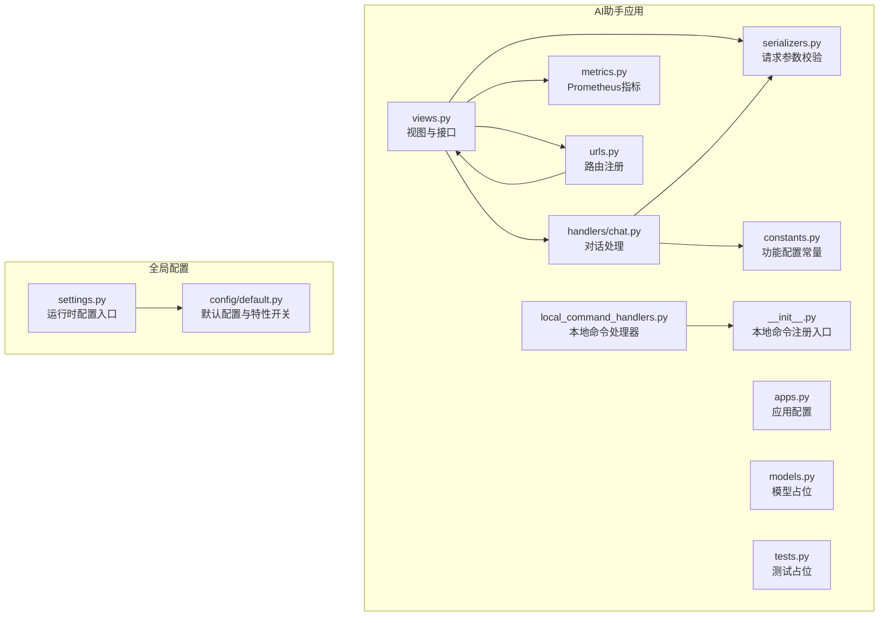
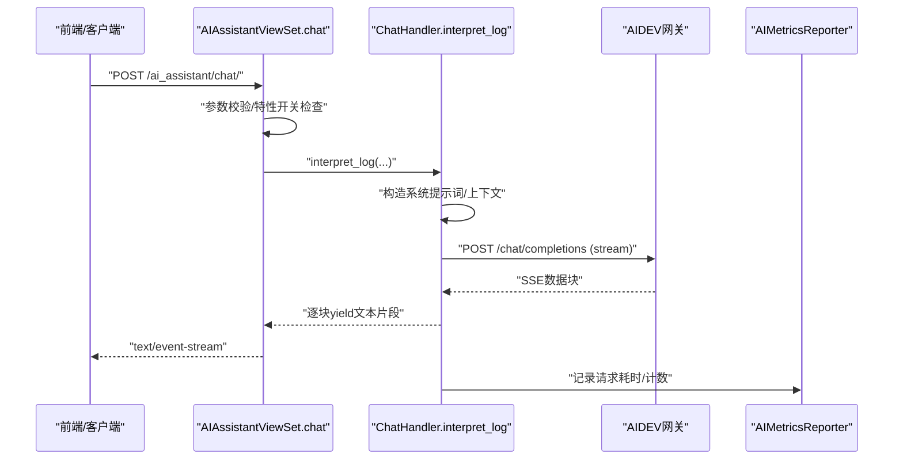
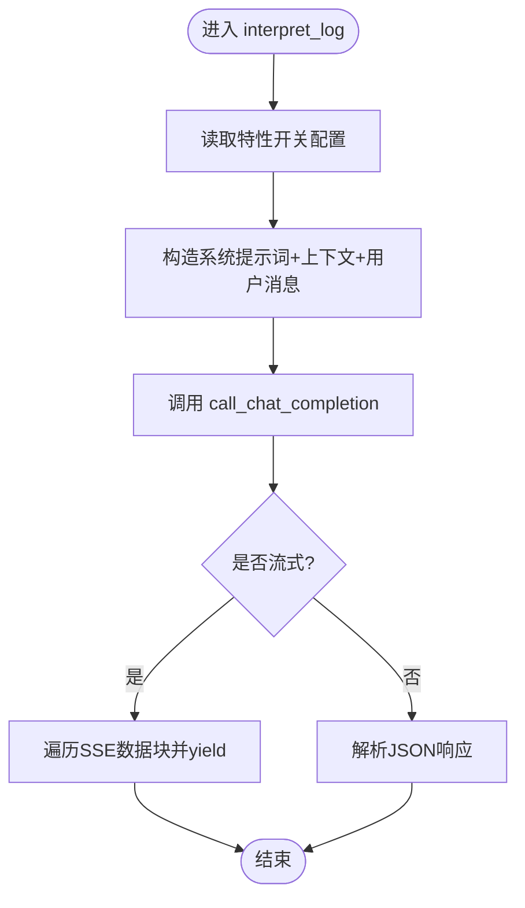
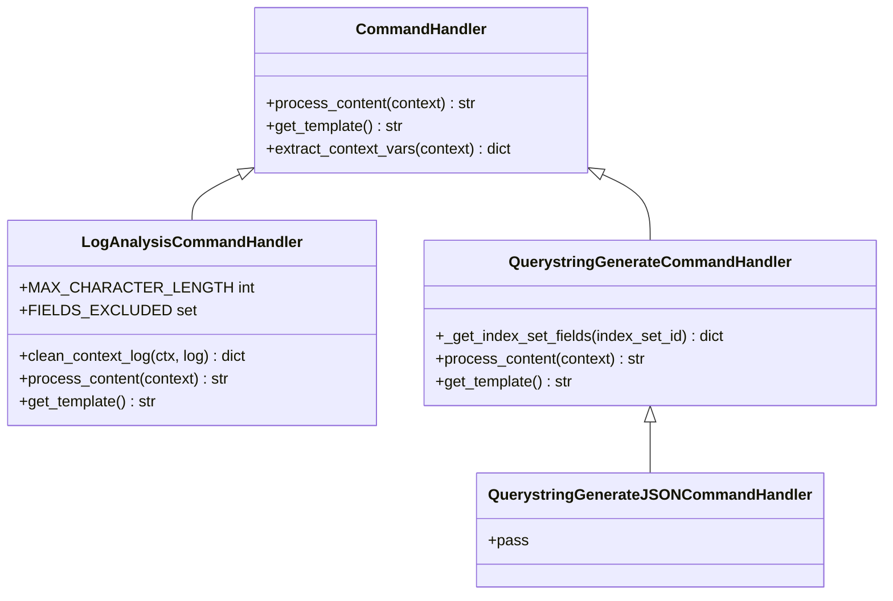
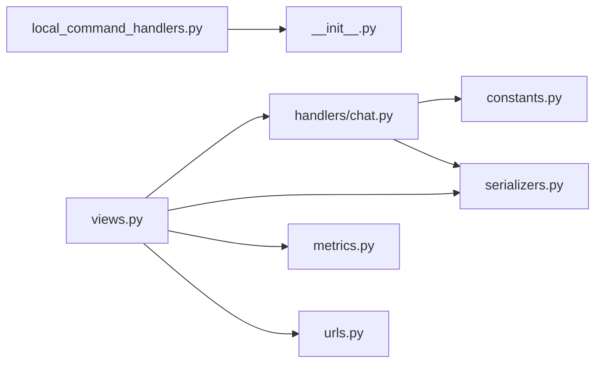

# AI助手系统

<cite>
**本文引用的文件**
- [apps/ai_assistant/views.py](file://apps/ai_assistant/views.py)
- [apps/ai_assistant/handlers/chat.py](file://apps/ai_assistant/handlers/chat.py)
- [apps/ai_assistant/local_command_handlers.py](file://apps/ai_assistant/local_command_handlers.py)
- [apps/ai_assistant/serializers.py](file://apps/ai_assistant/serializers.py)
- [apps/ai_assistant/constants.py](file://apps/ai_assistant/constants.py)
- [apps/ai_assistant/metrics.py](file://apps/ai_assistant/metrics.py)
- [apps/ai_assistant/urls.py](file://apps/ai_assistant/urls.py)
- [apps/ai_assistant/__init__.py](file://apps/ai_assistant/__init__.py)
- [apps/ai_assistant/apps.py](file://apps/ai_assistant/apps.py)
- [apps/ai_assistant/models.py](file://apps/ai_assistant/models.py)
- [apps/ai_assistant/tests.py](file://apps/ai_assistant/tests.py)
- [settings.py](file://settings.py)
- [config/default.py](file://config/default.py)
</cite>

## 目录
1. [简介](#简介)
2. [项目结构](#项目结构)
3. [核心组件](#核心组件)
4. [架构总览](#架构总览)
5. [详细组件分析](#详细组件分析)
6. [依赖分析](#依赖分析)
7. [性能考虑](#性能考虑)
8. [故障排查指南](#故障排查指南)
9. [结论](#结论)
10. [附录](#附录)

## 简介
本技术文档面向“AI助手系统”，聚焦以下目标：
- 全面说明AI模型接入、对话处理与结果生成机制
- 解释本地命令处理系统的设计与执行流程
- 阐述交互设计（自然语言理解、上下文管理、多轮对话）
- 总结性能优化策略（响应时间、并发与资源管理）
- 提供扩展开发指南（新增功能、模型集成、接口扩展）
- 给出使用示例与开发最佳实践

## 项目结构
AI助手系统位于 apps/ai_assistant 目录，采用Django + DRF风格组织，核心由视图层、序列化器、处理器、常量配置、指标与路由组成；同时通过特性开关与权限控制保障安全与可配置性。

图表来源
- [apps/ai_assistant/views.py:53-320](file://apps/ai_assistant/views.py#L53-L320)
- [apps/ai_assistant/handlers/chat.py:18-120](file://apps/ai_assistant/handlers/chat.py#L18-L120)
- [apps/ai_assistant/local_command_handlers.py:1-209](file://apps/ai_assistant/local_command_handlers.py#L1-L209)
- [apps/ai_assistant/serializers.py:1-129](file://apps/ai_assistant/serializers.py#L1-L129)
- [apps/ai_assistant/constants.py:5-16](file://apps/ai_assistant/constants.py#L5-L16)
- [apps/ai_assistant/metrics.py:22-39](file://apps/ai_assistant/metrics.py#L22-L39)
- [apps/ai_assistant/urls.py:26-47](file://apps/ai_assistant/urls.py#L26-L47)
- [apps/ai_assistant/__init__.py:1-3](file://apps/ai_assistant/__init__.py#L1-L3)
- [settings.py:39-46](file://settings.py#L39-L46)
- [config/default.py:584-611](file://config/default.py#L584-L611)

章节来源
- [apps/ai_assistant/views.py:53-320](file://apps/ai_assistant/views.py#L53-L320)
- [apps/ai_assistant/urls.py:26-47](file://apps/ai_assistant/urls.py#L26-L47)
- [apps/ai_assistant/__init__.py:1-3](file://apps/ai_assistant/__init__.py#L1-L3)

## 核心组件
- 视图与接口层：提供聊天、会话、会话内容、反馈、流式会话等REST接口，统一参数校验与权限控制。
- 对话处理层：封装与AIDEV网关的通信，支持流式与非流式响应，构造系统提示词与上下文消息。
- 本地命令处理层：基于装饰器注册本地命令处理器，负责日志上下文拼装、查询语句生成等本地逻辑。
- 序列化器：严格定义请求参数与校验规则，确保输入一致性。
- 常量配置：集中管理提示词、模型、上下文数量等可配置项。
- 指标与监控：基于Prometheus暴露请求总量与耗时指标，便于观测与告警。
- 路由与注册：DRF路由器自动注册各子视图集，统一对外URL。

章节来源
- [apps/ai_assistant/views.py:53-320](file://apps/ai_assistant/views.py#L53-L320)
- [apps/ai_assistant/handlers/chat.py:18-120](file://apps/ai_assistant/handlers/chat.py#L18-L120)
- [apps/ai_assistant/local_command_handlers.py:1-209](file://apps/ai_assistant/local_command_handlers.py#L1-L209)
- [apps/ai_assistant/serializers.py:13-129](file://apps/ai_assistant/serializers.py#L13-L129)
- [apps/ai_assistant/constants.py:5-16](file://apps/ai_assistant/constants.py#L5-L16)
- [apps/ai_assistant/metrics.py:22-39](file://apps/ai_assistant/metrics.py#L22-L39)
- [apps/ai_assistant/urls.py:26-47](file://apps/ai_assistant/urls.py#L26-L47)

## 架构总览
AI助手系统采用“视图-处理器-外部接口”的分层架构：
- 视图层负责权限、参数校验与接口编排
- 处理器层负责消息构造、上下文裁剪与外部调用
- 外部接口层对接AIDEV网关，支持流式SSE返回
- 本地命令处理器在本地完成上下文拼装与模板渲染

图表来源
- [apps/ai_assistant/views.py:57-94](file://apps/ai_assistant/views.py#L57-L94)
- [apps/ai_assistant/handlers/chat.py:92-120](file://apps/ai_assistant/handlers/chat.py#L92-L120)
- [apps/ai_assistant/metrics.py:26-39](file://apps/ai_assistant/metrics.py#L26-L39)

## 详细组件分析

### 视图与接口层（AIAssistantViewSet、ChatSessionViewSet、ChatSessionContentViewSet、SessionFeedbackViewSet、ChatCompletionViewSet、AgentInfoViewSet）
- 职责
  - AIAssistantViewSet.chat：接收日志与查询，结合上下文与提示词，调用处理器并返回流式或非流式结果
  - ChatSessionViewSet：会话生命周期管理（列表、创建、更新、查询、删除、AI重命名）
  - ChatSessionContentViewSet：会话内容增删改查与批量删除
  - SessionFeedbackViewSet：会话内容反馈与反馈原因查询
  - ChatCompletionViewSet：创建流式会话，透传执行参数至AIDEV
  - AgentInfoViewSet：查询Agent信息
- 关键点
  - 统一使用业务权限控制
  - 参数通过对应序列化器校验
  - 流式场景使用StreamingHttpResponse，设置SSE相关响应头
  - 通过特性开关控制功能可用性

章节来源
- [apps/ai_assistant/views.py:53-320](file://apps/ai_assistant/views.py#L53-L320)
- [apps/ai_assistant/serializers.py:13-129](file://apps/ai_assistant/serializers.py#L13-L129)

### 对话处理层（ChatHandler）
- 职责
  - call_chat_completion：向AIDEV网关发起聊天请求，支持流式与非流式
  - interpret_log：构造系统提示词与消息列表，裁剪上下文，调用聊天接口
- 关键点
  - 从特性开关读取功能配置，动态决定提示词、模型与上下文数量
  - 流式返回遵循SSE协议，逐块解码并yield
  - 错误捕获与异常包装，便于上层统一处理
  - 记录请求耗时与参数日志，便于问题定位

图表来源
- [apps/ai_assistant/handlers/chat.py:92-120](file://apps/ai_assistant/handlers/chat.py#L92-L120)
- [apps/ai_assistant/constants.py:5-16](file://apps/ai_assistant/constants.py#L5-L16)

章节来源
- [apps/ai_assistant/handlers/chat.py:18-120](file://apps/ai_assistant/handlers/chat.py#L18-L120)
- [apps/ai_assistant/constants.py:5-16](file://apps/ai_assistant/constants.py#L5-L16)

### 本地命令处理系统
- 设计
  - 基于装饰器注册本地命令处理器，实现“命令名 -> 处理器类”的映射
  - 支持日志分析（拼装上下文、清理重复字段、模板渲染）、查询语句生成（描述、字段、域名、索引集、当前时间）
- 关键点
  - 日志分析命令：限定最大字符长度，按需裁剪上下文，避免冗余字段
  - 查询语句生成命令：从索引集获取字段元信息，渲染模板输出
  - 通过__init__.py在应用启动时自动注册所有本地命令

图表来源
- [apps/ai_assistant/local_command_handlers.py:14-209](file://apps/ai_assistant/local_command_handlers.py#L14-L209)

章节来源
- [apps/ai_assistant/local_command_handlers.py:1-209](file://apps/ai_assistant/local_command_handlers.py#L1-L209)
- [apps/ai_assistant/__init__.py:1-3](file://apps/ai_assistant/__init__.py#L1-L3)

### 序列化器与参数校验
- ChatSerializer：聊天输入参数（空间ID、业务ID、索引集ID、日志内容、查询、上下文、是否流式、上下文数量、类型）
- 会话与内容相关序列化器：创建、更新、查询、批量删除、反馈等
- 作用：保证请求参数合法、类型正确、范围约束

章节来源
- [apps/ai_assistant/serializers.py:13-129](file://apps/ai_assistant/serializers.py#L13-L129)

### 指标与监控
- 指标定义：请求总量计数器、请求耗时Gauge，标签包含agent_code、resource_name、status、username、command
- 上报器：AIMetricsReporter与AIDevInterface配合，自动上报

章节来源
- [apps/ai_assistant/metrics.py:22-39](file://apps/ai_assistant/metrics.py#L22-L39)
- [apps/ai_assistant/views.py:97-107](file://apps/ai_assistant/views.py#L97-L107)

### 路由与注册
- DRF路由器注册多个子视图集，统一前缀 /ai_assistant/
- 自动生成REST接口，便于前后端对接

章节来源
- [apps/ai_assistant/urls.py:26-47](file://apps/ai_assistant/urls.py#L26-L47)

## 依赖分析
- 外部依赖
  - AIDEV网关：通过HTTP(S)调用，支持SSE流式返回
  - 特性开关：FeatureToggleObject控制AI助手功能开关
  - 权限控制：业务权限ViewBusinessPermission
- 内部依赖
  - 视图依赖处理器与序列化器
  - 处理器依赖常量配置与特性开关
  - 本地命令处理器依赖索引集与上下文查询工具

图表来源
- [apps/ai_assistant/views.py:53-320](file://apps/ai_assistant/views.py#L53-L320)
- [apps/ai_assistant/handlers/chat.py:18-120](file://apps/ai_assistant/handlers/chat.py#L18-L120)
- [apps/ai_assistant/local_command_handlers.py:1-209](file://apps/ai_assistant/local_command_handlers.py#L1-L209)
- [apps/ai_assistant/serializers.py:13-129](file://apps/ai_assistant/serializers.py#L13-L129)
- [apps/ai_assistant/constants.py:5-16](file://apps/ai_assistant/constants.py#L5-L16)
- [apps/ai_assistant/metrics.py:22-39](file://apps/ai_assistant/metrics.py#L22-L39)
- [apps/ai_assistant/urls.py:26-47](file://apps/ai_assistant/urls.py#L26-L47)
- [apps/ai_assistant/__init__.py:1-3](file://apps/ai_assistant/__init__.py#L1-L3)

## 性能考虑
- 响应时间优化
  - 流式SSE返回降低首字节延迟，提升感知速度
  - 控制上下文长度与消息数量，避免超长提示词导致延迟增加
- 并发与资源管理
  - 处理器内部使用requests流式迭代，避免一次性缓冲大响应
  - 指标上报Gauge按请求粒度记录耗时，便于定位慢请求
- 配置与特性开关
  - 通过特性开关动态调整模型与上下文策略，按业务维度灰度发布

章节来源
- [apps/ai_assistant/handlers/chat.py:42-91](file://apps/ai_assistant/handlers/chat.py#L42-L91)
- [apps/ai_assistant/constants.py:5-16](file://apps/ai_assistant/constants.py#L5-L16)
- [apps/ai_assistant/metrics.py:26-39](file://apps/ai_assistant/metrics.py#L26-L39)

## 故障排查指南
- 常见问题
  - 功能未启用：特性开关关闭时返回未实现错误
  - 外部接口异常：call_chat_completion捕获请求异常并记录详细信息
  - 上下文过长：本地命令处理器对字符长度进行限制与裁剪
- 建议排查步骤
  - 检查特性开关与业务ID配置
  - 查看视图层与处理器日志，确认请求ID与参数
  - 关注指标面板，定位慢请求与错误率
  - 对照序列化器校验，确认必填字段与取值范围

章节来源
- [apps/ai_assistant/views.py:76-86](file://apps/ai_assistant/views.py#L76-L86)
- [apps/ai_assistant/handlers/chat.py:81-88](file://apps/ai_assistant/handlers/chat.py#L81-L88)

## 结论
AI助手系统通过清晰的分层设计与严格的参数校验，实现了从日志到智能解读的完整链路；本地命令处理系统增强了上下文拼装与查询生成能力；流式SSE与指标体系保障了良好的用户体验与可观测性。建议在生产环境中结合特性开关与指标监控，持续优化上下文策略与模型选择。

## 附录

### 使用示例（接口与参数）
- 聊天接口（POST /ai_assistant/）
  - 参数要点：space_uid、bk_biz_id、index_set_id、log_data、query、chat_context、stream、log_context_count、type
  - 返回：流式SSE或JSON响应
- 会话管理（GET/POST/PUT/DELETE /ai_assistant/session/*）
  - 支持列表、创建、更新、查询、删除、AI重命名
- 会话内容管理（GET/POST/PUT/DELETE /ai_assistant/session_content/*）
  - 支持内容增删改查与批量删除
- 反馈接口（POST /ai_assistant/session_feedback、GET /ai_assistant/session_feedback/reasons）
  - 支持创建反馈与查询反馈原因
- 流式会话（POST /ai_assistant/chat_completion）
  - 支持透传执行参数与Agent代码

章节来源
- [apps/ai_assistant/views.py:57-319](file://apps/ai_assistant/views.py#L57-L319)
- [apps/ai_assistant/serializers.py:13-129](file://apps/ai_assistant/serializers.py#L13-L129)

### 开发最佳实践
- 新增本地命令
  - 基于装饰器注册，实现process_content与get_template
  - 注意字符长度限制与字段清洗，避免冗余上下文
- 新增对话类型
  - 在序列化器中新增参数校验
  - 在常量配置中补充提示词与上下文策略
- 模型集成
  - 通过特性开关切换不同模型，逐步灰度
  - 关注指标面板，对比不同模型的耗时与稳定性
- 接口扩展
  - 使用DRF路由器自动注册，保持URL前缀一致
  - 为新接口补充权限控制与参数校验

章节来源
- [apps/ai_assistant/local_command_handlers.py:14-209](file://apps/ai_assistant/local_command_handlers.py#L14-L209)
- [apps/ai_assistant/serializers.py:13-129](file://apps/ai_assistant/serializers.py#L13-L129)
- [apps/ai_assistant/constants.py:5-16](file://apps/ai_assistant/constants.py#L5-L16)
- [apps/ai_assistant/urls.py:26-47](file://apps/ai_assistant/urls.py#L26-L47)