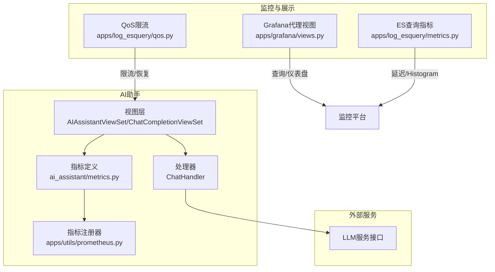
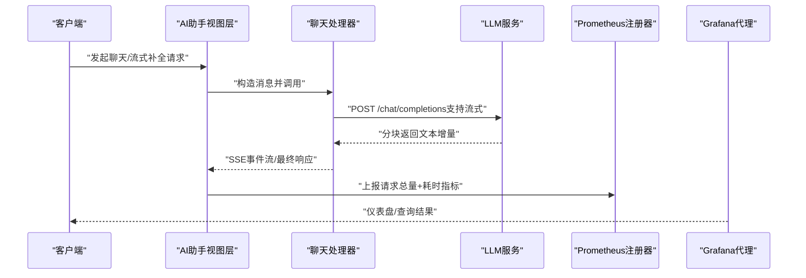
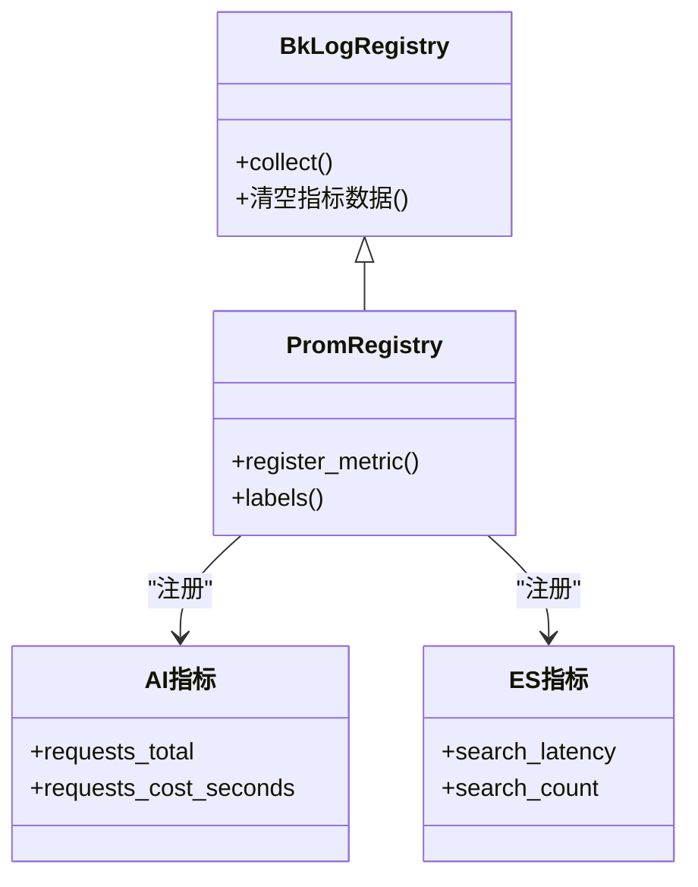
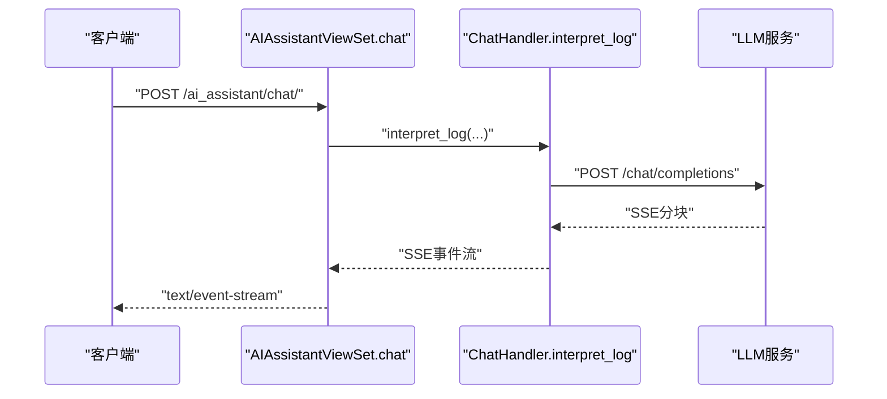
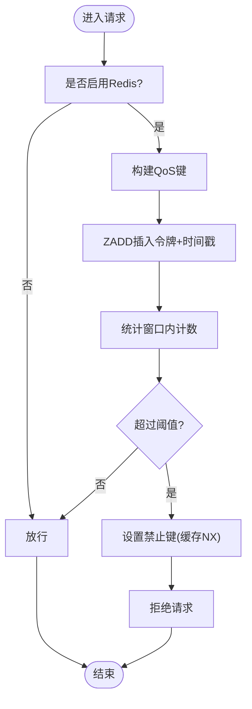
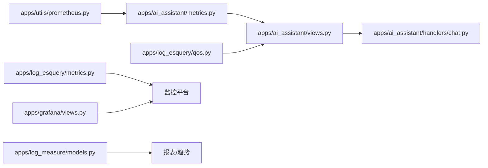

# AI性能监控

<cite>
**本文引用的文件**
- [apps/ai_assistant/metrics.py](file://apps/ai_assistant/metrics.py)
- [apps/ai_assistant/views.py](file://apps/ai_assistant/views.py)
- [apps/ai_assistant/handlers/chat.py](file://apps/ai_assistant/handlers/chat.py)
- [apps/ai_assistant/constants.py](file://apps/ai_assistant/constants.py)
- [apps/ai_assistant/urls.py](file://apps/ai_assistant/urls.py)
- [apps/utils/prometheus.py](file://apps/utils/prometheus.py)
- [apps/log_esquery/qos.py](file://apps/log_esquery/qos.py)
- [apps/log_esquery/metrics.py](file://apps/log_esquery/metrics.py)
- [apps/grafana/views.py](file://apps/grafana/views.py)
- [apps/log_measure/models.py](file://apps/log_measure/models.py)
</cite>

## 目录
1. [简介](#简介)
2. [项目结构](#项目结构)
3. [核心组件](#核心组件)
4. [架构总览](#架构总览)
5. [详细组件分析](#详细组件分析)
6. [依赖分析](#依赖分析)
7. [性能考量](#性能考量)
8. [故障排查指南](#故障排查指南)
9. [结论](#结论)
10. [附录](#附录)

## 简介
本技术文档面向“AI助手性能监控系统”，聚焦于AI助手在日志分析场景中的指标采集与治理，涵盖响应时间、吞吐量与错误率等关键性能指标的定义、采集与计算方法；解释QPS统计、延迟分析与资源使用情况的观测路径；阐述监控数据的存储与展示方式（数据库模型、管理界面与报表生成）；并提供性能优化建议（缓存策略、并发控制与资源调优），以及监控配置示例与故障诊断流程。

## 项目结构
围绕AI助手性能监控的关键模块分布如下：
- 指标定义与注册：统一通过Prometheus客户端与蓝鲸命名空间注册，确保跨实例聚合一致性
- AI助手接口与处理链路：视图层封装接口、处理器负责调用外部LLM服务并产出流式响应
- QoS与限流：基于Redis的窗口计数限流，防止热点查询冲击
- 数据展示与报表：通过Grafana代理与监控平台对接，实现仪表盘与查询能力
- 数据存储：指标历史与访问统计模型用于报表与趋势分析

图表来源
- [apps/ai_assistant/views.py:53-320](file://apps/ai_assistant/views.py#L53-L320)
- [apps/ai_assistant/handlers/chat.py:18-120](file://apps/ai_assistant/handlers/chat.py#L18-L120)
- [apps/ai_assistant/metrics.py:26-38](file://apps/ai_assistant/metrics.py#L26-L38)
- [apps/utils/prometheus.py:16-68](file://apps/utils/prometheus.py#L16-L68)
- [apps/log_esquery/qos.py:66-145](file://apps/log_esquery/qos.py#L66-L145)
- [apps/log_esquery/metrics.py:7-21](file://apps/log_esquery/metrics.py#L7-L21)
- [apps/grafana/views.py:149-593](file://apps/grafana/views.py#L149-L593)

章节来源
- [apps/ai_assistant/urls.py:35-46](file://apps/ai_assistant/urls.py#L35-L46)
- [apps/ai_assistant/views.py:53-320](file://apps/ai_assistant/views.py#L53-L320)
- [apps/ai_assistant/handlers/chat.py:18-120](file://apps/ai_assistant/handlers/chat.py#L18-L120)
- [apps/ai_assistant/metrics.py:26-38](file://apps/ai_assistant/metrics.py#L26-L38)
- [apps/utils/prometheus.py:16-68](file://apps/utils/prometheus.py#L16-L68)
- [apps/log_esquery/qos.py:66-145](file://apps/log_esquery/qos.py#L66-L145)
- [apps/log_esquery/metrics.py:7-21](file://apps/log_esquery/metrics.py#L7-L21)
- [apps/grafana/views.py:149-593](file://apps/grafana/views.py#L149-L593)

## 核心组件
- 指标定义与注册
  - AI助手请求总量与耗时指标：通过统一注册器自动附加主机名、环境阶段与应用标识，便于跨实例聚合
  - ES查询延迟与计数指标：采用直方图与计数器，标注索引集、场景、存储集群等维度
- AI助手接口与处理链路
  - 视图层封装聊天、会话、流式补全等接口，统一接入权限与序列化校验
  - 处理器负责构造消息、调用外部LLM服务并支持流式返回，记录端到端耗时
- QoS与限流
  - 基于Redis有序集合的滑动窗口计数，结合Django缓存设置限流键，保障热点查询稳定性
- 数据展示与报表
  - Grafana代理视图提供指标查询、日志查询、变量与拓扑树等能力，支持保存到监控仪表盘
  - 指标历史与访问统计模型支撑趋势与报表生成

章节来源
- [apps/ai_assistant/metrics.py:26-38](file://apps/ai_assistant/metrics.py#L26-L38)
- [apps/utils/prometheus.py:45-68](file://apps/utils/prometheus.py#L45-L68)
- [apps/ai_assistant/views.py:53-320](file://apps/ai_assistant/views.py#L53-L320)
- [apps/ai_assistant/handlers/chat.py:18-120](file://apps/ai_assistant/handlers/chat.py#L18-L120)
- [apps/log_esquery/qos.py:66-145](file://apps/log_esquery/qos.py#L66-L145)
- [apps/log_esquery/metrics.py:7-21](file://apps/log_esquery/metrics.py#L7-L21)
- [apps/grafana/views.py:149-593](file://apps/grafana/views.py#L149-L593)
- [apps/log_measure/models.py:28-44](file://apps/log_measure/models.py#L28-L44)

## 架构总览
AI助手性能监控体系以“指标采集—数据注册—外部服务调用—限流保护—可视化展示”为主线，形成闭环的可观测性方案。

图表来源
- [apps/ai_assistant/views.py:57-94](file://apps/ai_assistant/views.py#L57-L94)
- [apps/ai_assistant/handlers/chat.py:19-91](file://apps/ai_assistant/handlers/chat.py#L19-L91)
- [apps/ai_assistant/metrics.py:26-38](file://apps/ai_assistant/metrics.py#L26-L38)
- [apps/utils/prometheus.py:45-68](file://apps/utils/prometheus.py#L45-L68)
- [apps/grafana/views.py:196-266](file://apps/grafana/views.py#L196-L266)

## 详细组件分析

### 指标定义与注册（Prometheus）
- 统一注册器扩展
  - 自动注入主机名、环境阶段、应用标识等标签，避免跨实例重复累加
  - 支持Histogram直方图与Counter计数器，满足延迟与总量统计需求
- AI助手指标
  - 请求总量：按智能体代码、资源名、状态、用户名、命令等维度聚合
  - 请求耗时：以Gauge形式记录，便于观察尾延迟与峰值
- ES查询指标
  - 搜索延迟直方图：内置分桶，覆盖短延迟到长延迟区间
  - 搜索计数：按索引集、场景、存储集群等维度统计

图表来源
- [apps/utils/prometheus.py:16-68](file://apps/utils/prometheus.py#L16-L68)
- [apps/ai_assistant/metrics.py:26-38](file://apps/ai_assistant/metrics.py#L26-L38)
- [apps/log_esquery/metrics.py:7-21](file://apps/log_esquery/metrics.py#L7-L21)

章节来源
- [apps/utils/prometheus.py:16-68](file://apps/utils/prometheus.py#L16-L68)
- [apps/ai_assistant/metrics.py:26-38](file://apps/ai_assistant/metrics.py#L26-L38)
- [apps/log_esquery/metrics.py:7-21](file://apps/log_esquery/metrics.py#L7-L21)

### AI助手接口与处理链路
- 视图层
  - 聊天接口：支持流式与非流式两种模式，流式场景返回SSE
  - 会话与内容管理：提供会话生命周期与内容增删改查
  - 流式补全：支持开启/关闭流式，按需返回SSE或JSON
- 处理器
  - 构造系统提示词与用户消息，调用外部LLM服务
  - 支持流式迭代解析，逐块输出增量内容
  - 记录端到端耗时，便于指标采集与问题定位

图表来源
- [apps/ai_assistant/views.py:57-94](file://apps/ai_assistant/views.py#L57-L94)
- [apps/ai_assistant/handlers/chat.py:92-120](file://apps/ai_assistant/handlers/chat.py#L92-L120)

章节来源
- [apps/ai_assistant/views.py:53-320](file://apps/ai_assistant/views.py#L53-L320)
- [apps/ai_assistant/handlers/chat.py:18-120](file://apps/ai_assistant/handlers/chat.py#L18-L120)
- [apps/ai_assistant/constants.py:5-16](file://apps/ai_assistant/constants.py#L5-L16)

### QoS与限流（Redis滑动窗口）
- 窗口构建
  - 基于当前时间与窗口分钟数计算时间范围，使用Redis ZSET记录令牌与时间戳
- 限流判定
  - 若窗口内请求数达到阈值，设置缓存键作为“禁止标记”，并清理计数
- 恢复逻辑
  - 在请求未异常时清理ZSET，避免误伤后续请求
- 键生成规则
  - 优先使用索引集ID；若不可用，使用场景ID与索引片段，必要时对长索引做MD5摘要

图表来源
- [apps/log_esquery/qos.py:66-145](file://apps/log_esquery/qos.py#L66-L145)

章节来源
- [apps/log_esquery/qos.py:39-145](file://apps/log_esquery/qos.py#L39-L145)

### 数据展示与报表（Grafana代理）
- 能力概览
  - 指标查询、日志查询、变量与维度取值、拓扑树、仪表盘目录树、创建与保存到仪表盘
- 权限与认证
  - 业务权限控制与无CSRF会话认证，保障后台代理安全
- 与监控平台集成
  - 提供保存到仪表盘能力，将查询表达式与数据源写入监控平台

章节来源
- [apps/grafana/views.py:149-593](file://apps/grafana/views.py#L149-L593)

### 数据存储模型（报表与趋势）
- 索引集搜索统计
  - 记录项目ID、索引集ID、访问次数与日期，支持按天统计与趋势分析
- 指标历史
  - 存储指标ID、指标数据与更新时间戳，支撑历史回溯与报表生成

章节来源
- [apps/log_measure/models.py:28-44](file://apps/log_measure/models.py#L28-L44)

## 依赖分析
- 指标注册依赖
  - 统一注册器依赖Django Prometheus中间件与命名空间，确保指标可被监控系统采集
- 外部服务依赖
  - AI助手处理器依赖外部LLM服务接口，需关注网络超时与流式解析健壮性
- 缓存与限流依赖
  - Redis与Django缓存共同构成限流策略，需保证键空间与过期策略合理
- 展示依赖
  - Grafana代理依赖监控平台API与数据源配置，确保查询与面板渲染稳定

图表来源
- [apps/utils/prometheus.py:16-68](file://apps/utils/prometheus.py#L16-L68)
- [apps/ai_assistant/metrics.py:26-38](file://apps/ai_assistant/metrics.py#L26-L38)
- [apps/ai_assistant/views.py:53-320](file://apps/ai_assistant/views.py#L53-L320)
- [apps/ai_assistant/handlers/chat.py:18-120](file://apps/ai_assistant/handlers/chat.py#L18-L120)
- [apps/log_esquery/qos.py:66-145](file://apps/log_esquery/qos.py#L66-L145)
- [apps/log_esquery/metrics.py:7-21](file://apps/log_esquery/metrics.py#L7-L21)
- [apps/grafana/views.py:149-593](file://apps/grafana/views.py#L149-L593)
- [apps/log_measure/models.py:28-44](file://apps/log_measure/models.py#L28-L44)

## 性能考量
- 响应时间与延迟分析
  - 使用直方图统计延迟分布，结合分位点（如P95/P99）评估尾延迟
  - 对AI助手链路，记录端到端耗时，区分网络、推理与流式传输阶段
- 吞吐量与QPS
  - 通过计数器统计请求总量，结合时间窗口计算QPS，识别流量高峰与异常波动
- 错误率监控
  - 通过状态标签与异常捕获，统计失败请求占比，配合告警阈值触发
- 资源使用情况
  - 结合Grafana代理查询主机、容器等维度指标，观察CPU、内存、网络与磁盘IO
- 缓存策略
  - 利用Redis有序集合实现滑动窗口限流，避免热点查询导致下游拥塞
- 并发控制
  - 控制流式响应的并发连接数，避免过多长连接占用资源
- 资源调优
  - 合理设置LLM服务超时、批大小与并发度，平衡吞吐与延迟

## 故障排查指南
- 指标采集异常
  - 检查注册器是否正确注入标签，确认Prometheus抓取端点可达
- AI助手接口异常
  - 关注处理器异常分支与日志，核对外部LLM服务可用性与超时配置
- QoS限流误判
  - 校验Redis键生成规则与窗口时间，确认缓存键过期策略
- Grafana展示异常
  - 核查代理认证与权限配置，检查监控平台数据源与查询表达式

章节来源
- [apps/utils/prometheus.py:16-68](file://apps/utils/prometheus.py#L16-L68)
- [apps/ai_assistant/handlers/chat.py:81-91](file://apps/ai_assistant/handlers/chat.py#L81-L91)
- [apps/log_esquery/qos.py:66-145](file://apps/log_esquery/qos.py#L66-L145)
- [apps/grafana/views.py:149-593](file://apps/grafana/views.py#L149-L593)

## 结论
该AI助手性能监控体系通过统一指标注册、链路耗时统计、滑动窗口限流与Grafana可视化，实现了对响应时间、吞吐量与错误率的全面观测。结合数据库模型与报表能力，可进一步支撑趋势分析与容量规划。建议持续完善限流策略、优化并发与资源调优，并建立基于分位点与错误率的告警机制，以提升系统稳定性与用户体验。

## 附录
- 监控配置示例（概念性说明）
  - 指标命名空间与标签：确保跨实例聚合一致
  - 直方图分桶：根据业务延迟分布调整分桶边界
  - QoS阈值：依据SLA设定窗口与阈值，避免误伤正常流量
  - Grafana仪表盘：将关键指标与查询表达式固化到仪表盘，便于团队共享
- 故障诊断清单
  - 指标采集端点连通性
  - 外部LLM服务可用性与超时
  - Redis键空间与过期策略
  - Grafana代理权限与数据源配置