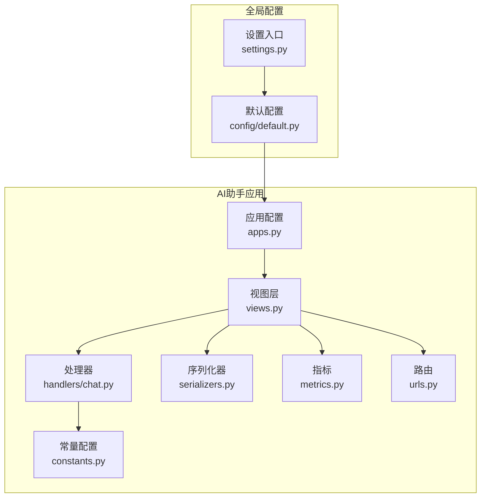
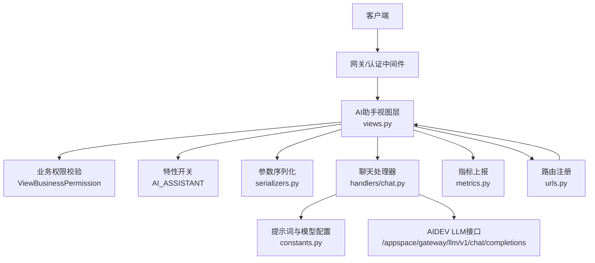
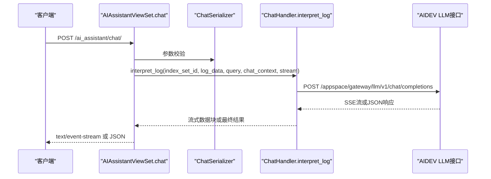
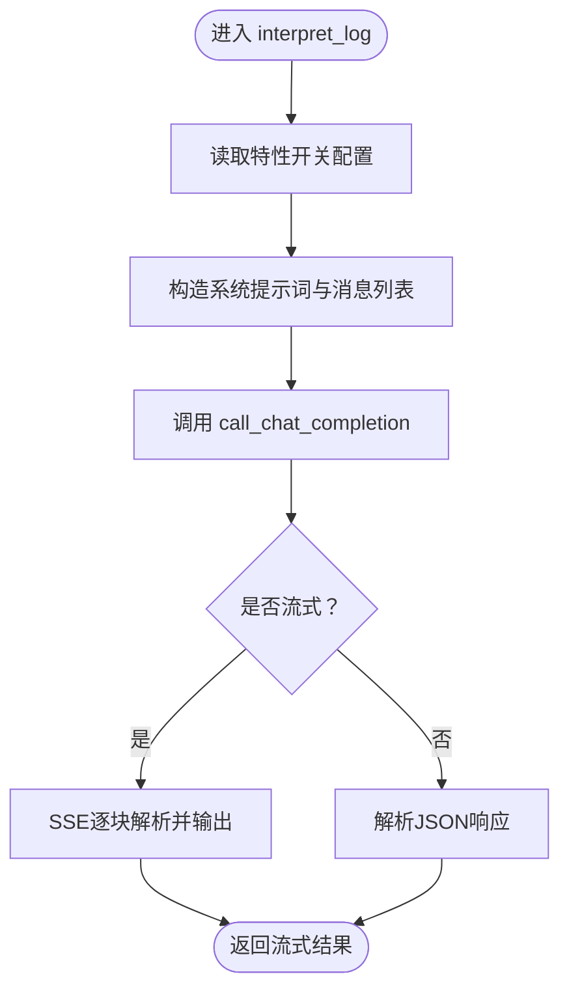
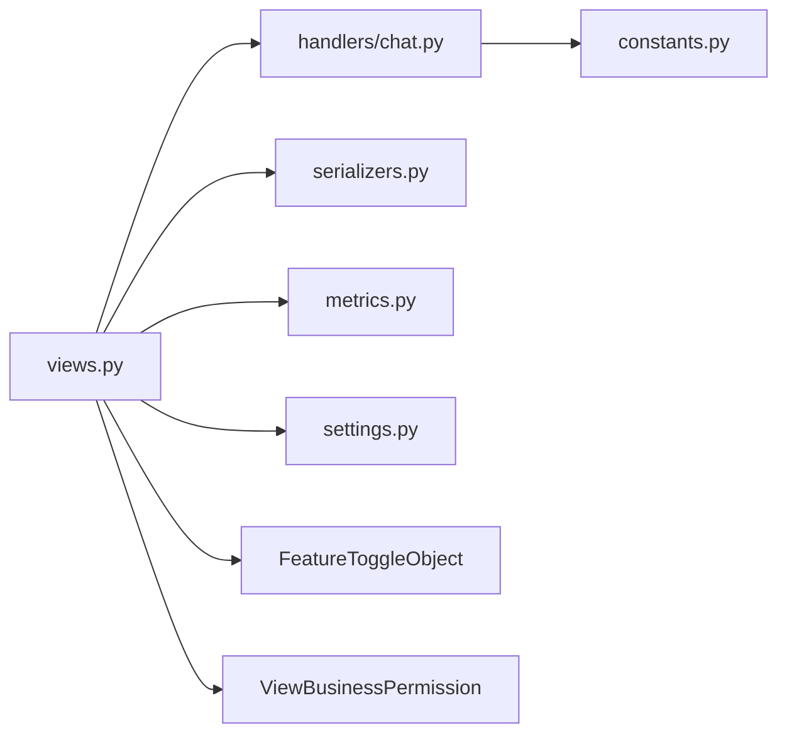

# AI核心功能

<cite>
**本文档引用的文件**
- [apps/ai_assistant/views.py](file://apps/ai_assistant/views.py)
- [apps/ai_assistant/handlers/chat.py](file://apps/ai_assistant/handlers/chat.py)
- [apps/ai_assistant/serializers.py](file://apps/ai_assistant/serializers.py)
- [apps/ai_assistant/constants.py](file://apps/ai_assistant/constants.py)
- [apps/ai_assistant/metrics.py](file://apps/ai_assistant/metrics.py)
- [apps/ai_assistant/urls.py](file://apps/ai_assistant/urls.py)
- [apps/ai_assistant/apps.py](file://apps/ai_assistant/apps.py)
- [apps/ai_assistant/tests.py](file://apps/ai_assistant/tests.py)
- [config/default.py](file://config/default.py)
- [settings.py](file://settings.py)
</cite>

## 目录
1. [简介](#简介)
2. [项目结构](#项目结构)
3. [核心组件](#核心组件)
4. [架构总览](#架构总览)
5. [详细组件分析](#详细组件分析)
6. [依赖分析](#依赖分析)
7. [性能考虑](#性能考虑)
8. [故障排查指南](#故障排查指南)
9. [结论](#结论)
10. [附录](#附录)

## 简介
本技术文档聚焦于AI助手核心功能，涵盖AI模型接入机制、对话处理系统设计、交互与上下文管理、性能优化策略以及使用示例与最佳实践。AI助手通过统一视图层对接AIDEV能力，提供日志解读、会话管理、流式对话与指标监控等能力，支撑蓝鲸日志平台的智能化体验。

## 项目结构
AI助手功能位于应用 apps/ai_assistant 下，采用“视图层-处理器-序列化器-常量-指标-路由”的分层组织方式，配合全局配置与特性开关，形成可扩展、可观测的AI能力入口。

图表来源
- [apps/ai_assistant/views.py:53-320](file://apps/ai_assistant/views.py#L53-L320)
- [apps/ai_assistant/handlers/chat.py:18-120](file://apps/ai_assistant/handlers/chat.py#L18-L120)
- [apps/ai_assistant/serializers.py:1-129](file://apps/ai_assistant/serializers.py#L1-L129)
- [apps/ai_assistant/constants.py:5-16](file://apps/ai_assistant/constants.py#L5-L16)
- [apps/ai_assistant/metrics.py:22-39](file://apps/ai_assistant/metrics.py#L22-L39)
- [apps/ai_assistant/urls.py:26-47](file://apps/ai_assistant/urls.py#L26-L47)
- [apps/ai_assistant/apps.py:4-6](file://apps/ai_assistant/apps.py#L4-L6)
- [config/default.py:54-95](file://config/default.py#L54-L95)
- [settings.py:24-46](file://settings.py#L24-L46)

章节来源
- [apps/ai_assistant/views.py:53-320](file://apps/ai_assistant/views.py#L53-L320)
- [apps/ai_assistant/urls.py:26-47](file://apps/ai_assistant/urls.py#L26-L47)
- [apps/ai_assistant/apps.py:4-6](file://apps/ai_assistant/apps.py#L4-L6)
- [config/default.py:54-95](file://config/default.py#L54-L95)
- [settings.py:24-46](file://settings.py#L24-L46)

## 核心组件
- 视图层（AIAssistantViewSet、ChatSessionViewSet、ChatSessionContentViewSet、SessionFeedbackViewSet、ChatCompletionViewSet、AgentInfoViewSet）：负责HTTP接口编排、参数校验、权限控制、流式/非流式响应与AIDEV接口转发。
- 处理器（ChatHandler）：封装与AIDEV的LLM聊天接口通信，支持消息构造、流式解码、异常处理与耗时记录。
- 序列化器（ChatSerializer、会话/内容/反馈相关序列化器）：定义请求参数结构与校验规则，确保输入一致性。
- 常量配置（InterpretLogFeatureConf）：集中管理提示词模板、模型名、上下文长度等可配置项。
- 指标（AIMetricsReporter、Prometheus计数器/耗时Gauge）：采集请求总量与耗时，便于性能观测与告警。
- 路由（urls.py）：注册AI助手相关REST端点，统一前缀与命名空间。
- 应用配置（apps.py）：声明Django应用配置。
- 全局配置（config/default.py、settings.py）：集成AI助手应用、中间件与环境变量加载。

章节来源
- [apps/ai_assistant/views.py:53-320](file://apps/ai_assistant/views.py#L53-L320)
- [apps/ai_assistant/handlers/chat.py:18-120](file://apps/ai_assistant/handlers/chat.py#L18-L120)
- [apps/ai_assistant/serializers.py:1-129](file://apps/ai_assistant/serializers.py#L1-L129)
- [apps/ai_assistant/constants.py:5-16](file://apps/ai_assistant/constants.py#L5-L16)
- [apps/ai_assistant/metrics.py:22-39](file://apps/ai_assistant/metrics.py#L22-L39)
- [apps/ai_assistant/urls.py:26-47](file://apps/ai_assistant/urls.py#L26-L47)
- [apps/ai_assistant/apps.py:4-6](file://apps/ai_assistant/apps.py#L4-L6)
- [config/default.py:54-95](file://config/default.py#L54-L95)
- [settings.py:24-46](file://settings.py#L24-L46)

## 架构总览
AI助手整体采用“视图层-处理器-外部服务”的三层架构，结合特性开关与权限控制，实现从请求到响应的完整链路。

图表来源
- [apps/ai_assistant/views.py:53-320](file://apps/ai_assistant/views.py#L53-L320)
- [apps/ai_assistant/handlers/chat.py:18-120](file://apps/ai_assistant/handlers/chat.py#L18-L120)
- [apps/ai_assistant/serializers.py:1-129](file://apps/ai_assistant/serializers.py#L1-L129)
- [apps/ai_assistant/constants.py:5-16](file://apps/ai_assistant/constants.py#L5-L16)
- [apps/ai_assistant/metrics.py:22-39](file://apps/ai_assistant/metrics.py#L22-L39)
- [apps/ai_assistant/urls.py:26-47](file://apps/ai_assistant/urls.py#L26-L47)

## 详细组件分析

### 视图层与接口编排
- AIAssistantViewSet.chat：接收日志解读请求，进行参数校验、特性开关检查，调用处理器构造消息并发起AIDEV请求；支持流式与非流式两种响应。
- ChatSessionViewSet/ChatSessionContentViewSet/SessionFeedbackViewSet：围绕会话生命周期与内容管理的REST接口，统一通过AIDEV接口完成读写。
- ChatCompletionViewSet：面向通用流式会话的创建与执行，透传execute_kwargs至AIDEV。
- AgentInfoViewSet：查询默认智能体信息，便于前端展示与配置校验。

图表来源
- [apps/ai_assistant/views.py:57-94](file://apps/ai_assistant/views.py#L57-L94)
- [apps/ai_assistant/handlers/chat.py:92-120](file://apps/ai_assistant/handlers/chat.py#L92-L120)

章节来源
- [apps/ai_assistant/views.py:53-320](file://apps/ai_assistant/views.py#L53-L320)

### 聊天处理器与模型调用
- call_chat_completion：构建请求头（含语言、请求ID、授权头）、构造请求体（模型、消息、流式标志），支持SSE流式解码与非流式JSON解析；异常捕获并转换为统一错误格式。
- interpret_log：读取特性开关配置，构造系统提示词与消息列表（截断历史上下文），调用call_chat_completion并返回结果。

图表来源
- [apps/ai_assistant/handlers/chat.py:92-120](file://apps/ai_assistant/handlers/chat.py#L92-L120)
- [apps/ai_assistant/constants.py:5-16](file://apps/ai_assistant/constants.py#L5-L16)

章节来源
- [apps/ai_assistant/handlers/chat.py:18-120](file://apps/ai_assistant/handlers/chat.py#L18-L120)
- [apps/ai_assistant/constants.py:5-16](file://apps/ai_assistant/constants.py#L5-L16)

### 参数序列化与校验
- ChatSerializer：定义空间ID、业务ID、索引集ID、日志数据、查询语句、聊天上下文、流式标志、日志上下文数量与类型等字段的校验规则。
- 会话/内容/反馈相关序列化器：分别约束会话创建/更新、内容增删改查、批量删除与反馈提交的字段结构。

章节来源
- [apps/ai_assistant/serializers.py:13-129](file://apps/ai_assistant/serializers.py#L13-L129)

### 提示词与模型配置
- InterpretLogFeatureConf：集中定义提示词模板、默认模型名、最大聊天上下文条数与最大日志上下文条数，便于按业务维度动态调整。

章节来源
- [apps/ai_assistant/constants.py:5-16](file://apps/ai_assistant/constants.py#L5-L16)

### 指标与可观测性
- AIMetricsReporter：封装请求总量与耗时Gauge的上报逻辑。
- Prometheus指标：
  - ai_agents_requests_total：按agent_code、resource_name、status、username、command聚合的累计请求计数。
  - ai_agents_requests_cost_seconds：同维度的请求耗时Gauge。

章节来源
- [apps/ai_assistant/metrics.py:22-39](file://apps/ai_assistant/metrics.py#L22-L39)

### 路由与应用注册
- urls.py：注册AI助手、Agent信息、会话、会话内容、流式会话、会话反馈等视图集合。
- apps.py：声明应用配置，配合config/default.py中的INSTALLED_APPS完成自动发现。

章节来源
- [apps/ai_assistant/urls.py:26-47](file://apps/ai_assistant/urls.py#L26-L47)
- [apps/ai_assistant/apps.py:4-6](file://apps/ai_assistant/apps.py#L4-L6)
- [config/default.py:74](file://config/default.py#L74)

## 依赖分析
- 组件内聚与耦合
  - 视图层仅承担编排职责，与处理器、序列化器、指标解耦，保持高内聚低耦合。
  - 处理器专注于与AIDEV的通信与消息构造，避免业务逻辑侵入。
- 外部依赖
  - AIDEV接口：通过settings中的AIDEV基础URL与鉴权参数访问。
  - 特性开关：通过FeatureToggleObject控制AI助手功能开关与动态配置。
  - 权限控制：通过ViewBusinessPermission限制业务域访问。
- 潜在循环依赖
  - 未见循环导入；视图层依赖处理器与序列化器，处理器依赖常量与工具模块，结构清晰。

图表来源
- [apps/ai_assistant/views.py:28-47](file://apps/ai_assistant/views.py#L28-L47)
- [apps/ai_assistant/handlers/chat.py:9-15](file://apps/ai_assistant/handlers/chat.py#L9-L15)
- [apps/ai_assistant/serializers.py:1-6](file://apps/ai_assistant/serializers.py#L1-L6)
- [apps/ai_assistant/metrics.py:22-39](file://apps/ai_assistant/metrics.py#L22-L39)
- [apps/ai_assistant/constants.py:5-16](file://apps/ai_assistant/constants.py#L5-L16)
- [config/default.py:54-95](file://config/default.py#L54-L95)
- [settings.py:24-46](file://settings.py#L24-L46)

章节来源
- [apps/ai_assistant/views.py:28-47](file://apps/ai_assistant/views.py#L28-L47)
- [apps/ai_assistant/handlers/chat.py:9-15](file://apps/ai_assistant/handlers/chat.py#L9-L15)
- [apps/ai_assistant/serializers.py:1-6](file://apps/ai_assistant/serializers.py#L1-L6)
- [apps/ai_assistant/metrics.py:22-39](file://apps/ai_assistant/metrics.py#L22-L39)
- [apps/ai_assistant/constants.py:5-16](file://apps/ai_assistant/constants.py#L5-L16)
- [config/default.py:54-95](file://config/default.py#L54-L95)
- [settings.py:24-46](file://settings.py#L24-L46)

## 性能考虑
- 响应时间优化
  - 启用流式返回：通过SSE逐步输出，降低首字节延迟，改善用户体验。
  - 控制上下文长度：根据InterpretLogFeatureConf限制聊天与日志上下文数量，减少令牌开销与往返时间。
  - 超时与重试：请求超时设置为固定窗口，避免长连接占用资源。
- 并发处理
  - 视图层采用异步/流式响应，释放线程用于处理其他请求。
  - 处理器内部逐块解析SSE，避免一次性缓冲大量数据。
- 资源管理
  - 指标上报：通过Prometheus计数器与Gauge记录请求总量与耗时，便于容量规划与瓶颈定位。
  - 日志与追踪：在处理器中记录请求ID与耗时，便于问题定位与审计。

章节来源
- [apps/ai_assistant/handlers/chat.py:19-91](file://apps/ai_assistant/handlers/chat.py#L19-L91)
- [apps/ai_assistant/constants.py:5-16](file://apps/ai_assistant/constants.py#L5-L16)
- [apps/ai_assistant/metrics.py:22-39](file://apps/ai_assistant/metrics.py#L22-L39)

## 故障排查指南
- 常见错误与定位
  - 功能未开启：当特性开关未启用时，接口返回未实现错误，需确认AI_ASSISTANT开关与业务ID配置。
  - AIDEV请求异常：处理器捕获底层请求异常并转换为统一错误格式，建议检查网络连通性、鉴权头与目标URL。
  - 参数校验失败：序列化器对必填字段与取值范围进行约束，需核对请求体结构。
- 指标与日志
  - 查看ai_agents_requests_total与ai_agents_requests_cost_seconds指标，定位异常峰值与慢请求。
  - 结合请求ID在处理器日志中定位具体调用链路。

章节来源
- [apps/ai_assistant/views.py:76-78](file://apps/ai_assistant/views.py#L76-L78)
- [apps/ai_assistant/handlers/chat.py:81-88](file://apps/ai_assistant/handlers/chat.py#L81-L88)
- [apps/ai_assistant/serializers.py:13-29](file://apps/ai_assistant/serializers.py#L13-L29)
- [apps/ai_assistant/metrics.py:26-38](file://apps/ai_assistant/metrics.py#L26-L38)

## 结论
AI助手通过清晰的分层设计与完善的可观测性，实现了从日志解读到会话管理的全链路能力。借助特性开关与权限控制，系统具备良好的可扩展性与安全性；结合流式响应与指标监控，能够满足生产环境对性能与稳定性的要求。

## 附录

### 使用示例与最佳实践
- 示例场景
  - 日志解读：调用/chat接口，传入索引集ID、日志数据、查询语句与可选聊天上下文，开启流式返回以获得即时响应。
  - 会话管理：通过/session与/session_content接口创建、查询、更新与删除会话内容，支持批量删除与智能重命名。
  - 流式会话：调用/chat_completion接口，传入会话编码与执行参数，实现持续对话与上下文累积。
- 最佳实践
  - 合理设置上下文长度：根据模型上下文限制与业务需求，控制聊天与日志上下文数量，避免超出阈值。
  - 使用流式响应：在前端侧采用SSE事件流，提升交互流畅度与感知速度。
  - 关注指标：定期查看请求总量与耗时指标，结合日志ID快速定位问题。
  - 权限与特性开关：确保业务权限与AI助手开关正确配置，避免越权与功能不可用。

章节来源
- [apps/ai_assistant/views.py:57-94](file://apps/ai_assistant/views.py#L57-L94)
- [apps/ai_assistant/views.py:141-202](file://apps/ai_assistant/views.py#L141-L202)
- [apps/ai_assistant/views.py:210-264](file://apps/ai_assistant/views.py#L210-L264)
- [apps/ai_assistant/views.py:299-319](file://apps/ai_assistant/views.py#L299-L319)
- [apps/ai_assistant/constants.py:5-16](file://apps/ai_assistant/constants.py#L5-L16)
- [apps/ai_assistant/metrics.py:26-38](file://apps/ai_assistant/metrics.py#L26-L38)