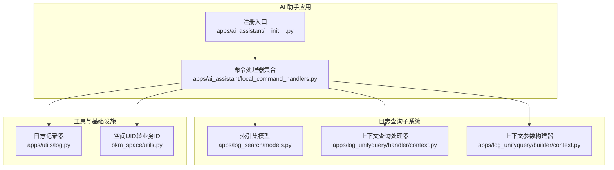
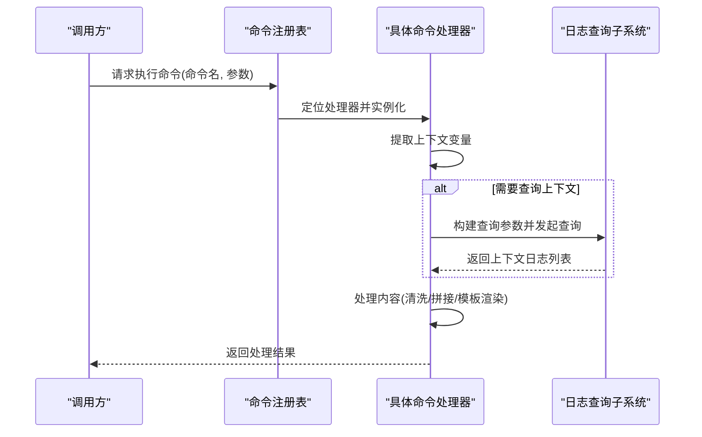
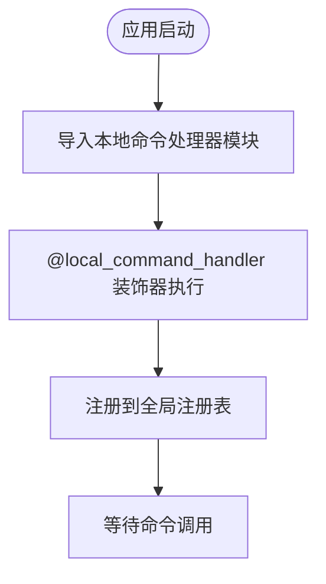
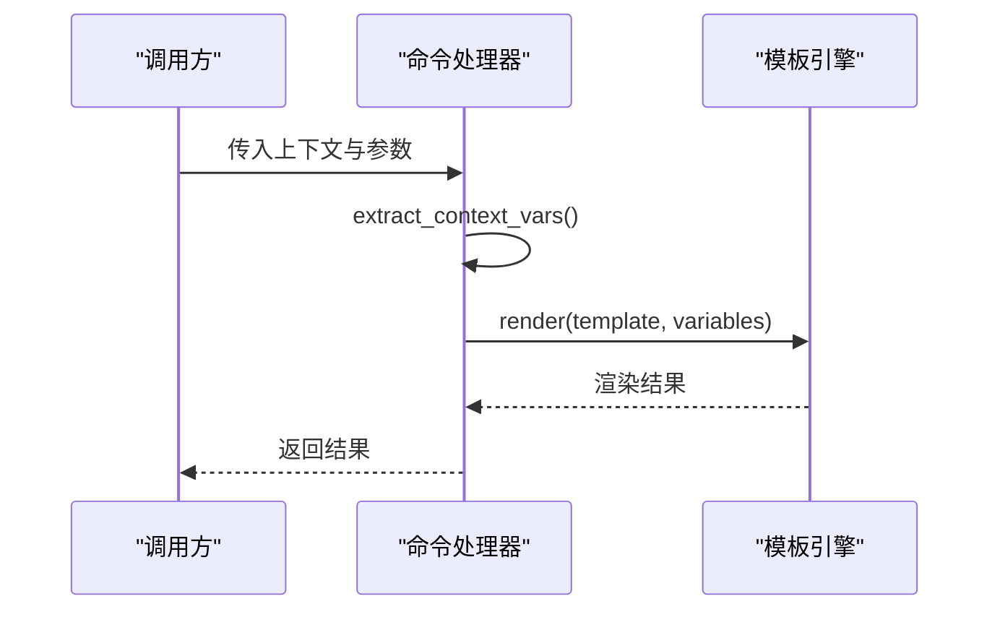
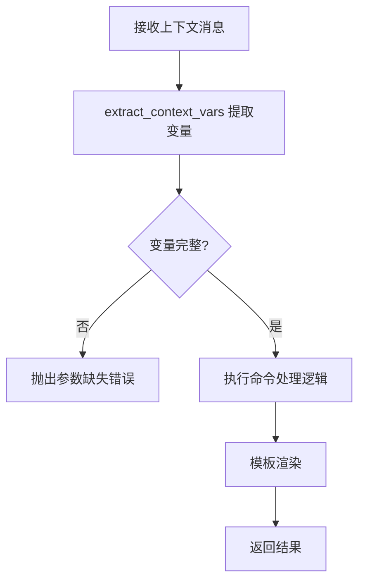
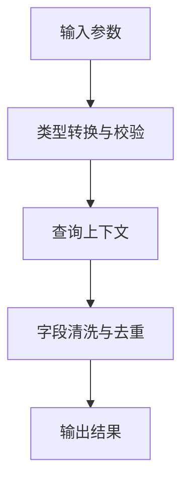
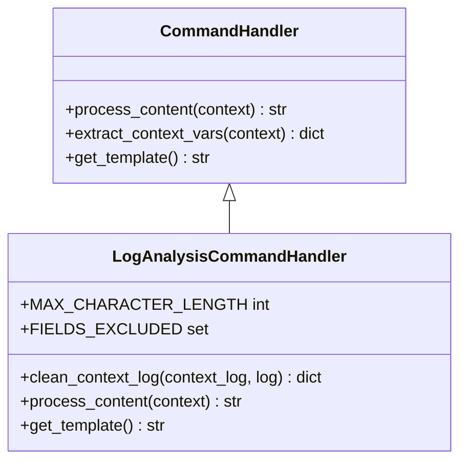
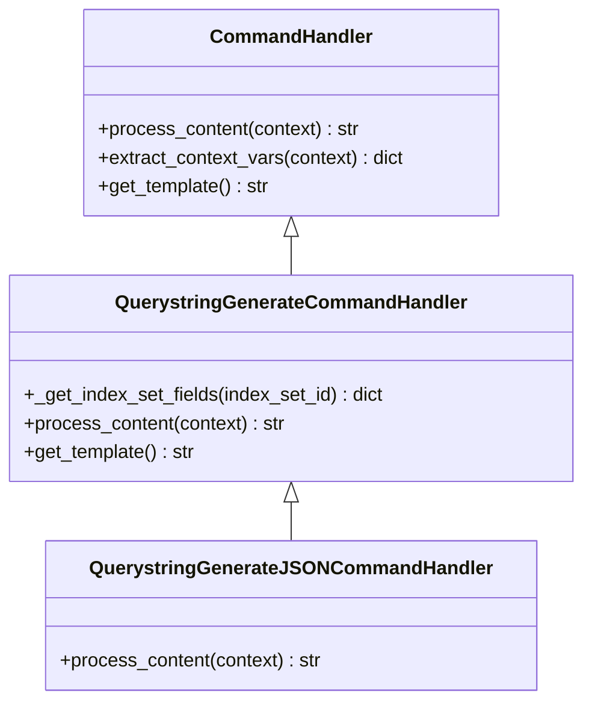
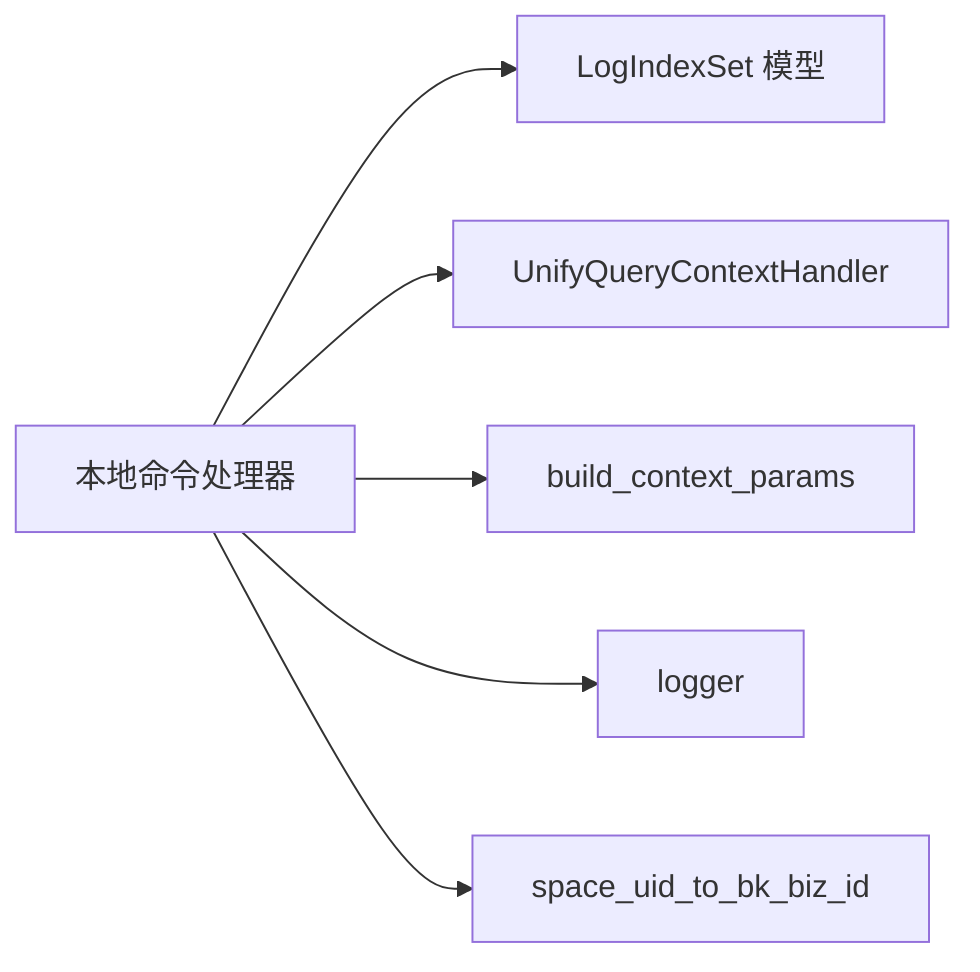

# 本地命令处理

<cite>
**本文档引用的文件**
- [apps/ai_assistant/local_command_handlers.py](file://apps/ai_assistant/local_command_handlers.py)
- [apps/ai_assistant/__init__.py](file://apps/ai_assistant/__init__.py)
- [apps/log_search/models.py](file://apps/log_search/models.py)
- [apps/log_unifyquery/handler/context.py](file://apps/log_unifyquery/handler/context.py)
- [apps/log_unifyquery/builder/context.py](file://apps/log_unifyquery/builder/context.py)
- [apps/utils/log.py](file://apps/utils/log.py)
- [bkm_space/utils.py](file://bkm_space/utils.py)
- [apps/ai_assistant/tests.py](file://apps/ai_assistant/tests.py)
</cite>

## 目录
1. [简介](#简介)
2. [项目结构](#项目结构)
3. [核心组件](#核心组件)
4. [架构总览](#架构总览)
5. [详细组件分析](#详细组件分析)
6. [依赖分析](#依赖分析)
7. [性能考虑](#性能考虑)
8. [故障排除指南](#故障排除指南)
9. [结论](#结论)
10. [附录](#附录)

## 简介
本文件面向“本地命令处理系统”的技术文档，重点阐述命令注册机制、执行流程与结果反馈；解释命令定义与解析过程（命令语法、参数传递、错误处理）；说明命令执行的安全机制（权限控制、输入验证、输出过滤）；并提供命令扩展开发指南（新增命令、自定义处理器编写与集成测试），最后给出实际使用示例与故障排除建议。

## 项目结构
本地命令处理系统位于应用模块中，通过装饰器注册命令处理器，并在应用启动时自动完成注册。命令处理器基于统一的基类，遵循相同的生命周期：参数提取、内容处理、模板渲染与结果返回。

**图表来源**
- [apps/ai_assistant/__init__.py:1-2](file://apps/ai_assistant/__init__.py#L1-L2)
- [apps/ai_assistant/local_command_handlers.py:1-209](file://apps/ai_assistant/local_command_handlers.py#L1-L209)
- [apps/log_search/models.py](file://apps/log_search/models.py)
- [apps/log_unifyquery/handler/context.py](file://apps/log_unifyquery/handler/context.py)
- [apps/log_unifyquery/builder/context.py](file://apps/log_unifyquery/builder/context.py)
- [apps/utils/log.py](file://apps/utils/log.py)
- [bkm_space/utils.py](file://bkm_space/utils.py)

**章节来源**
- [apps/ai_assistant/__init__.py:1-2](file://apps/ai_assistant/__init__.py#L1-L2)
- [apps/ai_assistant/local_command_handlers.py:1-209](file://apps/ai_assistant/local_command_handlers.py#L1-L209)

## 核心组件
- 命令注册入口：通过应用初始化导入处理器模块，触发装饰器注册。
- 命令处理器基类：提供统一的参数提取、模板渲染与结果返回能力。
- 具体命令处理器：
  - 日志分析命令处理器：从上下文查询接口拉取相关日志，清洗重复字段后拼接模板输出。
  - 查询语句生成命令处理器：根据索引集字段信息与用户描述生成查询模板。
  - 查询语句生成 JSON 版本命令处理器：复用查询语句生成逻辑，适配不同输出格式。

**章节来源**
- [apps/ai_assistant/local_command_handlers.py:14-127](file://apps/ai_assistant/local_command_handlers.py#L14-L127)
- [apps/ai_assistant/local_command_handlers.py:130-199](file://apps/ai_assistant/local_command_handlers.py#L130-L199)
- [apps/ai_assistant/local_command_handlers.py:202-209](file://apps/ai_assistant/local_command_handlers.py#L202-L209)

## 架构总览
本地命令处理系统采用“装饰器注册 + 统一基类 + 模板渲染”的架构模式。命令通过装饰器注册到全局注册表，运行时按需调用对应处理器进行内容处理与结果渲染。

**图表来源**
- [apps/ai_assistant/local_command_handlers.py:55-118](file://apps/ai_assistant/local_command_handlers.py#L55-L118)
- [apps/log_unifyquery/handler/context.py](file://apps/log_unifyquery/handler/context.py)
- [apps/log_unifyquery/builder/context.py](file://apps/log_unifyquery/builder/context.py)

## 详细组件分析

### 命令注册机制
- 应用启动时导入命令处理器模块，触发装饰器注册。
- 装饰器将命令名与处理器类绑定，建立命令名到处理器类的映射。
- 注册完成后，系统可通过命令名定位并调用对应处理器。

**图表来源**
- [apps/ai_assistant/__init__.py:1-2](file://apps/ai_assistant/__init__.py#L1-L2)
- [apps/ai_assistant/local_command_handlers.py:14-14](file://apps/ai_assistant/local_command_handlers.py#L14-L14)

**章节来源**
- [apps/ai_assistant/__init__.py:1-2](file://apps/ai_assistant/__init__.py#L1-L2)

### 执行流程与结果反馈
- 参数提取：从上下文消息中抽取命令所需的变量。
- 内容处理：根据命令类型执行相应逻辑（如查询上下文、拼接模板等）。
- 模板渲染：使用 Jinja2 模板引擎渲染最终结果字符串。
- 结果返回：将渲染后的文本返回给调用方。

**图表来源**
- [apps/ai_assistant/local_command_handlers.py:166-181](file://apps/ai_assistant/local_command_handlers.py#L166-L181)

**章节来源**
- [apps/ai_assistant/local_command_handlers.py:166-181](file://apps/ai_assistant/local_command_handlers.py#L166-L181)

### 命令定义与解析
- 命令语法：通过装饰器声明命令名，处理器类继承统一基类。
- 参数传递：从上下文消息中提取变量，支持字符串、JSON 等格式。
- 错误处理：对查询异常进行捕获与日志记录，保证流程不中断。

**图表来源**
- [apps/ai_assistant/local_command_handlers.py:60-65](file://apps/ai_assistant/local_command_handlers.py#L60-L65)
- [apps/ai_assistant/local_command_handlers.py:95-96](file://apps/ai_assistant/local_command_handlers.py#L95-L96)

**章节来源**
- [apps/ai_assistant/local_command_handlers.py:60-65](file://apps/ai_assistant/local_command_handlers.py#L60-L65)
- [apps/ai_assistant/local_command_handlers.py:95-96](file://apps/ai_assistant/local_command_handlers.py#L95-L96)

### 安全机制
- 权限控制：命令执行依赖于索引集对象的访问控制，查询时需要正确的业务 ID 映射。
- 输入验证：对索引集 ID、日志 JSON 等关键参数进行类型转换与存在性校验。
- 输出过滤：对上下文日志进行字段清洗，去除重复键值与敏感字段，降低噪声与泄露风险。

**图表来源**
- [apps/ai_assistant/local_command_handlers.py:63-74](file://apps/ai_assistant/local_command_handlers.py#L63-L74)
- [apps/ai_assistant/local_command_handlers.py:40-53](file://apps/ai_assistant/local_command_handlers.py#L40-L53)
- [apps/ai_assistant/local_command_handlers.py:102-117](file://apps/ai_assistant/local_command_handlers.py#L102-L117)

**章节来源**
- [apps/ai_assistant/local_command_handlers.py:40-53](file://apps/ai_assistant/local_command_handlers.py#L40-L53)
- [apps/ai_assistant/local_command_handlers.py:63-74](file://apps/ai_assistant/local_command_handlers.py#L63-L74)
- [apps/ai_assistant/local_command_handlers.py:102-117](file://apps/ai_assistant/local_command_handlers.py#L102-L117)

### 日志分析命令处理器
- 功能概述：根据索引集与日志内容，查询相关上下文日志，清洗重复字段后拼接到模板中输出。
- 关键点：
  - 上下文长度上限控制，避免超出模型上下文限制。
  - 字段排除清单，过滤无意义或重复字段。
  - 异常捕获与日志记录，保证查询失败不影响整体流程。

**图表来源**
- [apps/ai_assistant/local_command_handlers.py:14-127](file://apps/ai_assistant/local_command_handlers.py#L14-L127)

**章节来源**
- [apps/ai_assistant/local_command_handlers.py:14-127](file://apps/ai_assistant/local_command_handlers.py#L14-L127)

### 查询语句生成命令处理器
- 功能概述：根据索引集字段信息与用户描述，生成查询模板，支持 JSON 结构化版本。
- 关键点：
  - 字段信息动态获取，支持别名映射。
  - 时间戳自动注入，确保查询时效性。
  - 模板可扩展，便于适配不同输出格式。

**图表来源**
- [apps/ai_assistant/local_command_handlers.py:130-199](file://apps/ai_assistant/local_command_handlers.py#L130-L199)
- [apps/ai_assistant/local_command_handlers.py:202-209](file://apps/ai_assistant/local_command_handlers.py#L202-L209)

**章节来源**
- [apps/ai_assistant/local_command_handlers.py:130-199](file://apps/ai_assistant/local_command_handlers.py#L130-L199)
- [apps/ai_assistant/local_command_handlers.py:202-209](file://apps/ai_assistant/local_command_handlers.py#L202-L209)

## 依赖分析
- 处理器依赖 Django ORM 与日志查询子系统，用于索引集信息与上下文查询。
- 使用日志记录器记录异常，便于问题排查。
- 通过空间工具函数将空间 UID 转换为业务 ID，确保查询范围正确。

**图表来源**
- [apps/ai_assistant/local_command_handlers.py:57-88](file://apps/ai_assistant/local_command_handlers.py#L57-L88)
- [apps/log_search/models.py](file://apps/log_search/models.py)
- [apps/log_unifyquery/handler/context.py](file://apps/log_unifyquery/handler/context.py)
- [apps/log_unifyquery/builder/context.py](file://apps/log_unifyquery/builder/context.py)
- [apps/utils/log.py](file://apps/utils/log.py)
- [bkm_space/utils.py](file://bkm_space/utils.py)

**章节来源**
- [apps/ai_assistant/local_command_handlers.py:57-88](file://apps/ai_assistant/local_command_handlers.py#L57-L88)

## 性能考虑
- 上下文长度控制：通过最大字符长度限制，避免超长上下文导致性能下降。
- 字段清洗：去除重复键值与冗余字段，减少模板渲染负担。
- 查询异常降级：查询失败时记录日志并返回基础模板，保证可用性。

**章节来源**
- [apps/ai_assistant/local_command_handlers.py:24-25](file://apps/ai_assistant/local_command_handlers.py#L24-L25)
- [apps/ai_assistant/local_command_handlers.py:102-117](file://apps/ai_assistant/local_command_handlers.py#L102-L117)
- [apps/ai_assistant/local_command_handlers.py:95-96](file://apps/ai_assistant/local_command_handlers.py#L95-L96)

## 故障排除指南
- 常见问题
  - 命令未生效：确认应用初始化是否导入了命令处理器模块。
  - 查询失败：检查索引集是否存在、字段快照是否可用、业务 ID 映射是否正确。
  - 输出为空：确认上下文查询返回结果非空，或检查字段清洗规则是否过于严格。
- 排查步骤
  - 查看日志记录器输出，定位异常发生点。
  - 校验输入参数类型与完整性。
  - 逐步缩小问题范围，先验证查询链路，再检查模板渲染。

**章节来源**
- [apps/ai_assistant/local_command_handlers.py:72-74](file://apps/ai_assistant/local_command_handlers.py#L72-L74)
- [apps/ai_assistant/local_command_handlers.py:95-96](file://apps/ai_assistant/local_command_handlers.py#L95-L96)
- [apps/utils/log.py](file://apps/utils/log.py)

## 结论
本地命令处理系统通过装饰器注册与统一基类设计，实现了命令的可扩展与可维护。结合日志查询子系统与模板渲染机制，能够高效地将上下文信息转化为可读性强的结果。通过字段清洗与长度控制等安全与性能策略，保障了系统的稳定性与安全性。

## 附录

### 实际使用示例
- 日志分析命令
  - 输入：索引集 ID、日志 JSON、上下文数量
  - 输出：包含日志与上下文的模板化文本
- 查询语句生成命令
  - 输入：检索需求描述、平台域名、索引集 ID、字段信息
  - 输出：查询模板文本（支持 JSON 版本）

**章节来源**
- [apps/ai_assistant/local_command_handlers.py:14-127](file://apps/ai_assistant/local_command_handlers.py#L14-L127)
- [apps/ai_assistant/local_command_handlers.py:130-199](file://apps/ai_assistant/local_command_handlers.py#L130-L199)

### 扩展开发指南
- 新增命令
  - 定义命令处理器类，继承统一基类
  - 使用装饰器注册命令名
  - 实现内容处理与模板渲染方法
- 自定义处理器
  - 复用参数提取与模板渲染能力
  - 根据业务场景扩展查询链路
- 集成测试
  - 编写单元测试覆盖参数提取、查询与渲染流程
  - 使用模拟数据验证边界条件与异常路径

**章节来源**
- [apps/ai_assistant/local_command_handlers.py:14-127](file://apps/ai_assistant/local_command_handlers.py#L14-L127)
- [apps/ai_assistant/local_command_handlers.py:130-199](file://apps/ai_assistant/local_command_handlers.py#L130-L199)
- [apps/ai_assistant/tests.py](file://apps/ai_assistant/tests.py)