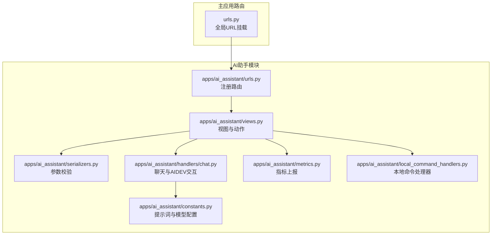
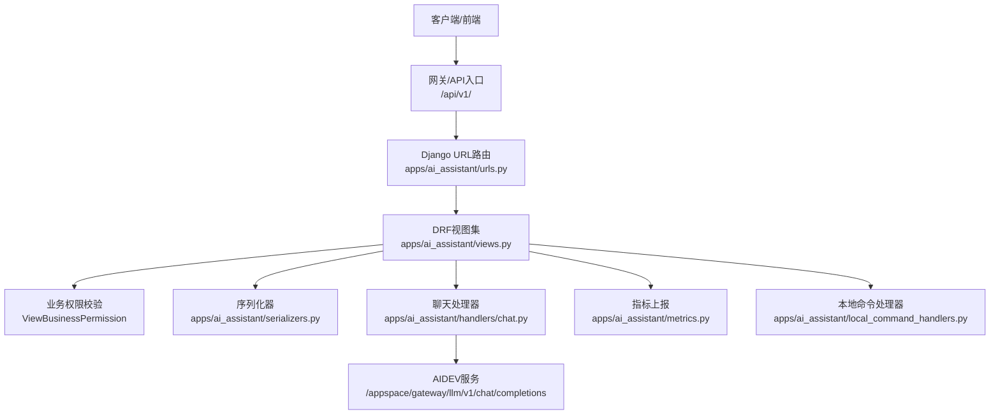
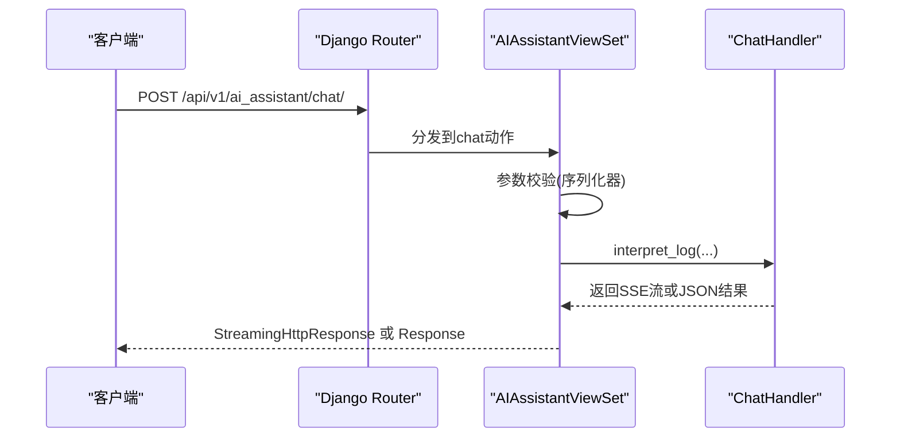
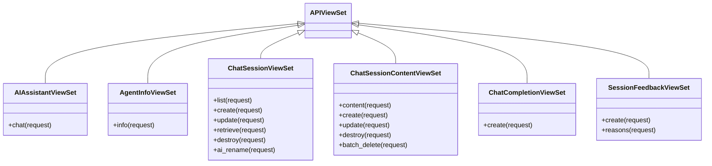
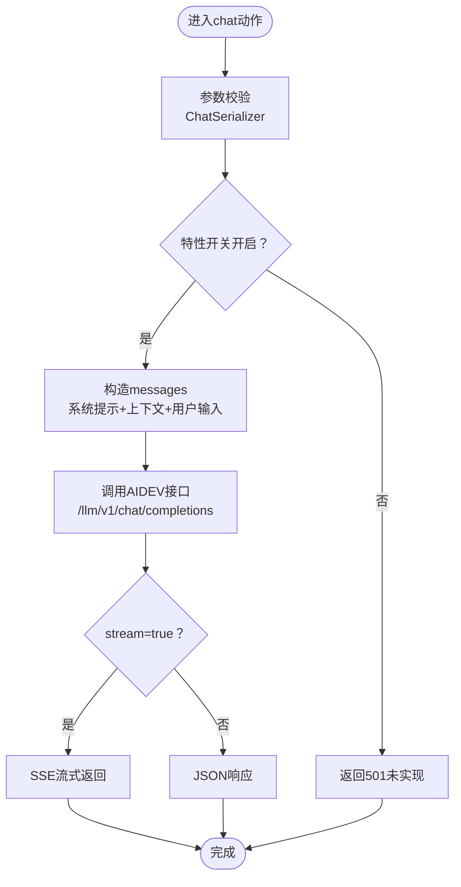
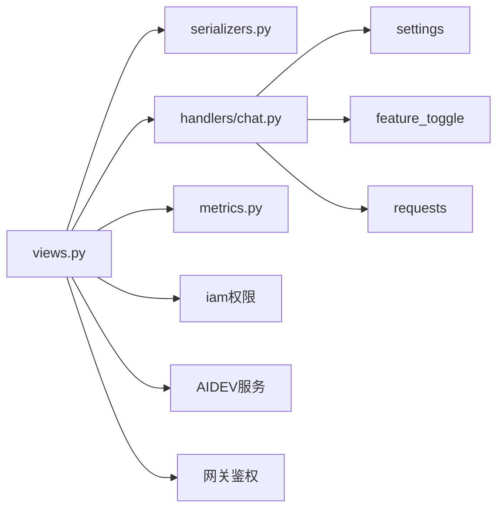

# 系统集成

<cite>
**本文档引用的文件**
- [apps/ai_assistant/urls.py](file://apps/ai_assistant/urls.py)
- [apps/ai_assistant/views.py](file://apps/ai_assistant/views.py)
- [apps/ai_assistant/handlers/chat.py](file://apps/ai_assistant/handlers/chat.py)
- [apps/ai_assistant/serializers.py](file://apps/ai_assistant/serializers.py)
- [apps/ai_assistant/constants.py](file://apps/ai_assistant/constants.py)
- [apps/ai_assistant/metrics.py](file://apps/ai_assistant/metrics.py)
- [apps/ai_assistant/local_command_handlers.py](file://apps/ai_assistant/local_command_handlers.py)
- [urls.py](file://urls.py)
- [apps/ai_assistant/tests.py](file://apps/ai_assistant/tests.py)
</cite>

## 目录
1. [简介](#简介)
2. [项目结构](#项目结构)
3. [核心组件](#核心组件)
4. [架构总览](#架构总览)
5. [详细组件分析](#详细组件分析)
6. [依赖分析](#依赖分析)
7. [性能考虑](#性能考虑)
8. [故障排查指南](#故障排查指南)
9. [结论](#结论)
10. [附录](#附录)

## 简介
本文件面向AI助手系统集成，围绕蓝鲸日志平台中的AI助手模块，系统性说明其与平台其他子系统之间的集成方式，包括API接口设计、数据交换格式、安全认证与权限控制、URL路由与视图处理机制、流式响应与指标监控等。同时给出集成开发指南、接口测试建议、版本兼容与部署配置要点，并提供常见问题解决方案。

## 项目结构
AI助手模块位于apps/ai_assistant目录，采用Django + DRF风格组织，核心由以下部分组成：
- 路由与视图：定义RESTful资源与动作，统一通过APIViewSet派生类实现
- 序列化器：对请求参数进行校验与转换
- 处理器：封装与外部AIDEV服务的交互逻辑
- 常量与指标：定义提示词模板、模型参数与Prometheus指标
- 本地命令处理器：提供日志上下文拼装与查询语句生成等本地能力
- 全局路由：在主应用urls.py中挂载到/api/v1/路径下

**图表来源**
- [apps/ai_assistant/urls.py:1-47](file://apps/ai_assistant/urls.py#L1-L47)
- [apps/ai_assistant/views.py:1-320](file://apps/ai_assistant/views.py#L1-L320)
- [apps/ai_assistant/handlers/chat.py:1-120](file://apps/ai_assistant/handlers/chat.py#L1-L120)
- [apps/ai_assistant/serializers.py:1-129](file://apps/ai_assistant/serializers.py#L1-L129)
- [apps/ai_assistant/constants.py:1-16](file://apps/ai_assistant/constants.py#L1-L16)
- [apps/ai_assistant/metrics.py:1-39](file://apps/ai_assistant/metrics.py#L1-L39)
- [apps/ai_assistant/local_command_handlers.py:1-209](file://apps/ai_assistant/local_command_handlers.py#L1-L209)
- [urls.py:42-74](file://urls.py#L42-L74)

**章节来源**
- [apps/ai_assistant/urls.py:1-47](file://apps/ai_assistant/urls.py#L1-L47)
- [apps/ai_assistant/views.py:1-320](file://apps/ai_assistant/views.py#L1-L320)
- [urls.py:42-74](file://urls.py#L42-L74)

## 核心组件
- 路由与资源
  - 通过DefaultRouter注册多个资源视图集，统一前缀为/api/v1/ai_assistant/
  - 主要资源：AI助手根资源、Agent信息、会话、会话内容、流式对话、会话反馈
- 视图与动作
  - 统一继承APIViewSet，使用@action装饰器扩展自定义动作
  - 权限控制：集成业务权限ViewBusinessPermission
- 参数校验
  - 使用DRF序列化器对请求参数进行严格校验，覆盖聊天、会话、内容、反馈、流式对话等场景
- 外部接口交互
  - 通过ChatHandler封装AIDEV聊天接口调用，支持流式返回
  - 通过AIDevInterface对接会话、内容、反馈等管理接口
- 配置与指标
  - constants定义提示词模板、模型与上下文长度等配置
  - metrics定义Prometheus指标，用于请求总量与耗时统计
- 本地命令处理器
  - 提供日志上下文拼装、查询语句生成等本地能力，便于在本地或受限环境下使用

**章节来源**
- [apps/ai_assistant/urls.py:35-46](file://apps/ai_assistant/urls.py#L35-L46)
- [apps/ai_assistant/views.py:53-320](file://apps/ai_assistant/views.py#L53-L320)
- [apps/ai_assistant/serializers.py:13-129](file://apps/ai_assistant/serializers.py#L13-L129)
- [apps/ai_assistant/handlers/chat.py:18-120](file://apps/ai_assistant/handlers/chat.py#L18-L120)
- [apps/ai_assistant/constants.py:5-16](file://apps/ai_assistant/constants.py#L5-L16)
- [apps/ai_assistant/metrics.py:26-39](file://apps/ai_assistant/metrics.py#L26-L39)
- [apps/ai_assistant/local_command_handlers.py:14-209](file://apps/ai_assistant/local_command_handlers.py#L14-L209)

## 架构总览
AI助手在整体架构中的定位：
- 作为蓝鲸日志平台的一个功能模块，通过统一的/api/v1/前缀对外提供RESTful接口
- 与日志搜索、统一查询、特征开关、IAM权限等模块协同工作
- 与AIDEV服务进行外部通信，支持流式SSE响应

**图表来源**
- [urls.py:42-74](file://urls.py#L42-L74)
- [apps/ai_assistant/urls.py:35-46](file://apps/ai_assistant/urls.py#L35-L46)
- [apps/ai_assistant/views.py:53-320](file://apps/ai_assistant/views.py#L53-L320)
- [apps/ai_assistant/handlers/chat.py:18-120](file://apps/ai_assistant/handlers/chat.py#L18-L120)
- [apps/ai_assistant/metrics.py:26-39](file://apps/ai_assistant/metrics.py#L26-L39)
- [apps/ai_assistant/local_command_handlers.py:14-209](file://apps/ai_assistant/local_command_handlers.py#L14-L209)

## 详细组件分析

### 路由与URL配置
- 资源注册
  - 使用DefaultRouter注册多个视图集，自动为每个视图集生成标准CRUD与自定义动作的URL
  - 前缀统一为ai_assistant/，最终暴露在/api/v1/ai_assistant/下
- 全局挂载
  - 主应用urls.py中通过include将ai_assistant.urls挂载到/api/v1/，确保统一入口

**图表来源**
- [apps/ai_assistant/urls.py:35-46](file://apps/ai_assistant/urls.py#L35-L46)
- [apps/ai_assistant/views.py:57-94](file://apps/ai_assistant/views.py#L57-L94)
- [apps/ai_assistant/handlers/chat.py:92-120](file://apps/ai_assistant/handlers/chat.py#L92-L120)

**章节来源**
- [apps/ai_assistant/urls.py:35-46](file://apps/ai_assistant/urls.py#L35-L46)
- [urls.py:60,42-74](file://urls.py#L60,42-L74)

### 视图与权限控制
- 权限
  - 继承APIViewSet并重写get_permissions，统一使用ViewBusinessPermission进行业务维度的访问控制
- 动作
  - chat：日志解读入口，支持流式SSE
  - agent/info：获取Agent信息
  - session：会话列表、创建、更新、查询、删除、AI重命名
  - session_content：内容列表、创建、更新、删除、批量删除
  - chat_completion：流式对话创建
  - session_feedback：反馈创建、反馈原因列表

**图表来源**
- [apps/ai_assistant/views.py:53-320](file://apps/ai_assistant/views.py#L53-L320)

**章节来源**
- [apps/ai_assistant/views.py:53-320](file://apps/ai_assistant/views.py#L53-L320)

### 请求参数与数据交换格式
- 参数校验
  - ChatSerializer：空间ID、业务ID、索引集ID、日志内容、当前输入、聊天上下文、是否流式、日志上下文条数、聊天类型
  - 会话/内容/反馈等序列化器分别对应相应资源的增删改查参数
- 数据交换
  - 流式响应：text/event-stream，逐块推送增量内容，以[data: ...]形式传输，以[DONE]结束
  - 非流式：直接返回JSON对象
  - 与AIDEV交互：POST /appspace/gateway/llm/v1/chat/completions，携带model、messages、stream等字段

**图表来源**
- [apps/ai_assistant/views.py:74-94](file://apps/ai_assistant/views.py#L74-L94)
- [apps/ai_assistant/handlers/chat.py:92-120](file://apps/ai_assistant/handlers/chat.py#L92-L120)
- [apps/ai_assistant/serializers.py:13-29](file://apps/ai_assistant/serializers.py#L13-L29)

**章节来源**
- [apps/ai_assistant/serializers.py:13-129](file://apps/ai_assistant/serializers.py#L13-L129)
- [apps/ai_assistant/handlers/chat.py:18-120](file://apps/ai_assistant/handlers/chat.py#L18-L120)

### 安全认证与权限控制
- 访问控制
  - 使用ViewBusinessPermission进行业务维度的权限校验
- 外部接口授权
  - ChatHandler在请求头中注入X-Bkapi-Authorization，由网关统一鉴权
  - 语言与请求ID通过blueking-language与request-id传递，便于链路追踪

**章节来源**
- [apps/ai_assistant/views.py:54-55,113-114](file://apps/ai_assistant/views.py#L54-L55,113-L114)
- [apps/ai_assistant/handlers/chat.py:27-32](file://apps/ai_assistant/handlers/chat.py#L27-L32)

### 指标监控与可观测性
- 指标定义
  - ai_agents_requests_total：计数器，记录请求总量
  - ai_agents_requests_cost_seconds：耗时Gauge，记录请求耗时
- 上报器
  - AIMetricsReporter与AIDevInterface结合，按资源名、状态、用户名、命令等维度上报

**章节来源**
- [apps/ai_assistant/metrics.py:26-39](file://apps/ai_assistant/metrics.py#L26-L39)
- [apps/ai_assistant/views.py:97-107](file://apps/ai_assistant/views.py#L97-L107)

### 本地命令处理器
- 日志分析命令
  - 基于上下文构建日志分析模板，支持字段清洗与字符长度限制
- 查询语句生成
  - 从索引集字段信息、平台域名、索引集ID、当前时间等变量生成查询语句模板

**章节来源**
- [apps/ai_assistant/local_command_handlers.py:14-128](file://apps/ai_assistant/local_command_handlers.py#L14-L128)
- [apps/ai_assistant/local_command_handlers.py:130-209](file://apps/ai_assistant/local_command_handlers.py#L130-L209)

## 依赖分析
- 模块内依赖
  - views依赖serializers、handlers、metrics、feature_toggle、iam等
  - handlers依赖settings、feature_toggle、logger、requests等
- 外部依赖
  - AIDEV服务：/appspace/gateway/llm/v1/chat/completions
  - 网关鉴权：X-Bkapi-Authorization
  - 特性开关：AI_ASSISTANT
  - 权限：ViewBusinessPermission

**图表来源**
- [apps/ai_assistant/views.py:28-47](file://apps/ai_assistant/views.py#L28-L47)
- [apps/ai_assistant/handlers/chat.py:6-15](file://apps/ai_assistant/handlers/chat.py#L6-L15)

**章节来源**
- [apps/ai_assistant/views.py:28-47](file://apps/ai_assistant/views.py#L28-L47)
- [apps/ai_assistant/handlers/chat.py:6-15](file://apps/ai_assistant/handlers/chat.py#L6-L15)

## 性能考虑
- 流式响应
  - 使用StreamingHttpResponse与SSE，降低前端等待时间，提升交互体验
- 超时与重试
  - ChatHandler对AIDEV请求设置超时；异常时记录日志并抛出ApiRequestError
- 指标监控
  - 通过Prometheus指标收集请求总量与耗时，便于容量与性能评估
- 上下文裁剪
  - constants限制最大聊天上下文与日志上下文数量，避免超出模型上下文长度

**章节来源**
- [apps/ai_assistant/handlers/chat.py:42-90](file://apps/ai_assistant/handlers/chat.py#L42-L90)
- [apps/ai_assistant/constants.py:13-16](file://apps/ai_assistant/constants.py#L13-L16)
- [apps/ai_assistant/metrics.py:26-39](file://apps/ai_assistant/metrics.py#L26-L39)

## 故障排查指南
- 501未实现
  - 现象：返回assistant is not configured
  - 原因：AI_ASSISTANT特性开关未开启或未配置
  - 处理：检查特性开关与业务ID映射
- AIDEV请求异常
  - 现象：ApiRequestError，包含后端返回信息
  - 原因：网络超时、鉴权失败、上游服务异常
  - 处理：查看日志、确认网关鉴权头、检查AIDEV可用性
- SSE流中断
  - 现象：前端未收到完整数据
  - 原因：上游响应格式异常或网络中断
  - 处理：确认上游返回data:前缀与[DONE]结尾，检查代理缓冲配置

**章节来源**
- [apps/ai_assistant/views.py:77-78](file://apps/ai_assistant/views.py#L77-L78)
- [apps/ai_assistant/handlers/chat.py:81-87](file://apps/ai_assistant/handlers/chat.py#L81-L87)

## 结论
AI助手模块通过清晰的路由与视图设计、严格的参数校验、完善的权限与指标体系，实现了与AIDEV服务的稳定集成。其RESTful接口与SSE流式响应满足了日志解读与会话管理的典型场景，配合特性开关与本地命令处理器，具备良好的可扩展性与可维护性。

## 附录

### 接口清单与规范
- 路由前缀：/api/v1/ai_assistant/
- 资源与动作
  - GET /agent/info：获取Agent信息
  - GET /session：获取会话列表
  - POST /session：创建会话
  - PUT /session：更新会话
  - GET /session/{session_code}：获取单个会话
  - DELETE /session/{session_code}：删除会话
  - POST /session/{session_code}/ai_rename：AI重命名会话
  - GET /session_content/content：获取会话内容
  - POST /session_content：创建会话内容
  - PUT /session_content：更新会话内容
  - DELETE /session_content/{content_id}：删除会话内容
  - POST /session_content/batch_delete：批量删除会话内容
  - POST /session_feedback：创建会话反馈
  - GET /session_feedback/reasons：获取反馈原因列表
  - POST /chat_completion：创建流式会话
  - POST /chat：日志解读（支持流式）

**章节来源**
- [apps/ai_assistant/urls.py:35-46](file://apps/ai_assistant/urls.py#L35-L46)
- [apps/ai_assistant/views.py:122-319](file://apps/ai_assistant/views.py#L122-L319)

### 集成开发指南
- 接口测试
  - 使用Swagger或Postman访问/api/v1/ai_assistant/各资源，先调用GET /agent/info确认连通性
  - 使用POST /chat或POST /chat_completion进行端到端测试，观察SSE流式输出
- 版本兼容
  - 关注AIDEV接口版本变更，保持messages与model字段兼容
  - 特性开关AI_ASSISTANT变化时，及时调整业务ID映射
- 部署配置
  - 设置BK_AIDEV_AGENT_APP_CODE与BK_AIDEV_AGENT_APP_SECRET
  - 配置AIDEV API基础地址与网关鉴权头
  - 开启Prometheus指标采集，配置告警规则

**章节来源**
- [apps/ai_assistant/views.py:103-107](file://apps/ai_assistant/views.py#L103-L107)
- [apps/ai_assistant/handlers/chat.py:43-49](file://apps/ai_assistant/handlers/chat.py#L43-L49)

### 常见问题与解答
- 问：为什么POST /chat返回501？
  - 答：AI_ASSISTANT特性开关未开启或业务ID未配置
- 问：SSE流式输出不完整怎么办？
  - 答：检查上游返回格式与[DONE]结尾，确认代理缓冲配置
- 问：如何接入本地命令处理器？
  - 答：通过本地命令处理器提供的模板与变量，生成日志分析或查询语句

**章节来源**
- [apps/ai_assistant/views.py:77-78](file://apps/ai_assistant/views.py#L77-L78)
- [apps/ai_assistant/handlers/chat.py:64-75](file://apps/ai_assistant/handlers/chat.py#L64-L75)
- [apps/ai_assistant/local_command_handlers.py:14-128](file://apps/ai_assistant/local_command_handlers.py#L14-L128)