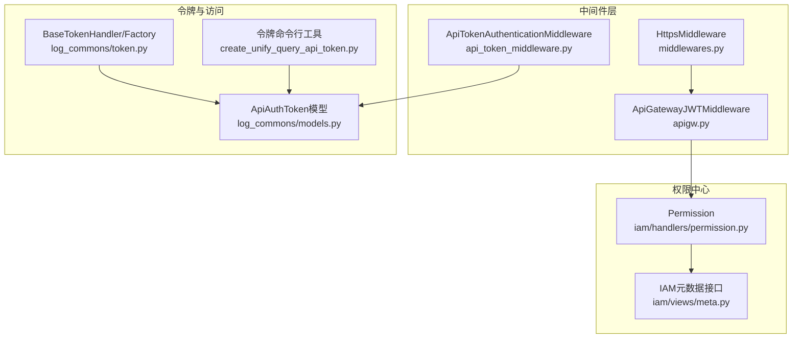
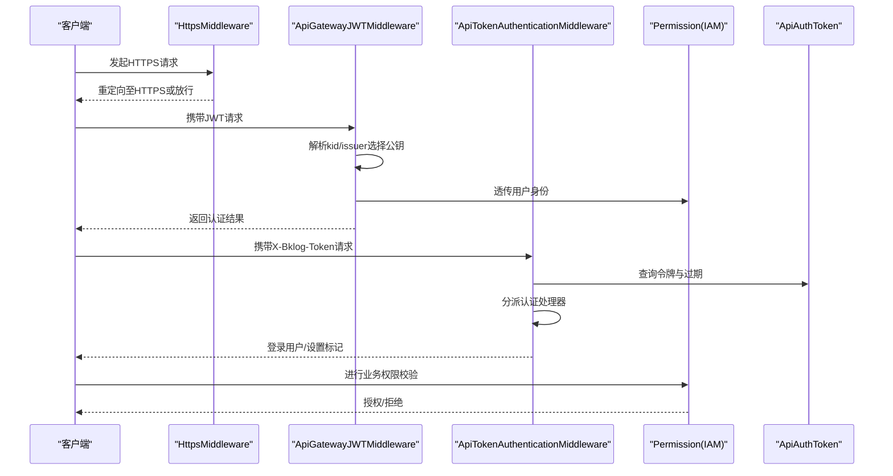
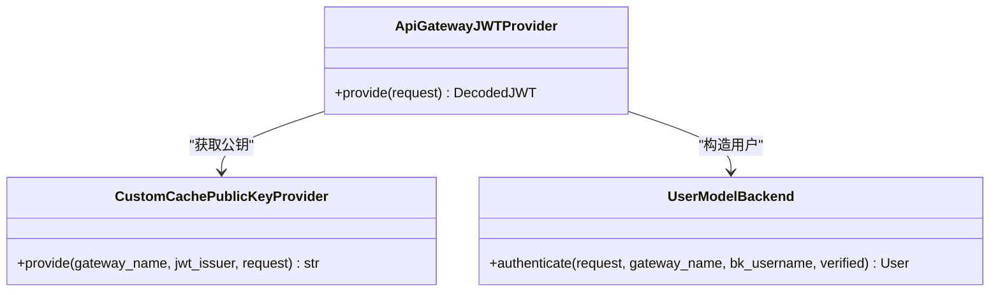
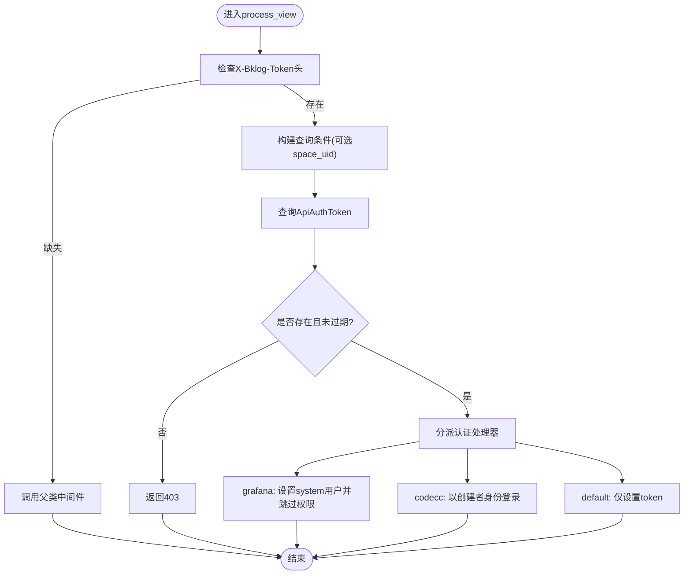
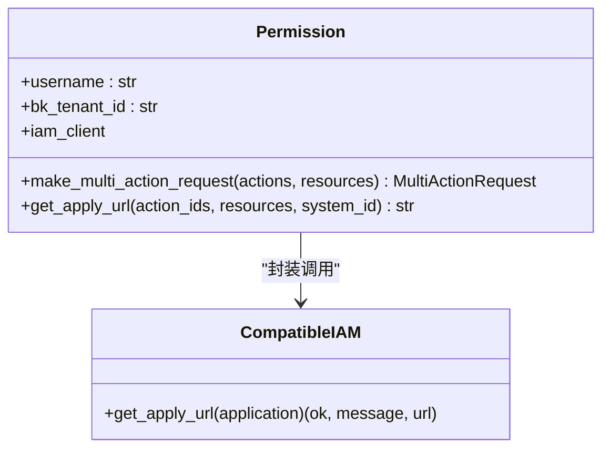
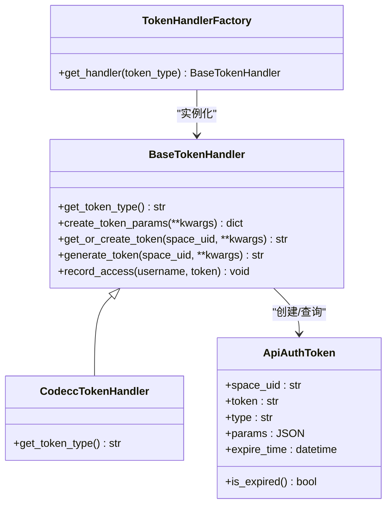
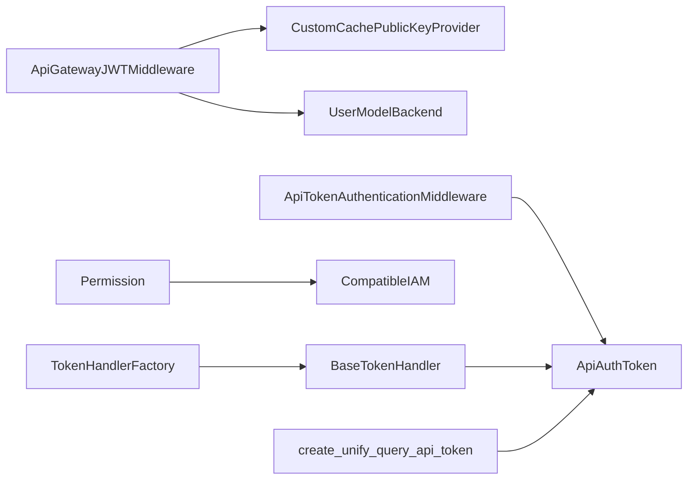

# API安全认证

<cite>
**本文引用的文件**   
- [apps/middleware/api_token_middleware.py](file://apps/middleware/api_token_middleware.py)
- [apps/middleware/apigw.py](file://apps/middleware/apigw.py)
- [apps/log_commons/token.py](file://apps/log_commons/token.py)
- [apps/log_commons/models.py](file://apps/log_commons/models.py)
- [apps/log_commons/constants.py](file://apps/log_commons/constants.py)
- [apps/iam/handlers/permission.py](file://apps/iam/handlers/permission.py)
- [apps/iam/views/meta.py](file://apps/iam/views/meta.py)
- [apps/middlewares.py](file://apps/middlewares.py)
- [apps/api/base.py](file://apps/api/base.py)
- [apps/log_commons/management/commands/create_unify_query_api_token.py](file://apps/log_commons/management/commands/create_unify_query_api_token.py)
- [apps/log_commons/exceptions.py](file://apps/log_commons/exceptions.py)
</cite>

## 目录
1. [简介](#简介)
2. [项目结构](#项目结构)
3. [核心组件](#核心组件)
4. [架构总览](#架构总览)
5. [详细组件分析](#详细组件分析)
6. [依赖分析](#依赖分析)
7. [性能考虑](#性能考虑)
8. [故障排查指南](#故障排查指南)
9. [结论](#结论)
10. [附录](#附录)

## 简介
本文件面向API安全认证，系统性梳理蓝鲸日志平台（bk-log）在API安全方面的整体架构与实现，覆盖身份验证、权限控制与数据加密机制，详述API认证流程（含app_code/app_secret、用户身份确认与会话管理）、RBAC权限模型与资源授权、API令牌生成与管理、安全最佳实践与常见问题防护方案，并提供安全配置指南。

## 项目结构
围绕API安全的关键模块分布如下：
- 中间件层：负责接入层的安全拦截与认证（如API网关JWT、统一Token认证）
- 权限中心封装：基于IAM的权限校验与资源授权
- 令牌与访问记录：统一的令牌生成、存储、过期与访问审计
- 配置与工具：安全相关配置项与工具方法

图表来源
- [apps/middleware/apigw.py:123-125](file://apps/middleware/apigw.py#L123-L125)
- [apps/middleware/api_token_middleware.py:22-76](file://apps/middleware/api_token_middleware.py#L22-L76)
- [apps/middlewares.py:205-211](file://apps/middlewares.py#L205-L211)
- [apps/iam/handlers/permission.py:57-92](file://apps/iam/handlers/permission.py#L57-L92)
- [apps/iam/views/meta.py:56-99](file://apps/iam/views/meta.py#L56-L99)
- [apps/log_commons/token.py:11-90](file://apps/log_commons/token.py#L11-L90)
- [apps/log_commons/models.py:47-68](file://apps/log_commons/models.py#L47-L68)
- [apps/log_commons/management/commands/create_unify_query_api_token.py:80-116](file://apps/log_commons/management/commands/create_unify_query_api_token.py#L80-L116)

章节来源
- [apps/middleware/apigw.py:123-125](file://apps/middleware/apigw.py#L123-L125)
- [apps/middleware/api_token_middleware.py:22-76](file://apps/middleware/api_token_middleware.py#L22-L76)
- [apps/middlewares.py:205-211](file://apps/middlewares.py#L205-L211)
- [apps/iam/handlers/permission.py:57-92](file://apps/iam/handlers/permission.py#L57-L92)
- [apps/iam/views/meta.py:56-99](file://apps/iam/views/meta.py#L56-L99)
- [apps/log_commons/token.py:11-90](file://apps/log_commons/token.py#L11-L90)
- [apps/log_commons/models.py:47-68](file://apps/log_commons/models.py#L47-L68)
- [apps/log_commons/management/commands/create_unify_query_api_token.py:80-116](file://apps/log_commons/management/commands/create_unify_query_api_token.py#L80-L116)

## 核心组件
- API网关JWT认证中间件：对接蓝鲸API网关，基于公钥验证JWT，支持内部/外部网关切换与缓存
- 统一Token认证中间件：支持多场景（grafana/codecc/default），按令牌类型执行不同认证策略
- 权限中心封装：封装IAM客户端、动作/资源定义、批量权限校验与无权限跳转
- 令牌处理器与工厂：抽象令牌生成流程，支持按类型创建与复用、访问记录
- 令牌模型与命令：令牌持久化、过期判断、命令行创建与刷新

章节来源
- [apps/middleware/apigw.py:41-125](file://apps/middleware/apigw.py#L41-L125)
- [apps/middleware/api_token_middleware.py:10-76](file://apps/middleware/api_token_middleware.py#L10-L76)
- [apps/iam/handlers/permission.py:57-200](file://apps/iam/handlers/permission.py#L57-L200)
- [apps/log_commons/token.py:11-90](file://apps/log_commons/token.py#L11-L90)
- [apps/log_commons/models.py:47-68](file://apps/log_commons/models.py#L47-L68)

## 架构总览
下图展示API安全认证的整体调用链路：客户端请求经由HTTPS中间件与API网关JWT中间件进行身份与来源校验，随后进入统一Token中间件完成令牌级认证，最后由权限中心进行资源授权校验。

图表来源
- [apps/middlewares.py:205-211](file://apps/middlewares.py#L205-L211)
- [apps/middleware/apigw.py:95-125](file://apps/middleware/apigw.py#L95-L125)
- [apps/middleware/api_token_middleware.py:22-76](file://apps/middleware/api_token_middleware.py#L22-L76)
- [apps/iam/handlers/permission.py:57-92](file://apps/iam/handlers/permission.py#L57-L92)
- [apps/log_commons/models.py:47-68](file://apps/log_commons/models.py#L47-L68)

## 详细组件分析

### API网关JWT认证中间件
- 功能要点
  - 自定义公钥提供器，支持内部/外部API网关公钥切换与缓存
  - 从JWT头部kid/issuer解析网关名称，动态选择对应公钥
  - 解码JWT后交由认证后端获取或构造用户对象
- 安全特性
  - 使用配置项控制公钥来源，避免硬编码
  - 对无效JWT抛出明确异常，便于上层处理
- 关键路径
  - 公钥提供器：[CustomCachePublicKeyProvider.provide:60-92](file://apps/middleware/apigw.py#L60-L92)
  - JWT提供器与解码：[ApiGatewayJWTProvider.provide:95-120](file://apps/middleware/apigw.py#L95-L120)
  - 中间件入口：[ApiGatewayJWTMiddleware:123-125](file://apps/middleware/apigw.py#L123-L125)

图表来源
- [apps/middleware/apigw.py:95-125](file://apps/middleware/apigw.py#L95-L125)
- [apps/middleware/apigw.py:60-92](file://apps/middleware/apigw.py#L60-L92)
- [apps/middleware/apigw.py:41-58](file://apps/middleware/apigw.py#L41-L58)

章节来源
- [apps/middleware/apigw.py:60-125](file://apps/middleware/apigw.py#L60-L125)

### 统一Token认证中间件
- 功能要点
  - 支持两种认证方式：仅token或space_uid+token
  - 查询ApiAuthToken并校验过期
  - 按令牌类型分派处理逻辑：grafana（跳过权限）、codecc（以创建者身份登录）、default（仅设置token）
- 安全特性
  - 令牌过期即拒绝访问
  - 不合法令牌直接返回禁止响应
- 关键路径
  - 认证主流程：[ApiTokenAuthenticationMiddleware.process_view:22-46](file://apps/middleware/api_token_middleware.py#L22-L46)
  - 分派处理：[ApiTokenAuthenticationMiddleware._handle_authentication:48-59](file://apps/middleware/api_token_middleware.py#L48-L59)
  - Grafana/CodeCC处理：[_handle_grafana_auth/_handle_codecc_auth:61-71](file://apps/middleware/api_token_middleware.py#L61-L71)

图表来源
- [apps/middleware/api_token_middleware.py:22-76](file://apps/middleware/api_token_middleware.py#L22-L76)
- [apps/log_commons/models.py:47-68](file://apps/log_commons/models.py#L47-L68)

章节来源
- [apps/middleware/api_token_middleware.py:10-76](file://apps/middleware/api_token_middleware.py#L10-L76)
- [apps/log_commons/models.py:47-68](file://apps/log_commons/models.py#L47-L68)

### 权限中心封装（IAM）
- 功能要点
  - 统一封装IAM客户端初始化、请求构造、批量动作与资源校验
  - 支持跳过权限校验（用于特殊场景或测试）
  - 提供无权限跳转URL生成与申请数据组装
- RBAC模型
  - 系统/动作/资源三元组定义，支持多动作批量校验
  - 支持演示业务权限豁免
- 关键路径
  - 初始化与客户端：[Permission.__init__:62-92](file://apps/iam/handlers/permission.py#L62-L92)
  - 批量请求构造：[Permission.make_multi_action_request:114-129](file://apps/iam/handlers/permission.py#L114-L129)
  - 无权限跳转：[Permission.get_apply_url:174-185](file://apps/iam/handlers/permission.py#L174-L185)

图表来源
- [apps/iam/handlers/permission.py:57-200](file://apps/iam/handlers/permission.py#L57-L200)

章节来源
- [apps/iam/handlers/permission.py:57-200](file://apps/iam/handlers/permission.py#L57-L200)

### 令牌生成与管理
- 抽象处理器
  - BaseTokenHandler：统一生成/复用令牌、记录访问
  - CodeccTokenHandler：特定类型令牌处理器
  - 工厂类：按类型获取处理器实例
- 令牌模型
  - ApiAuthToken：存储space_uid、token、类型、参数、过期时间
  - 过期判断：未设置过期时间视为不过期
- 命令行工具
  - create_unify_query_api_token：按space_uid与app_code创建/刷新令牌
- 关键路径
  - 令牌生成流程：[BaseTokenHandler.generate_token:57-64](file://apps/log_commons/token.py#L57-L64)
  - 令牌过期判断：[ApiAuthToken.is_expired:60-67](file://apps/log_commons/models.py#L60-L67)
  - 命令行创建：[create_unify_query_api_token.handle:80-116](file://apps/log_commons/management/commands/create_unify_query_api_token.py#L80-L116)

图表来源
- [apps/log_commons/token.py:11-90](file://apps/log_commons/token.py#L11-L90)
- [apps/log_commons/models.py:47-68](file://apps/log_commons/models.py#L47-L68)

章节来源
- [apps/log_commons/token.py:11-90](file://apps/log_commons/token.py#L11-L90)
- [apps/log_commons/models.py:47-68](file://apps/log_commons/models.py#L47-L68)
- [apps/log_commons/management/commands/create_unify_query_api_token.py:80-116](file://apps/log_commons/management/commands/create_unify_query_api_token.py#L80-L116)

### HTTPS强制与安全传输
- HttpsMiddleware：非HTTPS请求自动重定向至HTTPS主机
- 与API网关JWT中间件配合，确保令牌与业务请求在加密通道中传输

章节来源
- [apps/middlewares.py:205-211](file://apps/middlewares.py#L205-L211)

### API认证流程（app_code/app_secret与用户身份）
- 请求头注入：通过DataResponse与get_request_api_headers统一注入app_code、app_secret、用户名等
- API网关侧校验：由API网关JWT中间件完成JWT签名校验与用户身份透传
- 业务侧校验：统一Token中间件完成令牌有效性与过期校验

章节来源
- [apps/api/base.py:64-74](file://apps/api/base.py#L64-L74)
- [apps/middleware/apigw.py:95-120](file://apps/middleware/apigw.py#L95-L120)
- [apps/middleware/api_token_middleware.py:22-46](file://apps/middleware/api_token_middleware.py#L22-L46)

### 会话管理与CSRF
- 会话与CSRF：前端REST框架提供SessionAuthentication与CSRF头注入示例
- 后端中间件：HttpsMiddleware保障HTTPS传输，减少中间人风险

章节来源
- [apps/middlewares.py:205-211](file://apps/middlewares.py#L205-L211)

### 数据加密与敏感信息保护
- 传输加密：HTTPS中间件强制HTTPS，结合API网关JWT中间件确保令牌与数据在加密通道传输
- 敏感信息：app_code/app_secret通过统一请求头注入，避免明文暴露于URL或日志
- 存储加密：令牌模型未见对称加密字段，建议在数据库层面启用透明加密或密钥管理服务

章节来源
- [apps/api/base.py:64-74](file://apps/api/base.py#L64-L74)
- [apps/middlewares.py:205-211](file://apps/middlewares.py#L205-L211)

## 依赖分析
- 中间件耦合
  - ApiGatewayJWTMiddleware依赖自定义公钥提供器与用户后端
  - ApiTokenAuthenticationMiddleware依赖ApiAuthToken模型与认证后端
- 权限中心
  - Permission封装IAM客户端，依赖系统/动作/资源定义
- 令牌体系
  - BaseTokenHandler与TokenHandlerFactory解耦具体令牌类型
  - 命令行工具与模型强耦合，便于运维自动化

图表来源
- [apps/middleware/apigw.py:95-125](file://apps/middleware/apigw.py#L95-L125)
- [apps/middleware/api_token_middleware.py:22-76](file://apps/middleware/api_token_middleware.py#L22-L76)
- [apps/iam/handlers/permission.py:57-200](file://apps/iam/handlers/permission.py#L57-L200)
- [apps/log_commons/token.py:74-90](file://apps/log_commons/token.py#L74-L90)
- [apps/log_commons/models.py:47-68](file://apps/log_commons/models.py#L47-L68)
- [apps/log_commons/management/commands/create_unify_query_api_token.py:80-116](file://apps/log_commons/management/commands/create_unify_query_api_token.py#L80-L116)

章节来源
- [apps/middleware/apigw.py:95-125](file://apps/middleware/apigw.py#L95-L125)
- [apps/middleware/api_token_middleware.py:22-76](file://apps/middleware/api_token_middleware.py#L22-L76)
- [apps/iam/handlers/permission.py:57-200](file://apps/iam/handlers/permission.py#L57-L200)
- [apps/log_commons/token.py:74-90](file://apps/log_commons/token.py#L74-L90)
- [apps/log_commons/models.py:47-68](file://apps/log_commons/models.py#L47-L68)
- [apps/log_commons/management/commands/create_unify_query_api_token.py:80-116](file://apps/log_commons/management/commands/create_unify_query_api_token.py#L80-L116)

## 性能考虑
- 公钥缓存：ApiGatewayJWTProvider通过自定义公钥提供器实现缓存，降低频繁拉取公钥开销
- 令牌查询：统一Token中间件按space_uid+token组合查询，建议在令牌表建立复合索引
- 权限批量校验：Permission支持批量动作请求，减少多次往返
- 令牌访问记录：BaseTokenHandler记录访问，建议异步写入与定期清理

## 故障排查指南
- JWT签名校验失败
  - 检查公钥配置项（内部/外部API网关公钥）是否正确
  - 确认kid/issuer与网关配置一致
  - 参考：[ApiGatewayJWTProvider.provide:95-120](file://apps/middleware/apigw.py#L95-L120)
- 令牌无效或过期
  - 确认ApiAuthToken是否存在且未过期
  - 使用命令行工具刷新令牌
  - 参考：[ApiAuthToken.is_expired:60-67](file://apps/log_commons/models.py#L60-L67)、[create_unify_query_api_token:80-116](file://apps/log_commons/management/commands/create_unify_query_api_token.py#L80-L116)
- 权限不足
  - 通过IAM元数据接口检查动作与资源授权状态
  - 生成无权限跳转URL进行自助申请
  - 参考：[Permission.get_apply_url:174-185](file://apps/iam/handlers/permission.py#L174-L185)、[iam/views/meta.py:56-99](file://apps/iam/views/meta.py#L56-L99)
- 传输安全
  - 确保HttpsMiddleware生效，所有API请求走HTTPS
  - 参考：[HttpsMiddleware:205-211](file://apps/middlewares.py#L205-L211)

章节来源
- [apps/middleware/apigw.py:95-120](file://apps/middleware/apigw.py#L95-L120)
- [apps/log_commons/models.py:60-67](file://apps/log_commons/models.py#L60-L67)
- [apps/log_commons/management/commands/create_unify_query_api_token.py:80-116](file://apps/log_commons/management/commands/create_unify_query_api_token.py#L80-L116)
- [apps/iam/handlers/permission.py:174-185](file://apps/iam/handlers/permission.py#L174-L185)
- [apps/iam/views/meta.py:56-99](file://apps/iam/views/meta.py#L56-L99)
- [apps/middlewares.py:205-211](file://apps/middlewares.py#L205-L211)

## 结论
本项目在API安全方面形成了“传输加密+令牌认证+权限中心”的三层防护体系：通过HTTPS与API网关JWT确保身份可信与传输安全；通过统一Token中间件实现细粒度令牌校验与差异化认证策略；通过IAM封装实现RBAC模型下的资源授权与无权限自助申请。建议在生产环境完善令牌生命周期管理、公钥轮换与访问审计，持续提升整体安全性。

## 附录

### 安全最佳实践
- 传输加密
  - 强制HTTPS，避免明文传输
  - 参考：[HttpsMiddleware:205-211](file://apps/middlewares.py#L205-L211)
- 令牌管理
  - 严格设置过期时间，定期轮换
  - 使用命令行工具自动化创建与刷新
  - 参考：[create_unify_query_api_token:80-116](file://apps/log_commons/management/commands/create_unify_query_api_token.py#L80-L116)
- 权限控制
  - 最小权限原则，按资源与动作精确授权
  - 使用批量权限校验减少往返
  - 参考：[Permission.make_multi_action_request:114-129](file://apps/iam/handlers/permission.py#L114-L129)
- 防重放与防篡改
  - JWT签名校验与kid/issuer绑定
  - 参考：[ApiGatewayJWTProvider.provide:95-120](file://apps/middleware/apigw.py#L95-L120)
- 敏感信息保护
  - app_code/app_secret通过统一请求头注入
  - 参考：[get_request_api_headers:64-74](file://apps/api/base.py#L64-L74)

### 常见安全问题与防护
- 令牌泄露
  - 限制令牌可见范围（space_uid+token）
  - 过期即废，及时回收
  - 参考：[ApiTokenAuthenticationMiddleware:22-46](file://apps/middleware/api_token_middleware.py#L22-L46)、[ApiAuthToken.is_expired:60-67](file://apps/log_commons/models.py#L60-L67)
- 权限滥用
  - 无权限跳转与自助申请闭环
  - 参考：[Permission.get_apply_url:174-185](file://apps/iam/handlers/permission.py#L174-L185)
- 中间人攻击
  - HTTPS强制与API网关JWT双保险
  - 参考：[HttpsMiddleware:205-211](file://apps/middlewares.py#L205-L211)、[ApiGatewayJWTMiddleware:123-125](file://apps/middleware/apigw.py#L123-L125)